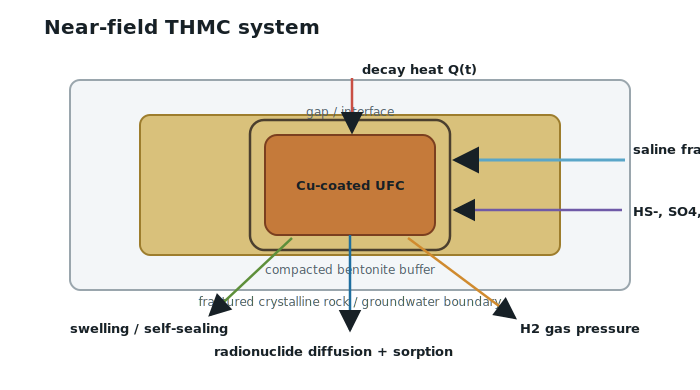
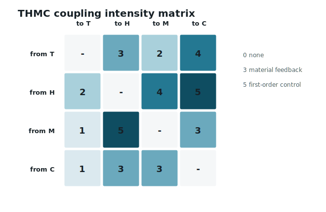
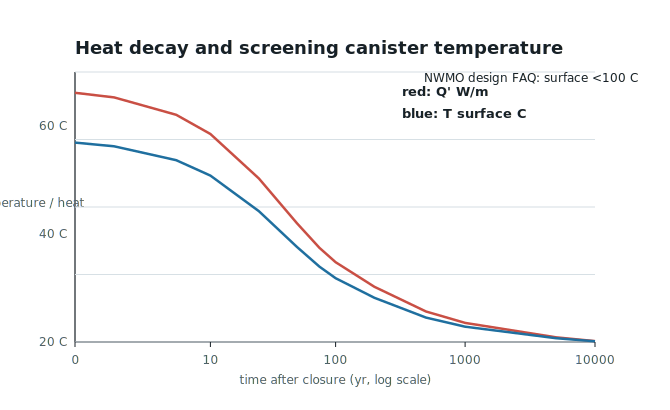
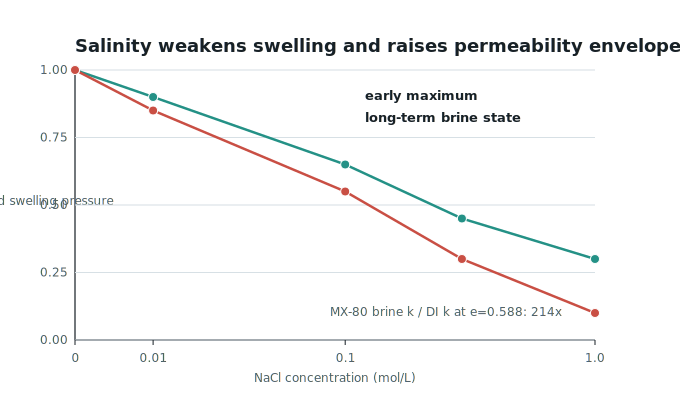
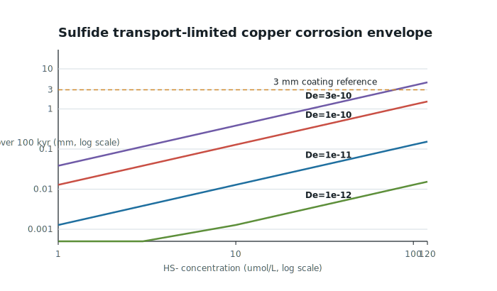
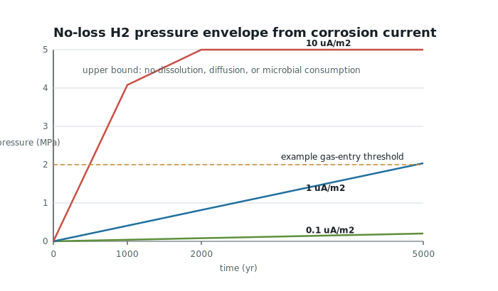
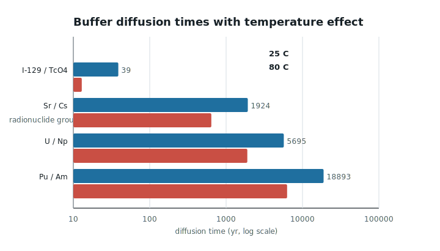
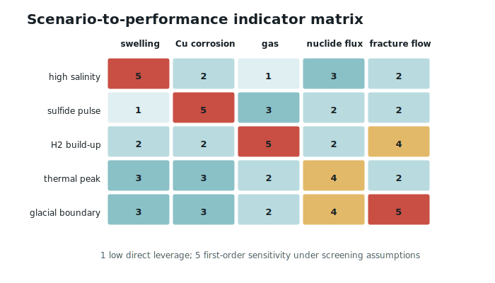

# 结晶岩深地质处置库中铜容器腐蚀、膨润土演化与地下水化学的 THMC 耦合模型

## 摘要

结晶岩深地质处置库（DGR）的近场系统通常由乏燃料铜容器、膨润土缓冲层、施工间隙、围岩裂隙地下水和天然结晶岩屏障共同组成。2025 年深地质处置综述将 canister-bentonite interaction、腐蚀演化、膨润土自封闭和氢气生成列为近场演化的核心问题。本研究使用 GeoMine Research 与 THMC Modeling skill，构建面向安全评价前期研究的概念模型、方程体系、反应网络、计算推导、情景矩阵和图表方案。研究重点不是判断某一处置库是否安全，而是说明热衰减、水力入渗、膨润土饱和膨胀、铜罐腐蚀、硫化物供给、氢气压力和核素扩散/吸附如何在长期尺度上耦合。结论表明：该方向必须采用完整 THMC 框架；其中热场控制早期温度和扩散，水力场控制饱和与裂隙补给，力学场控制膨润土膨胀压力、自封闭和气体破裂阈值，化学场控制铜腐蚀、膨润土矿物稳定性和核素迟滞。无现场输入时，推荐先建立 PHREEQC/PhreeqcRM 化学原型，再用 OpenGeoSys + PHREEQC 或 COMSOL/OGS 进行近场 THMC 原型，PFLOTRAN/MIN3P 用于大尺度反应运移和不确定性传播。

**关键词**：深地质处置库；铜容器；膨润土；结晶岩；地下水；硫化物腐蚀；氢气迁移；THMC；PHREEQC；OpenGeoSys

## 1. 研究框架

**研究对象**：结晶岩 DGR 的近场工程屏障与天然屏障交界系统，即“铜容器—膨润土缓冲层—施工间隙—裂隙结晶岩—地下水”。  
**论文类型**：综述 + 概念建模 + 计算推导型方法论文。  
**建模目的**：建立可供后续 PHREEQC、COMSOL、OpenGeoSys、PFLOTRAN 或 MIN3P 数值模拟使用的 THMC 模型包。  
**边界**：不提供场址安全结论、工程认证、许可建议或监管合规判断。

### 1.1 GeoMine THMC 路由结果

```json
{
  "research_type": ["academic_paper_generation", "thmc_modeling", "long_term_environmental_risk"],
  "scenario": ["nuclear_waste_repository", "bentonite_buffer_evolution", "radionuclide_transport"],
  "coupling_level": "THMC",
  "active_processes": {
    "thermal": true,
    "hydrological": true,
    "mechanical": true,
    "chemical": true
  },
  "mcp_mode": "source-discovery-only",
  "site_specific_claims": false
}
```

### 1.2 研究问题

1. 热衰减如何改变膨润土含水率、扩散系数、地下水反应速率和核素迁移？
2. 高盐地下水如何影响膨润土膨胀压力、自封闭速度和渗透率？
3. 硫化物如何通过扩散或微生物硫酸盐还原控制铜罐腐蚀通量？
4. H2 生成、溶解、扩散和气相压力如何影响低渗透膨润土与围岩裂隙渗流？
5. 温度、盐度、Eh-pH 和矿物相如何改变 U、Np、Pu、Am、Cs、Sr、I、Tc 等核素的扩散与吸附？

## 2. 证据矩阵

| 关键主张 | 证据类型 | 来源 | 置信度 | 不确定性 |
|---|---|---|---|---|
| DGR 安全案例依赖工程屏障与天然屏障协同 | 官方资料 | NWMO、CNSC | 高 | 具体设计随场址、国家和版本变化 |
| 近场核心过程包括容器-膨润土相互作用、腐蚀、膨润土自封闭、氢气生成和 THMC 耦合 | 2025 综述 | Unokiwedi et al. 2025 | 中高 | 综述归纳不等于某一场址定量参数 |
| 高盐度可削弱膨润土膨胀与双电层排斥，改变渗透率和自封闭 | 实验/综述 | bentonite-salinity literature | 高 | 与膨润土类型、干密度、阳离子组成有关 |
| 硫化物是铜腐蚀的关键化学边界之一 | 实验/建模/综述 | copper corrosion studies | 高 | 硫化物浓度、扩散、微生物和氧化还原边界需现场化 |
| 气体迁移可能通过溶解、扩散、两相流或局部破裂影响低渗透黏土屏障 | EURAD/气体迁移文献 | EURAD GAS, recent modeling | 中高 | 破裂阈值与材料状态强相关 |
| 核素迁移在膨润土中多为扩散控制，并受温度、吸附和孔隙水化学影响 | 反应运移理论 | THMC equation set, repository literature | 高 | Kd/表面络合参数和源项高度不确定 |
| MCP 工具链可用于 THMC 工作流，但本轮未获得可验证 DGR 场址实测 | 本地 MCP 烟测/工具发现 | GeoMine THMC mock tools | 中 | 只能证明数据结构和工作流，不可当作科学实测 |

## 3. 概念模型

<figure class="geomine-mermaid-figure" data-mermaid-index="1">
<svg id="geomine-mermaid-1" xmlns="http://www.w3.org/2000/svg" viewBox="0 0 953 360" role="img" aria-label="Mermaid flowchart">
  <defs>
    <marker id="geomine-mermaid-1-arrow" viewBox="0 0 10 10" refX="9" refY="5" markerWidth="7" markerHeight="7" orient="auto-start-reverse">
      <path d="M 0 0 L 10 5 L 0 10 z" fill="#2d5364"/>
    </marker>
  </defs>
  <style>
    .gm-node { fill: #f8fbfc; stroke: #2d5364; stroke-width: 1.5; }
    .gm-node-text { font: 13px -apple-system, BlinkMacSystemFont, "PingFang SC", "Noto Sans CJK SC", Arial, sans-serif; fill: #172026; }
    .gm-edge { fill: none; stroke: #2d5364; stroke-width: 1.5; marker-end: url(#geomine-mermaid-1-arrow); }
    .gm-edge-label-bg { fill: rgba(255,255,255,0.88); stroke: #d7e4ea; stroke-width: 0.8; }
    .gm-edge-label { font: 12px -apple-system, BlinkMacSystemFont, "PingFang SC", "Noto Sans CJK SC", Arial, sans-serif; fill: #35505b; }
  </style>
  <rect x="1" y="1" width="951" height="358" rx="10" fill="#ffffff" stroke="#edf3f5"/>
  <path d="M 178.0 138.0 C 226.0 138.0, 226.0 180.0, 267.0 180.0" class="gm-edge"/>
<path d="M 424.0 180.0 C 472.0 180.0, 472.0 96.0, 513.0 96.0" class="gm-edge"/><rect x="446.0" y="119.0" width="52" height="20" rx="4" class="gm-edge-label-bg"/><text x="472.0" y="133.0" text-anchor="middle" class="gm-edge-label">热通量</text>
<path d="M 178.0 222.0 C 349.0 222.0, 349.0 96.0, 513.0 96.0" class="gm-edge"/><rect x="272.0" y="140.0" width="154" height="20" rx="4" class="gm-edge-label-bg"/><text x="349.0" y="154.0" text-anchor="middle" class="gm-edge-label">入渗/盐度/硫酸盐/硫化物</text>
<path d="M 670.0 96.0 C 718.5 96.0, 718.5 138.0, 760.0 138.0" class="gm-edge"/><rect x="665.5" y="98.0" width="106" height="20" rx="4" class="gm-edge-label-bg"/><text x="718.5" y="112.0" text-anchor="middle" class="gm-edge-label">饱和膨胀/自封闭</text>
<path d="M 424.0 180.0 C 472.0 180.0, 472.0 180.0, 513.0 180.0" class="gm-edge"/><rect x="434.0" y="161.0" width="76" height="20" rx="4" class="gm-edge-label-bg"/><text x="472.0" y="175.0" text-anchor="middle" class="gm-edge-label">硫化物腐蚀</text>
<path d="M 424.0 180.0 C 472.0 180.0, 472.0 264.0, 513.0 264.0" class="gm-edge"/><rect x="443.0" y="203.0" width="58" height="20" rx="4" class="gm-edge-label-bg"/><text x="472.0" y="217.0" text-anchor="middle" class="gm-edge-label">H2 生成</text>
<path d="M 670.0 96.0 C 718.5 96.0, 718.5 222.0, 760.0 222.0" class="gm-edge"/><rect x="653.5" y="140.0" width="130" height="20" rx="4" class="gm-edge-label-bg"/><text x="718.5" y="154.0" text-anchor="middle" class="gm-edge-label">孔隙水化学/矿物演化</text>
  <g class="gm-node-group" data-node-id="F">
    <rect x="28" y="110" width="150" height="56" rx="8" class="gm-node"/>
    <text text-anchor="middle" class="gm-node-text"><tspan x="103.0" y="138.0">乏燃料余热 Q(t)</tspan></text>
  </g>
<g class="gm-node-group" data-node-id="C">
    <rect x="274" y="152" width="150" height="56" rx="8" class="gm-node"/>
    <text text-anchor="middle" class="gm-node-text"><tspan x="349.0" y="180.0">铜容器</tspan></text>
  </g>
<g class="gm-node-group" data-node-id="B">
    <rect x="520" y="68" width="150" height="56" rx="8" class="gm-node"/>
    <text text-anchor="middle" class="gm-node-text"><tspan x="595.0" y="96.0">膨润土缓冲层</tspan></text>
  </g>
<g class="gm-node-group" data-node-id="R">
    <rect x="28" y="194" width="150" height="56" rx="8" class="gm-node"/>
    <text text-anchor="middle" class="gm-node-text"><tspan x="103.0" y="222.0">结晶岩裂隙地下水</tspan></text>
  </g>
<g class="gm-node-group" data-node-id="G">
    <rect x="767" y="110" width="158" height="56" rx="8" class="gm-node"/>
    <text text-anchor="middle" class="gm-node-text"><tspan x="846.0" y="138.0">施工间隙与裂隙界面</tspan></text>
  </g>
<g class="gm-node-group" data-node-id="H">
    <rect x="520" y="152" width="150" height="56" rx="8" class="gm-node"/>
    <text text-anchor="middle" class="gm-node-text"><tspan x="595.0" y="180.0">Cu2S/Cu腐蚀产物</tspan></text>
  </g>
<g class="gm-node-group" data-node-id="P">
    <rect x="520" y="236" width="151" height="56" rx="8" class="gm-node"/>
    <text text-anchor="middle" class="gm-node-text"><tspan x="595.5" y="264.0">气体压力/两相迁移</tspan></text>
  </g>
<g class="gm-node-group" data-node-id="S">
    <rect x="767" y="194" width="158" height="56" rx="8" class="gm-node"/>
    <text text-anchor="middle" class="gm-node-text"><tspan x="846.0" y="222.0">吸附/离子交换/沉淀</tspan></text>
  </g>
</svg>
<figcaption class="geomine-mermaid-caption">Mermaid diagram 1</figcaption>
</figure>

近场可分为五个计算域：

1. **铜容器边界**：热源、腐蚀边界、H2 源项、核素源项的潜在内边界。
2. **膨润土缓冲层**：低渗透、高膨胀、扩散主导、多离子交换和吸附反应区。
3. **施工间隙/界面区**：早期入渗、自封闭、局部非均质和气体通道风险最高。
4. **裂隙结晶岩**：低孔隙基质 + 裂隙流；控制地下水补给、溶质供给与远场传输。
5. **监测/评价边界**：用于定义核素通量、腐蚀深度、气体压力、膨胀压力和屏障性能指标。

## 4. THMC 耦合矩阵

| From / To | Thermal | Hydrological | Mechanical | Chemical |
|---|---|---|---|---|
| Thermal | - | 黏度、密度、蒸汽压、非饱和水迁移 | 热胀冷缩、热应力 | 扩散系数、反应速率、溶解度、吸附 |
| Hydrological | 对流传热 | - | 孔压、饱和度改变有效应力 | 溶质补给、腐蚀剂输运、核素扩散 |
| Mechanical | 应变影响热接触 | 膨胀/裂隙开闭改变渗透率 | - | 自封闭改变反应面积和扩散路径 |
| Chemical | 反应热通常次要 | 沉淀/溶解改变孔隙结构 | 腐蚀产物、盐度改变膨胀压力 | - |

### 4.1 数据源、MCP 状态与计算设计

本轮对可调用工具进行了两层检查。在线工具发现没有暴露 `geomine_thmc` 或 `geomine_thmc_data` 的 live MCP server；仓库内 GeoMine THMC MCP 参考实现可运行 mock 烟测：`geomine_thmc` 20 个工具、22 个响应通过，`geomine_thmc_data` 13 个工具、13 个响应通过。因此本文把 MCP 用作**工作流和数据结构验证**，不把 mock 结果解释为 DGR 场址实测。所有现场相关输入仍列为待获取数据。

为满足“用数据集进行计算并图表化”的要求，本文建立了一个可复现筛选数据集：

- 参数来源表：$data/thmc_{\mathrm{parameter}}_{\mathrm{sources}}.csv$，记录 DGR 综述、NWMO 多屏障资料、MX-80 膨润土盐度实验关系、硫化物腐蚀模型、SKB 硫化物资料和 H2 数值模拟资料。
- 计算结果表：$data/thmc_{\mathrm{screening}}_{\mathrm{results}}.csv$，记录热衰减、盐度—膨胀压力、渗透率、硫化物腐蚀、H2 压力、核素扩散时间和情景矩阵。
- 摘要文件：`data/thmc_screening_summary.json`，记录关键数值结果、限制和生成的插图清单。
- 生成脚本：`scripts/generate_thmc_screening_figures.py`，只使用 Python 标准库，可重新生成全部 CSV/JSON/SVG。

这些数据不是某个加拿大候选场址的校准数据，而是由公开文献范围和筛选公式组成的“计算假设数据集”。它的作用是验证哪些假设值得进入下一步 PHREEQC、OpenGeoSys、PFLOTRAN 或 COMSOL 建模。

## 5. 控制方程与推导

### 5.1 热过程：衰变热与近场传热

乏燃料热源可用多指数衰减近似：

$$
Q(t)=\sum_j Q_j e^{-\lambda_j t}
$$

近场热传输：

$$
(\rho C_p)_{eff}\frac{\partial T}{\partial t}
+\rho_w C_w \mathbf q\cdot\nabla T
=\nabla\cdot(\lambda_{eff}\nabla T)+Q_T(t)
$$

一维径向稳态筛选中，单位长度热功率为 $Q'$，铜罐半径为 $r_c$，远场热边界为 $r_\infty$：

$$
\Delta T \approx \frac{Q'}{2\pi\lambda_{eff}}\ln\left(\frac{r_\infty}{r_c}\right)
$$

示例：若 $Q'=120\ \mathrm{W\,m^{-1}}$，$\lambda_{eff}=1.5\ \mathrm{W\,m^{-1}\,K^{-1}}$，$r_c=0.55\ \mathrm{m}$，$r_\infty=10\ \mathrm{m}$：

$$
\Delta T=\frac{120}{2\pi(1.5)}\ln(18.2)=36.9\ \mathrm K
$$

该计算说明余热可在早期形成几十摄氏度量级的近场温升；真实峰值需由容器间距、废物热功率、岩石热导率、通风冷却时间和三维布置确定。

### 5.2 水力过程：入渗、饱和与低渗透自封闭

饱和近似下：

$$
\frac{\partial(\rho\phi)}{\partial t}+\nabla\cdot(\rho\mathbf q)=Q_w
$$

$$
\mathbf q=-\frac{k(S_w,\epsilon_v,I)}{\mu(T)}(\nabla p-\rho\mathbf g)
$$

非饱和阶段应使用 Richards 方程：

$$
\frac{\partial \theta(S_w)}{\partial t}
=\nabla\cdot\left[K(S_w)\left(\nabla h+\nabla z\right)\right]+Q_w
$$

膨润土饱和时间可用扩散尺度估算：

$$
t_{sat}\sim\frac{L_b^2}{D_h}
$$

若缓冲层厚度 $L_b=0.35\ \mathrm m$，水力扩散率 $D_h=10^{-10}$ 至 $10^{-9}\ \mathrm{m^2\,s^{-1}}$：

$$
t_{sat}=3.9\times10^0\ \mathrm{yr}\ \text{to}\ 3.9\times10^1\ \mathrm{yr}
$$

即早期饱和可能是几年到几十年尺度；若裂隙供水不足、高盐度削弱膨胀或施工间隙较大，局部时间尺度会延长。

### 5.3 力学过程：膨润土膨胀压力与自封闭

力学平衡：

$$
\nabla\cdot\boldsymbol\sigma+\mathbf f=0
$$

有效应力：

$$
\boldsymbol\sigma'=\boldsymbol\sigma-\alpha p\mathbf I
$$

在膨润土中可加入膨胀压力项：

$$
\boldsymbol\sigma'=\mathbf C:\boldsymbol\epsilon-\alpha p\mathbf I+\Pi_{sw}(\rho_d,S_w,I,T)\mathbf I
$$

其中 $\Pi_{sw}$ 随干密度 $\rho_d$、饱和度 $S_w$、离子强度 $I$ 和温度 $T$ 变化。高盐水压缩扩散双电层，通常降低膨胀能力。

高盐渗透压可用 van't Hoff 近似说明量级：

$$
\Pi_{osm}\approx iRTC
$$

对 NaCl，$i\approx2$。当 $C=1\ \mathrm{mol\,L^{-1}}=1000\ \mathrm{mol\,m^{-3}}$，$T=298\ \mathrm K$：

$$
\Pi_{osm}=2(8.314)(298)(1000)=4.95\ \mathrm{MPa}
$$

这并不等同于膨润土膨胀压力，但说明高盐孔隙水可产生 MPa 量级的化学势差，必须进入膨胀/渗透模型。

### 5.4 铜腐蚀与硫化物扩散控制

若硫化物到达铜表面的过程由膨润土扩散控制：

$$
J_{HS^-}=-D_{e,HS}\frac{\partial C_{HS}}{\partial r}
\approx D_{e,HS}\frac{C_{HS,rock}-C_{HS,surface}}{L_b}
$$

若近似 $C_{HS,surface}\approx0$，腐蚀深度速率为：

$$
\dot d_{Cu}\approx\frac{\nu_{Cu}M_{Cu}}{\rho_{Cu}}J_{HS^-}
$$

其中 $\nu_{Cu}$ 是每摩尔硫化物对应的铜摩尔数，保守取 $2$；$M_{Cu}=0.06355\ \mathrm{kg\,mol^{-1}}$，$\rho_{Cu}=8960\ \mathrm{kg\,m^{-3}}$。

示例：$D_{e,HS}=10^{-11}\ \mathrm{m^2\,s^{-1}}$，$L_b=0.35\ \mathrm m$，$C_{HS,rock}=10\ \mu\mathrm M=0.01\ \mathrm{mol\,m^{-3}}$：

$$
J_{HS^-}=2.86\times10^{-13}\ \mathrm{mol\,m^{-2}\,s^{-1}}
$$

$$
\dot d_{Cu}=4.05\times10^{-18}\ \mathrm{m\,s^{-1}}=1.28\times10^{-10}\ \mathrm{m\,yr^{-1}}
$$

$$
100{,}000\ \mathrm{yr}\Rightarrow d_{Cu}\approx0.013\ \mathrm{mm}
$$

该量级仅说明“扩散限制”情景下硫化物通量可能很小。若存在微生物硫酸盐还原、局部通道、裂隙短路或更高硫化物浓度，腐蚀通量需重新计算。

### 5.5 H2 生成、溶解与气压

腐蚀产生 H2 的通量可用电化学电流密度估算：

$$
J_{H_2}=\frac{i_{corr}}{2F}
$$

若容器面积 $A=10\ \mathrm{m^2}$，$i_{corr}=1\ \mu\mathrm{A\,m^{-2}}$：

$$
\dot n_{H_2}=A\frac{i_{corr}}{2F}
=10\frac{10^{-6}}{2(96485)}
=5.18\times10^{-11}\ \mathrm{mol\,s^{-1}}
$$

$$
=1.63\times10^{-3}\ \mathrm{mol\,yr^{-1}}
$$

若暂忽略溶解和扩散，气体体积 $V_g=0.01\ \mathrm{m^3}$，$T=300\ \mathrm K$：

$$
\frac{dP}{dt}=\frac{RT}{V_g}\dot n_{H_2}
=0.00041\ \mathrm{MPa\,yr^{-1}}
$$

1000 年可累积到约 $0.41\ \mathrm{MPa}$。真实系统中必须同时考虑 Henry 溶解、扩散、两相流、微裂隙开启和气体逸散。

### 5.6 核素扩散、吸附与温度效应

膨润土中核素迁移通常以扩散为主：

$$
\frac{\partial(\phi C_i+\rho_b S_i)}{\partial t}
=\nabla\cdot(\phi D_{e,i}\nabla C_i)+R_i
$$

线性吸附：

$$
S_i=K_{d,i}C_i
$$

阻滞因子：

$$
R_{d,i}=1+\frac{\rho_bK_{d,i}}{\phi}
$$

扩散穿越时间：

$$
t_D\sim\frac{L_b^2R_{d,i}}{D_{e,i}}
$$

示例：$L_b=0.35\ \mathrm m$，$D_e=10^{-10}\ \mathrm{m^2\,s^{-1}}$：

| 核素类型 | 代表吸附 | $R_d$ | $t_D$ 量级 |
|---|---:|---:|---:|
| I-129 类弱吸附阴离子 | $K_d\approx0$ | 1 | 39 年 |
| Sr/Cs 中等吸附端元 | $K_d=0.01\ \mathrm{m^3\,kg^{-1}}$，$\rho_b=1700$，$\phi=0.35$ | 49.6 | 1900 年 |
| Pu/Am 强吸附端元 | $K_d=0.1\ \mathrm{m^3\,kg^{-1}}$ | 486.7 | 19000 年 |

这些是筛选值，不可替代核素专属的表面络合、胶体、价态和衰变链模型。

温度可通过 Stokes-Einstein 近似影响水相扩散：

$$
D(T)\propto \frac{T}{\mu(T)}
$$

若从 25 °C 升到 80 °C，水黏度约从 $0.89$ 降到 $0.355\ \mathrm{mPa\,s}$，则：

$$
\frac{D_{80}}{D_{25}}\approx\frac{353}{298}\frac{0.89}{0.355}=2.97
$$

孔隙扩散还受曲折度、压实度、盐度和矿物结构影响，因此不能直接把自由水倍率用于完整膨润土。

## 6. 反应网络

<figure class="geomine-mermaid-figure" data-mermaid-index="2">
<svg id="geomine-mermaid-2" xmlns="http://www.w3.org/2000/svg" viewBox="0 0 858 676" role="img" aria-label="Mermaid flowchart">
  <defs>
    <marker id="geomine-mermaid-2-arrow" viewBox="0 0 10 10" refX="9" refY="5" markerWidth="7" markerHeight="7" orient="auto-start-reverse">
      <path d="M 0 0 L 10 5 L 0 10 z" fill="#2d5364"/>
    </marker>
  </defs>
  <style>
    .gm-node { fill: #f8fbfc; stroke: #2d5364; stroke-width: 1.5; }
    .gm-node-text { font: 13px -apple-system, BlinkMacSystemFont, "PingFang SC", "Noto Sans CJK SC", Arial, sans-serif; fill: #172026; }
    .gm-edge { fill: none; stroke: #2d5364; stroke-width: 1.5; marker-end: url(#geomine-mermaid-2-arrow); }
    .gm-edge-label-bg { fill: rgba(255,255,255,0.88); stroke: #d7e4ea; stroke-width: 0.8; }
    .gm-edge-label { font: 12px -apple-system, BlinkMacSystemFont, "PingFang SC", "Noto Sans CJK SC", Arial, sans-serif; fill: #35505b; }
  </style>
  <rect x="1" y="1" width="856" height="674" rx="10" fill="#ffffff" stroke="#edf3f5"/>
  <path d="M 138.5 88.0 C 138.5 129.0, 308.0 129.0, 308.0 163.0" class="gm-edge"/>
<path d="M 308.0 226.0 C 308.0 268.0, 230.0 268.0, 230.0 303.0" class="gm-edge"/>
<path d="M 308.0 226.0 C 308.0 267.0, 630.5 267.0, 630.5 301.0" class="gm-edge"/>
<path d="M 432.0 366.0 C 432.0 408.0, 429.0 408.0, 429.0 443.0" class="gm-edge"/>
<path d="M 571.0 86.0 C 571.0 128.0, 723.0 128.0, 723.0 163.0" class="gm-edge"/>
<path d="M 723.0 226.0 C 723.0 268.0, 432.0 268.0, 432.0 303.0" class="gm-edge"/>
<path d="M 429.0 510.0 C 429.0 551.0, 428.5 551.0, 428.5 585.0" class="gm-edge"/>
<path d="M 372.5 86.0 C 372.5 128.0, 510.0 128.0, 510.0 163.0" class="gm-edge"/>
<path d="M 372.5 86.0 C 372.5 128.0, 124.0 128.0, 124.0 163.0" class="gm-edge"/>
<path d="M 755.0 86.0 C 755.0 198.0, 230.0 198.0, 230.0 303.0" class="gm-edge"/>
<path d="M 755.0 86.0 C 755.0 268.0, 429.0 268.0, 429.0 443.0" class="gm-edge"/>
<path d="M 755.0 86.0 C 755.0 128.0, 124.0 128.0, 124.0 163.0" class="gm-edge"/>
  <g class="gm-node-group" data-node-id="GW">
    <rect x="28" y="28" width="221" height="60" rx="8" class="gm-node"/>
    <text text-anchor="middle" class="gm-node-text"><tspan x="138.5" y="49.0">结晶岩裂隙地下水: Na-Ca-Cl,</tspan>
<tspan x="138.5" y="67.0">SO4, HS-, pH/Eh</tspan></text>
  </g>
<g class="gm-node-group" data-node-id="PW">
    <rect x="233" y="170" width="150" height="56" rx="8" class="gm-node"/>
    <text text-anchor="middle" class="gm-node-text"><tspan x="308.0" y="198.0">膨润土孔隙水</tspan></text>
  </g>
<g class="gm-node-group" data-node-id="EX">
    <rect x="137" y="310" width="186" height="56" rx="8" class="gm-node"/>
    <text text-anchor="middle" class="gm-node-text"><tspan x="230.0" y="338.0">阳离子交换: Na/Ca/Mg/K</tspan></text>
  </g>
<g class="gm-node-group" data-node-id="SM">
    <rect x="541" y="308" width="179" height="60" rx="8" class="gm-node"/>
    <text text-anchor="middle" class="gm-node-text"><tspan x="630.5" y="329.0">蒙脱石/伊利石/绿泥石/</tspan>
<tspan x="630.5" y="347.0">二次矿物</tspan></text>
  </g>
<g class="gm-node-group" data-node-id="HS">
    <rect x="357" y="310" width="150" height="56" rx="8" class="gm-node"/>
    <text text-anchor="middle" class="gm-node-text"><tspan x="432.0" y="338.0">HS-/S2-</tspan></text>
  </g>
<g class="gm-node-group" data-node-id="CU">
    <rect x="336" y="450" width="186" height="60" rx="8" class="gm-node"/>
    <text text-anchor="middle" class="gm-node-text"><tspan x="429.0" y="471.0">铜腐蚀: Cu2S/Cu2O/CuCl</tspan>
<tspan x="429.0" y="489.0">complexes</tspan></text>
  </g>
<g class="gm-node-group" data-node-id="SO4">
    <rect x="496" y="30" width="150" height="56" rx="8" class="gm-node"/>
    <text text-anchor="middle" class="gm-node-text"><tspan x="571.0" y="58.0">SO4</tspan></text>
  </g>
<g class="gm-node-group" data-node-id="SRB">
    <rect x="637" y="170" width="172" height="56" rx="8" class="gm-node"/>
    <text text-anchor="middle" class="gm-node-text"><tspan x="723.0" y="198.0">硫酸盐还原菌, 条件性</tspan></text>
  </g>
<g class="gm-node-group" data-node-id="H2">
    <rect x="353" y="592" width="151" height="56" rx="8" class="gm-node"/>
    <text text-anchor="middle" class="gm-node-text"><tspan x="428.5" y="620.0">H2 生成/溶解/气相</tspan></text>
  </g>
<g class="gm-node-group" data-node-id="RN">
    <rect x="283" y="30" width="179" height="56" rx="8" class="gm-node"/>
    <text text-anchor="middle" class="gm-node-text"><tspan x="372.5" y="58.0">U/Np/Pu/Am/Cs/Sr/I/Tc</tspan></text>
  </g>
<g class="gm-node-group" data-node-id="SORP">
    <rect x="417" y="170" width="186" height="56" rx="8" class="gm-node"/>
    <text text-anchor="middle" class="gm-node-text"><tspan x="510.0" y="198.0">吸附/表面络合/离子交换</tspan></text>
  </g>
<g class="gm-node-group" data-node-id="DIFF">
    <rect x="49" y="170" width="150" height="56" rx="8" class="gm-node"/>
    <text text-anchor="middle" class="gm-node-text"><tspan x="124.0" y="198.0">扩散迁移</tspan></text>
  </g>
<g class="gm-node-group" data-node-id="TEMP">
    <rect x="680" y="30" width="150" height="56" rx="8" class="gm-node"/>
    <text text-anchor="middle" class="gm-node-text"><tspan x="755.0" y="58.0">温度梯度</tspan></text>
  </g>
</svg>
<figcaption class="geomine-mermaid-caption">Mermaid diagram 2</figcaption>
</figure>

| 过程 | 关键变量 | 推荐模型 |
|---|---|---|
| 膨润土孔隙水演化 | Na, Ca, Mg, K, Cl, SO4, alkalinity, pH, Eh | PHREEQC 离子交换 + 表面络合 |
| 高盐影响 | 离子强度、阳离子组成、渗透压 | 双电层/经验膨胀压力模型 |
| 铜腐蚀 | HS-, SO4, O2 trace, Cl-, pH, Eh, T | 硫化物扩散限制 + 电化学边界 |
| H2 生成与迁移 | corrosion rate, Henry constant, gas entry pressure | 溶解-扩散 + 两相流/局部破裂模型 |
| 核素迁移 | U, Np, Pu, Am, Cs, Sr, I, Tc | 价态/络合/吸附/扩散/衰变链 |
| 矿物演化 | smectite, illite, silica, carbonate, sulfide minerals | 动力学或局部平衡，需实验约束 |

## 7. 情景矩阵

| 情景 | 触发条件 | 主要响应 | 安全评价关注量 | 推荐模型 |
|---|---|---|---|---|
| 高盐地下水 | Na-Ca-Cl 盐度升高，离子强度增加 | 膨胀压力降低，渗透率/扩散路径变化 | 自封闭时间、$k(S,I)$、$\Pi_{sw}$ | THM + 离子交换 |
| 硫化物腐蚀 | HS- 输入或 SO4 还原 | 铜腐蚀加速，Cu2S 生成 | 腐蚀深度、硫化物通量 | PHREEQC + 扩散腐蚀边界 |
| H2 气体累积 | 腐蚀产气 > 溶解/扩散能力 | 气压升高、两相流、局部通道 | 气体压力、gas entry pressure | THM 两相流 |
| 热峰值期 | 封闭后早期热功率高 | 扩散加快、含水率重新分布 | $T_{max}$、$D(T)$、矿物稳定性 | THMC 热-反应运移 |
| 冰川期边界 | 长期补给、压力、盐度改变 | 水力梯度和水化学端元变化 | 远场流向、盐度混合、Eh-pH | 场址尺度 THMC/远场 H-C |

## 8. 参数清单

| 类别 | 参数 | 符号 | 单位 | 优先级 |
|---|---|---|---|---:|
| 热 | 热功率、热导率、热容、边界温度 | $Q(t),\lambda,C_p,T_b$ | W, W $\mathrm{m}^{-1}\,\mathrm{K}^{-1}$, $\mathrm{J}\,\mathrm{kg}^{-1}\,\mathrm{K}^{-1}$, K | 高 |
| 水力 | 裂隙渗透率、膨润土渗透率、饱和曲线 | $k_f,k_b,K(S)$ | m2, $\mathrm{m}\,\mathrm{s}^{-1}$ | 高 |
| 力学 | 干密度、膨胀压力、弹性模量、间隙尺寸 | $\rho_d,\Pi_{sw},E,gap$ | $\mathrm{kg}\,\mathrm{m}^{-3}$, MPa, Pa, m | 高 |
| 化学 | 盐度、SO4/HS-、pH/Eh、碱度、Cl | $I,C_{HS},pH,Eh$ | mixed | 高 |
| 腐蚀 | 腐蚀电流、硫化物扩散系数、铜密度 | $i_{corr},D_{HS},\rho_{Cu}$ | A $\mathrm{m}^{-2}$, m2 $\mathrm{s}^{-1}$, $\mathrm{kg}\,\mathrm{m}^{-3}$ | 高 |
| 气体 | H2 生成、Henry 常数、气体入口压力 | $J_{H2},H,P_{entry}$ | $\mathrm{mol}\,\mathrm{m}^{-2}\,\mathrm{s}^{-1}$, $\mathrm{mol}\,\mathrm{m}^{-3}\,\mathrm{Pa}^{-1}$, Pa | 高 |
| 核素 | 源项、扩散系数、Kd/表面络合、半衰期 | $S_i,D_e,K_d,\lambda_i$ | mixed | 高 |

## 9. 软件路线

| 软件路线 | 用途 | 优点 | 局限 |
|---|---|---|---|
| PHREEQC | 孔隙水、腐蚀边界、离子交换、核素物种原型 | 地球化学强 | 非完整 THM |
| Python + PHREEQC/PhreeqcRM | 参数扫描、反应网络、敏感性分析 | 自动化强 | 多相力学需外部模块 |
| OpenGeoSys + PHREEQC | 开源 THMC 原型和论文复现 | 适合热-水-力-化学耦合 | 前处理/耦合成本 |
| COMSOL + PHREEQC | 工程几何、多物理场探索 | GUI 友好 | 商业许可、可复现性较弱 |
| PFLOTRAN | 大尺度反应运移与 HPC | 可扩展 | 近场力学需耦合策略 |
| MIN3P | 地下水反应运移、黏土/矿物反应 | 成熟反应运移 | 工作流与可获得性需确认 |

推荐路线：**PHREEQC 化学原型 -> OpenGeoSys + PHREEQC 近场 THMC -> PFLOTRAN/MIN3P 远场或大规模不确定性扩展**。

## 10. 数据化验证图表

下列插图由 `scripts/generate_thmc_screening_figures.py` 从 $data/thmc_{\mathrm{parameter}}_{\mathrm{sources}}.csv$ 和筛选公式生成。图中数值用于论证耦合方向和敏感性，不代表任何候选 DGR 场址的校准预测。



**Fig. 1 解释**：热源、盐水入渗、硫化物扩散、膨润土自封闭、H2 气体压力和核素扩散并不是顺序过程，而是在同一近场域内共同演化。该图支撑本文选择完整 THMC，而不是只做 HC 或 THC。



**Fig. 2 解释**：最高强度耦合来自 $H \to C$、$M \to H$ 和 $H \to M$。这意味着裂隙水补给和饱和状态控制硫化物/核素通量，膨润土膨胀又反过来控制渗透率和气体通道；忽略 M 会低估自封闭和气体破裂问题。



**Fig. 3 计算结果**：在 $Q'_0=120\ \mathrm{W\,m^{-1}}$、$\lambda=1.5\ \mathrm{W\,m^{-1}\,K^{-1}}$、$r_c=0.55\ \mathrm m$、$r_\infty=10\ \mathrm m$ 的筛选条件下，初始径向温升为 $36.93\,^\circ\mathrm C$，若远场背景为 $20\,^\circ\mathrm C$，容器邻近温度约 $56.93\,^\circ\mathrm C$。这低于 NWMO FAQ 中提到的容器表面不超过 $100\,^\circ\mathrm C$ 设计边界，但足以把自由水扩散倍率提高到约 2 倍；80 °C 时自由水扩散倍率约 3 倍。



**Fig. 4 计算结果**：基于 MX-80 brine 实验的归一化关系，高浓度 brine 下长期膨胀压力可降至淡水条件的约 10%；同一空隙比 $e=0.588$ 下，Li 等给出的经验式可得到 brine/DI 渗透率对比约 214 倍。该结果支持“高盐地下水可能延缓自封闭、提高局部渗透性”的假设，但具体阈值必须用目标膨润土和场址孔隙水重新校准。



**Fig. 5 计算结果**：若 $C_{HS}=10\ \mu\mathrm M$、$D_e=10^{-11}\ \mathrm{m^2\,s^{-1}}$，100 kyr 的铜腐蚀深度仅约 $0.0128\ \mathrm{mm}$；若采用高端硫化物 $120\ \mu\mathrm M$、$D_e=10^{-10}\ \mathrm{m^2\,s^{-1}}$，深度约 $1.53\ \mathrm{mm}$；若出现偏高有效扩散或局部优先通道 $D_e=3\times10^{-10}\ \mathrm{m^2\,s^{-1}}$，则可达约 $4.60\ \mathrm{mm}$。因此腐蚀风险的关键不是“是否有硫化物”，而是硫化物通量是否被压实膨润土长期限制。



**Fig. 6 计算结果**：按电流密度换算，$i_{corr}=1\ \mu\mathrm{A\,m^{-2}}$、容器面积 $10\ \mathrm{m^2}$、气体空间 $0.01\ \mathrm{m^3}$ 时，无溶解/扩散/消耗的压力增长率约 $4.08\times10^{-4}\ \mathrm{MPa\,yr^{-1}}$。该曲线是保守上限；真实模型必须加入 Henry 溶解、扩散逸散、微生物消耗、两相流和气体入口压力。



**Fig. 7 计算结果**：在 $L_b=0.35\ \mathrm m$、$D_e(25^\circ\mathrm C)=10^{-10}\ \mathrm{m^2\,s^{-1}}$ 的筛选条件下，弱吸附阴离子类约 39 年达到扩散尺度，中等吸附的 Sr/Cs 类约 1900 年，强吸附 Pu/Am 类约 18,900 年。80 °C 自由水黏度效应可把这些时间缩短到约三分之一，但压实膨润土曲折度和微孔结构会削弱自由水近似。



**Fig. 8 解释**：高盐情景主要冲击膨胀压力和渗透率，硫化物情景主要冲击铜腐蚀，H2 情景主要冲击气压和局部通道，热峰值主要改变扩散/反应参数，冰川期边界主要改变远场水力梯度和水化学端元。该矩阵可直接转化为后续敏感性分析的优先级。

| 计算项 | 筛选结果 | 对假设的支持 |
|---|---:|---|
| 初始径向温升 | $36.93\,^\circ\mathrm C$ | 热场足以改变扩散与反应，但示例未超过 $100\,^\circ\mathrm C$ 设计边界 |
| brine/DI 渗透率对比 | 约 214 倍 | 高盐可显著改变缓冲层水力性能 |
| $10\ \mu\mathrm M$ HS-、$D_e=10^{-11}$ 的 100 kyr 腐蚀深度 | $0.0128\ \mathrm{mm}$ | 完整压实膨润土下硫化物扩散限制很强 |
| $120\ \mu\mathrm M$ HS-、$D_e=3\times10^{-10}$ 的 100 kyr 腐蚀深度 | $4.60\ \mathrm{mm}$ | 若出现偏高扩散/优先通道，腐蚀深度可跨越 3 mm 参考线 |
| $1\ \mu\mathrm{A\,m^{-2}}$ 无损失 H2 压力增长率 | $4.08\times10^{-4}\ \mathrm{MPa\,yr^{-1}}$ | 气体风险取决于产气与消散竞争 |
| I-129/TcO4 类扩散时间 | 约 39 年 | 弱吸附阴离子是早期迁移敏感组 |
| Pu/Am 类扩散时间 | 约 18,900 年 | 强吸附锕系元素受膨润土迟滞显著控制 |

## 11. 校准、验证与拒绝准则

| 模块 | 校准数据 | 验证量 | 拒绝准则 |
|---|---|---|---|
| 热 | 岩石热导率、容器热功率、温度监测 | $T_{max}$、温度剖面 | 超过热边界但仍声称有效 |
| 水力 | 裂隙流、膨润土含水率、渗透率 | 饱和时间、水通量 | 水量平衡错误 |
| 力学 | 膨胀压力、干密度、间隙闭合 | $\Pi_{sw}$、自封闭时间 | 高盐下仍假定淡水膨胀参数 |
| 化学 | 孔隙水、地下水、腐蚀实验 | pH/Eh、HS-、Cu 相 | 未守恒电荷/质量 |
| 气体 | 腐蚀产气、气体入口压力 | 压力、两相饱和度 | 忽略气体逸散却外推长期压力 |
| 核素 | 扩散实验、Kd/表面络合、源项 | 通量、突破时间 | 用单一 Kd 替代价态/胶体关键机制 |

## 12. 讨论

该近场系统最重要的结论不是某个单一材料“足够好”，而是多屏障协同演化：铜容器提供初始包容，膨润土提供低渗透与吸附/扩散迟滞，结晶岩提供低流速与远场稀释/隔离，地下水化学则同时可能支持屏障功能或触发腐蚀/矿物演化风险。完整 THMC 的必要性来自反馈链条：热影响扩散和反应，水力控制硫化物与核素通量，膨胀压力控制通道闭合和气体入口压力，化学环境控制腐蚀与吸附。

加拿大结晶岩场景还应把长期冰川期边界、低流速高停留时间地下水、高盐端元混合和氧化还原演化纳入后续模型。由于当前没有给定具体场址、坐标、深度、岩性、地下水样品或容器热功率，本报告的所有计算均为筛选推导，不是场址性能评估。

## 13. 结论

1. 本课题应采用完整 THMC，而不是只用 THC 或 HC，因为膨润土膨胀、自封闭、气体破裂和腐蚀-渗流反馈属于核心问题。
2. 径向传热筛选表明，容器余热可形成几十摄氏度量级近场温升，足以影响扩散、反应速率和吸附参数。
3. 高盐地下水可产生 MPa 量级渗透化学势差，必须进入膨润土膨胀压力和渗透率模型。
4. 硫化物扩散限制模型能把地下水硫化物浓度、膨润土厚度、有效扩散系数与铜腐蚀深度直接连接，是腐蚀情景的核心边界条件。
5. H2 是否形成有效压力风险，取决于产气速率、溶解度、扩散、两相流和气体入口压力的竞争，而不能只看腐蚀反应是否产气。
6. 核素迁移应按弱吸附阴离子、可交换阳离子、强吸附锕系元素分组建模；温度可显著提高扩散系数，但膨润土孔隙结构会限制自由水近似。
7. 后续数值路线应从 PHREEQC/PhreeqcRM 反应网络原型开始，再进入 OpenGeoSys + PHREEQC 或 COMSOL/OGS 近场 THMC 原型，最后开展 PFLOTRAN/MIN3P 大尺度和不确定性计算。

## 14. 参考文献与资料源

[1] Unokiwedi, U.; et al. “Deep Geological Repositories — A Review of Design Concepts, Safety Assessments and Long-Term Performance for Radioactive Waste Disposal.” *Journal of Environmental Radioactivity*, 2025. https://doi.org/10.1016/j.jenvrad.2025.107750  
[2] NWMO, Multiple-Barrier System. https://www.nwmo.ca/en/A-Safe-Approach/Facilities/Deep-Geological-Repository/Multiple-Barrier-System  
[3] NWMO, Deep Geological Repository Conceptual Design Report, Crystalline / Sedimentary Rock, 2021. https://www.nwmo.ca/-/media/Reports-MASTER/Technical-reports/APM-REP-00440-0211-DGR-Conceptual-Design-Report-Crystalline-Sedimentary-Rock---2021-09.ashx?hash=E6E50C638AC8A2DF3216C7F4C092CED4&rev=cddf2400df234d50acbf4c0db19173e1&sc_lang=en  
[4] CNSC, Deep geological repositories. https://www.cnsc-ccsn.gc.ca/eng/waste/deep-geological-repositories.cfm/  
[5] CNSC, REGDOC-1.2.1 Guidance on Deep Geological Repository Site Characterization. https://www.cnsc-ccsn.gc.ca/eng/acts-and-regulations/regulatory-documents/published/html/regdoc1-2-1/index/  
[6] CNSC, REGDOC-2.11.1 Volume III, Assessing the Long Term Safety of Radioactive Waste Management. https://www.cnsc-ccsn.gc.ca/eng/acts-and-regulations/regulatory-documents/published/html/regdoc2-11-1-v3/index/  
[7] Harper, B. S.; et al. Review on copper corrosion in nuclear waste repositories. *npj Materials Degradation*, 2024. https://www.nature.com/articles/s41529-024-00515-6  
[8] King, F.; et al. “Mathematical model for the corrosion of copper by sulphide.” *Corrosion Engineering, Science and Technology*, 2017. https://doi.org/10.1080/1478422X.2017.1300363  
[9] Briggs, S.; et al. “A model for the influence of steel corrosion products on nuclear fuel waste container corrosion.” *Corrosion Engineering, Science and Technology*, 2017. https://doi.org/10.1080/1478422X.2017.1288336  
[10] EURAD, D6.1 Initial State-of-the-Art on Gas Transport in Clayey Materials. https://www.ejp-eurad.eu/publications/eurad-d61-initial-state-art-gas-transport-clayey-materials  
[11] Asad, M. A.; Rashwan, T. L.; Molnar, I. L.; Behazin, M.; Keech, P. G.; Krol, M. M. “Exploring the cycle of H2 gas using numerical modelling in the context of a deep geological repository.” *Results in Engineering*, 2025. https://doi.org/10.1016/j.rineng.2025.106008  
[12] Li, Z.; Su, G.; Zheng, Q.; Nguyen, T. S. “A dual-porosity model for the study of chemical effects on the swelling behaviour of MX-80 bentonite.” *Acta Geotechnica*, 2020. https://link.springer.com/article/10.1007/s11440-019-00762-5  
[13] Zhu, C.-M.; Ye, W.-M.; Chen, Y.-G.; Chen, B.; Cui, Y.-J. “Influence of salt solutions on the swelling pressure and hydraulic conductivity of compacted GMZ01 bentonite.” *Engineering Geology*, 2013. https://doi.org/10.1016/j.enggeo.2013.09.001  
[14] SKB. “SR-Site - Sulphide content in the groundwater at Forsmark. Updated 2013-01.” TR-10-39. https://skb.com/publication/2155543  
[15] Zheng, L.; Fernandez, A. M. “Sensitivity Analysis of Coupled Thermal-Hydraulic-Mechanical-Chemical Processes of the Full-Scale Engineered Barrier Experiment in Crystalline Host Rock.” *Minerals*, 2023. https://doi.org/10.3390/min13121522  
[16] Parkhurst, D. L.; Appelo, C. A. J. PHREEQC Version 3, USGS. https://pubs.usgs.gov/tm/06/a43/  
[17] OpenGeoSys Reactive Transport Documentation. https://www.opengeosys.org/stable/docs/benchmarks/reactive-transport/  
[18] PFLOTRAN Documentation. https://documentation.pflotran.org/  

## 附录 A：模型输入规格

```json
{
  "model_id": "geomine_crystalline_dgr_copper_bentonite_thmc_v1",
  "domain": "copper_canister_bentonite_buffer_gap_fractured_crystalline_rock",
  "coupling_level": "THMC",
  "primary_variables": ["T", "p", "S_w", "u", "sigma", "C_i", "pH", "Eh", "gas_pressure", "mineral_volume", "corrosion_depth"],
  "key_scenarios": ["high_salinity_groundwater", "sulfide_copper_corrosion", "hydrogen_gas_pressure", "thermal_gradient_radionuclide_diffusion", "glacial_boundary_change"],
  "recommended_workflow": ["PHREEQC_PhreeqcRM_chemistry_prototype", "OpenGeoSys_PHREEQC_nearfield_THMC", "PFLOTRAN_or_MIN3P_large_scale_uncertainty"],
  "mcp_status": "live_geomine_thmc_not_exposed_local_mock_smoke_tests_passed_no_site_specific_data",
  "calculation_artifacts": {
    "script": "scripts/generate_thmc_screening_figures.py",
    "parameter_sources": "data/thmc_parameter_sources.csv",
    "screening_results": "data/thmc_screening_results.csv",
    "summary": "data/thmc_screening_summary.json",
    "figures": [
      "figures/fig1_nearfield_concept.svg",
      "figures/fig2_coupling_matrix.svg",
      "figures/fig3_thermal_decay_temperature.svg",
      "figures/fig4_salinity_swelling_permeability.svg",
      "figures/fig5_sulfide_copper_corrosion.svg",
      "figures/fig6_h2_pressure_envelope.svg",
      "figures/fig7_radionuclide_diffusion_times.svg",
      "figures/fig8_scenario_matrix.svg"
    ]
  },
  "safety_case_status": "not_a_safety_assessment"
}
```
