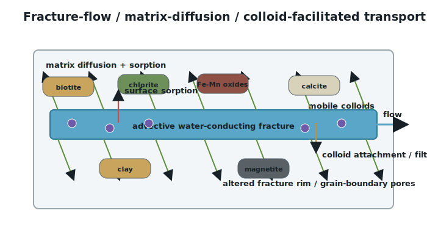
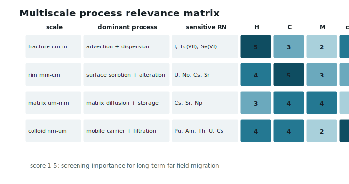
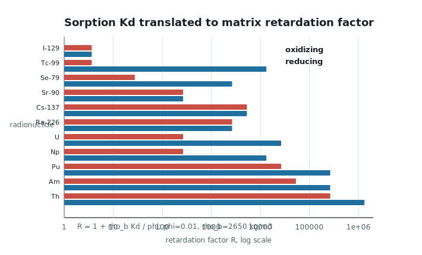
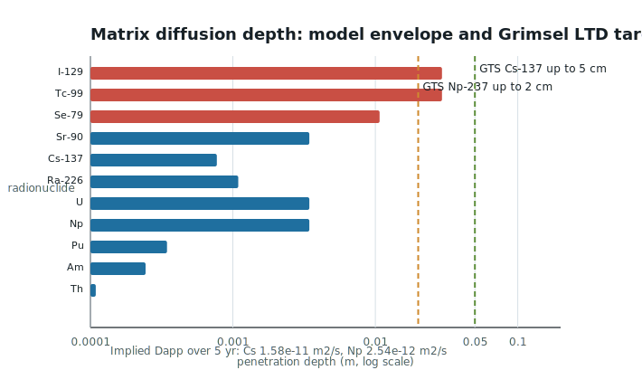
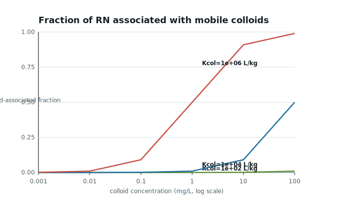
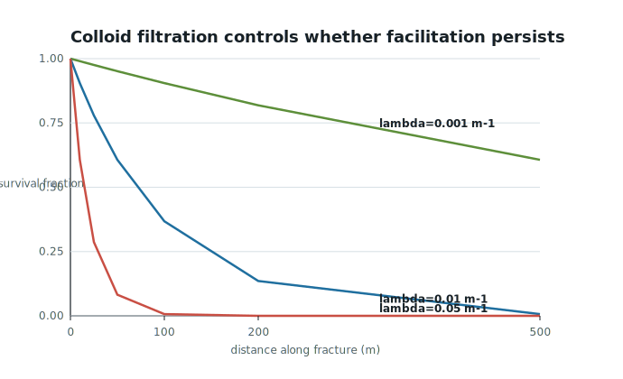
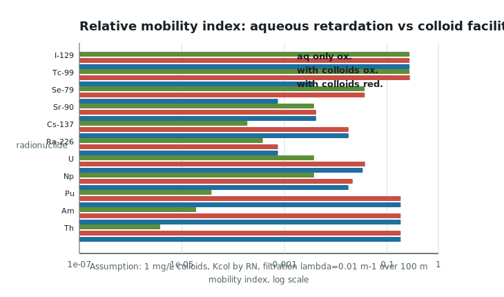
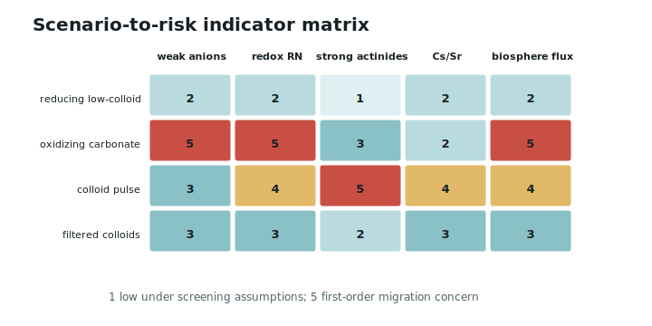
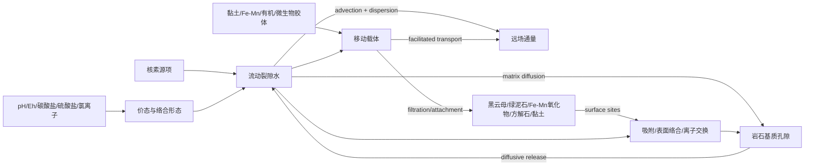

# 结晶岩裂隙中核素吸附—基质扩散—胶体促进迁移的多尺度模型

## 摘要

结晶岩深地质处置库远场系统中的核素迁移不是简单的“裂隙水携带溶质向外流动”问题，而是由裂隙流动、矿物表面吸附、岩石基质扩散、氧化还原/络合反应以及胶体携带共同控制的多尺度反应运移过程。EGU 2026 摘要 EGU26-5127 明确指出，矿物表面吸附是约束核素从深地质处置库进入生物圈的关键过程，吸附行为高度依赖 pH、Eh、离子强度、络合离子、微生物和矿物类型，并会随空间和时间变化。本研究使用 GeoMine Research 与 THMC Modeling skill，构建“裂隙流动—矿物吸附—基质扩散—胶体携带”四过程耦合概念模型，并用公开资料和文献导向的筛选参数生成可复现数据表和图表。模型显示：I-129、氧化态 Tc-99 和 Se-79 的关键风险来自弱吸附与裂隙连通性；U、Np、Tc 在氧化还原转换下可发生数量级迁移性变化；Pu、Am、Th 等强吸附核素通常被矿物吸附和基质扩散迟滞，但在移动胶体稳定且过滤弱的条件下可能出现表观迁移增强。本文不是场址安全评价，而是为后续 PHREEQC/ThermoChimie、PFLOTRAN、OpenGeoSys 或 COMSOL 反应运移建模提供概念模型、参数清单、计算推导、图表和数据结构。

**关键词**：结晶岩裂隙；核素迁移；矿物吸附；基质扩散；胶体促进迁移；锕系元素；I-129；Tc-99；Se-79；PHREEQC；PFLOTRAN；OpenGeoSys；THMC

## 1. 研究目标与问题定义

研究对象是深地质处置库远场中的结晶岩裂隙系统：厘米到米尺度的导水裂隙控制地下水通道，毫米到厘米尺度的裂隙蚀变带和岩石基质控制吸附与扩散，纳米到微米尺度的黏土、Fe-Mn 氧化物、有机质和微生物胶体可能作为移动载体。研究目的不是判断某一场址是否安全，而是回答三个机制性问题：

1. 哪些核素主要受矿物表面吸附和基质扩散迟滞？
2. 哪些核素在氧化还原、碳酸盐、盐度和 pH 条件变化下会显著提高迁移性？
3. 哪些核素在移动胶体存在时可能绕过部分矿物吸附位点，出现胶体促进迁移？

### 1.1 GeoMine THMC 路由结果

```json
{
  "research_type": ["academic_paper_generation", "thmc_modeling", "long_term_environmental_risk"],
  "scenario": ["radionuclide_transport", "fractured_rock_contaminant_transport", "nuclear_waste_repository"],
  "core_coupling_level": "HC",
  "thmc_extensions": {
    "thermal": "temperature-dependent diffusion, speciation, sorption and thermodynamic database selection",
    "hydrological": "fracture advection, dispersion, matrix diffusion, colloid transport",
    "mechanical": "fracture aperture, filtration, clogging/opening and damage feedback when needed",
    "chemical": "surface sorption, redox, complexation, precipitation, ion exchange and colloid binding"
  },
  "active_processes": {
    "thermal": "optional but relevant to DGR thermal evolution",
    "hydrological": true,
    "mechanical": "optional aperture/filtering feedback",
    "chemical": true
  },
  "mcp_mode": "live_geomine_thmc_not_exposed; local_mock_smoke_tests_passed",
  "site_specific_claims": false
}
```

核心问题是反应运移，因此最小可辩护耦合为 **HC**。若考虑长期热衰减、裂隙开闭、矿物蚀变、胶体生成/过滤和地震/冰川期应力边界，则扩展为 **THMC**。

## 2. 资料源与数据集

本研究使用两类数据：第一类是公开资料/文献给出的机制和数据源；第二类是由这些资料导向的可复现筛选数据集。所有筛选值均为数量级模型参数，不能替代场址实测或实验拟合。

| 数据源 | 可用信息 | 本文用途 | 边界 |
|---|---|---|---|
| EGU26-5127 | I、Np、Tc 吸附知识缺口；pH、Eh、离子强度、络合离子、微生物等影响 | 问题定义、知识缺口矩阵 | 摘要级信息，不提供原始 Kd 表 |
| SKB TR-10-50 | SR-Site 远场核素运移报告 | 结晶岩安全评价数据通道 | 本文未抽取完整 PDF 表格 |
| SKB R-10-48 / R-06-75 | 结晶岩 Kd 数据与不确定性评估 | Kd 分组和后续校准数据源 | 本文使用代表性数量级 |
| Grimsel LTD | 公开项目描述给出 Cs-137 进入基质可达约 5 cm、Np-237 可达约 2 cm | 基质扩散深度校准目标 | 不是完整浓度剖面 |
| Grimsel CRR | bentonite colloids 影响三价/四价锕系元素在裂隙岩体中的迁移 | 胶体促进迁移情景 | 需原始突破曲线才能校准 |
| RES3T | 矿物比表面积、表面位点、表面络合反应数据库 | 表面络合模型数据源 | 需逐矿物/逐核素筛选 |
| NEA Sorption Project | Np-hematite、Se-goethite、U-quartz、Np-montmorillonite 等 benchmark | 模型验证案例 | benchmark 条件不等同现场 |
| ThermoChimie | 放射性废物管理热力学数据库；PHREEQC/PFLOTRAN 等兼容 | 物种、溶解度、Eh-pH 计算 | 本文未执行完整 PHREEQC |

生成的数据文件包括：

- `data/fracture_colloid_parameter_sources.csv`：资料源—参数用途表。
- `data/fracture_colloid_nuclide_parameters.csv`：核素分组、代表性 Kd、胶体结合系数和迁移指标。
- `data/fracture_colloid_screening_results.csv`：所有公式计算结果。
- `data/fracture_colloid_screening_summary.json`：关键结果摘要与限制。
- `scripts/generate_fracture_colloid_figures.py`：可复现生成 CSV/JSON/SVG 的脚本。

## 3. 概念模型



图 1 将结晶岩远场划分为四个相互耦合的迁移域：

1. **流动裂隙**：地下水和弱吸附溶解态核素的主要通道。
2. **裂隙壁面与蚀变带**：黑云母、绿泥石、赤铁矿、磁铁矿、方解石、黏土矿物和 Fe-Mn 氧化物提供吸附位点。
3. **岩石基质**：低渗透孔隙和晶界形成扩散储库，降低裂隙中迁移峰值。
4. **移动胶体相**：黏土胶体、Fe-Mn 氧化物胶体、有机胶体和微生物胶体吸附核素后，可作为第三移动相。

## 4. 多尺度过程矩阵



矩阵显示，厘米到米尺度上 H 过程控制裂隙流速和连通性；毫米到厘米尺度上 C 过程控制矿物吸附、氧化还原和络合；微米到毫米尺度上基质扩散决定滞留容量；纳米到微米尺度上胶体稳定性和过滤决定强吸附核素是否出现表观快速迁移。机械过程不是本课题的一阶主控项，但裂隙开度、应力扰动、矿物沉淀堵塞和胶体过滤均可成为 THMC 扩展项。

## 5. 控制方程与推导

### 5.1 裂隙一维反应运移

对单条平行板裂隙，可用裂隙开度 $b$、平均流速 $v_f$ 和纵向弥散系数 $D_L$ 表示溶解态核素浓度 $C_f$：

$$
b\frac{\partial C_f}{\partial t}
+bv_f\frac{\partial C_f}{\partial x}
=bD_L\frac{\partial^2 C_f}{\partial x^2}
-2J_m-k_{fs}bC_f+S_f
$$

其中 $J_m$ 是进入岩石基质的扩散通量，$k_{fs}$ 是裂隙表面吸附/反应汇，$S_f$ 是源项。若只做保守示踪剂，$J_m$ 和 $k_{fs}$ 可设为零；若研究 DGR 核素远场迁移，这两个项不能忽略。

### 5.2 基质扩散与 Kd 迟滞

岩石基质中核素满足：

$$
R_m\frac{\partial C_m}{\partial t}
=D_e\frac{\partial^2 C_m}{\partial y^2}
$$

线性 Kd 近似下：

$$
R_m=1+\frac{\rho_bK_d}{\phi_m}
$$

其中 $\rho_b$ 为岩石体密度，$\phi_m$ 为基质孔隙率。本文筛选计算取 $\rho_b=2650\ \mathrm{kg\,m^{-3}}$、$\phi_m=0.01$。这会使 Kd 的数量级变化被显著放大：

$$
K_d=10^{-5}\ \mathrm{m^3\,kg^{-1}}\Rightarrow R_m=3.65
$$

$$
K_d=10^{-2}\ \mathrm{m^3\,kg^{-1}}\Rightarrow R_m=2651
$$

$$
K_d=1\ \mathrm{m^3\,kg^{-1}}\Rightarrow R_m=265001
$$

基质扩散深度可用：

$$
\delta(t)\sim \sqrt{\frac{D_e t}{R_m}}
$$

半无限基质对裂隙溶质的单位面积储量可用：

$$
\frac{M_m}{AC_0}\approx 2\phi_m\sqrt{\frac{R_mD_e t}{\pi}}
$$

这说明强吸附核素虽然扩散前缘更浅，但单位体积岩石的滞留容量更高；弱吸附核素扩散更深，但储量放大较弱。

### 5.3 胶体结合与移动相分配

若移动胶体质量浓度为 $M_{col}$，核素在胶体与水之间的分配系数为 $K_{col}$，则移动胶体携带分数可写为：

$$
f_{col}=\frac{K_{col}M_{col}}{1+K_{col}M_{col}}
$$

其中 $K_{col}$ 单位为 $\mathrm{L\,kg^{-1}}$，$M_{col}$ 单位为 $\mathrm{kg\,L^{-1}}$。当 $M_{col}=1\ \mathrm{mg\,L^{-1}}=10^{-6}\ \mathrm{kg\,L^{-1}}$ 且 $K_{col}=10^6\ \mathrm{L\,kg^{-1}}$：

$$
f_{col}=\frac{1}{1+1}=0.5
$$

胶体沿裂隙迁移时还会过滤、附着或被孔喉筛分：

$$
C_{col}(x)=C_{col,0}\exp(-\lambda_{col}x)
$$

例如 $\lambda_{col}=0.01\ \mathrm{m^{-1}}$，$x=100\ \mathrm m$：

$$
\frac{C_{col}}{C_{col,0}}=\exp(-1)=0.368
$$

因此胶体促进迁移需要同时满足两个条件：核素强烈结合移动胶体，且胶体在裂隙中不过快过滤。

### 5.4 迁移指数

为了比较不同核素与情景，本文定义一个筛选迁移指数：

$$
I_{mob}=\frac{1}{R_m}+f_{col}\exp(-\lambda_{col}L)
$$

该指标不是突破曲线，也不表示剂量；它只用于比较“溶解态迟滞”和“胶体移动相”哪个更主导。本文默认 $L=100\ \mathrm m$、$M_{col}=1\ \mathrm{mg\,L^{-1}}$、$\lambda_{col}=0.01\ \mathrm{m^{-1}}$。

## 6. 计算结果与图表

### 6.1 Kd 到迟滞因子的放大



图 3 显示，弱吸附 I-129 与氧化态 Tc-99 的代表性 $K_d=10^{-5}\ \mathrm{m^3\,kg^{-1}}$，在低孔隙结晶岩基质中仍仅得到 $R_m\approx3.65$；而 Cs-137 的 $K_d=0.02\ \mathrm{m^3\,kg^{-1}}$ 给出 $R_m\approx5301$；Pu 在还原强吸附端元 $K_d=1\ \mathrm{m^3\,kg^{-1}}$ 下可达 $R_m\approx265001$。这支持第一类判断：强吸附核素在无胶体条件下通常被显著迟滞，但弱吸附阴离子的远场迁移更受裂隙水力连通性控制。

### 6.2 基质扩散深度与 Grimsel 校准目标



图 4 用 $D_e=10^{-12}\ \mathrm{m^2\,s^{-1}}$ 和 100 年时间尺度计算扩散深度。低 Kd 核素的扩散深度可达厘米量级，而强吸附锕系元素由于 $R_m$ 很高，前缘可被限制在毫米以下。Grimsel LTD 公开项目描述给出 Cs-137 可进入基质约 5 cm，Np-237 可达约 2 cm；若用 $\delta^2/t$ 以 5 年估算表观扩散系数，得到：

$$
D_{app,Cs}\approx\frac{0.05^2}{5\ \mathrm{yr}}=1.58\times10^{-11}\ \mathrm{m^2\,s^{-1}}
$$

$$
D_{app,Np}\approx\frac{0.02^2}{5\ \mathrm{yr}}=2.54\times10^{-12}\ \mathrm{m^2\,s^{-1}}
$$

这两个值说明，真实裂隙岩体中的晶界孔隙、蚀变带和微裂隙可能使“有效可进入孔隙空间”比简单均质基质模型更复杂。后续校准必须使用剖面浓度，而不能只用单一扩散系数。

### 6.3 胶体结合分数



图 5 显示胶体促进迁移的阈值特征。若 $K_{col}=10^2\ \mathrm{L\,kg^{-1}}$，即使胶体浓度达到 $100\ \mathrm{mg\,L^{-1}}$，移动胶体结合分数仍低；若 $K_{col}=10^6\ \mathrm{L\,kg^{-1}}$，$1\ \mathrm{mg\,L^{-1}}$ 胶体即可携带约 50% 核素。Pu、Am、Th、U、Cs 等强吸附核素正是需要评估胶体结合的对象。

### 6.4 胶体过滤



图 6 表明，胶体促进迁移是否能跨越远场距离，取决于过滤系数 $\lambda_{col}$。当 $\lambda_{col}=0.001\ \mathrm{m^{-1}}$，100 m 后仍保留约 90%；当 $\lambda_{col}=0.01\ \mathrm{m^{-1}}$，100 m 后为 37%；当 $\lambda_{col}=0.05\ \mathrm{m^{-1}}$，100 m 后不足 1%。因此“胶体存在”本身不足以构成高迁移风险，必须同时证明胶体在裂隙网络中稳定、可移动且不被快速过滤。

### 6.5 溶解态迟滞与胶体促进迁移的合成指数



图 7 给出默认情景下的相对迁移指数。弱吸附 I-129 和氧化态 Tc-99 的迁移指数主要来自 $1/R_m$，即溶解态迁移；Pu、Am、Th 在无胶体条件下的 $1/R_m$ 极低，但若 $K_{col}=10^6\ \mathrm{L\,kg^{-1}}$、$M_{col}=1\ \mathrm{mg\,L^{-1}}$、$\lambda_{col}=0.01\ \mathrm{m^{-1}}$，胶体贡献可使迁移指数约为 0.184。该结果支持第四类情景：胶体主要改变强吸附核素的表观移动性，而不是改变本来就弱吸附的 I/Tc(VII) 迁移逻辑。

### 6.6 情景矩阵



情景矩阵给出后续数值模拟优先级：

| 情景 | 主要影响 | 重点核素 | 模型优先级 |
|---|---|---|---|
| 还原、低胶体 | 强吸附核素被固定，弱阴离子仍可迁移 | I-129、Se-79、少量 Tc | 裂隙流 + 基质扩散 |
| 氧化、富碳酸盐 | U/Np/Tc 溶解态迁移性提高 | U、Np、Tc-99 | PHREEQC/ThermoChimie speciation |
| 胶体脉冲 | 强吸附锕系元素表观迁移增强 | Pu、Am、Th、U、Cs | 三相反应运移 |
| 胶体过滤强 | 胶体效应快速衰减 | Pu、Am、Cs | 胶体 attachment/straining |

## 7. 核素分类矩阵

| 组别 | 代表核素 | 主要形态 | 迟滞机制 | 高迁移触发条件 |
|---|---|---|---|---|
| 高迁移性阴离子 | I-129 | I-、IO3- | 弱吸附，基质扩散有限迟滞 | 裂隙连通性强、低过滤、低反应性 |
| 氧化还原敏感阴离子 | Tc-99、Se-79 | TcO4-、SeO4--/SeO3-- | 还原态沉淀/吸附，氧化态高迁移 | 氧化、碳酸盐/硫酸盐环境 |
| 氧化还原敏感锕系 | U、Np、Pu | U(VI)、Np(V)、Pu(IV/V/VI) | Fe-Mn 氧化物、黏土、绿泥石、黑云母吸附 | 氧化、碳酸盐络合、胶体移动 |
| 强吸附锕系 | Th、Pu、Am | Th(IV)、Pu(III/IV)、Am(III) | 强表面络合/沉淀/胶体结合 | 胶体稳定且过滤弱 |
| 裂变产物阳离子 | Cs-137、Sr-90 | Cs+、Sr++ | Cs: 黑云母/伊利石位点；Sr: 方解石/离子交换 | 高离子强度竞争、胶体携带 |
| 天然衰变系列 | Ra | Ra++ | 方解石/重晶石共沉淀、黏土交换 | Ba/SO4/Ca 条件变化、低吸附端元 |

## 8. 反应网络



PHREEQC 或 PFLOTRAN 反应网络应至少包括：

- U(IV)/U(VI)、Np(IV)/Np(V)、Pu(III/IV/V/VI)、Tc(IV)/Tc(VII)、Se(IV)/Se(VI) 的价态控制。
- 碳酸盐、硫酸盐、氯离子和有机配体络合。
- Fe-Mn 氧化物、黏土矿物、黑云母/绿泥石、方解石和有机质表面络合。
- Cs/Sr/Ra 的离子交换或共沉淀。
- 胶体相的可逆/不可逆结合、过滤和沉积。

## 9. 边界条件与参数清单

| 类别 | 参数 | 符号 | 单位 | 数据优先级 |
|---|---|---|---|---|
| 裂隙几何 | 开度、长度、连通性、粗糙度 | $b,L,\tau_f$ | m | 高 |
| 水力 | 流速、水力梯度、弥散度 | $v_f,i,\alpha_L$ | m/yr, -, m | 高 |
| 基质 | 孔隙率、有效扩散系数、体密度 | $\phi_m,D_e,\rho_b$ | -, m2/s, kg/m3 | 高 |
| 矿物 | 黑云母、绿泥石、赤铁矿、磁铁矿、方解石、黏土、Fe-Mn 氧化物 | $f_{min}$ | wt%/vol% | 高 |
| 吸附 | Kd、表面络合常数、位点密度、比表面积 | $K_d,K_{SCM},\Gamma,A_s$ | mixed | 高 |
| 化学 | pH、Eh、离子强度、碳酸盐、硫酸盐、氯离子、有机碳 | pH, Eh, I | mixed | 高 |
| 胶体 | 粒径、浓度、ζ 电位、稳定性、过滤系数 | $d_p,M_{col},\zeta,\lambda_{col}$ | nm-um, mg/L, m-1 | 高 |
| 核素 | 初始形态、半衰期、源项、溶解度 | $C_0,\lambda_{decay},S_i,K_{sp}$ | mixed | 高 |
| 热/力扩展 | 温度、裂隙开闭、沉淀堵塞 | $T,b(t),k_f(t)$ | C, m, m2 | 中 |

## 10. 软件路线

| 阶段 | 工具 | 目的 | 输出 |
|---|---|---|---|
| 0 | 数据整理 + RES3T/SKB/NEA/ThermoChimie | 建立核素—矿物—环境条件矩阵 | 参数表、数据缺口表 |
| 1 | PHREEQC + ThermoChimie | Eh-pH、碳酸盐、盐度条件下的物种与溶解度 | 物种分布、饱和指数 |
| 2 | PHREEQC/PhreeqcRM | 表面络合、离子交换、Kd 替代模型 | 条件依赖吸附参数 |
| 3 | PFLOTRAN | 裂隙-基质反应运移和不确定性传播 | 突破曲线、通量包络 |
| 4 | OpenGeoSys + PHREEQC | 显式裂隙/基质几何、热-水-化学耦合 | TH(C) 原型 |
| 5 | COMSOL 或 DFN 工具 | 裂隙网络与胶体过滤敏感性 | 情景对比 |

推荐起点是：**PHREEQC speciation + 表面络合原型 -> 单裂隙双孔隙反应运移 -> 胶体三相模型 -> DFN/场址尺度不确定性分析**。

## 11. MCP 状态与可复现性

本轮工具发现未暴露 live `geomine_thmc` 或 `geomine_thmc_data` MCP server；仓库内 GeoMine THMC MCP 参考实现可运行 mock 烟测：

| MCP/脚本 | 结果 | 用途 |
|---|---:|---|
| `python3 scripts/test_thmc_mcp_tools.py` | 20 tools / 22 responses / ok | 验证 THMC 项目、AOI、化学、网格、PHREEQC、OGS/PFLOTRAN、模型版本和 run record schema |
| `python3 scripts/test_thmc_data_mcp_tools.py` | 13 tools / 13 responses / ok | 验证 DGR campaign、borehole、water sample、core、packer、stress 和 data package schema |
| `scripts/generate_fracture_colloid_figures.py` | executed | 生成本论文所有数据表与插图 |

因此，MCP 结果只用于工作流与数据结构验证；本文不声称已获取任何 DGR 场址实测水化学、裂隙统计、Kd 表或胶体浓度。

## 12. 校准、验证与拒绝准则

| 模块 | 校准数据 | 验证量 | 拒绝准则 |
|---|---|---|---|
| 裂隙水力 | 示踪剂突破曲线、流速、开度、连通性 | 非反应示踪剂 BTC | 无法守恒水量/质量 |
| 基质扩散 | Grimsel/Äspö 类剖面、孔隙率、形成因子 | Cs/Np 剖面深度和浓度 | 用单一 $D_e$ 拟合所有核素且无矿物解释 |
| 吸附 | 批实验、柱实验、RES3T/NEA benchmark | 条件依赖 Kd 或 SCM 参数 | 把固定 Kd 外推到所有 pH/Eh/盐度 |
| 氧化还原 | Eh-pH、Fe/S/C 系统、微生物指标 | U/Np/Tc/Se 价态 | 忽略价态却解释迁移差异 |
| 胶体 | 粒径、浓度、ζ 电位、过滤实验 | 胶体突破、核素胶体分数 | 有胶体浓度但无移动性/过滤约束 |
| 远场通量 | 多核素通量、剂量模型接口 | 峰值时间和峰值通量 | 用迁移指数替代安全评价通量 |

## 13. 讨论

本研究的核心判断是：结晶岩远场核素迁移的主控机制随核素类型发生切换。I-129、Tc(VII)、Se(VI) 的迁移风险主要来自弱吸附、长寿命和裂隙连通性；U、Np、Tc 的不确定性主要来自氧化还原与碳酸盐络合；Pu、Am、Th 这类强吸附核素在无移动胶体时迁移性很低，但若存在稳定胶体并且过滤弱，迁移指数可能显著上升。Cs-137 和 Sr-90 处于中间地带：Cs 可被黑云母/伊利石类位点强烈迟滞，Sr 更受方解石、离子交换和 Ca/Sr 竞争影响。

EGU26-5127 提到的知识缺口与本文结果一致：中性到弱碱性、低到中等离子强度条件下已有较多研究，但高离子强度、高温、有机配体和微生物影响仍是难点。对于结晶岩 DGR，这些条件不能被视为边缘项，因为冰川期补给、深部盐水混合、近场热扰动和微生物/胶体演化都可能改变远场吸附边界。

## 14. 结论

1. 本课题的核心方程组是 HC 反应运移，但在 DGR 长期尺度下应保留 THMC 扩展接口。
2. Kd 在低孔隙结晶岩中会被放大为很大的基质迟滞因子；弱吸附阴离子和强吸附锕系元素的迁移机制完全不同。
3. Grimsel LTD 的 Cs-137 和 Np-237 扩散深度提示，真实基质扩散受微裂隙、晶界孔隙和蚀变矿物控制，不能用单一均质扩散系数直接外推。
4. 胶体促进迁移对 Pu、Am、Th、U、Cs 等强吸附核素最关键；对 I-129 这类本来弱吸附核素，胶体不是主要控制项。
5. 胶体风险必须同时评估结合强度、胶体浓度、稳定性和过滤系数；强过滤可迅速削弱胶体促进效应。
6. 后续数值模拟应先用 PHREEQC/ThermoChimie 做物种与表面络合，再用 PFLOTRAN 或 OGS 建立裂隙—基质—胶体三相反应运移模型。

## 15. 参考文献与资料源

[1] Philipp, T.; Weyand, T.; Bracke, G. “Identification of knowledge gaps regarding iodine, neptunium and technetium sorption in the context of deep geological nuclear waste disposal.” EGU General Assembly 2026, EGU26-5127. https://doi.org/10.5194/egusphere-egu26-5127  
[2] SKB. “Radionuclide transport report for the safety assessment SR-Site.” TR-10-50, 2010, updated 2015. https://www.skb.com/publication/2166831  
[3] Crawford, J. “Bedrock Kd data and uncertainty assessment for application in SR-Site geosphere transport calculations.” SKB R-10-48, 2010. https://skb.com/publication/2192981  
[4] Crawford, J.; Neretnieks, I.; Malmström, M. “Data and uncertainty assessment for radionuclide Kd partitioning coefficients in granitic rock for use in SR-Can calculations.” SKB R-06-75, 2006. https://www.skb.com/publication/1176696  
[5] Grimsel Test Site. “Long Term Diffusion (LTD) - Diffusion Processes Study.” https://www.grimsel.com/gts-projects/ltd/ltd-diffusion-processes-study  
[6] Möri, A.; Alexander, W. R.; Geckeis, H.; et al. “The colloid and radionuclide retardation experiment at the Grimsel Test Site: influence of bentonite colloids on radionuclide migration in a fractured rock.” *Colloids and Surfaces A*, 2003. https://doi.org/10.1016/S0927-7757(02)00556-3  
[7] Zhao, Y.; et al. “Incorporating cross-scale insights into colloid-facilitated radionuclide transport in fractured rocks: A critical review.” *Earth-Science Reviews*, 2024. https://doi.org/10.1016/j.earscirev.2024.104974  
[8] Abdel-Salam, A.; Chrysikopoulos, C. V. “Colloid-facilitated radionuclide transport in fractured porous rock.” *Waste Management*, 1996. https://doi.org/10.1016/S0956-053X(96)00074-8  
[9] Painter, S.; Cvetkovic, V.; et al. “Model analysis of the colloid and radionuclide retardation experiment at the Grimsel Test Site.” *Journal of Colloid and Interface Science*, 2006. https://doi.org/10.1016/j.jcis.2005.12.036  
[10] RES3T. Rossendorf Expert System for Surface and Sorption Thermodynamics. https://www.re3data.org/repository/r3d100010241  
[11] OECD/NEA. Sorption Project. https://www.oecd-nea.org/jcms/pl_27447/sorption-project  
[12] ThermoChimie Consortium. ThermoChimie thermodynamic database. https://www.thermochimie-tdb.com/  
[13] Parkhurst, D. L.; Appelo, C. A. J. PHREEQC Version 3. USGS. https://pubs.usgs.gov/tm/06/a43/  
[14] PFLOTRAN Documentation. https://documentation.pflotran.org/  
[15] OpenGeoSys Reactive Transport Documentation. https://www.opengeosys.org/stable/docs/benchmarks/reactive-transport/  

## 附录 A：机器可读模型规格

```json
{
  "model_id": "geomine_fractured_rock_radionuclide_sorption_diffusion_colloid_v1",
  "domain": "single_fracture_with_altered_rim_and_diffusive_crystalline_matrix",
  "core_coupling_level": "HC",
  "thmc_extensions": ["temperature_dependent_speciation", "fracture_aperture_filtering", "mineral_alteration_colloid_generation"],
  "primary_variables": ["C_aqueous_i", "C_matrix_i", "C_colloid_i", "pH", "Eh", "ionic_strength", "fracture_velocity", "matrix_diffusion_depth", "colloid_survival"],
  "key_radionuclides": ["U", "Ra", "Th", "Np", "Pu", "Am", "I-129", "Tc-99", "Se-79", "Cs-137", "Sr-90"],
  "key_minerals": ["biotite", "chlorite", "hematite", "magnetite", "calcite", "clay_minerals", "Fe-Mn_oxides", "organic_colloids", "microbial_colloids"],
  "generated_artifacts": {
    "script": "scripts/generate_fracture_colloid_figures.py",
    "sources": "data/fracture_colloid_parameter_sources.csv",
    "nuclide_parameters": "data/fracture_colloid_nuclide_parameters.csv",
    "screening_results": "data/fracture_colloid_screening_results.csv",
    "summary": "data/fracture_colloid_screening_summary.json",
    "figures": [
      "figures/fig1_fractured_rock_concept.svg",
      "figures/fig2_multiscale_process_matrix.svg",
      "figures/fig3_kd_retardation.svg",
      "figures/fig4_matrix_diffusion_depth.svg",
      "figures/fig5_colloid_association.svg",
      "figures/fig6_colloid_filtration.svg",
      "figures/fig7_mobility_index.svg",
      "figures/fig8_scenario_risk_matrix.svg"
    ]
  },
  "safety_case_status": "not_a_safety_assessment"
}
```
