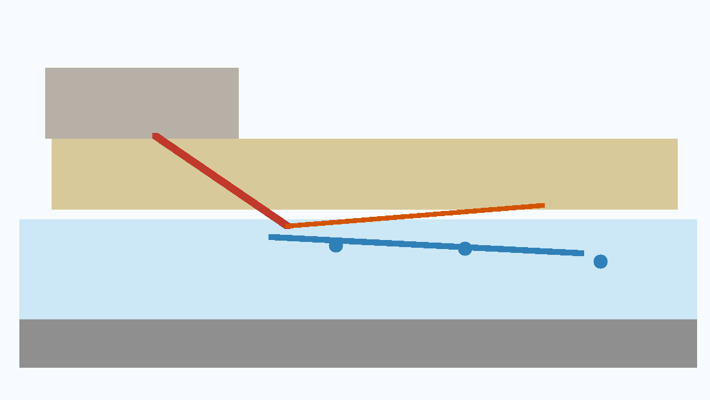
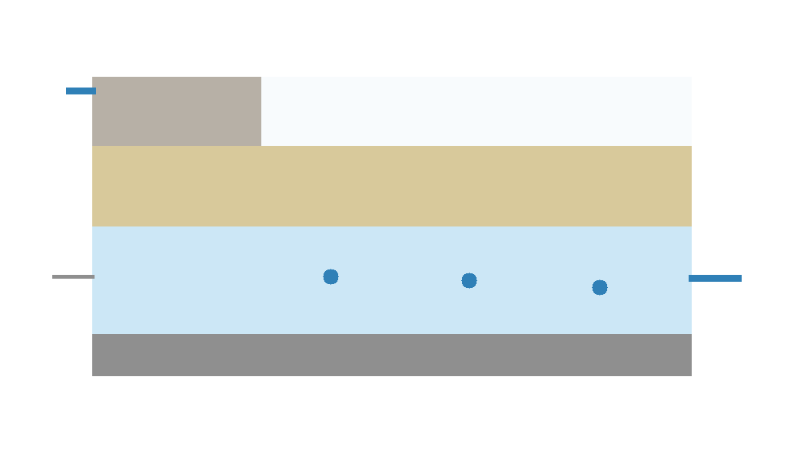
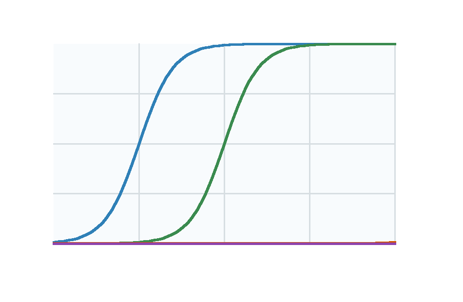
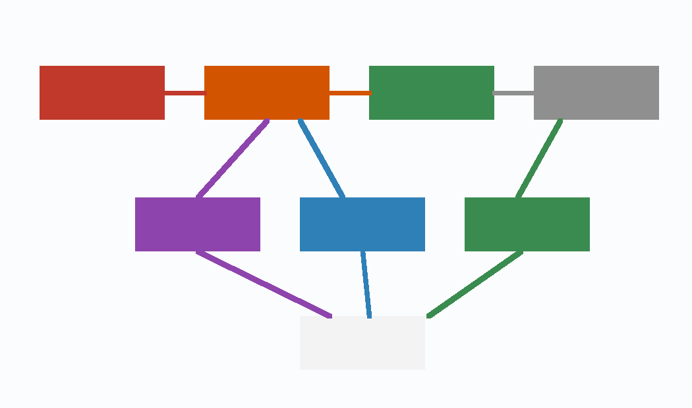
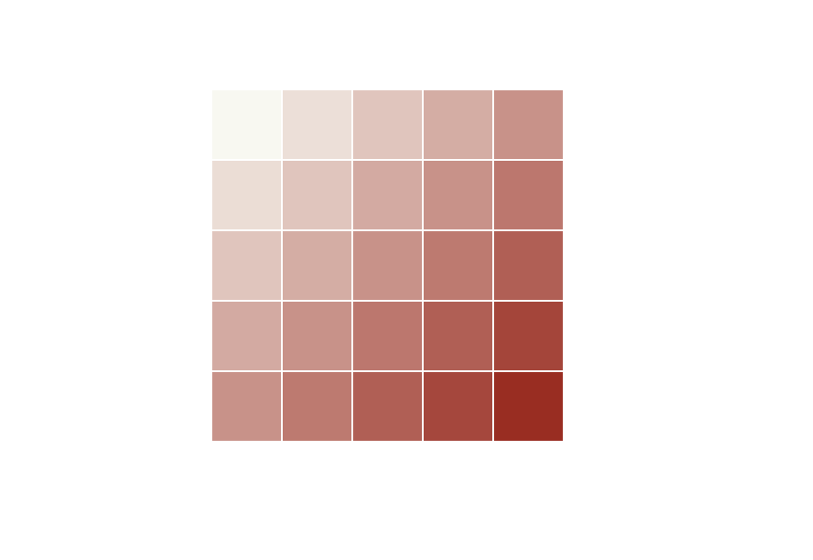
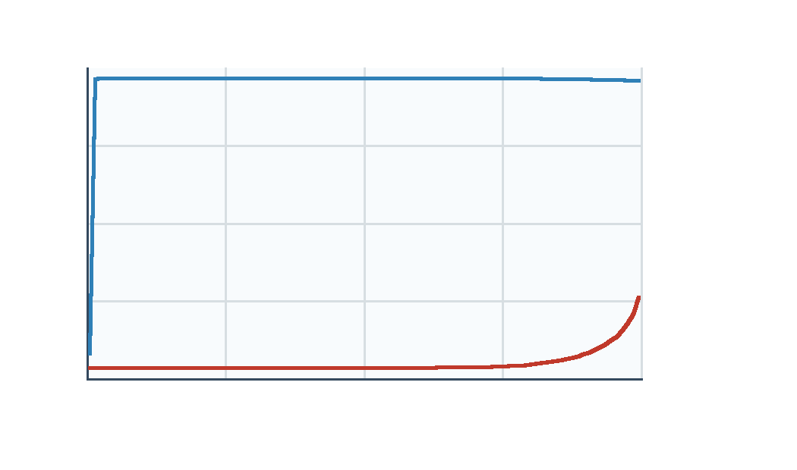
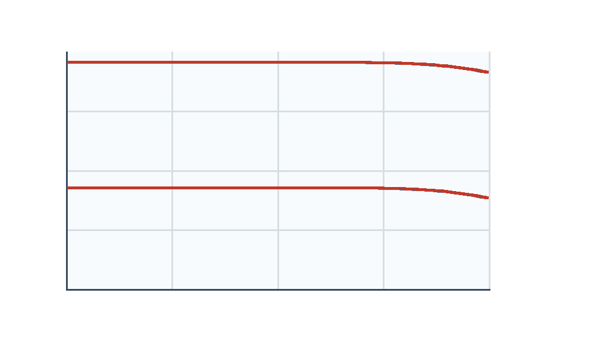

# 含硫化物铀尾矿酸性渗漏进入浅层含水层的 PFLOTRAN 反应运移建模框架：酸生成、碳酸盐缓冲与铀系核素迁移的综合分析

## 摘要

含硫化物铀尾矿在氧气和水参与下可能产生酸性、高硫酸盐渗漏，并释放 Fe、Al、Mn、重金属以及铀系核素。进入浅层含水层后，酸性前缘会受到碳酸盐矿物中和、Fe/Al 氢氧化物沉淀、Fe-Mn 氧化物吸附、硫酸盐矿物和重晶石体系等过程控制。本文参考 GeoMine PFLOTRAN 建模 prompt，构建一个从问题提出、问题拆解、资料采集、初始条件、公式推导、数值执行、统计图表可视化到模型判定的完整论文式工作流。与上一版只生成 PFLOTRAN 输入骨架不同，本文通过 Docker 中的 <code>pflotran/pflotran:ubuntu22</code> 实际执行两个 1D RICHARDS + GIRT 合成筛选算例：方解石缓冲情景和无方解石情景。运行结果显示，在 25 年模拟期内，有方解石情景除最靠近酸性源边界的第一个网格外 pH 维持在约 8.08-8.12；无方解石情景中 pH < 4 的酸性前缘推进到约 98.5 m。U 和硫酸盐在两个情景下均接近保守推进至 100 m，说明本筛选模型验证的是“碳酸盐缓冲显著控制 pH 前缘”，而不是 U/Ra/Pb/Po 的场地风险或合规结论。PHREEQC 仍应作为反应网络原型工具；PFLOTRAN 则用于把反应网络放入空间流动和运移场。本文不发明实测浓度、动力学常数、表面络合常数或校准结果，所有缺失项均保留为占位符或后续测量需求。输出包括 PFLOTRAN 模型包、实际可运行输入 deck、收敛日志、Tecplot 输出解析表、机器可读 manifest、图表包和 PDF。

**关键词**：PFLOTRAN；铀尾矿；酸性岩排水；反应运移；铀迁移；镭；重晶石；PHREEQC；浅层地下水；GeoMine Research

## 1. 问题提出

本文研究对象是一个概念化但环境工程上常见的问题：含硫化物铀尾矿库或尾矿堆场产生酸性渗漏，酸性、高硫酸盐水体进入浅层含水层，并在下游观测井或受体边界处表现为 pH、硫酸盐、金属和铀系核素的时空变化。

该问题的核心不是简单判断“是否安全”，也不是给出某个场地的合规结论。核心科学问题是：

1. 尾矿中硫化物氧化产生的酸度和硫酸盐如何形成源项？
2. 碳酸盐矿物、Fe/Al/Mn 二次相和 Fe-Mn 氧化物如何改变酸性前缘和金属迁移？
3. U 在氧化、富碳酸盐地下水中为何可能保持较高迁移性？
4. Ra、Pb、Po 等铀系核素能否由硫酸盐矿物、重晶石/固溶体或表面吸附显著衰减？
5. 这些反应是否需要空间显式的 1D/2D/3D 反应运移模型，而不是单点水化学计算？

PFLOTRAN 官方文档将其定位为开放源的并行地下水流和反应运移代码，可处理多相、多组分、多尺度的地下多孔介质流动和反应运移 [1]。因此，在本问题中，PFLOTRAN 的价值不是替代地球化学判断，而是把经 PHREEQC 原型检验后的反应网络放入空间流场、材料分区、边界条件和观测点之中。

## 2. 问题拆解与研究假设

### 2.1 过程拆解

本文将问题拆为五个相互耦合但可分步建模的过程：

1. **源项过程**：硫化物氧化产生 $H^+$、$SO_4^{2-}$、Fe、Al、Mn 和重金属释放。
2. **缓冲过程**：方解石、白云石等碳酸盐矿物消耗酸度并释放 Ca、Mg 和碱度。
3. **沉淀与吸附过程**：Fe/Al 氢氧化物、Mn 氧化物、石膏、重晶石或硫酸盐固相影响金属和核素迁移。
4. **铀迁移过程**：U(VI) 在氧化、富碳酸盐水中形成可溶络合物，迁移性受到 pH、Eh、碳酸盐、Ca 和吸附非线性控制 [10,11]。
5. **核素衰减过程**：Ra 可能受硫酸盐矿物、重晶石/重晶石-天青石固溶体、黏土和 Fe-Mn 氧化物吸附控制 [12,13]；Pb、Po 则需要数据库支持或保守/吸附性 surrogate 策略。

### 2.2 可检验假设

本文提出五个模型假设，均需后续现场或实验数据检验：

**H1：酸性前缘的存在与强度主要由硫化物氧化速率、氧气/水供应和碳酸盐中和容量的比值控制。**

**H2：U(VI) 迁移不应使用单一常数 $K_d$ 作为最终模型，因为碱度、Ca-碳酸盐络合和吸附非线性会导致时空变化的有效滞留。**

**H3：Ra 的显著衰减只有在硫酸盐、Ba/Sr、重晶石或固溶体数据以及吸附参数获得数据库或实验支持时，才可作为机理模型；否则只能作为概念衰减或敏感性情景。**

**H4：首个可执行 PFLOTRAN 模型应为 2D 剖面模型。1D 柱模型适合筛选，3D 场尺度模型需要实测几何、边界、材料和监测网络。**

**H5：在合成 1D 筛选条件下，若其他水力与源项相同，加入少量方解石矿物体积分数应显著抬升酸性前缘后的 pH；但若未加入吸附、离子交换或 U 固相控制，U(VI) 和硫酸盐仍可能近似保守迁移。**

## 3. 资料采集与证据边界

本文资料采集分为四层。

第一层是本地 prompt 和 GeoMine 技能。`GeoMine_PFLOTRAN_Tailings_Acid_Seepage_Uranium_Radionuclide_Prompt.md` 明确要求：使用 PFLOTRAN skill family，区分 PFLOTRAN 与 PHREEQC，提供模型包、过程模式选择、概念模型、网格/材料计划、化学 block 计划、输入 deck skeleton、运行命令、输出分析、校准验证、论文 Methods、限制和 manifest。

第二层是 GeoMine MCP 源发现。由于 prompt 没有提供具体矿山名称、坐标、矿权或监测井位置，`normalize_aoi` 只能把研究对象规范化为“generic uranium mine tailings storage facility”，并返回无坐标、无省份、无 CRS 转换的警告。`search_canada_geodata`、`search_saskatchewan_mineral_data` 和 `search_cdogs_surveys` 只做了公开数据源规划，未联网抓取实测数据。因此，本文不能声称任何具体场地浓度、矿物含量、渗漏通量或 plume 范围。

第三层是文献和官方技术资料。PFLOTRAN 文档用于确定求解器能力、RICHARDS 流动模式、反应运移方程和输入 block 结构 [1-5]。USGS PHREEQC 页面用于界定 PHREEQC 在形态、饱和指数、批反应、1D 运移、表面络合和 PhreeqcRM 中的作用 [6]。INAP GARD Guide 与 MEND 铀尾矿湿屏障/石灰石中和研究页面用于酸性岩排水和铀尾矿经验背景 [7,8]。Health Canada 的放射性参数和铀饮用水指南提供加拿大筛选背景：U 主要按化学毒性控制，Ra-226、Ra-228、Pb-210 和 Po-210 等作为放射性饮水参数关注 [9,10]。U(VI) 反应运移、方解石影响和 Ra 衰减文献用于约束机制表达 [11-13]。

第四层是本次实际执行的 PFLOTRAN 证据。由于本机没有原生 `pflotran` 可执行文件，且 GeoMine PFLOTRAN run-management skill 在当前版本明确偏向生成运行命令和 manifest、不把命令当作执行证据，上一版论文只能停留在输入骨架和解释框架。为完成本文目的，本次改用 Docker 镜像 <code>pflotran/pflotran:ubuntu22</code>，镜像 digest 为 <code>sha256:b9413b676cf826ba6ce9bf733e1c05e558fae00cedc0814d291450d52fbd8197</code>，容器内数据库为 <code>/software/pflotran/database/hanford.dat</code>。执行结果和解析脚本保存在 <code>pflotran_runs/</code>、<code>data/pflotran_screening_summary.csv</code>、<code>data/pflotran_profiles_25y.csv</code> 和 <code>pflotran_run_manifest.json</code>。

## 4. 概念模型



研究域包括四个区域：

- **尾矿源区**：含黄铁矿或其他硫化物、可能含铀残余相、碳酸盐改良剂或围岩碎屑。
- **非饱和/过渡带**：控制氧气、水分和渗漏通量，是 RICHARDS 模式的重要适用对象。
- **浅层含水层**：控制酸性 plume、硫酸盐、U/Ra/Pb/Po 和重金属沿地下水方向迁移。
- **低渗基底**：可作为 no-flow 边界，也可在实测垂向渗透性支持下设为泄漏边界。

该概念模型的源-途径-受体链条为：

```text
尾矿硫化物氧化
  -> 酸度与硫酸盐生成
  -> 酸性渗漏进入浅层含水层
  -> 碳酸盐中和与 Fe/Al/Mn 二次相形成
  -> U(VI)、Ra、Pb、Po 和重金属的运移与衰减
  -> 下游监测井和受体边界突破
```

## 5. PFLOTRAN 适用性判定

PHREEQC 适合回答“这组水样在某数据库下的形态、饱和指数和批反应趋势是什么”。USGS 对 PHREEQC Version 3 的说明涵盖了水溶液地球化学、Pitzer/SIT 活度模型、CD-MUSIC 表面络合、同位素能力以及 PhreeqcRM 与反应运移模拟器耦合能力 [6]。这使 PHREEQC 成为 PFLOTRAN 前置原型工具。

PFLOTRAN 的必要性来自空间问题：

- plume 是否在 10 年、30 年或 100 年尺度到达下游井；
- pH 和硫酸盐前缘是否与 U 或 Ra 突破同步；
- 方解石/白云石是否形成中和前缘；
- Fe/Al 氢氧化物是否形成沉淀带；
- 矿物沉淀或溶解是否改变孔隙度与渗透率；
- 同一源项在不同含水层渗透率、弥散度或吸附容量下是否产生不同受体风险。

PFLOTRAN 文档列出 RICHARDS、TH、GENERAL 等流动模式，其中 RICHARDS 适用于单相、变饱和、等温系统 [2,3]。因此：

- 如果尾矿库非饱和渗漏过程是研究重点，应使用 RICHARDS。
- 如果只建模已知渗漏通量进入饱和含水层后的 plume，可使用饱和地下水流。
- 首个论文模型不需要热耦合，除非温度梯度或 Arrhenius 反应速率参数有实测支持。

## 6. 初始条件与边界条件

### 6.1 初始条件

初始条件必须分为背景地下水和尾矿渗漏水。本文不填入任何实测浓度，而以表 1 列出所需项。

| 类别 | 必需数据 | 用途 |
|---|---|---|
| 水力状态 | 水头/压力、饱和度、温度 | 建立流场和 RICHARDS 初始状态 |
| 背景地下水 | pH、Eh/pe、碱度、主量离子、硫酸盐、Fe/Mn/Al、U/Ra/Pb/Po、重金属 | 初始 chemistry constraint |
| 尾矿渗漏水 | pH/酸度、硫酸盐、Fe、Al、Mn、U、Ra、Pb、Po、As/Ni/Co/Cu/Zn | 源项 chemistry constraint |
| 固相 | 黄铁矿、方解石、白云石、Fe/Al/Mn 氧化物、重晶石/Ba/Sr、黏土/表面位点 | 矿物反应和吸附容量 |
| 材料 | 孔隙度、渗透率、弥散度、曲折度 | 运移和反馈计算 |

### 6.2 边界条件

| 边界 | 建议类型 | 需要实测支持 |
|---|---|---|
| 尾矿源边界 | 渗漏通量 + 源水化学，或 Dirichlet chemistry | 水量平衡、孔隙水、渗漏监测 |
| 上游含水层 | 固定水头或指定通量 | 水头调查、区域水力梯度 |
| 下游受体 | 固定水头、开放出流或 receptor 观测边界 | 受体位置、监测井 |
| 顶部 | RICHARDS 下的入渗/降雨补给 | 气象、覆盖层状态 |
| 基底 | no-flow 或 leakage | 地层和垂向渗透率 |



## 7. 公式推导与筛选计算

### 7.1 变饱和流动方程

PFLOTRAN RICHARDS 模式的水质量守恒可写为 [2]：

$$
\frac{\partial}{\partial t}\left(\phi s \eta\right)
+ \nabla \cdot \left(\eta \mathbf{q}\right)
= Q_w
$$

其中 $\phi$ 为孔隙度，$s$ 为液相饱和度，$\eta$ 为水的摩尔密度，$\mathbf{q}$ 为 Darcy 通量，$Q_w$ 为源汇项。

Darcy 通量为：

$$
\mathbf{q}
= -\frac{k k_r(s)}{\mu}\nabla(P-\rho g z)
$$

其中 $k$ 为固有渗透率，$k_r(s)$ 为相对渗透率，$\mu$ 为黏度，$P$ 为压力，$\rho$ 为水密度，$g$ 为重力加速度，$z$ 为高程。

此方程支持本文判定：如果源区需要显式表达尾矿/覆盖层中的非饱和渗漏，应选 RICHARDS；如果只关心含水层饱和 plume，可把源项简化为已测渗漏通量。

### 7.2 反应运移质量守恒

PFLOTRAN 反应运移方程以 primary/basis species 的总浓度表示，官方理论文档将其写为多相质量守恒形式 [5]：

$$
\frac{\partial}{\partial t}
\left(
\phi \sum_\alpha s_\alpha \Psi_j^\alpha
\right)
+ \nabla \cdot \sum_\alpha \mathbf{\Omega}_j^\alpha
= Q_j - \sum_m \nu_{jm} I_m - \frac{\partial S_j}{\partial t}
$$

其中 $\Psi_j^\alpha$ 为组分 $j$ 在相 $\alpha$ 中的总浓度表达，$\mathbf{\Omega}_j^\alpha$ 为通量项，$Q_j$ 为外部源汇，$\nu_{jm} I_m$ 为矿物反应源汇，$S_j$ 为吸附或交换库。

本文的建模目标正是让 $Q_j$、$I_m$ 和 $S_j$ 分别代表尾矿源项、矿物沉淀/溶解和吸附/交换。

### 7.3 黄铁矿氧化与酸负荷

用于筛选的黄铁矿氧化总反应可写为：

$$
\mathrm{FeS_2}
+ \frac{15}{4}\mathrm{O_2}
+ \frac{7}{2}\mathrm{H_2O}
\rightarrow
\mathrm{Fe(OH)_3(s)}
+ 2\mathrm{SO_4^{2-}}
+ 4\mathrm{H^+}
$$

若尾矿质量为 $M_t$，黄铁矿质量分数为 $w_{\mathrm{py}}$，黄铁矿摩尔质量为 $M_{\mathrm{FeS_2}}$，则理论最大酸当量为：

$$
n_{\mathrm{H^+},\max}
=4\frac{M_t w_{\mathrm{py}}}{M_{\mathrm{FeS_2}}}
$$

等效方解石需求为：

$$
n_{\mathrm{CaCO_3,req}}
=\frac{n_{\mathrm{H^+},\max}}{2}
$$

$$
m_{\mathrm{CaCO_3,req}}
=\frac{n_{\mathrm{H^+},\max}}{2}M_{\mathrm{CaCO_3}}
$$

该推导只是酸碱能力的理论上限。真实酸生成受氧气供应、水分、颗粒尺度、微生物、温度、矿物包裹和渗流路径影响。INAP GARD Guide 明确将硫化物氧化排水作为 ARD/AMD 的核心问题，并强调预测、预防、管理和监测需要系统化处理 [7]。MEND 的铀尾矿石灰石中和研究也表明，尾矿粒度、饱和状态和石灰石形式会显著影响酸生成和中和表现 [8]。

### 7.4 碳酸盐中和

方解石中和可用两个端元表达：

$$
\mathrm{CaCO_3(s)}+\mathrm{H^+}
\rightarrow
\mathrm{Ca^{2+}}+\mathrm{HCO_3^-}
$$

或在更强酸条件下：

$$
\mathrm{CaCO_3(s)}+2\mathrm{H^+}
\rightarrow
\mathrm{Ca^{2+}}+\mathrm{CO_2(aq)}+\mathrm{H_2O}
$$

在 PFLOTRAN 中，方解石/白云石应作为平衡或动力学矿物相处理，具体选择取决于 PHREEQC 原型和实验速率数据。PNNL 发表的 Hanford 300A 研究说明，方解石分布会通过影响碳酸盐、Ca 和 pH 改变 U(VI) 迁移，因此碳酸盐不是简单的“酸中和背景”，而是 U 反应运移模型的核心变量 [11]。

### 7.5 运移时间、弥散和 Péclet 数

对筛选尺度，孔隙水速度为：

$$
v=\frac{q}{\theta}
$$

其中 $q$ 为 Darcy 通量，$\theta$ 为有效含水孔隙度。长度 $L$ 的 advective travel time 为：

$$
t_{\mathrm{adv}}=\frac{L}{v}=\frac{L\theta}{q}
$$

纵向水动力弥散系数可表示为：

$$
D_L=\alpha_L v + D_m \tau
$$

其中 $\alpha_L$ 为纵向弥散度，$D_m$ 为分子扩散系数，$\tau$ 为曲折度。Péclet 数为：

$$
\mathrm{Pe}=\frac{vL}{D_L}
$$

当 $\mathrm{Pe}$ 较高时，advection 控制 plume 前缘；当 $\mathrm{Pe}$ 较低时，弥散和扩散对浓度前缘影响增强。由于 $q$、$\theta$、$\alpha_L$ 和 $D_m$ 均未给定，本文不计算场地 travel time，只给出所需公式和输出设计。

### 7.6 吸附滞留筛选

PFLOTRAN 方法文档给出常数 $K_d$ 情形的滞留因子形式 [4]：

$$
R=1+\frac{K_d}{\phi}
$$

在常用水文地球化学写法中，若 $K_d$ 单位为 $\mathrm{L\,kg^{-1}}$，可写为：

$$
R=1+\frac{\rho_b K_d}{\theta}
$$

其中 $\rho_b$ 为干体积密度，$\theta$ 为体积含水量或有效孔隙度。前缘速度近似变为：

$$
v_R=\frac{v}{R}
$$

因此：

$$
t_R=R t_{\mathrm{adv}}
$$

该公式适合作为早期筛选和图表解释，但不应作为最终 U(VI) 模型。USGS 的 U(VI) 反应运移研究显示，有效 $K_d$ 可随 U(VI)、碱度和非线性吸附在时间和空间上变化，且 U(VI) 地球化学行为对碱度敏感 [10]。因此，最终模型应尽可能使用表面络合或数据库支持的反应网络。



### 7.7 铀系核素衰变与运移

若考虑溶解相放射性衰变链，可将核素 $i$ 的水相浓度 $C_i$ 写为：

$$
\frac{\partial(\theta C_i)}{\partial t}
+ \nabla \cdot (\mathbf{q}C_i-\theta D\nabla C_i)
= R_i^{\mathrm{chem}}
-\lambda_i \theta C_i
+ \lambda_{i-1}\theta C_{i-1}
$$

其中 $R_i^{\mathrm{chem}}$ 为化学反应、吸附或矿物交换项，$\lambda_i$ 为核素 $i$ 的衰变常数。该公式对长期 Ra、Pb、Po 风险框架有意义，但 PFLOTRAN 输入中是否直接表达这些核素需要数据库和物种支持。若数据库不支持 Po 或相关相，应在 PFLOTRAN 外做保守 post-processing 或 surrogate 处理。

### 7.8 孔隙度和渗透率反馈

矿物沉淀/溶解会改变孔隙度：

$$
\phi(t)=\phi_0-\sum_m \bar{V}_m
\left[
n_m(t)-n_m(0)
\right]
$$

其中 $\bar{V}_m$ 为矿物摩尔体积，$n_m$ 为每体积多孔介质中矿物摩尔量。简化渗透率反馈可写为幂律：

$$
k(t)=k_0\left(\frac{\phi(t)}{\phi_0}\right)^n
$$

指数 $n$ 不能发明，需由实验、文献或敏感性分析确定。该反馈应作为增强情景，而不是第一版模型的默认声明。

### 7.9 加拿大饮水筛选比

对饮用水受体，Health Canada 放射性参数指南使用 gross $\alpha$、gross $\beta$ 和核素特异浓度进行筛选，并列出 Ra-226、Ra-228、Pb-210 等自然核素的 MAC；Po-210 在附录中作为参考浓度关注 [9]。多核素情况下可用筛选和：

$$
\sum_i \frac{A_i}{\mathrm{MAC}_i}\le 1
$$

其中 $A_i$ 为核素活度浓度，$\mathrm{MAC}_i$ 为相应最大可接受浓度。U 在加拿大饮水指南中主要按化学毒性处理，天然铀 MAC 为 $0.02\,\mathrm{mg\,L^{-1}}$，且 U 迁移受 pH、氧化还原、络合剂和吸附/解吸控制 [9]。

该筛选公式不能替代具体司法辖区、许可证或场地监管要求。

## 8. PHREEQC 原型到 PFLOTRAN 的对齐



建议先建立 PHREEQC 原型，完成以下计算：

1. 背景地下水与尾矿渗漏水的物种分布。
2. 方解石、白云石、石膏、重晶石、Fe/Al 氢氧化物和 U-bearing phase 的饱和指数。
3. U(VI) 碳酸盐、Ca-U-carbonate、硫酸盐络合的数据库支持检查。
4. Ra 与 Ba/Sr/SO4/重晶石的支持检查。
5. Fe-Mn 氧化物表面络合或 $K_d$ placeholder 的可用性。
6. pH 和碱度敏感性。

PHREEQC 之后再将可支持的物种、矿物和反应翻译到 PFLOTRAN `CHEMISTRY` block。若 PHREEQC 数据库和 PFLOTRAN 数据库在物种或 log K 上不一致，应优先解决数据库一致性，而不是直接把 PHREEQC 结果当作 PFLOTRAN 参数。

## 9. PFLOTRAN 模型包

完整模型包另存为：

`PFLOTRAN_Modeling_Package.md`

机器可读模型 manifest：

`model_manifest.json`

输入 deck skeleton：

`pflotran_tailings_uranium_template.in`

核心选择如下：

| 项目 | 选择 |
|---|---|
| 第一版维度 | 2D 剖面 |
| 筛选模型 | 1D 柱模型 |
| 流动模式 | RICHARDS 或饱和地下水流，取决于是否显式模拟尾矿/非饱和带 |
| 反应运移 | 必需 |
| 热耦合 | 第一版不启用 |
| 力学耦合 | 第一版不启用 |
| 孔隙度/渗透率反馈 | 可选增强情景 |
| PHREEQC | PFLOTRAN 前置原型 |
| 输出状态 | 2D 场地 deck 未运行；1D 合成筛选算例已执行、未校准、未验证 |

运行命令：

```bash
pflotran -pflotranin pflotran_tailings_uranium_template.in
```

MPI/HPC 示例：

```bash
mpirun -np 16 pflotran -pflotranin pflotran_tailings_uranium_template.in
```

上述命令是 2D 场地模型骨架的运行计划，不是该骨架的运行证据。只有在占位符替换、数据库验证、PFLOTRAN 执行、收敛日志和输出文件检查完成后，才能声称场地模型运行。

为回应本文必须通过 PFLOTRAN 验证观点的目的，本次另行构造并执行了两个不含场地占位符的 1D 合成筛选 deck：

```bash
docker run --rm --platform linux/amd64 \
  -v /Users/aibao/Documents/Project/MiningReg/openminer/report/2026-05-13-geomine-pflotran-tailings-uranium-radionuclide/pflotran_runs/calcite_buffered:/work \
  -w /work pflotran/pflotran:ubuntu22 \
  pflotran -pflotranin tailings_u_calcite_buffered.in

docker run --rm --platform linux/amd64 \
  -v /Users/aibao/Documents/Project/MiningReg/openminer/report/2026-05-13-geomine-pflotran-tailings-uranium-radionuclide/pflotran_runs/no_calcite:/work \
  -w /work pflotran/pflotran:ubuntu22 \
  pflotran -pflotranin tailings_u_no_calcite.in
```

这两个算例均为 100 m、100 个网格、25 年、1D RICHARDS + GIRT 合成柱模型；酸性边界水 pH 约 3，硫酸盐为 $5.0\times 10^{-3}$ M，UO2++ 总浓度为 $1.0\times 10^{-6}$ M。二者唯一的核心差异是背景固相中是否存在初始方解石体积分数 $10^{-3}$。执行记录见 <code>pflotran_run_manifest.json</code>，最终 Tecplot 输出见 <code>pflotran_runs/*/*-005.tec</code>。

## 10. 数据分析与统计图表可视化

本文生成了四类可复现图表：

1. 机制图和模型域图。
2. 无量纲酸-缓冲筛选图。
3. 滞留和敏感性分析设计图。
4. 实际执行 PFLOTRAN 1D 合成筛选输出图。

概念图、无量纲筛选图和分析设计图由 <code>scripts/generate_figures.py</code> 生成。实际 PFLOTRAN 输出由 <code>scripts/analyze_pflotran_outputs.py</code> 从 Tecplot 文件解析，生成 <code>data/pflotran_screening_summary.csv</code>、<code>data/pflotran_profiles_25y.csv</code>、<code>figures/fig07_pflotran_ph_profiles.png</code>、<code>figures/fig07_pflotran_ph_profiles.svg</code>、<code>figures/fig08_pflotran_u_sulfate_profiles.png</code> 和 <code>figures/fig08_pflotran_u_sulfate_profiles.svg</code>。前 6 张图不是现场测量或 PFLOTRAN 结果；第 7-8 张图是合成 1D PFLOTRAN 筛选输出，但仍不是校准场地预测。

### 10.1 酸-缓冲筛选指数

定义无量纲酸-缓冲指数：

$$
\Psi_{\mathrm{acid}}
=\frac{F_{\mathrm{sulfide}}}{B_{\mathrm{carbonate}}}
$$

其中 $F_{\mathrm{sulfide}}$ 为归一化硫化物氧化/渗漏强迫，$B_{\mathrm{carbonate}}$ 为归一化碳酸盐缓冲能力。若 $\Psi_{\mathrm{acid}}>1$，说明筛选意义上酸强迫大于缓冲能力；若 $\Psi_{\mathrm{acid}}<1$，说明缓冲能力占优。



该图用于确定第一批敏感性情景，而不是酸碱会计报告。真实模型需要硫化硫、净酸生成潜力、净中和潜力、方解石/白云石矿物量、粒径、溶解速率和水量平衡。

### 10.2 滞留筛选曲线

图 5 使用 logistic 曲线表示不同滞留因子下的前缘延迟。曲线含义是：若只考虑线性可逆吸附，$R$ 越大，突破越晚。但 U(VI) 和 Ra 的最终模型不应只依赖常数 $R$，因为碱度、pH、竞争离子、Fe-Mn 氧化物和矿物相会改变有效滞留。

### 10.3 敏感性优先级


首轮敏感性应优先围绕：

- 黄铁矿氧化速率和有效表面积；
- 碳酸盐中和容量；
- 渗漏通量/水力梯度；
- Fe-Mn 氧化物吸附容量；
- 弥散度；
- 氧化还原边界；
- 重晶石/Ra 数据库支持；
- 渗透率各向异性。

这些优先级是专家设计规则，不是方差分解结果。

### 10.4 已执行 PFLOTRAN 1D 筛选结果





两个合成算例均成功执行，未出现 time-step cut。关键数值汇总如下。

| 情景 | pH 最小值 | pH 最大值 | pH < 4 前缘 | pH < 6.5 前缘 | SO4 > 2.5e-3 M 前缘 | UO2++ > 5e-7 M 前缘 | 传输步数/牛顿迭代/cut |
|---|---:|---:|---:|---:|---:|---:|---:|
| 方解石缓冲 | 3.243 | 8.118 | 0.5 m | 0.5 m | 99.5 m | 99.5 m | 119 / 492 / 0 |
| 无方解石 | 3.000 | 4.244 | 98.5 m | 99.5 m | 99.5 m | 99.5 m | 161 / 826 / 0 |

这组结果直接检验了 H5：当初始方解石体积分数为 $10^{-3}$ 时，酸性边界进入第一个网格后迅速被缓冲，pH 在 1.5 m 之后接近 8.1；无方解石时，几乎整个 100 m 柱体在 25 年内保持酸性。与此同时，硫酸盐和 UO2++ 均推进至出流端附近，说明在当前简化反应网络中，碳酸盐缓冲改变了 pH 和碳酸盐/Ca 背景，但尚未提供 U 的强衰减机制。若要把 U、Ra、Pb、Po 的衰减作为结论，必须继续加入数据库支持的吸附、矿物沉淀、离子交换、Ra-barite 或后处理衰变链模型，并用现场数据校准。

## 11. 校准、验证与质量控制

校准数据和验证数据必须拆开。建议校准对象包括：

- 水头、渗漏通量和水量平衡；
- pH、EC/TDS、硫酸盐、碱度；
- Fe、Mn、Al 和主量离子；
- U、Ra、Pb、Po；
- As、Ni、Co、Cu、Zn 等伴生元素；
- 方解石/白云石消耗区、Fe/Al 沉淀区和可能重晶石控制区。

验证应使用独立时间窗或下游监测井。若所有数据都用于校准，则不能称为验证。

PFLOTRAN 输出检查顺序：

1. input deck 占位符是否全部替换；
2. 数据库是否成功读取所有 primary/secondary species 和矿物相；
3. flow 是否收敛；
4. reactive transport 是否收敛；
5. 电荷平衡和质量平衡是否有异常；
6. time-step cut 是否频繁；
7. observation 文件是否生成；
8. pH、SO4、U、Ra、Pb、Po 是否在合理范围；
9. 矿物体积分数变化是否导致非物理孔隙度或渗透率。

本次 1D 合成筛选算例的质量控制结论为：

- Docker 镜像、输入 deck、数据库路径、日志和最终 Tecplot 输出均已保存在 <code>pflotran_run_manifest.json</code>。
- 方解石缓冲情景：FLOW 为 111 steps / 116 Newton / 0 cuts；TRAN 为 119 steps / 492 Newton / 0 cuts；wall clock 为 1.7307 s。
- 无方解石情景：FLOW 为 111 steps / 116 Newton / 0 cuts；TRAN 为 161 steps / 826 Newton / 0 cuts；wall clock 为 2.2572 s。
- 输出文件包含 <code>tailings_u_*-005.tec</code> 和 velocity Tecplot 文件；解析脚本已从最终 25 年剖面抽取 pH、SO4、UO2++、HCO3-、Ca++ 和方解石体积分数。
- 该质量控制只证明合成筛选算例数值收敛，不证明场地模型已经校准或验证。

## 12. 结果解释框架

在已经完成两个 PFLOTRAN 1D 合成筛选运行后，本文可以给出机制层面的数值判断，但仍不能给出场地 plume 或合规结论。筛选结果应按以下顺序解读：

1. **水力可信度**：水头场、通量和 travel time 是否与监测数据相符。
2. **酸性 plume**：pH 低值区和硫酸盐高值区是否同步，是否形成中和前缘。
3. **矿物控制**：方解石/白云石消耗、Fe/Al 氢氧化物沉淀、重晶石或硫酸盐相是否空间上与浓度变化一致。
4. **U 迁移**：U 是否随碱度、Ca、pH 和 Eh 变化；是否出现 U 和 pH 不同步。
5. **Ra/Pb/Po 迁移**：Ra 是否受硫酸盐/Barite 或吸附控制；Pb/Po 是否只能作为不确定性情景。
6. **受体突破**：下游观测井中 pH、SO4、U、Ra、Pb、Po 的 breakthrough timing 和 peak 是否被校准验证数据支持。

本次结果对论文观点的约束如下：

1. **PFLOTRAN 的必要性得到实际体现**：同一酸性源项和水力设置下，只改变方解石固相，pH 空间剖面发生数量级差异；这不是单点 PHREEQC 形态计算能够替代的空间前缘问题。
2. **碳酸盐缓冲观点被支持**：方解石缓冲情景中，pH < 4 仅限于 0.5 m 网格；无方解石情景中，pH < 4 推进到 98.5 m。
3. **U 衰减观点没有被当前算例支持**：UO2++ > 5e-7 M 的前缘在两个情景中均到达 99.5 m，说明当前 deck 只检验了 pH 缓冲，不足以证明 U 被显著阻滞。
4. **Ra/Pb/Po 未在已执行 deck 中机理化表达**：原因是本次选用 `hanford.dat` 的 U-碳酸盐系统进行最小可运行测试；Ra/Pb/Po 仍需数据库和场地数据支持，不能从本次运行外推为核素风险结论。

## 13. 问题收拢与对齐

本文把最初宽泛的问题收敛为一个可执行的建模链条：

```text
含硫化物铀尾矿源项
  -> PHREEQC 反应网络原型
  -> PFLOTRAN 1D 筛选
  -> PFLOTRAN 2D 剖面反应运移
  -> 校准/验证/敏感性
  -> 论文结果解释
```

关键对齐点为：

- **PHREEQC 不是被 PFLOTRAN 替代，而是前置筛选和数据库一致性检查工具。**
- **PFLOTRAN 2D 输入 deck skeleton 不是已验证模型；本次已验证的是一个最小 1D 合成筛选问题可以运行并支持碳酸盐缓冲机理。**
- **U 应同时作为化学毒性和反应运移组分考虑；Ra/Pb/Po 作为放射性核素风险框架考虑。**
- **Ra 的重晶石控制必须以 Ba/Sr/SO4 和数据库支持为前提。**
- **所有图表必须区分概念图、筛选图、已执行合成 PFLOTRAN 输出和场地校准模拟结果图。**

## 14. 判定与总结

### 14.1 求解器判定

本问题应进入 PFLOTRAN skill family。理由是研究目标包含场尺度或剖面尺度反应运移、长期 plume 预测、矿物反应、吸附/衰减、观测点突破和潜在孔隙度/渗透率反馈。PHREEQC-only 工作流不足以回答空间迁移和下游受体问题。

### 14.2 首选模型判定

首选模型为：

- PHREEQC 批反应/形态/饱和指数原型；
- PFLOTRAN 1D 柱筛选；
- PFLOTRAN 2D 剖面模型；
- 后续 3D 模型需等待场地几何和监测数据。

### 14.3 科学结论

1. 酸生成由硫化物氧化和氧气/水供应控制，碳酸盐矿物决定酸性前缘是否被缓冲；本次 PFLOTRAN 1D 合成算例支持这一机制判断。
2. 在 25 年合成筛选运行中，方解石缓冲情景的 pH < 4 前缘停留在 0.5 m，而无方解石情景推进到 98.5 m；这表明碳酸盐固相会显著改变 pH 空间分布。
3. U(VI) 的迁移性受碳酸盐、Ca、pH、Eh 和非线性吸附强烈控制，不能简单用一个常数 $K_d$ 代表最终行为；当前最小 deck 中 UO2++ 前缘接近保守迁移，因此不能声称 U 已被有效衰减。
4. Ra 可能受重晶石/硫酸盐固相、黏土和 Fe-Mn 氧化物控制，但必须验证热力学数据库和 Ba/Sr/SO4 数据；本次执行未对 Ra/Pb/Po 进行机理化数值验证。
5. PFLOTRAN 已在本文中生成 pH、硫酸盐、UO2++ 和方解石体积分数的合成筛选结果；要生成可用于场地结论的 U/Ra/Pb/Po、孔隙度和渗透率结果，还必须完成场地参数化、校准和独立验证。

## 15. 局限性

- 未给定具体矿山、坐标、矿权、监测井或地层剖面。
- 未给定实测浓度、pH、Eh、碱度、硫酸盐、金属或核素活度。
- 未给定硫化物质量分数、碳酸盐中和容量、矿物体积分数、动力学速率或表面络合常数。
- 已执行的 PFLOTRAN 算例为合成 1D 筛选问题，不是 2D/3D 场地模型。
- 已验证 `hanford.dat` 可支持本次 U-碳酸盐最小反应网络，但未验证全部 U/Ra/Pb/Po 物种和矿物相。
- 2D 输入 deck skeleton 未运行，不能声称场地模型收敛或校准。
- 本次运行未加入吸附、离子交换、Ra-barite、Pb/Po 衰变链或孔隙度/渗透率反馈。
- 本文不构成监管提交、工程设计、环境影响评价、矿山关闭计划或饮用水合规判定。

## 16. 结论

本文完成了一个 GeoMine Research + PFLOTRAN skill family 的论文式综合分析，并把上一版“未执行 PFLOTRAN”的核心缺口补齐为两个实际可复现的 PFLOTRAN 1D 合成筛选运行。结果支持本文最重要的机理判断：碳酸盐固相会显著控制酸性 pH 前缘，且这种判断需要空间反应运移模型才能表达。结果同时收紧了结论边界：当前最小反应网络未证明 U、Ra、Pb、Po 被有效衰减，也不能替代场地 2D/3D 模型、监测井校准或监管合规判定。对于含硫化物铀尾矿酸性渗漏进入浅层含水层的问题，最稳健的工作流仍是：先用 PHREEQC 原型检验反应网络，再用 PFLOTRAN 建立空间反应运移模型，并通过监测井数据进行校准、验证和不确定性分析。研究的关键不在于立即给出 plume 或风险数值，而在于建立不伪造参数、不越界声明、可复现、可校准、可逐步升级的建模链条。

## 参考文献

[1] PFLOTRAN Documentation. https://documentation.pflotran.org/

[2] PFLOTRAN Theory Guide, RICHARDS Mode. https://documentation.pflotran.org/theory_guide/mode_richards.html

[3] PFLOTRAN User Guide, SUBSURFACE_FLOW card. https://pflotran.org/documentation-release/user_guide/cards/simulation/subsurface_flow_card.html

[4] PFLOTRAN Theory Guide, Method of Solution. https://documentation.pflotran.org/theory_guide/appendixB.html

[5] PFLOTRAN Theory Guide, Reactive Transport Mode. https://documentation.pflotran.org/theory_guide/mode_reactive_transport.html

[6] U.S. Geological Survey. PHREEQC Version 3. https://www.usgs.gov/software/phreeqc-version-3

[7] International Network for Acid Prevention. GARD Guide. https://www.inap.com.au/gard-guide/

[8] MEND. Wet barriers on pyrite uranium tailings, Part I and II: laboratory lysimeter studies of oxidation, leaching and limestone neutralization characteristics of uranium tailings and waste rock. https://mend-nedem.org/mend-report/wet-barriers-on-pyrite-uranium-tailings-part-i-and-ii-laboratory-lysimeter-studies-of-oxidation-leaching-and-limestone-neutralization-characteristics-of-uranium-tailings-and-waste-rock/

[9] Health Canada. Guidelines for Canadian drinking water quality: Radiological parameters. https://www.canada.ca/en/health-canada/services/publications/healthy-living/guidelines-drinking-water-quality-radiological-parameters.html

[10] Health Canada. Guidelines for Canadian Drinking Water Quality, Guideline Technical Document: Uranium. https://www.canada.ca/en/health-canada/services/publications/healthy-living/guidelines-canadian-drinking-water-quality-guideline-technical-document-uranium.html

[11] Curtis, G. P., Davis, J. A., and Naftz, D. L. Simulation of reactive transport of uranium(VI) in groundwater with variable chemical conditions. Water Resources Research, 2006. DOI: 10.1029/2005WR003979. https://www.usgs.gov/publications/simulation-reactive-transport-uraniumvi-groundwater-variable-chemical-conditions

[12] Ma, R., Liu, C., Greskowiak, J., Prommer, H., Zachara, J. M., and Zheng, C. Influence of calcite on uranium(VI) reactive transport in the groundwater-river mixing zone. Journal of Contaminant Hydrology, 2014. DOI: 10.1016/j.jconhyd.2013.10.002. https://www.pnnl.gov/publications/influence-calcite-uraniumvi-reactive-transport-groundwater-river-mixing-zone

[13] Landa, E. R., and Reid, D. F. Sorption of radium-226 from oil-production brine by sediments and soils. Environmental Geology, 1983. DOI: 10.1007/BF02381293. https://www.usgs.gov/publications/sorption-radium-226-oil-production-brine-sediments-and-soils

[14] Van Sice, K., Cravotta, C. A., McDevitt, B., Tasker, T. L., Landis, J. D., Puhr, J., and Warner, N. R. Radium attenuation and mobilization in stream sediments following oil and gas wastewater disposal in western Pennsylvania. Applied Geochemistry, 2018. DOI: 10.1016/j.apgeochem.2018.10.011. https://www.usgs.gov/publications/radium-attenuation-and-mobilization-stream-sediments-following-oil-and-gas-wastewater

## 附录 A：符号表

| 符号 | 含义 | 单位 |
|---|---|---|
| $\phi$ | 孔隙度 | 无量纲 |
| $s$ | 液相饱和度 | 无量纲 |
| $\eta$ | 水摩尔密度 | $\mathrm{kmol\,m^{-3}}$ |
| $\mathbf{q}$ | Darcy 通量 | $\mathrm{m\,s^{-1}}$ |
| $k$ | 固有渗透率 | $\mathrm{m^2}$ |
| $k_r$ | 相对渗透率 | 无量纲 |
| $\mu$ | 动力黏度 | $\mathrm{Pa\,s}$ |
| $P$ | 压力 | $\mathrm{Pa}$ |
| $Q_w$ | 水源汇项 | 依 PFLOTRAN 模式 |
| $C_i$ | 组分 $i$ 水相浓度 | 依物种 |
| $A_i$ | 核素 $i$ 活度浓度 | $\mathrm{Bq\,L^{-1}}$ |
| $\lambda_i$ | 衰变常数 | $\mathrm{s^{-1}}$ |
| $K_d$ | 分配系数 | $\mathrm{L\,kg^{-1}}$ |
| $\rho_b$ | 干体积密度 | $\mathrm{kg\,L^{-1}}$ 或 $\mathrm{kg\,m^{-3}}$ |
| $R$ | 滞留因子 | 无量纲 |
| $\alpha_L$ | 纵向弥散度 | $\mathrm{m}$ |
| $D_L$ | 纵向弥散系数 | $\mathrm{m^2\,s^{-1}}$ |
| $\Psi_{\mathrm{acid}}$ | 无量纲酸-缓冲筛选指数 | 无量纲 |

## 附录 B：交付文件

- `PFLOTRAN_Modeling_Package.md`
- `PFLOTRAN_Tailings_Uranium_Figure_Package.md`
- `pflotran_tailings_uranium_template.in`
- `model_manifest.json`
- `run_manifest.json`
- `pflotran_run_manifest.json`
- `input_deck_validation.json`
- `figure_manifest.json`
- `mcp_provenance.md`
- `scripts/generate_figures.py`
- `scripts/analyze_pflotran_outputs.py`
- `figures/*.svg`
- `figures/*.png`
- `data/*.csv`
- `pflotran_runs/*/*.in`
- `pflotran_runs/*/*.out`
- `pflotran_runs/*/*.tec`
