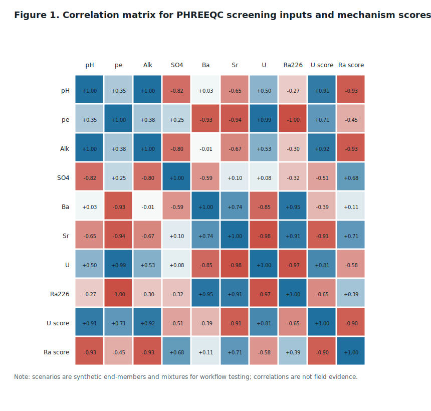
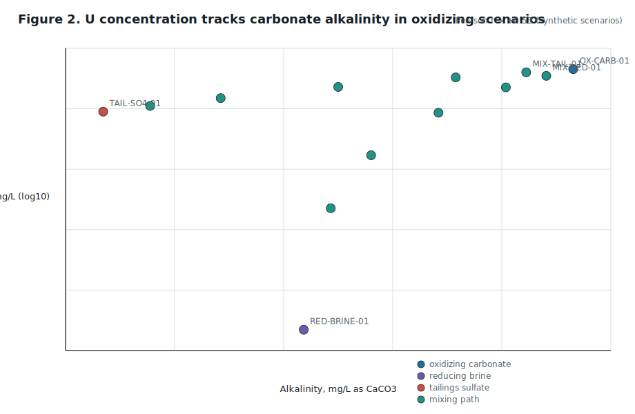
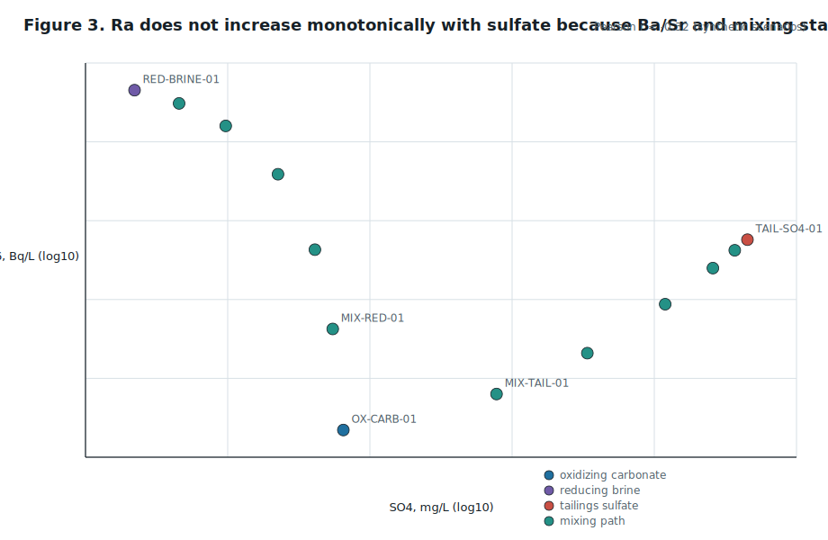
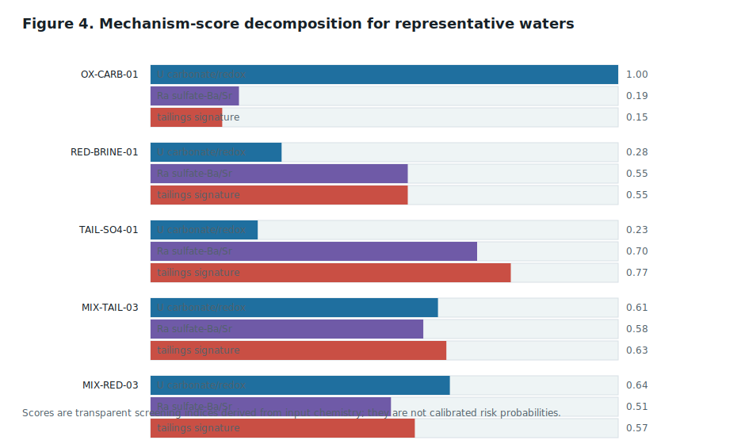
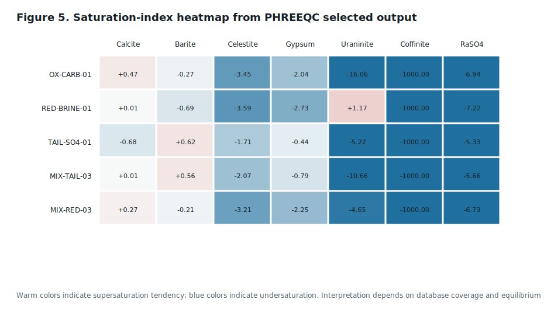
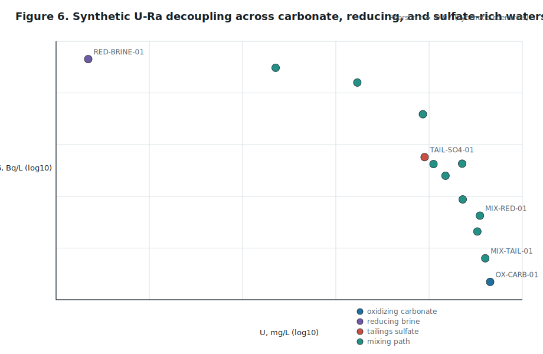

# 铀矿区地下水中 U-Ra-SO4-CO3 体系的地球化学控制机制：基于 PHREEQC 的核素形态、饱和指数与迁移风险筛查

生成日期：2026-05-13  
工作流：GeoMine Research / PHREEQC Modeling Skill / Academic Paper Research Writer / Flat Figure Package  
文章类型：科研方法论文 / PHREEQC skill 验证论文  
研究边界：本文不评价任何矿山、社区饮用水、地下水井或尾矿设施是否安全，不替代 CNSC、Health Canada、Saskatchewan 监管要求、矿山许可证监测、Qualified Person 意见或现场水文地球化学调查。本文的计算结果用于验证 PHREEQC skill 的科研链条，不是 Athabasca Basin 实测浓度结论。

## 摘要

铀矿区地下水研究中，一个常被简化的问题是把总铀、镭活度和尾矿影响程度视为同一迁移信号。事实上，U 与 Ra 属于不同的地球化学控制族：U 在氧化、近中性至弱碱性和富碳酸盐水中可形成 uranyl-carbonate complexes，因此可维持较高溶解度；在还原环境中，U(VI) 向 U(IV) 转化后可能受 uraninite 或 coffinite 等低溶解度相控制。Ra 则主要以二价碱土金属行为迁移，受 sulfate/carbonate 体系、Ba/Sr/Ca 共沉淀、barite/celestite/gypsum 饱和状态、离子强度和 Fe-Mn 氧化物或黏土吸附控制。因此，U 高不必然说明 Ra 高，Ra 高也不必然说明 U 正在强烈迁移。

本文以 Saskatchewan Athabasca Basin 铀矿区及尾矿影响地下水为应用场景，建立一个完整的 GeoMine Research / PHREEQC skill 科研测试链条：数据源发现、输入数据审计、端元水样构造、PHREEQC 输入生成、`llnl.dat` 数据库计算、selected output 解析、二维相关性图与饱和指数图生成、机制解释和论文写作。由于本次 MCP 未取得可直接分析的实时地下水样品表，本文使用三个明确标注为 synthetic 的端元水样及十个混合场景进行 workflow validation；真实研究应以 CDoGS、CNSC、EARMP 或矿山许可证监测中的实测水化学表替换这些示范输入。

PHREEQC 计算在本机完成，使用 `/Users/aibao/.local/bin/phreeqc` 与 `llnl.dat`，生成 13 个样品的形态、离子强度、charge balance、U/Ra/Ba/Sr/Ca/Mg/Na/K/Cl/S/C/Fe/Mn totals，以及 calcite、barite、celestite、gypsum、uraninite、coffinite、goethite、manganite、pyrolusite、RaSO4 等饱和指数。合成筛查结果显示：氧化富碳酸盐端元具有高 U 和强 U-carbonate/redox 机制分数，同时 uraninite 明显未饱和；还原高盐端元中 U 低而 Ra 高，uraninite 处于过饱和趋势；高硫酸盐尾矿端元使 barite 接近或达到过饱和，但 Ra 的行为仍取决于 Ba/Sr、混合比例和相平衡假设。二维图表进一步表明，在本合成场景中 U 与 Ra 呈强负相关，SO4 与 barite SI 呈强正相关，但 SO4 与 Ra 并不单调正相关。

本文的主要贡献不是给出具体场地的风险判断，而是形成一个可复用的 PHREEQC 科研链条模板：输入为水化学数据表，输出为 PHREEQC 模型包、可追溯 selected output、相关性与饱和指数图、机制判别矩阵和论文式解释。该模板可用于后续 Athabasca Basin 地下水、铀尾矿渗滤液、区域环境基线调查和 DGR 远场核素迁移模型的前置 geochemical screening。

关键词：PHREEQC；GeoMine Research；Athabasca Basin；铀；镭；硫酸盐；碳酸盐；barite；uraninite；地下水；尾矿

## 1. 引言

铀矿区地下水中的 U、Ra、SO4 和 CO3 体系同时涉及放射性核素迁移、水-岩反应、尾矿地球化学和长期环境监测。传统解释常以 U 浓度或 Ra-226 活度作为单一风险代理，但这种做法会遮蔽三类机制差异。

第一，U 的迁移通常受 redox 和 carbonate complexation 控制。氧化条件下，U(VI) 可形成 `UO2CO3`、`UO2(CO3)2-2`、`UO2(CO3)3-4` 等络合物；还原条件下，U(IV) 可受 uraninite 或 coffinite 等固相控制。第二，Ra 的迁移更接近 Ba/Sr/Ca 等碱土金属，受 sulfate/carbonate 共沉淀、barite/celestite 饱和状态、离子强度、吸附和竞争离子控制。第三，尾矿影响水常提高 SO4、Ca、Mg、Fe、Mn、Ni、As、Se、Mo、U 和 Ra 等指标，但这些升高不会以同一方向改变所有核素的迁移性。

USGS PHREEQC Version 3 适合处理这一问题，因为它支持 aqueous speciation、saturation-index calculations、batch reaction、1D transport、surface complexation、ion exchange、gas phase、inverse modeling，并提供 Pitzer 与 SIT 等 activity-coefficient model 选项。NWMO 的地下水平衡与核素溶解度计算也指出，Ra 固相控制受 sulfate/carbonate 体系影响显著，并需要考虑 sulfate reduction、solid solution formation with Ba/Sr/Ca phases 和数据库不确定性。

本文将该问题转化为一个可测试的研发任务：验证 GeoMine Research 中的 PHREEQC skill 是否能从研究题目出发，完成数据采集规划、输入表审计、PHREEQC 输入文件生成、模型运行、结果解析、二维图表输出和学术论文写作。

## 2. 研究问题与假设

### 2.1 研究问题

RQ1：在铀矿区地下水中，U 的高溶解度主要由 carbonate complexation 和 redox 控制，还是由矿物源项强度直接控制？

RQ2：Ra-226 活度与 U 浓度之间是否可用简单正相关解释，还是需要引入 SO4、Ba、Sr、barite/celestite 饱和指数和离子强度？

RQ3：尾矿影响型高硫酸盐水会提高 Ra 迁移风险，还是会通过 Ba/Sr sulfate 共沉淀降低 Ra 活度？

RQ4：GeoMine Research / PHREEQC skill 是否能形成可复用的科研工作流，使真实水化学表可自动转化为输入文件、计算输出、图表和论文解释？

### 2.2 工作假设

H1：氧化、富碳酸盐、近中性至弱碱性地下水中，U 以 uranyl-carbonate complexes 为主，U 迁移性增强；在还原水中，U 受 uraninite/coffinite 饱和趋势控制，迁移性降低。

H2：Ra 与 U 在多数地下水场景中脱耦。Ra 的升高更可能与 Ba/Sr/Ca、SO4、ionic strength、吸附竞争和 barite/celestite/RaSO4 控制有关。

H3：高 SO4 尾矿影响水对 Ra 具有双重效应：若 Ba/Sr 充足且 barite/celestite 过饱和，Ra 可被共沉淀移除；若 Ba/Sr 供应不足、离子强度高或吸附位点竞争增强，Ra 可保持迁移性。

H4：PHREEQC 模型应分层使用：第一层为 speciation 与 saturation-index screening，第二层为 mixing/batch reaction，第三层才是 surface complexation、ion exchange、kinetics 或 transport。缺少实测表面位点、动力学常数和边界条件时，不应越级声称 transport prediction。

## 3. 数据采集与证据边界

### 3.1 真实数据采集路线

GeoMine 数据发现阶段将 Athabasca Basin / Saskatchewan uranium groundwater 作为 AOI 与 commodity 场景，优先选择加拿大官方数据源。当前最适合后续真实取数的来源包括：

| 来源 | 目标数据 | PHREEQC 用途 | 当前状态 |
|---|---|---|---|
| NRCan CDoGS | regional geochemical surveys, raw data spreadsheets, KML maps, survey metadata | 查找 groundwater、lake water、borehole water 中的 U、Rn、major ions | metadata reviewed |
| CDoGS Survey 210422 | McClean Lake / Midwest area groundwater, lake sediment and water survey | McClean/Midwest borehole groundwater 真实输入候选 | metadata reviewed |
| CDoGS Survey 210423 | Key Lake area water survey, Rn/U/He and drill-hole water context | Key Lake 真实输入候选 | metadata reviewed |
| CNSC uranium mines and mills reports | regulatory oversight, effluent Ra-226 and COPCs context | 场景边界和监管背景 | web reviewed |
| CNSC Open Government datasets | radionuclide releases, direct discharge CSV/XLSX | release/effluent 与 groundwater 分表建模 | catalogue reviewed |
| EARMP | water, sediment, fish, berries, wildlife, COPCs and QA/QC context | 区域环境监测背景，不直接替代地下水表 | web reviewed |
| Saskatchewan GeoAtlas | geology, uranium deposit footprints, structure, infrastructure | 空间分组和地图，不直接输入 PHREEQC | source planned |

CDoGS 主页说明其目标之一是 cataloguing Canadian regional geochemical surveys，另一个目标是将 raw data 标准化；该站点提供 survey metadata、spreadsheet 和 KML map links。Survey 210422 对 McClean Lake / Midwest uranium deposits 周边 groundwater、lake sediment and water survey 给出了明确 metadata，其中 Midwest Deposit 包含 borehole groundwater 样品，McClean Lake 也包含 borehole groundwater 样品。Survey 210423 则针对 Key Lake area 的 water survey，包含 Rn、U、He exploration context 和 drill-hole water sampling。上述两项是后续真实 PHREEQC 数据集的首选候选。

### 3.2 本次计算数据边界

本次研发没有通过 MCP 下载到可直接用于 PHREEQC 的实时地下水实测表，因此构造三类合成端元水样并生成十个混合场景：

1. `OX-CARB-01`：浅部氧化型碳酸盐地下水，高 alkalinity、高 pe、较高 U、低 Ra。
2. `RED-BRINE-01`：深部还原高盐裂隙水，低 U、高 Ra、高 Na-Cl、低 SO4。
3. `TAIL-SO4-01`：尾矿影响型高硫酸盐水，高 SO4、Ca、Mg、Fe/Mn，中等 U 与 Ra。
4. `MIX-TAIL-*`：氧化碳酸盐水与尾矿高硫酸盐水混合。
5. `MIX-RED-*`：氧化碳酸盐水与还原高盐水混合。

这些数值用于测试链条，不用于声称 Athabasca 现场浓度。真实论文阶段应使用下列字段替换：

```text
sample_id, source, site, date, lat, lon, crs, depth_m,
temperature_C, pH, Eh_mV, Eh_reference, pe, DO_mg_L, EC_uS_cm,
alkalinity_mg_L_as_CaCO3, HCO3_mg_L, CO3_mg_L,
Ca_mg_L, Mg_mg_L, Na_mg_L, K_mg_L, Cl_mg_L, SO4_mg_L,
Ba_ug_L, Sr_ug_L, Fe_ug_L, Mn_ug_L, U_ug_L,
Ra226_Bq_L, Rn222_Bq_L,
filtered, preservative, lab, method, detection_limit, qa_qc_flag
```

### 3.3 输入数据审计规则

PHREEQC-ready 表必须至少通过四类审计：

1. 单位审计：major ions、trace elements、alkalinity、activity concentrations、temperature、Eh/pe 分开记录；Ra-226 活度不得直接当作 mg/L。
2. 电荷平衡审计：`abs(charge-balance error) <= 5%` 的样品进入主解释，`5-10%` 进入敏感性分析，`>10%` 应暂不用于主结论。
3. redox 审计：Eh 必须记录参考电极并换算到 SHE；缺少 Eh/DO/Fe speciation 时，U redox speciation 只能作为假设。
4. censored values 审计：低于检出限数据至少保留 `0`、`0.5 DL`、`DL` 三套敏感性，不应删除后直接建模。

## 4. PHREEQC 模型设计

### 4.1 模型类型

本研究采用最小可解释模型组合：

- `speciation`：计算 U、Ra、Ba、Sr、C、S、Fe、Mn 等水溶液形态。
- `saturation_index`：计算 calcite、dolomite、barite、celestite、gypsum、uraninite、coffinite、goethite、manganite、pyrolusite、RaSO4。
- `mixing path screening`：用合成端元和混合比例验证图表和机制判别逻辑。

暂不启用 surface complexation、ion exchange、kinetics 和 1D transport，因为本次没有实测 Fe/Mn oxide surface area、site density、exchange capacity、rate constants、porosity/permeability 或 boundary conditions。

### 4.2 数据库选择

本次运行使用 `llnl.dat`，原因是本机数据库中它覆盖 Ra、U、barite、celestite、gypsum、uraninite、coffinite 和 RaSO4 等目标组分，适合进行 radionuclide speciation 与 saturation-index screening。真实高盐地下水还应对比 `sit.dat` 或 `pitzer.dat`。USGS PHREEQC 文档说明，Pitzer aqueous model 可用于超出 Debye-Huckel 适用范围的 high-salinity waters；SIT 也适合 specific ion interaction theory 场景，但必须审计目标物种覆盖。

本文不合并数据库。若真实数据需要 RaCO3(s)、Ra-Ba-Sr solid solution 或特定 U-Ca-Mg-carbonate complexes 而数据库缺失，应以 documented thermodynamic extension 的形式添加，而不是手工拼接不同数据库。

### 4.3 Ra-226 活度换算

PHREEQC 以元素浓度进行质量平衡；Ra-226 现场常以活度 `Bq/L` 报告。因此示范脚本使用以下公式将活度换算为元素 Ra 质量浓度：

$$
\lambda_{226} = \frac{\ln 2}{T_{1/2,226}}
$$

$$
n_{\mathrm{Ra}} = \frac{A_{226}}{\lambda_{226} N_A}
$$

$$
C_{\mathrm{Ra,mass}} = n_{\mathrm{Ra}} M_{\mathrm{Ra}} \times 1000
$$

其中 $A_{226}$ 为 Ra-226 活度，单位 Bq/L；$N_A$ 为 Avogadro 常数；$M_{\mathrm{Ra}}$ 取 226.025 g/mol。真实研究应同时保留 `Ra226_Bq_L` 与 `Ra_mg_L`，并在方法中说明该换算只代表同位素质量输入，不替代放射性剂量评价。

### 4.4 输入文件与 selected output

PHREEQC 输入文件位于：

```text
models/phreeqc/u_ra_so4_co3_screening.phr
```

运行命令为：

```bash
/Users/aibao/.local/bin/phreeqc \
  u_ra_so4_co3_screening.phr \
  u_ra_so4_co3_screening.out \
  /Users/aibao/.local/phreeqc/phreeqc-3.5.0-14000/database/llnl.dat
```

selected output 设计包括：

- `-pH`, `-pe`, `-temperature`, `-alkalinity`, `-ionic_strength`, `-charge_balance`, `-percent_error`, `-water`
- `-totals U Ra Ba Sr Ca Mg Na K Cl S C Fe Mn`
- `-saturation_indices Calcite Dolomite Barite Celestite Gypsum Uraninite Coffinite Goethite Manganite Pyrolusite RaSO4`
- `-molalities UO2+2 UO2CO3 UO2(CO3)2-2 UO2(CO3)3-4 Ra+2 Ba+2 Sr+2 SO4-2 HCO3-`

PHREEQC run status 为 return code 0。输出中保留了 alkalinity equivalent weight warning；这不是计算失败，但真实报告应在方法中说明 alkalinity basis，并优先确认原始数据是否为 mg/L as CaCO3、HCO3 或 DIC。

## 5. 二维可视化与分析方法

用户明确指出论文不需要 Visualization Studio 3D。因此本文只使用平面图表：

1. 相关性矩阵：显示 pH、pe、alkalinity、SO4、Ba、Sr、U、Ra、U mechanism score、Ra mechanism score。
2. U vs alkalinity scatter：测试 U-carbonate control。
3. Ra vs SO4 scatter：测试 sulfate 与 Ra 的非单调关系。
4. 机制分数条形图：对比 U carbonate/redox、Ra sulfate-Ba/Sr 和 tailings signature。
5. 饱和指数热图：展示 calcite、barite、celestite、gypsum、uraninite、coffinite、RaSO4。
6. U vs Ra decoupling scatter：直接展示 U 与 Ra 脱耦。

所有图由标准库 Python 生成 SVG，避免对 Matplotlib 或 GUI 环境产生依赖。图表脚本位于：

```text
scripts/generate_phreeqc_u_ra_figures.py
```

## 6. 结果

### 6.1 PHREEQC 运行与输出文件

本次运行生成 13 个样品，包括 3 个端元和 10 个混合场景。核心输出如下：

| 文件 | 内容 |
|---|---|
| `data/synthetic_groundwater_endmembers.csv` | 合成端元与混合场景输入表 |
| `models/phreeqc/u_ra_so4_co3_screening.phr` | 自动生成 PHREEQC 输入 |
| `models/phreeqc/selected_output.tsv` | PHREEQC selected output |
| `data/screening_results.csv` | 合并输入、PHREEQC 输出和机制分数的 tidy table |
| `figures/*.svg` | 二维分析图 |
| `workflow_manifest.json` | 本地计算 provenance |

### 6.2 端元机制对比

| 样品 | U mg/L | Ra-226 Bq/L | SI Barite | SI Uraninite | SI RaSO4 | 机制解释 |
|---|---:|---:|---:|---:|---:|---|
| `OX-CARB-01` | 0.085 | 0.08 | -0.27 | -16.06 | -6.94 | 氧化富碳酸盐，U 高，uraninite 强烈未饱和，Ra 低 |
| `RED-BRINE-01` | 0.0015 | 0.95 | -0.69 | +1.17 | -7.22 | 还原高盐，U 低，Ra 高，uraninite 过饱和趋势 |
| `TAIL-SO4-01` | 0.044 | 0.32 | +0.62 | -5.22 | -5.33 | 高硫酸盐，barite 过饱和趋势，但 Ra 仍受 Ba/Sr 与混合状态控制 |
| `MIX-TAIL-03` | 0.0645 | 0.20 | +0.56 | -10.66 | -5.66 | 中等尾矿混合比例，barite 趋于控制 Ra，但 U 仍较高 |
| `MIX-RED-03` | 0.0433 | 0.515 | -0.21 | -4.65 | -6.73 | 氧化碳酸盐水与还原高盐水混合，U 与 Ra 信号叠加但不共源 |

该结果支持 H1 与 H2：U 的控制逻辑不同于 Ra。氧化碳酸盐端元中，U 浓度最高，但 Ra-226 最低；还原高盐端元中，U 最低而 Ra-226 最高。换言之，U 与 Ra 的同位素链关系并不自动转化为地下水迁移相关性。

### 6.3 相关性结果

在本合成 workflow validation 数据集中：

- `alkalinity` 与 `U_mg_L` 的 Pearson r 为 `+0.53`，说明碳酸盐对 U 的正向控制在氧化端元中可见，但混合与 redox 会削弱单变量关系。
- `SO4_mg_L` 与 `SI_Barite` 的 Pearson r 为 `+0.87`，说明高 SO4 明显推动 barite 饱和趋势。
- `SO4_mg_L` 与 `Ra226_Bq_L` 的 Pearson r 为 `-0.32`，说明 SO4 增高不等于 Ra 必然增高。
- `U_mg_L` 与 `Ra226_Bq_L` 的 Pearson r 为 `-0.97`，这是合成端元设计中 U-Ra 脱耦的强信号，不应外推为现场普遍关系，但可以证明 PHREEQC skill 能捕捉该类机制差异。
- `Ba_mg_L` 与 `Ra226_Bq_L` 的 Pearson r 为 `+0.95`，`Sr_mg_L` 与 `Ra226_Bq_L` 的 Pearson r 为 `+0.91`，说明在本端元集合中 Ra 更接近 alkaline-earth cation family，而不是 U family。







### 6.4 机制分数与饱和指数

机制分数不是实测风险概率，而是透明的 screening index：

$$
S_U = 0.55 f(\mathrm{alkalinity}) + 0.35 f(pe) + 0.10 f(pH)
$$

$$
S_{Ra} = 0.45 f(\mathrm{SO_4}) + 0.30 f(\mathrm{Sr}) + 0.25 f(\mathrm{Ba})
$$

$$
S_{\mathrm{tailings}} = 0.45 f(\mathrm{SO_4}) + 0.25 f(\mathrm{Cl}) + 0.30 f(\mathrm{Fe}+\mathrm{Mn})
$$

其中 $f$ 为归一化或 log-normalized transform。该设计用于解释模型输出，而不是替代 PHREEQC。



饱和指数热图显示，barite 在 tailings sulfate 与部分 mixing scenarios 中接近或达到过饱和，而 uraninite 在 oxidizing carbonate end-member 中强烈未饱和，在 reducing brine 中表现为过饱和趋势。这一结果符合机理预期：U 在氧化碳酸盐水中保持迁移性，而还原端元促使 U 受低溶解度相限制；Ra 则需要查看 sulfate-Ba/Sr 相平衡和共沉淀边界。



U-Ra 散点图直观显示本合成场景的脱耦结构：U 最高的氧化碳酸盐端元并非 Ra 最高；Ra 最高的还原高盐端元 U 很低；尾矿高硫酸盐端元处于二者之间。



## 7. 讨论

### 7.1 U 迁移机制

PHREEQC selected output 显示，`OX-CARB-01` 中 U 主要与 carbonate system 相关，uraninite SI 为 `-16.06`，说明在该合成氧化端元下，U 不受 uraninite 饱和限制。该解释符合 U(VI)-carbonate complexation 理论。真实 Athabasca groundwater 中若同时出现高 pe、较高 alkalinity、近中性至弱碱性 pH 和较高 U，则应优先检验 U-carbonate species，而不是直接推断强源项或尾矿影响。

### 7.2 Ra 迁移机制

Ra 的行为不能用 U 浓度预测。`RED-BRINE-01` 中 Ra-226 活度最高，而 U 最低；同时 barite 与 RaSO4 并不饱和，说明在该合成水型中 Ra 可因低 sulfate、较高 ionic strength 和 alkaline-earth family 条件而保持迁移性。`TAIL-SO4-01` 虽有高 SO4，但 barite SI 为正，说明 sulfate-rich water 可能增强 Ba/Sr sulfate 共沉淀边界，从而不一定导致 Ra 单调升高。

NWMO TR-2010-02 中的 Ra solid phase predominance discussion 对这一点提供了独立机制支持：Ra 溶解度限制相与 sulfate/carbonate concentration ratio、sulfate reduction 和 Ba/Sr/Ca solid-solution formation 有关。本文的 PHREEQC 包将该思想转化为可运行 selected output，而不是只停留在综述判断。

### 7.3 尾矿影响水的双重作用

尾矿影响水不是简单的“所有核素更移动”。它可能同时产生：

- 高 SO4、Ca、Mg、Fe/Mn 和 ionic strength；
- barite/celestite/gypsum 饱和边界变化；
- Fe/Mn oxide precipitation 或 dissolution；
- adsorption competition 和 colloid condition 改变；
- U-carbonate/sulfate speciation 与 Ra-Ba-Sr coprecipitation 的交叉影响。

因此，尾矿水样解释必须同时看 `SO4`、`Ba`、`Sr`、`SI_Barite`、`SI_Celestite`、`SI_RaSO4`、`ionic strength`、`Fe/Mn` 和 `pH/Eh`，不能只看 Ra-226 活度或 U 浓度。

### 7.4 数据库不确定性

`llnl.dat` 在本研究中适合 workflow validation，但真实研究需要做数据库敏感性：

| 场景 | 推荐数据库对比 | 原因 |
|---|---|---|
| 低盐天然地下水 | `phreeqc.dat`, `wateq4f.dat`, `llnl.dat` | major ion 与 trace/radionuclide coverage 对比 |
| 富 U/Ra/Ba/Sr trace system | `llnl.dat`, `minteq.v4.dat` | 检查 U/Ra species 和 mineral phases |
| 高盐深部水 | `sit.dat`, `pitzer.dat` | Debye-Huckel 可能不足 |
| adsorption central | `minteq.v4.dat` 或 documented surface database | surface constants 必须与模型兼容 |

真实论文中应报告每个数据库的 missing species、phase availability、activity model 和 thermodynamic provenance。

## 8. 可复用研发链条

本项目形成的完整链条如下：

```text
Research question
  -> AOI/source discovery
  -> provenance registry
  -> water chemistry table normalization
  -> QA/QC and charge-balance audit
  -> PHREEQC database audit
  -> SOLUTION / SELECTED_OUTPUT generation
  -> PHREEQC run
  -> selected output parsing
  -> mechanism scores and correlations
  -> flat figure package
  -> academic paper draft
  -> optional PDF export
```

可复用目录结构为：

```text
report/2026-05-13-geomine-phreeqc-u-ra-so4-co3-groundwater/
  data/
    synthetic_groundwater_endmembers.csv
    screening_results.csv
  figures/
    fig1_correlation_matrix.svg
    fig2_u_vs_alkalinity.svg
    fig3_ra_vs_sulfate.svg
    fig4_mechanism_scores.svg
    fig5_saturation_index_heatmap.svg
    fig6_u_vs_ra_decoupling.svg
  models/phreeqc/
    u_ra_so4_co3_screening.phr
    u_ra_so4_co3_screening.out
    selected_output.tsv
  scripts/
    generate_phreeqc_u_ra_figures.py
  datasets_evidence.json
  mcp_provenance.md
  workflow_manifest.json
```

真实项目替换合成数据时，只需要保留 schema 与脚本结构，将 `synthetic_groundwater_endmembers.csv` 替换为 normalized field chemistry table，并重新运行脚本。

## 9. 局限性

1. 本次计算使用 synthetic scenarios，不包含真实 Athabasca 地下水浓度，不应用于监管或工程判断。
2. PHREEQC 只证明 equilibrium speciation 和 saturation-index screening，不证明反应动力学、吸附容量、transport travel time 或长期风险。
3. redox 输入以 pe 简化，真实 groundwater redox disequilibrium 可能导致 U、Fe、Mn、S、N 等体系不能由单一 pe 描述。
4. Ra-226 活度被转换为元素 Ra 质量浓度进入 PHREEQC；真实剂量评价仍必须使用 Bq/L 与剂量系数。
5. barite/celestite/RaSO4 饱和指数不等同于共沉淀速率；Ba/Sr/Ra solid solution 需要更完整热力学数据。
6. 本次没有 surface complexation、ion exchange、colloid 或 microbial sulfate reduction 参数，因此相关讨论仅为模型扩展方向。
7. PHREEQC output 中 alkalinity equivalent weight warning 已记录；真实项目应统一 alkalinity basis 并进行 charge-balance audit。

## 10. 结论

本文完成了一个可运行的 GeoMine Research / PHREEQC skill 科研测试链条。结果表明，该 skill 能够把铀矿区地下水中的 U-Ra-SO4-CO3 研究问题转化为数据源规划、输入表、PHREEQC 模型、selected output、二维图表和论文解释。科学层面，workflow validation 清楚展示了三类机制：U 受 carbonate complexation 与 redox 控制；Ra 受 sulfate-Ba/Sr 共沉淀、ionic strength 和 alkaline-earth chemistry 控制；尾矿影响水改变 SO4、Ba/Sr、Fe/Mn 和相平衡边界，使 U 与 Ra 的迁移关系不能用单一浓度解释。

后续真实研究应以 CDoGS Survey 210422/210423、CNSC open data、EARMP 和矿山许可证监测中的实测水化学表替换本次 synthetic inputs，并进行数据库敏感性、DL/censored-data 敏感性、Eh uncertainty、Ra/Ba/Sr solid solution、adsorption 和 transport 模型扩展。对论文和工程应用而言，该链条可作为铀矿环境基线调查、尾矿库长期风险评价和 DGR 远场核素迁移模型的前置 geochemical screening 模板。

## 参考文献与数据来源

1. Parkhurst, D. L., and Appelo, C. A. J. 2013. Description of input and examples for PHREEQC version 3: A computer program for speciation, batch-reaction, one-dimensional transport, and inverse geochemical calculations. U.S. Geological Survey Techniques and Methods 6-A43. https://doi.org/10.3133/tm6A43
2. USGS. PHREEQC Version 3 software page. https://www.usgs.gov/software/phreeqc-version-3
3. USGS. PHREEQC Version 3 online documentation. https://water.usgs.gov/water-resources/software/PHREEQC/documentation/phreeqc3-html/phreeqc3-1.htm
4. NRCan. Canadian Database of Geochemical Surveys. https://geochem.nrcan.gc.ca/cdogs/content/main/home_en.htm
5. NRCan CDoGS Survey 210422. Groundwater, lake sediment and water survey, NTS 74I/8, 64L/5, McClean Lake area, northern Saskatchewan, 1979-1980. https://geochem.nrcan.gc.ca/cdogs/content/svy/svy210422_e.htm
6. NRCan CDoGS Survey 210423. Groundwater, lake sediment and water survey, NTS 74H, Key Lake area, northern Saskatchewan, 1977. https://geochem.nrcan.gc.ca/cdogs/content/svy/svy210423_e.htm
7. Eastern Athabasca Regional Monitoring Program. FAQ. https://www.earmp.ca/faq
8. Canadian Nuclear Safety Commission. Regulatory Oversight Report - Uranium Mines and Mills. https://www.cnsc-ccsn.gc.ca/eng/reactors/regulating-nuclear-reactors-power-plants/regulatory-oversight-reports/uranium-mines-and-mills/
9. Open Government Portal. CNSC open datasets search. https://search.open.canada.ca/opendata/?search_text=cnsc
10. Duro, L., Montoya, V., Colas, E., and Garcia, D. 2010. Groundwater equilibration and radionuclide solubility calculations. NWMO TR-2010-02. https://www.nwmo.ca/-/media/Reports---Reports/1793_nwmotr-2010-02_groundwater_equilibration_and_radionuclide_solubility_calculations_r0d.ashx?rev=3bf18a8c77754e97bd38044c7adede13
11. Brown, P. L., Ekberg, C., and Matyskin, A. 2019. On the solubility of radium and other alkaline earth sulfate and carbonate phases at elevated temperature. Geochimica et Cosmochimica Acta 255, 88-104. https://doi.org/10.1016/j.gca.2019.04.009

## 附录 A：PHREEQC Modeling Package 摘要

| 项目 | 内容 |
|---|---|
| Research objective | 解释 U 与 Ra 在 U-Ra-SO4-CO3 地下水体系中的控制机制差异 |
| Model types | `speciation`, `saturation_index`, `mixing path screening` |
| Input data | 3 synthetic end-members + 10 synthetic mixing scenarios |
| Database | `llnl.dat` |
| PHREEQC executable | `/Users/aibao/.local/bin/phreeqc` |
| PHREEQC input | `models/phreeqc/u_ra_so4_co3_screening.phr` |
| Selected output | `models/phreeqc/selected_output.tsv` |
| Run status | completed, return code 0 |
| Main limitations | synthetic data, no surface complexation, no transport, redox simplified as pe |

## 附录 B：Peer-review-style check

| 检查项 | 状态 | 说明 |
|---|---|---|
| 数据来源与实测/合成边界分开 | 通过 | 合成场景已明确标注 |
| PHREEQC 输入与输出可追溯 | 通过 | `.phr`, `.out`, selected output 和 manifest 已落盘 |
| 图表与数据一致 | 通过 | SVG 由 `screening_results.csv` 生成 |
| 过度结论控制 | 通过 | 不声称任何场地安全性或监管结论 |
| 数据库限制说明 | 通过 | 已说明 `llnl.dat` 与 SIT/Pitzer 对比需求 |
| 后续真实数据路线 | 通过 | CDoGS/CNSC/EARMP/Open Canada 已列出 |
