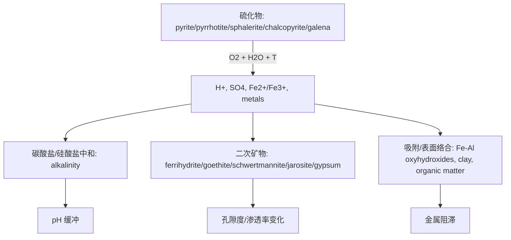

# 硫化物尾矿酸性渗滤进入浅层地下水的 THC/THMC 反应运移模型：概念框架、方程推导与验证方案

## 摘要

硫化物尾矿在氧气、水和微生物共同作用下可释放硫酸盐、酸度和金属，形成从尾矿孔隙水到浅层地下水的酸性渗滤羽。浅层地下水位具有季节性波动，温度场又会改变水动力参数、扩散系数、溶解度和硫化物氧化速率。因此，单独的静态水化学平衡计算不足以解释尾矿-含水层系统中的时变污染羽。本研究提出一个面向学术研究和后续场地化建模的 THC 主模型，并把力学反馈作为可选 HMC/THMC 扩展。论文构建了尾矿氧化、酸中和、二次矿物沉淀、金属吸附/解吸和温度依赖反应速率的反应网络；给出地下水流、反应运移、热传输、孔隙度-渗透率反馈的控制方程；并用示范性筛选参数推导硫酸盐/酸度生成、地下水迁移时间、季节性温度衰减和金属阻滞效应。研究结论是：在缺少现场矿物学、水化学、温度剖面和水文地质参数时，最稳妥路径是先以 PHREEQC/PhreeqcRM 做批反应和一维柱状反应运移筛选，再以 OpenGeoSys + PHREEQC 或 MIN3P/PFLOTRAN 建立二维或三维 THC 模型；任何监管或工程结论均需要现场校准和独立专业复核。

**关键词**：尾矿渗滤；酸性矿山排水；浅层地下水；反应运移；THMC；PHREEQC；OpenGeoSys；PFLOTRAN

## 1. 研究设计

**论文类型**：方法学与机理型研究论文。  
**研究对象**：硫化物尾矿库或尾矿堆下伏浅层含水层中的酸性渗滤羽。  
**空间尺度**：尾矿孔隙尺度、柱状尺度、二维剖面尺度。  
**时间尺度**：季节性到多年尺度。  
**核心问题**：

1. 如何以最小但充分的 THC 方程组描述硫化物尾矿释放硫酸盐、酸度和金属进入浅层地下水？
2. 季节性温度变化通过哪些项影响水动力、反应速率和污染羽迁移？
3. 在无现场数据阶段，哪些计算可用于筛选主控因子，哪些结论必须等待现场校准？

**假设**：

- H1：在浅层地下水系统中，温度对硫化物氧化速率和扩散/黏度的影响足以改变季节性污染通量，因此 HC 模型通常低估时变性。
- H2：若含水层具有显著碳酸盐碱度或 Fe/Al 氢氧化物表面，金属羽会相对硫酸盐羽明显滞后。
- H3：只有当二次矿物沉淀、尾矿固结或裂隙开闭显著改变孔隙度和渗透率时，完整 THMC 才比 THC 更有必要。

## 2. 资料来源与证据矩阵

本研究结合三类证据：文献机制、THMC 方程推导、GeoMine MCP 数据源发现。MCP 当前只返回数据源规划与本地注册表信息，未返回现场实测样本。

| 主张 | 证据类型 | 证据来源 | 置信度 | 主要不确定性 |
|---|---|---|---|---|
| 硫化物尾矿可产生酸度、硫酸盐和金属污染负荷 | 文献 + 化学计量 | GARD Guide；Lindsay et al. 2015 | 高 | 具体释放速率依赖矿物学、粒径、氧通量、微生物与水分 |
| PHREEQC 适合水化学和一维反应运移原型 | 官方文档 | USGS PHREEQC v3 | 高 | 复杂二维/三维耦合需外部流场或反应运移平台 |
| PhreeqcRM 可作为反应模块耦合到多物理场运移模型 | 官方/论文 | Parkhurst & Wissmeier 2015 | 高 | 耦合实现、物种映射和性能需项目级验证 |
| OGS + PHREEQC 适合开放源 THMC 研究路线 | 官方文档 | OpenGeoSys reactive transport docs | 中高 | 学习曲线和化学数据库一致性 |
| CDoGS、Saskatchewan GeoAtlas、BC MINFILE 可作为后续公开数据源 | MCP 数据源发现 | GeoMine MCP planned/local registry | 中低 | 未现场检索；CRS、许可、样本介质、检测限未验证 |
| 本文示范计算可证明主控变量量级 | 方程推导 | 本文推导 | 中 | 参数是假设筛选值，不是场地实测 |

## 3. 概念模型

尾矿系统可分为四个反应-运移区：

1. **氧化源区**：尾矿表层和非饱和带，氧气和降水进入，硫化物氧化。
2. **酸化孔隙水区**：硫酸盐、Fe、Al 和 Zn/Cu/Ni/Pb/As/Cd 等场地相关金属升高。
3. **浅层含水层混合区**：酸性渗滤与背景地下水混合，中和、吸附、沉淀开始控制金属迁移。
4. **下游监测区**：硫酸盐常作为相对保守示踪，金属和 pH 受吸附/沉淀/还原条件控制。


## 4. THMC 耦合等级

本文推荐的主模型为 **THC**。力学过程暂列为可选扩展，因为题设未给出尾矿固结、裂隙开闭、坝体变形或应力-渗透率演化作为核心问题。

| From / To | Thermal | Hydrological | Mechanical | Chemical |
|---|---|---|---|---|
| Thermal | - | 温度改变黏度、密度、扩散 | 可选：热胀冷缩 | 温度改变平衡常数、动力学、溶解度 |
| Hydrological | 地下水对流传热 | - | 可选：孔压影响有效应力 | 对流、弥散、扩散输运溶质 |
| Mechanical | 初始模型排除 | 可选：固结改变孔隙度和渗透率 | - | 可选：裂隙/表面积变化 |
| Chemical | 反应热通常次要 | 沉淀/溶解改变孔隙度与渗透率 | 可选：胶结或溶蚀弱化 | - |

## 5. 控制方程与推导

### 5.1 地下水流

对于饱和含水层，水头方程为：

$$
S_s\frac{\partial h}{\partial t}=\nabla\cdot\left(K(T,\phi)\nabla h\right)+Q
$$

Darcy 通量为：

$$
\mathbf q=-K(T,\phi)\nabla h
$$

其中 $S_s$ 为贮水率，$h$ 为水头，$K$ 为水力传导系数，$\mathbf q$ 为 Darcy 通量，$Q$ 为源汇项。孔隙水平均速度为：

$$
\mathbf v=\frac{\mathbf q}{\theta_e}
$$

由此得到平流迁移时间：

$$
t_{adv}=\frac{L\theta_e}{q}
$$

### 5.2 反应运移

第 $i$ 个组分的守恒方程写为：

$$
\frac{\partial(\theta C_i+\rho_b S_i)}{\partial t}
+\nabla\cdot(\mathbf q C_i-\theta \mathbf D_i\nabla C_i)
=\theta R_i
$$

若采用线性吸附近似 $S_i=K_{d,i}C_i$，则有：

$$
R_{d,i}=1+\frac{\rho_bK_{d,i}}{\theta}
$$

代入后：

$$
\theta R_{d,i}\frac{\partial C_i}{\partial t}
=\nabla\cdot(\theta \mathbf D_i\nabla C_i)-\mathbf q\cdot\nabla C_i+\theta R_i
$$

这说明硫酸盐等弱吸附组分可近似追踪地下水速度，而强吸附金属的羽流前锋会被 $R_{d,i}$ 延迟。

### 5.3 热传输与季节性边界

含水层热传输方程为：

$$
(\rho C_p)_{eff}\frac{\partial T}{\partial t}
+\rho_w C_w\mathbf q\cdot\nabla T
=\nabla\cdot(\lambda_{eff}\nabla T)+Q_T
$$

地表年周期温度边界可近似为：

$$
T(z,t)=T_{mean}+A_0e^{-z/z_d}\sin(\omega t-z/z_d)
$$

其中：

$$
z_d=\sqrt{\frac{2\kappa}{\omega}}
$$

$z_d$ 为热扩散阻尼深度，$\kappa$ 为热扩散率，$\omega$ 为年周期角频率。该式表明浅层水位附近的温度振幅和相位滞后都取决于深度。

### 5.4 硫化物氧化与酸生成

以黄铁矿为简化端元，净反应可写为：

$$
\mathrm{FeS_2+\frac{15}{4}O_2+\frac{7}{2}H_2O\rightarrow Fe(OH)_3+2SO_4^{2-}+4H^+}
$$

若黄铁矿氧化速率为 $r_{py}$，则：

$$
R_{SO_4}=2r_{py}
$$

$$
R_{H^+}=4r_{py}-R_{neutralization}-R_{alkalinity}
$$

温度依赖动力学可用 Arrhenius 形式：

$$
k(T)=k_{ref}\exp\left[-\frac{E_a}{R_g}\left(\frac{1}{T}-\frac{1}{T_{ref}}\right)\right]
$$

其中 $E_a$ 为表观活化能，$R_g$ 为气体常数。

### 5.5 可选孔隙度-渗透率反馈

若二次矿物沉淀显著，孔隙度变化可写为：

$$
\frac{\partial\phi}{\partial t}=-\sum_m \bar V_m r_m
$$

并用 Kozeny-Carman 型关系更新渗透率：

$$
k=k_0\left(\frac{\phi}{\phi_0}\right)^3
\left(\frac{1-\phi_0}{1-\phi}\right)^2
$$

若该项造成通量或水头拟合显著改善，模型才应升级到 HMC/THMC。

## 6. 示范性筛选计算

以下数值仅用于说明推理方法，不是任何场地的实测参数。

### 6.1 1 kg 黄铁矿氧化的酸度和硫酸盐负荷

黄铁矿摩尔质量约为 $119.98\ \mathrm{g\ mol^{-1}}$。若氧化 $1\ \mathrm{kg}$ 黄铁矿：

$$
n_{py}=\frac{1000}{119.98}=8.33\ \mathrm{mol}
$$

硫酸盐生成量：

$$
n_{SO_4}=2n_{py}=16.67\ \mathrm{mol}
$$

$$
m_{SO_4}=16.67\times 96.06=1601\ \mathrm{g}
$$

酸度生成量：

$$
n_{H^+}=4n_{py}=33.33\ \mathrm{mol}
$$

以碳酸钙当量估算中和需求：

$$
m_{CaCO_3,eq}=\frac{n_{H^+}}{2}\times100.09=1.67\ \mathrm{kg}
$$

因此，$1\ \mathrm{kg}$ 黄铁矿完全氧化约对应 $1.60\ \mathrm{kg}$ 硫酸盐和 $1.67\ \mathrm{kg}$ 碳酸钙当量酸中和需求。

### 6.2 地下水迁移时间量级

取 $K=10^{-5}\ \mathrm{m\ s^{-1}}$，水力梯度 $i=0.01$，有效孔隙度 $\theta_e=0.30$，迁移距离 $L=100\ \mathrm{m}$：

$$
q=Ki=10^{-7}\ \mathrm{m\ s^{-1}}=3.15\ \mathrm{m\ yr^{-1}}
$$

$$
v=\frac{q}{\theta_e}=10.5\ \mathrm{m\ yr^{-1}}
$$

$$
t_{adv}=\frac{100}{10.5}=9.5\ \mathrm{yr}
$$

因此，若硫酸盐近似保守，其下游百米尺度的响应可能是多年尺度；强吸附金属会进一步滞后。

### 6.3 季节性温度衰减

取热扩散率 $\kappa=10^{-6}\ \mathrm{m^2\ s^{-1}}$，年周期 $\omega=2\pi/(365\times24\times3600)=1.99\times10^{-7}\ \mathrm{s^{-1}}$：

$$
z_d=\sqrt{\frac{2\times10^{-6}}{1.99\times10^{-7}}}=3.17\ \mathrm{m}
$$

| 深度 | 振幅比例 $e^{-z/z_d}$ | 相位滞后 |
|---:|---:|---:|
| 1 m | 0.73 | 约 18 天 |
| 3 m | 0.39 | 约 55 天 |
| 5 m | 0.21 | 约 92 天 |

浅层水位若位于 1-3 m，季节性温度信号仍可能显著影响反应速率。

### 6.4 温度对硫化物氧化速率的影响

设 $T_{ref}=10^\circ\mathrm C$，$T=20^\circ\mathrm C$，不同表观活化能下：

| $E_a$ | $k(20^\circ\mathrm C)/k(10^\circ\mathrm C)$ |
|---:|---:|
| 20 kJ mol^-1 | 1.34 |
| 40 kJ mol^-1 | 1.79 |
| 60 kJ mol^-1 | 2.39 |

若尾矿浅层在夏季升温 10 °C，氧化速率可能出现约 1.3-2.4 倍量级变化。实际倍率必须用场地矿物学、氧扩散和微生物条件校准。

### 6.5 金属阻滞量级

取 $\rho_b=1700\ \mathrm{kg\ m^{-3}}$，$\theta=0.30$：

| $K_d$ | $R_d=1+\rho_bK_d/\theta$ | 相对迁移速度 |
|---:|---:|---:|
| 0.1 L kg^-1 | 1.57 | 0.64 $v$ |
| 1 L kg^-1 | 6.67 | 0.15 $v$ |
| 10 L kg^-1 | 57.7 | 0.017 $v$ |

这解释了为什么硫酸盐羽可作为水动力和酸生成的早期指示，而部分金属羽可能由于吸附和沉淀显著滞后。

## 7. 反应网络



| 过程 | 代表物种/相 | 推荐模型 |
|---|---|---|
| 硫化物氧化 | pyrite, pyrrhotite, sphalerite, chalcopyrite, galena | 动力学，受 O2、pH、温度、表面积控制 |
| 酸中和 | calcite, dolomite, feldspar, silicates, alkalinity | 平衡或动力学 |
| 硫酸盐迁移 | SO4, gypsum | 反应运移，弱吸附近似 |
| 铁铝沉淀 | ferrihydrite, goethite, schwertmannite, jarosite, Al hydroxides | 饱和指数 + 动力学或局部平衡 |
| 金属迁移 | Zn, Cu, Ni, Pb, As, Cd 等 | 物种分配 + 吸附/沉淀 |
| 吸附/表面络合 | Fe/Al 氧化物、黏土、有机质 | 表面络合优先，Kd 作为筛选模型 |

## 8. 参数与数据需求

| 参数 | 符号 | 单位 | 数据来源 | 优先级 |
|---|---|---|---|---:|
| 水力传导系数 | $K$ | m s^-1 | 抽水/slug test、室内渗透 | 高 |
| 有效孔隙度 | $\theta_e$ | - | 示踪、岩芯、经验估计 | 高 |
| 水位季节变化 | $h(t)$ | m | 连续水位计 | 高 |
| 温度剖面 | $T(z,t)$ | °C | 温度探头 | 高 |
| 尾矿矿物学 | $V_m$ | vol% / wt% | XRD/QEMSCAN/MLA | 高 |
| 反应表面积 | $A_s$ | m^2 kg^-1 | BET/粒径换算 | 高 |
| 氧化速率 | $k_{ref},E_a$ | variable | 柱试验/文献先验 | 高 |
| 背景水化学 | $C_i$ | mol m^-3 | 监测井 | 高 |
| 吸附参数 | $K_d$ 或表面络合常数 | variable | 批吸附/文献先验 | 中高 |
| 孔隙度-渗透率关系 | $k(\phi)$ | m^2 | 柱试验/反演 | 可选 |

## 9. 软件路线

| 路线 | 适用阶段 | 优点 | 局限 |
|---|---|---|---|
| PHREEQC | 批反应、物种分配、一维柱状筛选 | 地球化学强、数据库成熟 | 复杂 2D/3D THC 弱 |
| Python + PHREEQC/PhreeqcRM | 参数扫描、反应网络测试 | 自动化强，可做敏感性分析 | 多物理场需另接流热模块 |
| OpenGeoSys + PHREEQC | 论文级开放源 THC/THMC | 开源、适合地学多物理场 | 前处理与耦合学习成本 |
| MIN3P | 变饱和反应运移、酸性矿山排水类问题 | 反应运移研究基础强 | 工作流和可用性需确认 |
| PFLOTRAN | 大尺度三维/HPC | 可扩展、高性能 | 输入和可视化成本高 |
| COMSOL + PHREEQC | 复杂几何与 GUI 工作流 | 多物理场界面成熟 | 商业许可和可复现性边界 |

推荐路线：**PHREEQC/PhreeqcRM 原型 -> OpenGeoSys + PHREEQC 二维 THC -> PFLOTRAN 或 MIN3P 扩展**。

## 10. 校准与验证方案

| 校准对象 | 数据 | 指标 | 拒绝条件 |
|---|---|---|---|
| 流场 | 水头、水位季节变化、渗漏量 | RMSE、质量平衡误差 | 水量平衡错误但化学拟合好 |
| 热场 | 温度剖面、相位滞后 | RMSE、相位误差 | 温度振幅/相位与实测相反 |
| 化学 | pH、Eh、EC、SO4、Fe、Al、金属、碱度 | log-RMSE、趋势一致性 | 依赖错误电荷平衡或非物理 pH |
| 矿物 | XRD、SEM、饱和指数 | 矿物趋势一致性 | 模型沉淀物与观测矿物不一致 |
| 运移 | 硫酸盐和金属突破曲线 | 到达时间、峰值、羽流长度 | 硫酸盐水动力时序明显错误 |

验证应使用独立时期或独立井组，不能用全部数据同时校准和验证。

## 11. 敏感性与不确定性设计

优先做三层分析：

1. 局部敏感性：$K$、$i$、$\theta_e$、$k_{py}$、$E_a$、碱度、$K_d$、温度振幅。
2. Latin Hypercube：联合传播水文、温度和地球化学参数不确定性。
3. 结构不确定性：比较 Kd 模型、表面络合模型、平衡沉淀模型和动力学沉淀模型。

推荐图件包括 tornado chart、Sobol index、pH/SO4/金属羽流置信带、突破曲线包络。

## 12. 图表方案

| 图号 | 图名 | 图型 | 数据需求 |
|---|---|---|---|
| Fig. 1 | 尾矿-浅层地下水 THC 概念剖面 | 多面板概念图 | 地形、尾矿厚度、水位、监测井 |
| Fig. 2 | THMC 耦合矩阵 | 热图/矩阵 | 模型耦合等级 |
| Fig. 3 | 反应网络 | 网络图 | 矿物相、水化学、吸附相 |
| Fig. 4 | 季节性温度衰减 | 曲线图 | 温度剖面或筛选参数 |
| Fig. 5 | 硫酸盐与金属突破曲线 | 线图 | 监测井时序 |
| Fig. 6 | pH/SO4/金属二维羽流 | 剖面等值图 | 模拟网格输出 |
| Fig. 7 | 参数敏感性 | tornado/Sobol | 参数扫描结果 |

## 13. 讨论

本研究的关键推理链为：硫化物氧化提供酸度和硫酸盐源项；浅层地下水流决定通量和迁移时间；温度改变反应速率和物性；中和、吸附与二次矿物沉淀决定金属是否与硫酸盐同步迁移。硫酸盐通常更适合作为源项和水动力的早期响应指标，而金属浓度受 pH、Eh、吸附表面和矿物饱和状态控制，可能出现显著空间滞后。

完整 THMC 并非默认必要。若现场主要问题是酸性渗滤的化学羽流，THC 已能覆盖主要机制。只有当二次矿物沉淀导致渗透性堵塞、尾矿固结改变渗流路径、冻融或裂隙演化改变通量时，才应把力学过程纳入主模型。

## 14. 结论

1. 硫化物尾矿进入浅层地下水的问题至少需要 HC 模型；若水位浅且温度季节性明显，推荐采用 THC。
2. 化学计量表明，$1\ \mathrm{kg}$ 黄铁矿完全氧化约释放 $1.60\ \mathrm{kg}$ 硫酸盐，并产生约 $1.67\ \mathrm{kg}$ CaCO3 当量酸中和需求。
3. 示例水文参数显示，百米尺度硫酸盐迁移可为多年尺度；金属迁移会因吸附和沉淀进一步滞后。
4. 季节性温度在 1-3 m 浅层仍可保持显著振幅，并通过 Arrhenius 动力学改变硫化物氧化速率。
5. 最稳妥的软件路线是 PHREEQC/PhreeqcRM 原型、OpenGeoSys + PHREEQC 二维 THC、PFLOTRAN/MIN3P 扩展。
6. 当前结果是概念和方法学论文，不是已校准数值模拟，不可用于工程认证、合规结论或投资决策。

## 15. 参考文献与资料源

[1] INAP, *Global Acid Rock Drainage Guide (GARD Guide)*. https://www.inap.com.au/gard-guide/  
[2] Lindsay, M. B. J.; Blowes, D. W.; Condon, P. D.; Ptacek, C. J. *Applied Geochemistry* 2015, “Managing pore-water quality in mine tailings by inducing microbial sulfate reduction.” DOI: 10.1016/j.apgeochem.2015.06.005. https://hero.epa.gov/hero/index.cfm/reference/details/reference_id/3100844  
[3] Parkhurst, D. L.; Appelo, C. A. J. *Description of Input and Examples for PHREEQC Version 3*, USGS Techniques and Methods 6-A43, 2013. https://pubs.usgs.gov/tm/06/a43/  
[4] Parkhurst, D. L.; Wissmeier, L. “PhreeqcRM: A reaction module for transport simulators based on the geochemical model PHREEQC.” *Advances in Water Resources* 2015. https://doi.org/10.1016/j.advwatres.2015.06.001  
[5] OpenGeoSys Documentation, Reactive Transport benchmarks. https://www.opengeosys.org/stable/docs/benchmarks/reactive-transport/  
[6] PFLOTRAN Documentation. https://documentation.pflotran.org/  
[7] MIN3P project site. https://www.min3p.com/  
[8] Schoonen, M. A. A.; Elsetinow, A. R.; Borda, M. J.; Strongin, D. R. “Effect of temperature and illumination on pyrite oxidation between pH 2 and 6.” *Geochemical Transactions* 2000. https://geochemicaltransactions.biomedcentral.com/articles/10.1186/1467-4866-1-23  
[9] NRCan CDoGS public geochemical surveys entry point. https://geochem.nrcan.gc.ca/cdogs/content/main/home_en.htm  
[10] Saskatchewan GeoAtlas public geoscience data entry point. https://gisappl.saskatchewan.ca/Html5Ext/index.html?viewer=GeoAtlas  
[11] BC MINFILE mineral inventory entry point. https://www2.gov.bc.ca/gov/content/industry/mineral-exploration-mining/british-columbia-geological-survey/mineralinventory  

## 附录 A：方程注册表

| 方程 | 变量 | 单位 | 边界条件 | 可测量量 |
|---|---|---|---|---|
| 地下水流 | $h,K,S_s,Q$ | m, m s^-1, m^-1, s^-1 | 上游水头、下游水头、补给/渗漏通量 | 水头、水位、流量 |
| Darcy 通量 | $\mathbf q,K,\nabla h$ | m s^-1 | 水力梯度 | 水头梯度、渗透试验 |
| 反应运移 | $C_i,\theta,\rho_b,S_i,\mathbf D_i,R_i$ | mol m^-3, kg m^-3 | 源区浓度、背景水、出流边界 | 浓度时序、突破曲线 |
| 线性阻滞 | $R_d,\rho_b,K_d,\theta$ | -, kg m^-3, m^3 kg^-1 | 局部平衡吸附近似 | 批吸附、柱试验 |
| 热传输 | $T,\lambda,\rho C_p,Q_T$ | °C/K, W m^-1 K^-1 | 地表季节温度、底部热通量 | 温度剖面 |
| Arrhenius 速率 | $k,T,E_a,R_g$ | variable | 参考温度和速率 | 柱试验、温控反应实验 |
| 孔隙度反馈 | $\phi,\bar V_m,r_m$ | -, m^3 mol^-1, mol m^-3 s^-1 | 初始孔隙度 | 孔隙度、矿物体积分数 |

## 附录 B：机器可读模型规格

```json
{
  "model_id": "geomine_tailings_seepage_shallow_groundwater_thc_v1",
  "research_type": ["academic_paper_generation", "thmc_modeling", "environmental_baseline_review"],
  "scenario": "tailings_seepage",
  "coupling_level": "THC_with_optional_HMC_or_THMC_feedback",
  "active_processes": {
    "thermal": true,
    "hydrological": true,
    "mechanical": false,
    "chemical": true
  },
  "domain": {
    "prototype": "1D tailings-to-aquifer column",
    "research_model": "2D vertical cross-section",
    "future_extension": "3D variably saturated tailings and shallow aquifer"
  },
  "state_variables": ["h", "q", "T", "pH", "Eh", "SO4", "Fe", "Al", "site_specific_metals", "mineral_volume", "porosity_optional"],
  "reaction_network": ["sulfide_oxidation", "acid_neutralization", "secondary_mineral_precipitation", "sorption_surface_complexation", "ion_exchange_optional"],
  "recommended_solver_route": ["PHREEQC_or_PhreeqcRM_prototype", "OpenGeoSys_PHREEQC_2D_THC", "PFLOTRAN_or_MIN3P_large_scale_extension"],
  "mcp_status": "source_discovery_only_no_live_site_data",
  "validation_required": true,
  "regulatory_or_engineering_certification": false
}
```
