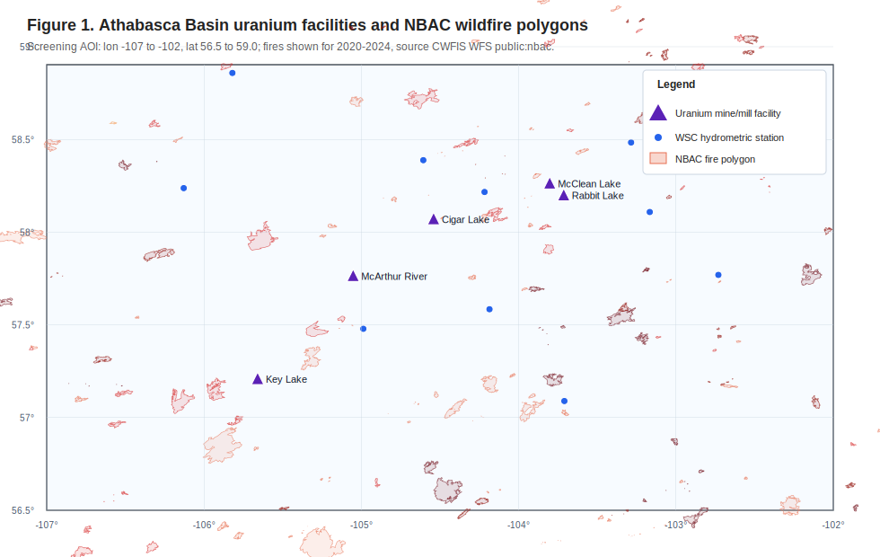
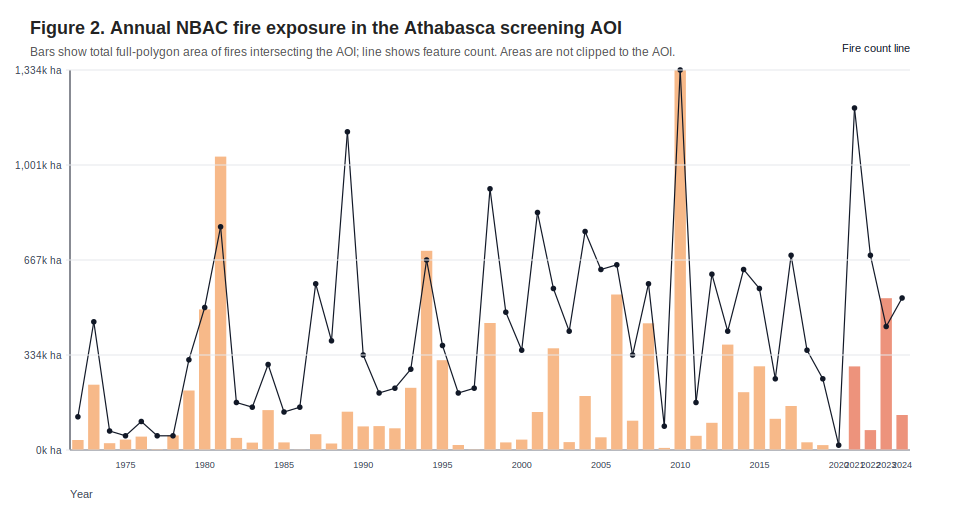
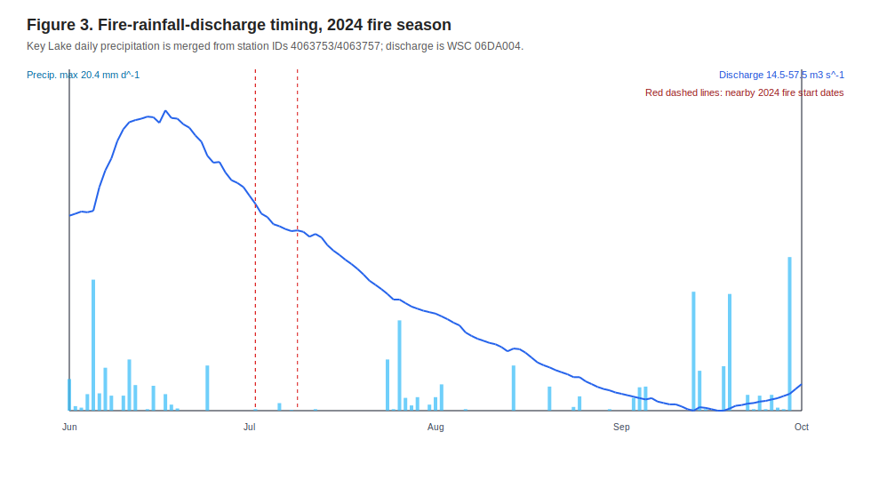
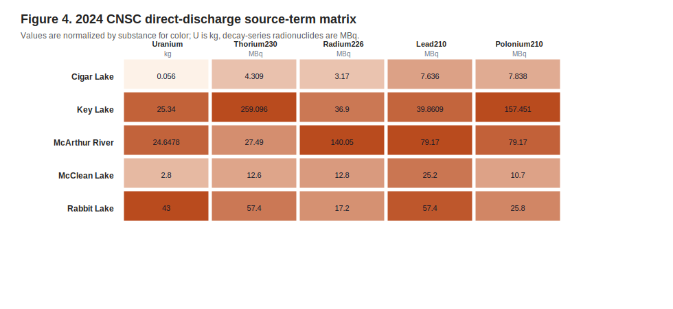
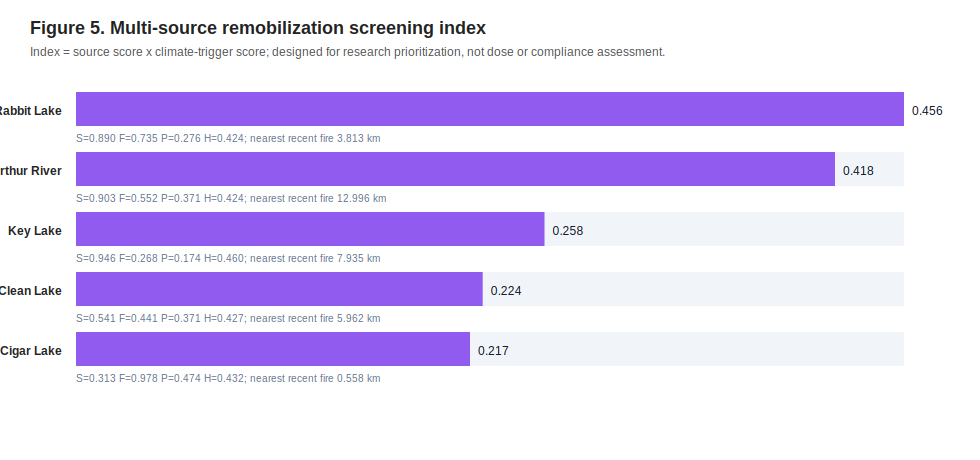
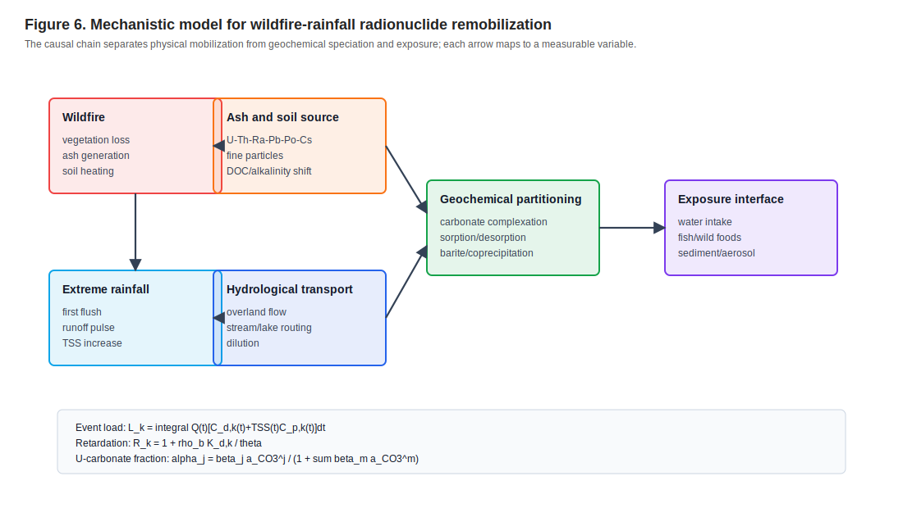
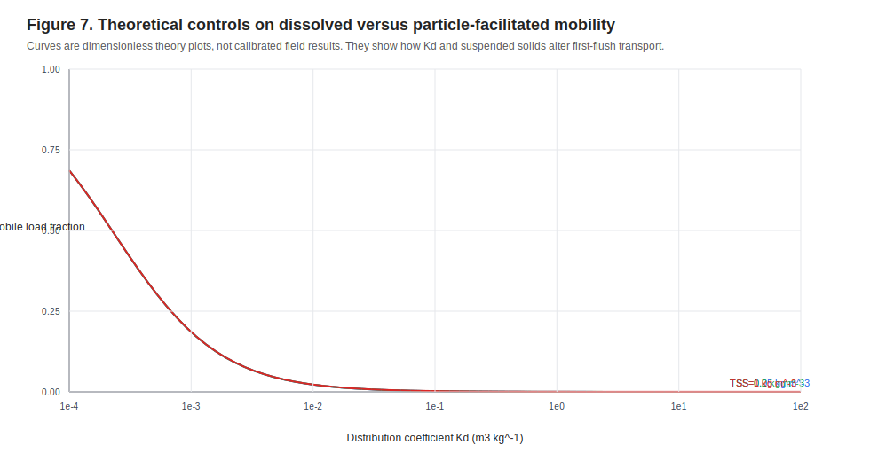

# 野火与极端降雨驱动下加拿大北部铀矿区放射性核素再迁移机制

## 基于 Athabasca Basin 公开数据的环境地球化学定量框架、理论推导与研究方向论证

**研究类型**：环境地球化学与放射性核素迁移研究论文草稿  
**案例区**：加拿大 Saskatchewan Athabasca Basin 铀矿区，筛查 AOI 为 lon -107 至 -102、lat 56.5 至 59.0，CRS 为 EPSG:4326  
**核心数据**：CWFIS/NBAC 火烧边界、ECCC Key Lake 日降雨、Water Survey of Canada 06DA004 日流量、CNSC/Open Canada 铀矿与磨矿厂核素排放数据  
**输出日期**：2026-05-14

---

## 摘要

野火和极端降雨可能把矿区中原本局部固定或缓慢迁移的放射性核素源项转化为短时、高连通性的再迁移源项。本文参考博士开题方向文档，将研究问题从“野火与极端降雨是否影响核素迁移”收敛为一个可计算、可制图、可被 PHREEQC 与 GIS 工作流扩展的科学问题：在加拿大北部森林覆盖铀矿区，火烧边界、火后降雨脉冲、水文响应与设施源项强度如何共同控制 U、Th、Ra、Pb、Po 等核素进入地表水和沉积物系统的再迁移风险。

本文以 Saskatchewan Athabasca Basin 铀矿区为第一案例区，获取并分析 1362 个 NBAC 火烧要素、5 个 CNSC/Open Canada 铀矿设施源项点、1827 天 Key Lake 日降雨数据、1827 天 WSC 06DA004 日流量数据和 300 条铀矿/磨矿厂年度核素排放记录。分析显示，研究 AOI 内 2021 年、2023 年和 2024 年均存在近年火烧扰动，其中 2023 年相交火烧多边形总面积约 532845 ha，2024 年约 122763 ha。CNSC 2024 年直接排放数据显示，5 个设施均报告 U、Th-230、Ra-226、Pb-210 和 Po-210 直接排放，其中 Rabbit Lake 的 U 直接排放为 43 kg，Key Lake 的非铀衰变系核素直接排放合计约 493.3 MBq。基于源项强度、近年火烧距离、火后降雨和区域流量响应构建的筛查指数显示，Rabbit Lake 和 McArthur River 在当前数据链条下具有较高的后续采样优先级，但该指数仅用于科研设计和监测优先级排序，不构成剂量评价或监管结论。

理论上，火烧后再迁移可以表示为源项释放、径流输送、颗粒分配、溶解态络合、吸附/解吸和放射性衰变耦合的质量守恒问题。本文推导了事件负荷、灰烬富集、分配系数、阻滞因子、对流-弥散-反应方程、U-碳酸盐络合分数、Ra-硫酸盐共沉淀约束和多源筛查指数。结果支持一个明确研究方向：以“火烧暴露和水文触发”为遥感/GIS 入口，以“U/Ra 水化学控制和 Pb/Po/Cs 颗粒控制差异”为地球化学主线，以“火后第一场暴雨及随后 30 天”为关键时间窗，建立可复用的北方铀矿区放射性核素再迁移评价工作流。

**关键词**：野火；极端降雨；放射性核素；铀矿；Athabasca Basin；灰烬淋滤；PHREEQC；环境地球化学；水文连通性；第一冲刷

---

## 1. 研究方向锁定与论证过程

开题方向文档提出的科学链条为：

```text
野火扰动 -> 灰烬富集 -> 大气再悬浮/沉降 -> 火后暴雨径流 -> 河湖输送与沉积 -> 暴露风险
```

这个方向具有交叉学科价值，但如果直接在加拿大北部全域展开，会同时面对火烧严重度、矿山边界、尾矿设施、DEM 流路、降雨、流量、水化学、沉积物和人体暴露数据的多重缺口。因此本文首先把研究方向收敛为一个可验证的第一阶段论文问题：

> 在公开数据支持下，能否识别 Athabasca Basin 铀矿区中“源项强度较高、近年受火烧扰动、火后存在降雨和地表水响应”的设施和时间窗，并建立后续现场采样与 PHREEQC 模拟所需的理论框架？

选择 Athabasca Basin 作为第一案例区的理由如下。

1. 该区具有真实铀矿环境背景，且 CNSC/Open Canada 数据提供了 Rabbit Lake、Key Lake、McArthur River、McClean Lake、Cigar Lake 的年度 U、Th-230、Ra-226、Pb-210、Po-210 源项信息。
2. 该区位于加拿大北方森林-湖泊-湿地系统，野火、湖泊沉积物和地表水连通性是环境迁移研究的实际问题。
3. CWFIS/NBAC、ECCC、Water Survey of Canada 均可通过公开接口获取时空数据，使论文能够从概念论证进入定量筛查。
4. 与 Elliot Lake 等历史矿区相比，Athabasca Basin 的当前设施源项、近年火烧扰动和公开水文气象数据更适合构建第一阶段可复现工作流。

本文采用的研究定位不是“证明某一矿山已经发生污染再迁移”，而是建立一个可复用的科研框架：先用公开数据识别高优先级情景，再用水化学、颗粒物和沉积物实测数据进入 PHREEQC/反应迁移模拟。

---

## 2. 数据源、处理流程与可重复性

### 2.1 数据源

| 数据类别 | 数据源 | 本文使用方式 | 本地证据 |
| --- | --- | --- | --- |
| 火烧边界 | CWFIS GeoServer WFS public NBAC layer | 获取 AOI 相交 NBAC 火烧多边形，统计年份、面积、火因和设施距离 | 原始 NBAC GeoJSON |
| 降雨 | ECCC climate daily OGC API | 获取 Key Lake 2020-2024 日降雨，合并 station IDs 4063753 与 4063757 | 原始 ECCC 日气象 GeoJSON |
| 地表水流量 | Water Survey of Canada HYDAT daily mean API | 获取 WSC 06DA004 Geikie River below Wheeler River 日均流量 | 原始 WSC 日流量 GeoJSON |
| 水文站点 | ECCC/WSC hydrometric stations API | 获取 AOI 内 10 个水文监测站点 | 原始 WSC 站点 GeoJSON |
| 核素源项 | CNSC/Open Canada Radionuclide Release Datasets | 解析铀矿与磨矿厂 NPRI 格式 xlsx，抽取设施坐标、年度核素直接排放 | 原始 CNSC/Open Canada xlsx |

GeoMine MCP 工具用于 AOI 标准化和加拿大公开数据源规划；当前 MCP geodata 网络检索层返回的是规划信息，实际数据由本地脚本通过公开 URL 获取和处理。因此本文把 MCP 结果作为工作流和数据源发现证据，而不把其视为已执行的科学数据查询。

### 2.2 处理脚本

全部处理由论文包内的 Python 复现脚本完成，输出包括年度火烧汇总、设施逐年火烧距离、火后事件指标、CNSC 核素源项长表、2024 年设施-核素矩阵、Key Lake 年降雨汇总、WSC 年流量汇总、筛查指数和模型规格 JSON。具体文件名见 README 和 data/processed 目录。

空间距离采用筛查级算法：先判断设施点是否落入火烧多边形外环，若未落入，则以抽样后的火烧多边形环顶点估算最小距离。NBAC 火烧面积使用数据集中完整多边形面积，没有裁剪到 AOI 内。因此面积结果应解释为“与 AOI 相交火烧多边形的总面积”，不是 AOI 内精确火烧面积。

---

## 3. 科研图表结果

### 3.1 研究区、火烧边界和铀矿设施



图 1 显示 2020-2024 年 NBAC 火烧多边形与 5 个 CNSC/Open Canada 铀矿设施点的空间关系。Cigar Lake、McClean Lake 和 Rabbit Lake 位于 AOI 东北部，McArthur River 和 Key Lake 位于中西部。近年火烧多边形与多个设施的距离达到个位数公里量级，说明该研究方向具备实际空间耦合基础。

### 3.2 历史火烧暴露



NBAC 相交火烧要素覆盖 1972-2024 年，共 1362 个要素。面积最大的年份包括 2010 年约 1,334,199 ha、1981 年约 1,030,212 ha、1994 年约 699,497 ha、2006 年约 546,004 ha 和 2023 年约 532,845 ha。近年中，2021 年有 72 个火烧要素、总面积约 293,631 ha；2023 年有 26 个火烧要素、总面积约 532,845 ha；2024 年有 32 个火烧要素、总面积约 122,763 ha。

这一结果支持两个判断。第一，火烧扰动不是孤立事件，而是研究区长期环境背景的一部分。第二，2021-2024 年存在足以设计“火后降雨-流量-源项再迁移”时间窗的近年事件。

### 3.3 火后降雨与流量响应



ECCC Key Lake 2020-2024 年日降雨合并后有 1827 个日记录。2020 年年降水量为 618.0 mm，最大日降雨 47.1 mm；2023 年为 342.2 mm，最大日降雨 43.5 mm；2024 年为 388.1 mm，最大日降雨 20.4 mm。WSC 06DA004 同期有 1827 个日流量记录，2020 年平均流量 76.298 m3 $\mathrm{s}^{-1}$，2024 年平均流量 26.000 m3 $\mathrm{s}^{-1}$。

火后事件指标显示，部分设施附近的火烧事件后 7 天或 30 天内出现明显降雨。例如 Cigar Lake 2023 年近邻火烧事件后 7 天累计降雨 43.7 mm，30 天累计 72.2 mm；Key Lake 2022 年近邻火烧事件后 30 天累计 104.1 mm。由于本文只采用一个区域流量站点，流量响应应解释为区域水文背景代理变量，不能直接代表所有设施的局地径流。

### 3.4 CNSC 2024 年核素源项矩阵



2024 年直接排放数据展示了不同设施的源项差异：

| 设施 | U kg | Th-230 MBq | Ra-226 MBq | Pb-210 MBq | Po-210 MBq |
| --- | ---: | ---: | ---: | ---: | ---: |
| Cigar Lake | 0.056 | 4.309 | 3.170 | 7.636 | 7.838 |
| Key Lake | 25.340 | 259.096 | 36.900 | 39.861 | 157.451 |
| McArthur River | 24.648 | 27.490 | 140.050 | 79.170 | 79.170 |
| McClean Lake | 2.800 | 12.600 | 12.800 | 25.200 | 10.700 |
| Rabbit Lake | 43.000 | 57.400 | 17.200 | 57.400 | 25.800 |

U 的质量排放和衰变系核素的活度排放不能直接相加，但可以分别作为不同源项通道的强度指标。Key Lake 的 Th-230 和 Po-210 排放较突出，McArthur River 的 Ra-226 较突出，Rabbit Lake 的 U 排放较突出。这种差异意味着后续采样不应只测总 U，还应区分 Ra、Pb、Po 等更偏颗粒/沉积物通道的核素。

### 3.5 多源筛查指数



本文构建的筛查指数显示：Rabbit Lake 为 0.456，McArthur River 为 0.418，Key Lake 为 0.258，McClean Lake 为 0.224，Cigar Lake 为 0.217。这个排序的解释不是“污染风险排序”，而是“下一阶段采样和模型工作优先级排序”。Rabbit Lake 的指数较高，主要由较高 U 直接排放、近年火烧距离较近和气候触发共同贡献；McArthur River 的指数较高，主要由较高源项分数和 2021 年近邻火烧事件贡献；Cigar Lake 虽有最近火烧距离优势，但 2024 年源项分数较低，因此总指数不最高。

### 3.6 机制图与理论敏感性





图 6 将机制拆解为火烧、灰烬/土壤源项、极端降雨、水文输送、地球化学分配和暴露接口。图 7 给出理论敏感性：当分配系数 $K_d$ 升高时，溶解相迁移受阻滞增强；但在高悬浮颗粒浓度条件下，颗粒携带通道可能重新提高事件负荷。这一结果说明，火后第一冲刷期的总核素负荷不能只用溶解态浓度解释，必须同时测定 TSS、粒径、胶体和沉积物活度。

---

## 4. 理论框架与数学推导

### 4.1 火烧扰动下的核素质量守恒

对核素 $k$，在火烧影响子流域内可写为：

$$
\frac{\partial M_k}{\partial t}
= S_{k}^{ash}(t) + S_{k}^{tail}(t) + S_{k}^{res}(t)
- L_{k}^{runoff}(t) - L_{k}^{atm}(t) - L_{k}^{sed}(t)
- \lambda_k M_k .
$$

其中，$M_k$ 为可迁移库存量，单位可取 Bq 或 kg；$S_{k}^{ash}$ 为灰烬/火烧土壤释放源项，$S_{k}^{tail}$ 为尾矿、废石或矿区设施再暴露源项，$S_{k}^{res}$ 为沉积物再悬浮源项；$L_{k}^{runoff}$ 为地表径流输出，$L_{k}^{atm}$ 为空气再悬浮输出，$L_{k}^{sed}$ 为沉积埋藏损失；$\lambda_k$ 为放射性衰变常数。本文公开数据阶段只估计源项强度和气候触发条件，不直接反演 $M_k$。

### 4.2 灰烬富集因子

火烧后有机质和水分损失会提高灰分中某些元素或核素浓度。相对于保守参考元素 $r$，核素 $k$ 的灰烬富集因子可定义为：

$$
EF_{k}^{ash}
= \frac{C_{k,ash}/C_{r,ash}}{C_{k,soil}/C_{r,soil}} .
$$

若 $EF_{k}^{ash}>1$，说明火后灰烬相对于火前土壤存在相对富集。$C_{k,ash}$ 与 $C_{k,soil}$ 可取 Bq kg^-1 或 mg kg^-1，但必须保持同一核素、同一干重基准和同一粒径级分。该式需要现场土壤与灰烬数据，本文未把其作为已验证结果，而是作为后续采样设计的核心检验量。

### 4.3 第一冲刷事件负荷

火后暴雨期间，核素总负荷可拆分为溶解态和颗粒态：

$$
L_k^{event}
= \int_{t_0}^{t_1} Q(t)
\left[
C_{k,d}(t) + TSS(t) C_{k,p}(t)
\right] dt .
$$

其中，$Q(t)$ 为流量，单位 m3 $\mathrm{s}^{-1}$；$C_{k,d}$ 为溶解态浓度，单位 Bq $\mathrm{m}^{-3}$ 或 $\mathrm{kg}\,\mathrm{m}^{-3}$；$TSS$ 为悬浮颗粒质量浓度，单位 $\mathrm{kg}\,\mathrm{m}^{-3}$；$C_{k,p}$ 为颗粒相浓度，单位 Bq kg^-1 或 $\mathrm{kg}\,\mathrm{kg}^{-1}$。该式说明，仅凭日均水样浓度可能低估第一冲刷脉冲，因为 $TSS(t)$ 和 $Q(t)$ 的峰值常与短历时强降雨同步。

若采用线性分配关系：

$$
C_{k,p}=K_{d,k} C_{k,d},
$$

则事件负荷可写为：

$$
L_k^{event}
= \int_{t_0}^{t_1} Q(t) C_{k,d}(t)
\left[1+K_{d,k}TSS(t)\right] dt .
$$

这里 $K_{d,k}$ 的单位为 m3 kg^-1。对 Pb、Po、Th、Cs 等颗粒亲和性较强的核素，$K_dTSS$ 可能成为控制项；对 U 和 Ra，溶解态络合、硫酸盐/碳酸盐体系和共沉淀过程也必须纳入。

### 4.4 对流-弥散-反应方程与阻滞因子

在一维河岸带或浅层地下水近似中，溶解态核素可用阻滞对流-弥散方程描述：

$$
R_k \frac{\partial C_k}{\partial t}
= D_L \frac{\partial^2 C_k}{\partial x^2}
- v \frac{\partial C_k}{\partial x}
- \lambda_k C_k
- r_k(C,\mathrm{pH},Eh,DOC,I)
+ S_k(x,t).
$$

阻滞因子为：

$$
R_k = 1 + \frac{\rho_b K_{d,k}}{\theta},
$$

其中，$\rho_b$ 为沉积物或土壤干容重，$\mathrm{kg}\,\mathrm{m}^{-3}$；$\theta$ 为含水率或孔隙度；$D_L$ 为纵向弥散系数，m2 $\mathrm{s}^{-1}$；$v$ 为孔隙水平均流速，$\mathrm{m}\,\mathrm{s}^{-1}$；$r_k$ 为反应项，包含络合、沉淀、吸附、氧化还原和胶体过滤等过程。该方程表明，野火影响并不只表现为源项变化，还可能通过改变 $\theta$、$K_d$、DOC、pH、Eh 和颗粒物浓度改变迁移速度。

### 4.5 U 的碳酸盐络合分数

在含碳酸盐天然水体中，U(VI) 通常以 uranyl-carbonate 络合物迁移。若简化为：

$$
UO_2^{2+} + jCO_3^{2-} \rightleftharpoons UO_2(CO_3)_j^{2-2j},
$$

总 U(VI) 浓度可写为：

$$
C_U^T = [UO_2^{2+}]
\left(1+\sum_j \beta_j a_{CO_3}^{j}\right),
$$

络合物 $j$ 的分数为：

$$
\alpha_j
= \frac{\beta_j a_{CO_3}^{j}}
{1+\sum_m \beta_m a_{CO_3}^{m}} .
$$

其中，$\beta_j$ 为累积稳定常数，$a_{CO_3}$ 为碳酸根活度。火后灰烬淋滤液常可能提高 pH 和碱度，从而提高碳酸盐络合比例并增强 U 的溶解态迁移能力。若同时存在 Ca，则还需考虑 calcium-uranyl-carbonate 络合物；这正是 PHREEQC 数据库选择和水样化学输入必须严格处理的原因。

### 4.6 Ra 与 Ba/Sr/SO4 共沉淀约束

Ra-226 在硫酸盐体系中可受 barite/celestite 类矿物共沉淀控制。若用简化溶度积表示：

$$
K_{sp}^{RaSO_4}=a_{Ra^{2+}}a_{SO_4^{2-}},
$$

则在固定硫酸盐活度下，溶解态 Ra 的上限可近似表示为：

$$
a_{Ra^{2+}} \leq \frac{K_{sp}^{RaSO_4}}{a_{SO_4^{2-}}}.
$$

但真实矿区水体中 Ba、Sr、Ca、离子强度、络合物和晶体固溶体都会改变 Ra 的有效分配。火后暴雨若引入硫酸盐脉冲或稀释高离子强度水体，可能改变 Ra 在溶解态与沉淀/颗粒态之间的比例。因此 Ra 的研究不能只看总活度，还应同时测 Ba、Sr、SO4、离子强度和饱和指数。

### 4.7 多源筛查指数

为服务第一阶段采样设计，本文定义筛查指数：

$$
I_i = S_i \left(0.45F_i + 0.35P_i + 0.20H_i\right),
$$

其中，$i$ 为设施；$S_i$ 为源项分数，由 2024 年 U 直接排放和衰变系核素直接排放经对数归一化得到；$F_i$ 为火烧暴露分数，与最近火烧距离和火烧面积相关；$P_i$ 为火后降雨触发分数，由火后 7 天与 30 天累计降雨构成；$H_i$ 为区域流量响应分数，由火前/火后 7 天日均流量比构成。该式是“研究优先级函数”，不是剂量方程。它的作用是把公开数据转化为可复核的采样排序。

---

## 5. 地球化学机制讨论

### 5.1 U：水化学和碳酸盐络合控制

U 的迁移常受 pH、Eh、碳酸盐、Ca、DOC 和 Fe-Mn 氧化物吸附控制。火后灰烬可能提高局地 pH 和碱度，使 U(VI)-carbonate 或 Ca-U(VI)-carbonate 络合物比例增加，从而增强溶解态迁移。相反，若火后颗粒物富含 Fe-Mn 氧化物且水体 pH 适中，U 可能被吸附并转入颗粒/沉积物相。

### 5.2 Ra：硫酸盐、Ba/Sr 和共沉淀控制

Ra-226 与 Ba/Sr/SO4 体系关系密切。McArthur River 2024 年 Ra-226 直接排放在 5 个设施中最高，说明后续采样应特别关注 Ra 与 Ba、Sr、SO4 的共变关系。火后暴雨可能一方面稀释水体，另一方面冲刷硫酸盐和细颗粒，二者对 Ra 迁移方向可能相反，必须通过水化学和悬浮颗粒同步测定区分。

### 5.3 Pb/Po/Th/Cs：颗粒和沉积物通道

Pb-210、Po-210、Th-230 和 Cs-137 通常更易与颗粒物、有机质、Fe-Mn 氧化物或黏土矿物关联。野火通过灰烬生成、土壤疏水性增强、植被覆盖降低和坡面侵蚀增强，提高这些核素进入水体的颗粒通量。火后短期水体浓度下降并不一定代表风险消失，因为核素可能转入湖泊或湿地沉积物并形成二次源。

### 5.4 为什么关键时间窗是火后第一场雨和 30 天

火后第一场雨通常具有最高的灰烬冲刷效率，30 天窗口则可覆盖第一次径流脉冲、短期沉积和水文稀释。本文的事件指标显示，若仅用年降雨量，无法捕捉 Cigar Lake 2023 年火后 7 天 43.7 mm 降雨、Key Lake 2022 年火后 30 天 104.1 mm 降雨这类短时触发条件。因此后续研究应以事件尺度采样代替低频常规监测。

---

## 6. PHREEQC 与后续模型设计

本文在 models 目录中生成了 PHREEQC 火后灰烬淋滤液-溪流水混合模板。该模板包含基线溪流水、灰烬淋滤液/尾矿径流和混合比例序列，并预留 U、Ra、SO4、DIC、Ca、Ba、Sr、Fe、Mn 等输出项。

建议 PHREEQC 建模分三层推进。

1. **Speciation 层**：输入实测 pH、Eh/pe、温度、碱度、DIC、SO4、Ca、Mg、Na、K、U、Ra 等，计算 U 与 Ra 的形态分布和离子强度。
2. **Saturation Index 层**：计算 calcite、gypsum、barite、uraninite 等饱和指数，评估碳酸盐、硫酸盐和还原条件下的迁移约束。
3. **Mixing/Reaction 层**：模拟灰烬淋滤液与溪流水按 5%、25%、50% 混合，分析 pH、碱度、SO4 和离子强度变化对 U/Ra 的影响。

在没有实测水化学表之前，PHREEQC 模板只能作为方法设计和输入结构，不能被解释为模型结果。

---

## 7. 研究结论

1. **研究方向成立且可执行**。公开数据已经足以把“野火与极端降雨影响放射性核素再迁移”从概念问题推进到可计算的案例研究。Athabasca Basin 具有设施源项、火烧边界、降雨和流量数据的交集，适合作为第一论文案例。
2. **核心科学主线应聚焦“源项强度 x 火烧暴露 x 降雨/流量触发 x 地球化学分配”**。单独讨论野火、降雨或核素浓度都不足以解释再迁移，必须把它们放入事件负荷和反应迁移框架。
3. **后续实测数据的优先级明确**。Rabbit Lake 和 McArthur River 在当前筛查指数中更适合作为第一阶段重点采样对象；Key Lake 因 Th-230 和 Po-210 源项较高，也应作为地球化学形态研究对象。
4. **核素路径需要分组研究**。U/Ra 更依赖水化学、碳酸盐/硫酸盐和溶解态迁移；Pb/Po/Th/Cs 更依赖灰烬、TSS、粒径、Fe-Mn 氧化物和沉积物二次源。
5. **论文理论高度应建立在质量守恒和反应迁移方程上**。灰烬富集因子、事件负荷、阻滞因子、U-碳酸盐络合分数和 Ra-硫酸盐共沉淀约束可构成本文的理论骨架。

---

## 8. 不确定性与边界

本文结果有明确边界。

1. NBAC 火烧面积未裁剪到 AOI 内，不能作为精确受烧面积。
2. 未使用 Fire Burn Severity 栅格、DEM 流向、CHN/NHN 河网、湖泊边界和矿山设施多边形，因此尚不能计算真实径流路径。
3. Key Lake 降雨站和 WSC 06DA004 流量站是区域代理，不代表每个设施点的局地降雨和径流。
4. CNSC 排放数据是年度直接排放和排放源项信息，不等同于环境介质浓度或人体剂量。
5. 筛查指数是研究设计工具，不是环境合规、剂量评估、矿山安全或 Qualified Person 结论。
6. PHREEQC 目前为模板，必须等待实测水化学、沉积物、灰烬和颗粒数据后才能运行并解释。

---

## 9. 下一阶段研究设计

建议将正式博士论文或系列论文拆成三篇。

**论文一：公开数据驱动的火烧-降雨-源项筛查框架。**  
目标是完善本文工作流，加入 Fire Burn Severity、DEM、CHN/NHN、水体和社区/取水点数据，形成加拿大北部铀矿区气候扰动风险筛查图。

**论文二：火后第一冲刷中 U-Ra-Pb-Po 的相态分配和水化学控制。**  
目标是在 Rabbit Lake、McArthur River、Key Lake 等设施周边采集灰烬、土壤、径流、河水、悬浮颗粒和沉积物，检验灰烬富集因子、颗粒分配和 PHREEQC 模型。

**论文三：湖泊/湿地沉积物二次源与长期再悬浮风险。**  
目标是用沉积物柱样、粒径分级、核素活度和有机质/Fe-Mn 氧化物数据评估火后输入是否形成新的二次源。

---

## 参考资料与数据源

1. Canadian Wildland Fire Information System, CWFIS GeoServer WFS. https://cwfis.cfs.nrcan.gc.ca/geoserver/public/wfs
2. ECCC MSC GeoMet / OGC API, Climate Daily Observations. https://api.weather.gc.ca/collections/climate-daily
3. ECCC MSC GeoMet / OGC API, Hydrometric Historical Data Daily Mean. https://api.weather.gc.ca/collections/hydrometric-daily-mean
4. ECCC MSC GeoMet / OGC API, Hydrometric Stations. https://api.weather.gc.ca/collections/hydrometric-stations
5. Open Canada / Canadian Nuclear Safety Commission, Radionuclide Release Datasets. https://open.canada.ca/data/en/dataset/6ed50cd9-0d8c-471b-a5f6-26088298870e
6. Geochemical Perspectives Letters, open-access geochemistry literature used as background corpus in the local geochemistry paper manifest. https://www.geochemicalperspectivesletters.org/
7. Geochemical Perspectives, open-access long-form geochemistry reviews used as background corpus in the local geochemistry paper manifest. https://www.geochemicalperspectives.org/
8. Evangeliou, N. et al. Wildfires in Chernobyl-contaminated forests and risks to the population and the environment. Scientific Reports. https://www.nature.com/articles/srep26062
9. Masson, O. et al. Uncovering transport, deposition and impact of radionuclides released after the early spring 2020 wildfires in the Chernobyl Exclusion Zone. Scientific Reports. https://www.nature.com/articles/s41598-020-67620-3
10. Moody, J.A. et al. Current research issues related to post-wildfire runoff and erosion processes. Earth-Science Reviews. https://www.fs.usda.gov/rm/pubs_other/rmrs_2013_moody_j001.pdf
11. Johansen, M.P. et al. Pulsed redistribution of a contaminant following forest fire: cesium-137 in runoff. Journal of Environmental Quality. https://pubmed.ncbi.nlm.nih.gov/14674537/
12. PHREEQC program and documentation, USGS. https://www.usgs.gov/software/phreeqc-version-3

---

## 附录 A：变量表

| 符号 | 含义 | 单位或说明 |
| --- | --- | --- |
| $M_k$ | 核素 $k$ 的可迁移库存量 | Bq 或 kg |
| $S_k^{ash}$ | 灰烬/火烧土壤释放源项 | Bq $\mathrm{s}^{-1}$ 或 $\mathrm{kg}\,\mathrm{s}^{-1}$ |
| $S_k^{tail}$ | 尾矿/废石/设施再暴露源项 | Bq $\mathrm{s}^{-1}$ 或 $\mathrm{kg}\,\mathrm{s}^{-1}$ |
| $Q(t)$ | 流量 | m3 $\mathrm{s}^{-1}$ |
| $C_{k,d}$ | 溶解态核素浓度 | Bq $\mathrm{m}^{-3}$ 或 $\mathrm{kg}\,\mathrm{m}^{-3}$ |
| $C_{k,p}$ | 颗粒相核素浓度 | Bq kg^-1 或 $\mathrm{kg}\,\mathrm{kg}^{-1}$ |
| $TSS$ | 悬浮颗粒物浓度 | $\mathrm{kg}\,\mathrm{m}^{-3}$ |
| $K_{d,k}$ | 分配系数 | m3 kg^-1 |
| $R_k$ | 阻滞因子 | 无量纲 |
| $\rho_b$ | 土壤或沉积物干容重 | $\mathrm{kg}\,\mathrm{m}^{-3}$ |
| $\theta$ | 孔隙度或含水率 | 无量纲 |
| $D_L$ | 纵向弥散系数 | m2 $\mathrm{s}^{-1}$ |
| $v$ | 平均孔隙水流速 | $\mathrm{m}\,\mathrm{s}^{-1}$ |
| $\lambda_k$ | 放射性衰变常数 | $\mathrm{s}^{-1}$ |
| $\beta_j$ | U-碳酸盐络合累积稳定常数 | 依反应式而定 |
| $\alpha_j$ | 络合物分数 | 无量纲 |
