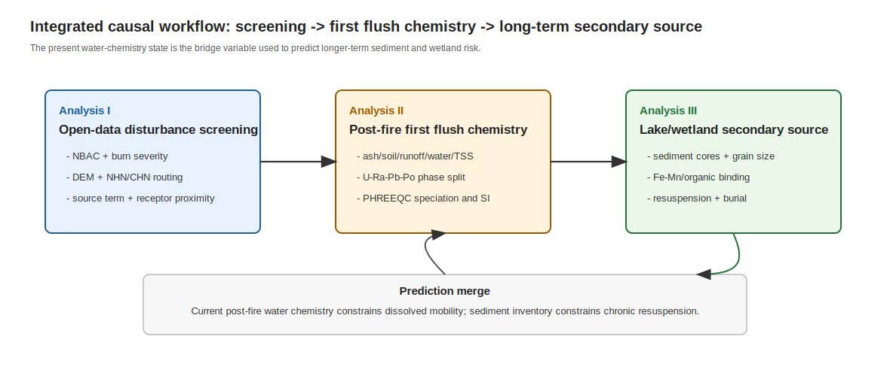
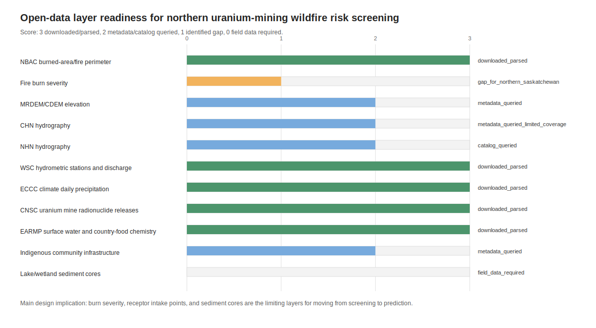
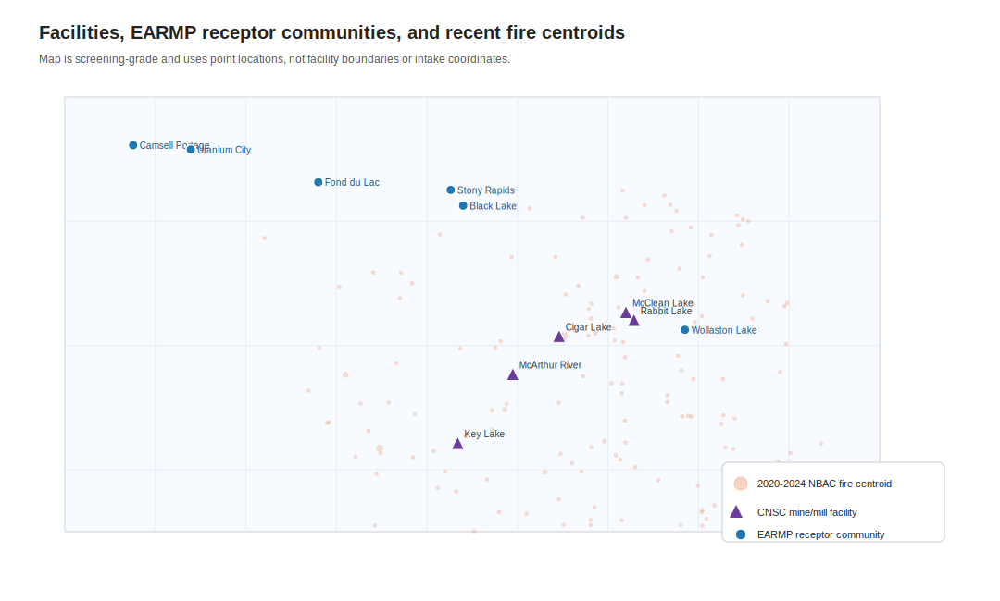
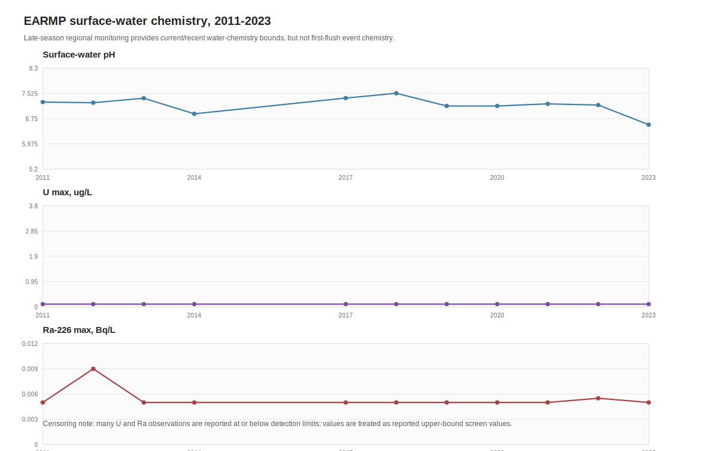
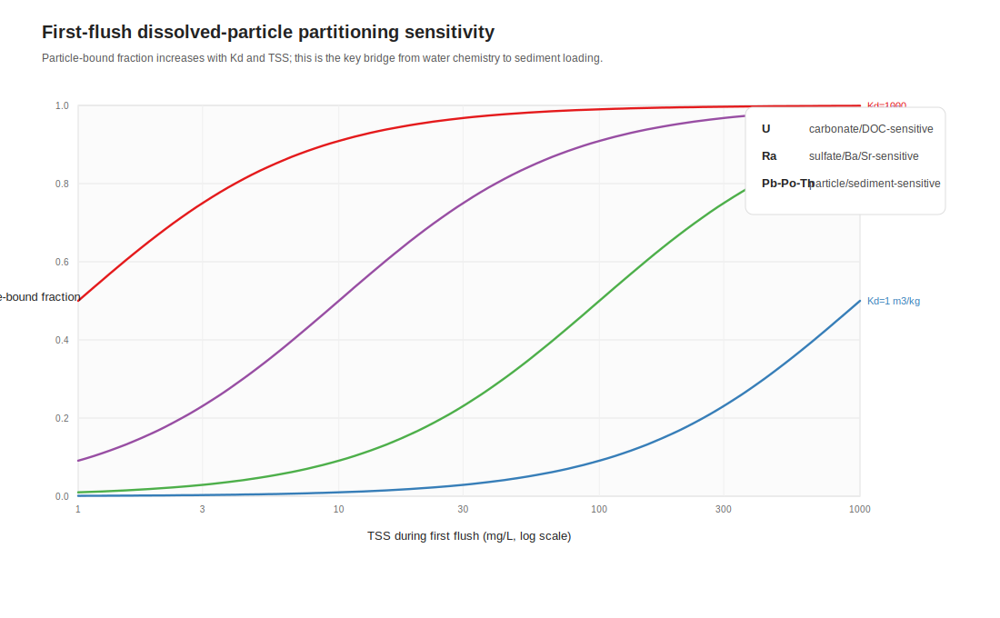
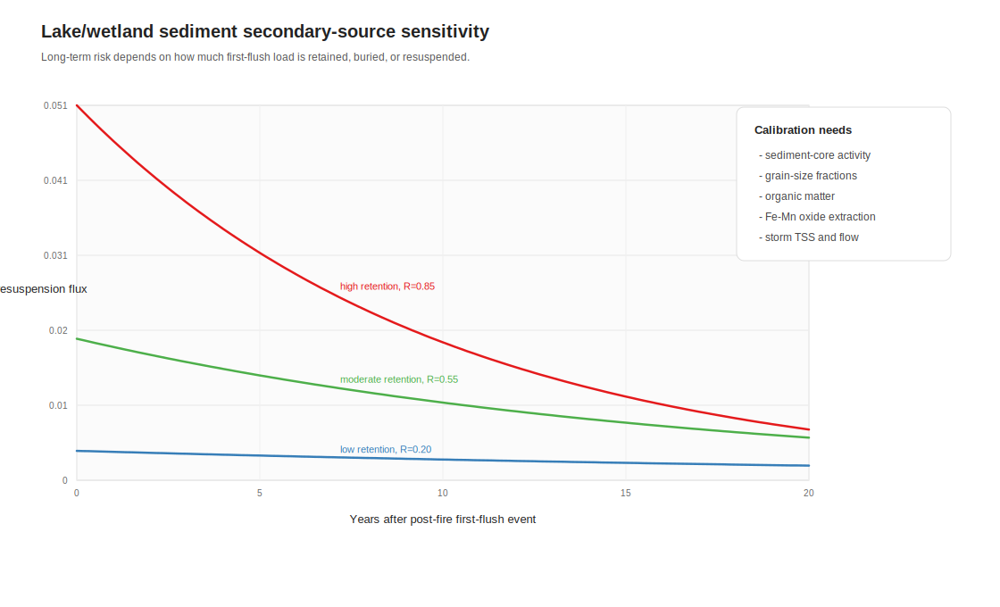

# 火后水化学约束下加拿大北部铀矿区放射性核素长期再迁移风险预测

## 公开筛查、第一冲刷水化学与湖泊/湿地沉积物二次源的三阶段因果框架

**研究类型**：环境地球化学、水文地球化学与反应迁移建模论文草稿  
**案例区**：Saskatchewan Athabasca Basin 及 Eastern Athabasca 社区监测区  
**核心问题**：如何利用当下火后水化学状态，预测铀矿区 U-Ra-Pb-Po 在湖泊/湿地沉积物系统中的长期再迁移风险  
**GeoMine Research 路由**：环境地球化学 + 水文地球化学 + 反应迁移建模 + PHREEQC 机制敏感性  
**输出日期**：2026-05-14

---

## 摘要

北方森林铀矿区的野火影响不是单一扰动，而是一个连续因果链：火烧改变地表覆盖、灰烬和土壤反应性，随后的第一场强降雨把灰烬、颗粒物和设施相关源项带入河湖系统，湖泊和湿地沉积物再把一次性输入转化为多年尺度的二次源。上一阶段研究已证明，在 Athabasca Basin 铀矿带中，NBAC 火烧边界、ECCC 降雨、WSC 流量和 CNSC 源项可以形成公开数据驱动的“火烧-降雨-源项”筛查框架。本文进入第二阶段，把三个研究方向按因果顺序合并为一个预测流程：第一，建立公开数据驱动的火烧-降雨-源项-受体筛查图；第二，解释火后第一冲刷中 U、Ra、Pb、Po 的相态分配和水化学控制；第三，评估湖泊/湿地沉积物二次源及长期再悬浮风险。

本文新增获取并解析 CNSC Eastern Athabasca Regional Monitoring Program (EARMP) 公开数据，共 6680 条监测记录，其中地表水记录 511 条，覆盖 2011-2023 年 Black Lake、Camsell Portage、Fond du Lac、Stony Rapids、Uranium City 与 Wollaston Lake 等社区。EARMP 地表水结果显示，2023 年区域晚季水样中 U 多数报告为低于或等于 0.1 µg/L，Uranium City 为 0.5 µg/L；Ra-226 多数报告为低于或等于 0.005 Bq/L，Wollaston Lake 最高为 0.006 Bq/L；pH 主要位于 6.26-7.08。该结果不能代表第一冲刷峰值，因为样品不是火后小时到天尺度事件采样，且缺少 TSS、DOC、碱度、主要离子、Eh、Fe-Mn、Pb-210、Po-210 与沉积物柱样数据。但它提供了一个重要约束：在区域社区受体尺度，目前公开水样并未显示 U 或 Ra 的高幅度溶解态异常；长期风险预测的关键不应只放在溶解态 U，而应转向“火后颗粒输入是否形成沉积物二次源”。

为连接当下水化学与长期风险，本文运行了本机 PHREEQC 机制敏感性模型。以 EARMP 2023 水样的 pH 和 U/Ra 上限为锚点，低碱度情景下 U 选定碳酸盐络合分数约 0.082；灰烬碱度脉冲情景下，该比例升至约 0.735，Pb 选定碳酸盐络合分数由约 0.055 升至约 0.847。RaSO4 饱和指数仍为负，说明 Ra 的长期行为需要真实 SO4、Ba、Sr、离子强度与共沉淀数据约束。综合分析表明，最合理的下一阶段博士论文方向是：以公开数据筛查定位火后高优先级窗口，以第一冲刷水化学和颗粒分配识别可迁移通量，以湖泊/湿地沉积物柱样和再悬浮模型预测长期风险。Rabbit Lake、McArthur River 与 Key Lake 仍是第一批设施周边采样对象；Wollaston Lake、Black Lake、Fond du Lac 等社区水体可作为受体端背景与时间序列约束。

**关键词**：野火；第一冲刷；铀；镭；铅；钋；EARMP；PHREEQC；沉积物二次源；湖泊湿地；Athabasca Basin

---

## 1. 论文类型、科学问题与研究假设

按照 GeoMine Research 的地球化学论文架构，本研究不是单纯综述，也不是单一 GIS 筛查，而是一个混合型论文：

| 层级 | 论文类型 | 在本文中的作用 |
| --- | --- | --- |
| 主类型 | 环境地球化学论文 | 解释火后 U-Ra-Pb-Po 源项、相态、受体与长期风险 |
| 次类型 | 水文地球化学论文 | 用 pH、碱度、硫酸盐、碳酸盐、DOC、TSS 和流量解释迁移能力 |
| 次类型 | 反应迁移建模论文 | 用 PHREEQC 与沉积物二次源方程连接短期水化学和长期风险 |
| 方法补充 | 公开数据与 GIS 筛查方法论文 | 用公开数据构建可复制的风险筛查图层与优先级 |

本文的核心科学问题为：

> 火后当下水化学状态能否作为长期沉积物再迁移风险的预测入口？如果可以，应如何把公开火烧/降雨/源项筛查、第一冲刷水化学和湖泊/湿地沉积物二次源统一为一个可检验模型？

提出三条可检验假设：

**H1：筛查假设。** 设施源项强度、火烧暴露、降雨触发、水文连通性和受体距离共同决定采样优先级。加入 Fire Burn Severity、DEM、NHN/CHN、水体和社区/取水点后，筛查指数应从设施级排序升级为流域-受体风险图。

**H2：水化学假设。** 火后第一冲刷的 U、Ra、Pb、Po 迁移差异主要由相态分配控制。U 对 pH-碱度-碳酸盐-Ca-DOC 敏感；Ra 对 SO4-Ba-Sr 共沉淀和离子强度敏感；Pb、Po、Th 更依赖 TSS、Fe-Mn 氧化物、有机质和细粒沉积物。

**H3：长期风险假设。** 若第一冲刷把颗粒态 Pb-Po-Th-Ra 或吸附态 U 输入湖泊/湿地，沉积物可能形成二次源。长期风险不是由第一年水样浓度单独决定，而由沉积物库存、埋藏速率、再悬浮频率和孔隙水-上覆水交换共同决定。

---

## 2. 三个方向的逻辑顺序与合并流程

三个方向之间不是并列关系，而是前后因果关系。

**分析一是入口：公开数据驱动的火烧-降雨-源项筛查框架。** 它回答“在哪里、什么时候、针对谁采样”。上一阶段已有 NBAC、ECCC、WSC 与 CNSC 源项数据。第二阶段应加入 Fire Burn Severity、MRDEM/CDEM、NHN/CHN、水体、社区与取水点图层，形成气候扰动风险筛查图。此阶段输出的是高优先级事件窗口、设施-受体连通路径和采样点布设，而不是最终风险结论。

**分析二是机制核心：火后第一冲刷中 U-Ra-Pb-Po 的相态分配和水化学控制。** 它回答“第一场雨把什么形态的核素带走”。如果没有水化学、TSS 和颗粒物数据，分析一只能排序，不能解释迁移机制。分析二通过灰烬、土壤、径流、河水、悬浮颗粒和表层沉积物样品，计算灰烬富集因子、溶解/颗粒分配、PHREEQC 物种分布和饱和指数。

**分析三是长期预测：湖泊/湿地沉积物二次源与再悬浮风险。** 它回答“短期输入是否转化为多年风险”。如果分析二显示火后输入主要为颗粒态或可吸附态，则湖泊/湿地沉积物会成为关键库。沉积物柱样、粒径分级、放射性活度、有机质和 Fe-Mn 氧化物数据用于判断火后输入是否形成新的二次源。

合并后的预测流程为：

$$
\mathrm{Fire\ severity,DEM,NHN,source,receptor}
\rightarrow
\mathrm{first\ flush\ chemistry}
\rightarrow
\mathrm{phase\ partitioning}
\rightarrow
\mathrm{sediment\ inventory}
\rightarrow
\mathrm{long\ term\ resuspension\ risk}.
$$

当下火后水化学位于流程中间，是连接短期扰动与长期风险的状态变量。若水样显示高碱度、高 DOC、高 TSS、还原性增强或硫酸盐脉冲，则长期沉积物风险模型的参数应相应改变；若区域水样中 U/Ra 溶解态维持低水平，但 TSS 和沉积物活度升高，则长期风险应主要归因于颗粒沉积与再悬浮。

---

## 3. 数据源与第二阶段可复现处理

第二阶段新增两类数据：一类是公开目录和地图服务元数据，用于构建下一步 GIS 图层；另一类是 EARMP 实际水化学和生物/环境监测数据，用于约束当下受体端水化学状态。

公开数据层准备度显示，本研究包现在具有 11 类图层或数据源。其中 NBAC、ECCC 降雨、WSC 流量、CNSC 源项和 EARMP 监测数据已经下载并解析；MRDEM/CDEM、NHN/CHN、Indigenous community infrastructure 和 StatCan freshwater intake 已完成目录或服务元数据查询；Fire Burn Severity 和湖泊/湿地沉积物柱样仍是关键缺口。

本轮真实下载和解析的新增数据包括：

| 数据 | 记录或状态 | 用途 |
| --- | ---: | --- |
| EARMP 全部监测记录 | 6680 条 | 社区受体端水、鱼、植被、哺乳动物和鸟类化学监测背景 |
| EARMP 地表水记录 | 511 条 | pH、U、Ra-226、As、Se、Mo、Hg 等地表水状态 |
| EARMP 地表水年份 | 2011-2014、2017-2023 | 长期背景与近年火后晚季水化学约束 |
| EARMP 社区 | 6 个 | Black Lake、Camsell Portage、Fond du Lac、Stony Rapids、Uranium City、Wollaston Lake |
| MRDEM STAC 元数据 | 已保存 | 后续流向、坡度、湿地/湖泊汇流路径 |
| CHN/NHN 元数据 | 已保存 | 后续水系连通和受体路径 |
| Indigenous community infrastructure 元数据 | 已保存 | 后续社区/取水点受体层 |

CHN 当前服务元数据表明其工作单元覆盖并未完整覆盖研究 AOI，因此北 Saskatchewan 的水系图层应优先使用 NHN 预打包工作单元，待 CHN 覆盖扩展后再替换。Open Canada 目录检索没有在本轮直接获得北 Saskatchewan 可用的全国 Fire Burn Severity 产品；BC 省 same-year burn severity 被识别为同类参考，但不能外推到 Athabasca。火烧严重度应通过 Sentinel-2 或 Landsat dNBR/RdNBR 派生，或继续查找联邦/省级产品。

---

## 4. 分析一：公开数据驱动的气候扰动风险筛查图

分析一的目标是把第一阶段设施级筛查升级为“流域-水体-受体”筛查。一个完整筛查图应至少包含以下图层：

$$
\mathcal{L}=
\{B_s,F_y,R_p,Q_h,S_m,D_e,H_n,W_b,C_r,I_w\},
$$

其中，$B_s$ 为火烧严重度，$F_y$ 为火烧年份和边界，$R_p$ 为降雨触发，$Q_h$ 为流量响应，$S_m$ 为矿区源项，$D_e$ 为 DEM 派生流路，$H_n$ 为 NHN/CHN 水系，$W_b$ 为湖泊/湿地水体，$C_r$ 为社区受体，$I_w$ 为取水点或饮用水系统。

对设施 $i$ 和受体 $j$，可定义路径筛查函数：

$$
\Pi_{ij}=g(d_{ij}^{flow},\Delta z_{ij},A_{burn},B_s,H_{conn}),
$$

其中 $d_{ij}^{flow}$ 是沿水系或地形流路的距离，$\Delta z_{ij}$ 是高程势差，$A_{burn}$ 是上游火烧面积，$B_s$ 是火烧严重度，$H_{conn}$ 是水文连通性。设施-受体气候扰动筛查指数可写为：

$$
I_{ij}^{screen}=S_i
\left(
w_1 B_s^{up}
+w_2 R_{p,30}
+w_3 Q_{rise}
+w_4 \Pi_{ij}
+w_5 E_j
\right),
$$

其中 $S_i$ 是 CNSC 源项分数，$R_{p,30}$ 是火后 30 天累计降雨，$Q_{rise}$ 是流量响应，$E_j$ 是受体敏感性。权重 $w_1$ 到 $w_5$ 应通过专家先验、敏感性分析和后续实测数据校准。此式仍是科研筛查指数，不是剂量或合规评价。

当前点位图表明，EARMP 社区受体与铀矿设施位于同一区域水文-生态系统内，但其关系需要 DEM 和 NHN/CHN 流路确认。Rabbit Lake、McArthur River 与 Key Lake 是设施端优先采样对象；Wollaston Lake、Black Lake 与 Fond du Lac 等社区水体可作为受体端背景、时间序列和暴露接口。精确取水口坐标可能受数据可用性或敏感性限制，论文中必须把“社区点”与“真实取水点”区分开。

---

## 5. 分析二：火后第一冲刷中的相态分配与水化学控制

### 5.1 EARMP 当下/近年地表水约束

EARMP 地表水结果提供了受体端水化学背景。2023 年地表水中：

| 指标 | 2023 年公开数据表现 | 解释边界 |
| --- | --- | --- |
| pH | Black Lake 6.54；Fond du Lac 6.59；Stony Rapids 6.53；Uranium City 7.08；Wollaston Lake 中位约 6.26 | 可作为当下水化学状态约束，但缺少碱度和 Eh |
| U | 多数为 `<0.1 µg/L` 或 0.1 µg/L；Uranium City 为 0.5 µg/L | 未显示区域社区尺度 U 高幅度溶解态异常，但不能排除第一冲刷峰值 |
| Ra-226 | 多数为 `<0.005 Bq/L`；Wollaston Lake 最高 0.006 Bq/L | 未显示区域社区尺度 Ra 高幅度溶解态异常，但缺少硫酸盐/Ba/Sr 共沉淀约束 |

这些结果对研究方向有两个重要含义。第一，若只看区域晚季地表水，U 和 Ra 的溶解态背景较低，不能直接支持“持续高溶解态异常”的结论。第二，这并不否定火后再迁移风险，因为第一冲刷通常发生在小时到天尺度，峰值可能被年度或晚季抓样错过；Pb、Po、Th 和部分 Ra 也可能主要以颗粒态进入沉积物，水样溶解态浓度不一定升高。

### 5.2 第一冲刷事件负荷

对核素 $k$，火后第一冲刷事件负荷为：

$$
L_k^{ff}=\int_{t_0}^{t_1} Q(t)
\left[
C_{k,d}(t)+TSS(t)C_{k,p}(t)
\right]dt .
$$

若采用线性分配：

$$
C_{k,p}=K_{d,k}C_{k,d},
$$

则：

$$
L_k^{ff}=\int_{t_0}^{t_1} Q(t)C_{k,d}(t)
\left[1+K_{d,k}TSS(t)\right]dt .
$$

颗粒态分数为：

$$
f_{p,k}=\frac{K_{d,k}TSS}{1+K_{d,k}TSS}.
$$

理论曲线显示，在 TSS 升高和 $K_d$ 较大时，即使溶解态浓度不高，总事件负荷也可由颗粒态主导。这个结论对 Pb、Po、Th 尤其关键。对 U 和 Ra，不能只套用固定 $K_d$，还必须考虑络合、沉淀、共沉淀和吸附表面的变化。

### 5.3 U-Ra-Pb-Po 的水化学控制差异

U 的迁移主要受 U(VI)-carbonate、Ca-U-carbonate、pH、Eh、DOC 和 Fe-Mn 氧化物吸附控制。可用络合分数表示：

$$
\alpha_j=
\frac{\beta_j a_{CO_3}^{j}}
{1+\sum_m \beta_m a_{CO_3}^{m}},
$$

其中 $\beta_j$ 为累积稳定常数，$a_{CO_3}$ 为碳酸根活度。火后灰烬若提高 pH 和碱度，可能增强 U 的溶解态迁移。

Ra-226 的水化学控制更接近碱土金属行为，受 SO4、Ba、Sr 和共沉淀影响。简化条件下：

$$
a_{Ra^{2+}}\leq \frac{K_{sp}^{RaSO_4}}{a_{SO_4^{2-}}}.
$$

但真实体系中 barite-celestite 固溶体、离子强度、竞争吸附和悬浮颗粒都会改变 Ra 的有效迁移。

Pb-210 和 Po-210 往往与颗粒、有机质、Fe-Mn 氧化物和细粒沉积物关系更强。Po 的 PHREEQC 热力学覆盖通常不足，因此 Po 应优先通过相态分离、放射化学测量和沉积物结合态提取来研究，而不是强行用通用水化学数据库外推。

### 5.4 PHREEQC 机制敏感性

本轮没有暴露 build_phreeqc_input 或 run_phreeqc_job 这类 PHREEQC MCP 工具，因此采用本机 PHREEQC 执行。模型文件为 models/phreeqc_postfire_water_sensitivity_llnl.phr，数据库为 llnl.dat，运行记录见 models/phreeqc_run_manifest_phase2.md。模型以 EARMP 2023 水样为锚点，设置两个情景：

| 情景 | pH | 碱度 | 目的 |
| --- | ---: | ---: | --- |
| 低碱度 EARMP 上限 | 6.59 | 5 mg/L as CaCO3 | 表示区域晚季水样的低碱度约束 |
| 灰烬碱度脉冲 | 8.20 | 50 mg/L as CaCO3 | 表示火后灰烬淋滤液提高 pH/碱度的机制情景 |

PHREEQC selected output 的关键结果为：

| 情景 | U 选定碳酸盐络合分数 | Pb 选定碳酸盐络合分数 | RaSO4 SI | Calcite SI |
| --- | ---: | ---: | ---: | ---: |
| 低碱度 EARMP 上限 | 0.0822 | 0.0549 | -9.1216 | -3.8236 |
| 灰烬碱度脉冲 | 0.7354 | 0.8466 | -8.8385 | -0.2905 |

结果说明，火后灰烬碱度脉冲可能把 U 和 Pb 从自由离子/羟基形态推向碳酸盐络合形态，从而改变溶解态迁移和颗粒吸附行为。RaSO4 饱和指数为负，说明在该简化水样中 RaSO4 沉淀不是直接饱和控制；但因缺少真实 SO4、Ba、Sr 和离子强度，该结论只能作为模型需求提示，不能作为现场判断。

---

## 6. 分析三：湖泊/湿地沉积物二次源与长期再悬浮风险

火后输入进入湖泊/湿地后，可分为三部分：溶解态随水体输出，颗粒态沉降形成表层沉积物库存，胶体/有机络合态在水体和沉积物间交换。对沉积物库存 $B_k$ 和水柱库存 $A_k$，可写为：

$$
\frac{dA_k}{dt}
=\frac{L_k(t)}{V}
+\frac{k_{r,k}B_k}{H}
-\left(\frac{Q}{V}+\frac{v_{s,k}}{H}+\lambda_k\right)A_k
-R_{chem,k},
$$

$$
\frac{dB_k}{dt}
=f_{p,k}\frac{L_k(t)}{A_b}
+v_{s,k}A_k
-\left(k_{r,k}+k_{b,k}+\lambda_k\right)B_k
+R_{sorb,k}.
$$

其中 $V$ 为水体体积，$H$ 为平均水深，$Q$ 为出流量，$v_s$ 为沉降速度，$A_b$ 为沉积面积，$k_r$ 为再悬浮系数，$k_b$ 为埋藏系数，$R_{chem}$ 和 $R_{sorb}$ 分别表示水相反应与沉积物吸附/解吸。第一冲刷脉冲可近似为瞬时输入 $L_k^{ff}$。若沉积保留比例为 $\eta_k$，则：

$$
B_k(t)=\eta_k L_k^{ff}
\exp[-(k_{r,k}+k_{b,k}+\lambda_k)t],
$$

再悬浮通量为：

$$
F_{res,k}(t)=k_{r,k}B_k(t).
$$

灵敏度曲线表明，长期风险最高的不一定是第一年溶解态浓度最高的场景，而是“高颗粒保留 + 高再悬浮 + 低埋藏”的场景。湖泊/湿地系统尤其需要关注浅水区、风浪再悬浮区、湿地出入口和细粒有机沉积区。后续样品应包括：

| 样品 | 主要指标 | 目的 |
| --- | --- | --- |
| 沉积物柱样 | Pb-210、Po-210、Ra-226、U、Th-230、Cs-137、粒径、干密度 | 判断火后输入层位、库存和沉积速率 |
| 粒径分级 | <63 µm、63-250 µm、>250 µm 活度 | 判断细粒富集和再悬浮敏感性 |
| 顺序提取 | Fe-Mn 氧化物、有机质、碳酸盐、残渣态 | 判断可再迁移结合态 |
| 孔隙水 | pH、Eh、碱度、SO4、DOC、U、Ra、Pb、Po | 判断沉积物-水界面释放 |
| 风浪/流量事件水样 | TSS、粒径、溶解/总量核素 | 校准再悬浮通量 |

---

## 7. 用当下火后水化学预测长期风险

本文提出的预测思想是：当下火后水化学不是最终结论，而是长期模型的初始/边界条件和反应参数控制量。定义火后水化学状态向量：

$$
\mathbf{x}_w(t)=
\left[
pH,Eh,Alk,DOC,TSS,Ca,SO_4,Ba,Sr,Fe,Mn,
C_{U,d},C_{Ra,d},C_{Pb,d},C_{Po,d}
\right]^T .
$$

该状态向量通过 PHREEQC 或等效物种分布模型决定：

$$
\mathbf{s}_k=\Phi_k(\mathbf{x}_w,DB),
$$

其中 $\mathbf{s}_k$ 是核素 $k$ 的水相物种、饱和指数和络合分数，$DB$ 是热力学数据库。相态分配函数为：

$$
K_{d,k}^{eff}
=K_{d,k}^{0}
\Delta K_{d,k}(pH,Eh,DOC,FeMn,OM,I,TSS).
$$

第一冲刷输入和长期沉积物风险连接为：

$$
R_k^{long}(T)
=\int_0^T
\left[
\omega_1 C_{k,d}(t)
+\omega_2 F_{res,k}(t)
+\omega_3 J_{pw,k}(t)
\right]dt,
$$

其中 $J_{pw,k}$ 是孔隙水扩散或解吸通量。若 EARMP 类区域水样显示 $C_{U,d}$ 和 $C_{Ra,d}$ 较低，则 $R_k^{long}$ 的主控项可能不是水柱溶解态背景，而是 $F_{res,k}$ 和 $J_{pw,k}$。这就是本文把沉积物柱样置于第三阶段核心位置的原因。

对当前公开数据，预测结论应谨慎表述为：

1. 区域社区地表水中，2023 年 U 和 Ra-226 没有显示高幅度溶解态异常；这降低了“持续溶解态区域异常”的可能性。
2. 由于缺少第一冲刷事件采样，不能排除火后小时到天尺度 U/Ra 峰值或 Pb/Po/Th 颗粒态输入。
3. PHREEQC 敏感性表明，灰烬碱度脉冲可能显著改变 U/Pb 的络合形态；因此现场必须测碱度、主要离子、DOC、Eh 和 TSS。
4. 长期风险预测最关键的未知量是沉积物库存、细粒活度、Fe-Mn/有机结合态和再悬浮系数。

---

## 8. 采样设计与验证路线

第一批设施端采样建议仍以 Rabbit Lake、McArthur River 和 Key Lake 为主。Rabbit Lake 在上一阶段筛查指数最高，适合检验高 U 源项与火后颗粒/水体输入；McArthur River 的 Ra-226 源项较突出，适合检验 Ra-SO4-Ba-Sr 控制；Key Lake 的 Th-230 和 Po-210 源项较高，适合检验颗粒和沉积物通道。

采样应按事件窗口组织：

| 时间窗 | 样品 | 关键测量 | 对应假设 |
| --- | --- | --- | --- |
| 火后未降雨基线 | 灰烬、火烧土、未烧土 | U、Ra、Pb、Po、Th、粒径、TOC、Fe-Mn | 灰烬富集因子 |
| 第一场降雨前 0-24 h | 径流、河水、TSS | 溶解/总量核素、pH、Eh、碱度、DOC、SO4、Ca、Ba、Sr | 第一冲刷负荷 |
| 降雨后 1-7 d | 河水、悬浮颗粒、表层沉积物 | 相态分配、颗粒活度、TSS 峰后衰减 | 颗粒沉降 |
| 30-90 d | 湖泊/湿地沉积物柱样 | 活度剖面、粒径、Fe-Mn、有机质 | 二次源形成 |
| 下一融雪/暴雨季 | 水柱、TSS、沉积物再悬浮 | 再悬浮通量、孔隙水释放 | 长期风险预测 |

PHREEQC 的最小实测输入表应包括 pH、温度、Eh/pe、碱度、Ca、Mg、Na、K、Cl、SO4、HCO3/CO3、DOC、Fe、Mn、Ba、Sr、U、Ra、Pb 和检测限。Po-210 应以放射化学和颗粒/沉积物相态为主，PHREEQC 只作为辅助约束。

---

## 9. 不确定性与边界

本文所有结论均为科研方向和采样设计结论，不是剂量评价、监管风险结论、环境合规结论、Qualified Person 意见或矿山安全结论。

主要不确定性包括：

1. NBAC 火烧边界不是 burn severity；火烧严重度需要遥感派生或额外产品。
2. MRDEM、NHN/CHN 和取水点尚未完成空间联通计算。
3. EARMP 是区域监测数据，不能替代矿区周边第一冲刷事件采样。
4. EARMP 地表水缺少 PHREEQC 所需主要离子、碱度、Eh、DOC、TSS、Fe-Mn、Pb-210 和 Po-210。
5. PHREEQC 本轮为机制敏感性，使用 placeholder major-ion chemistry，结果只能说明方向性。
6. 沉积物长期风险尚无柱样、定年、粒径分级和结合态数据，不能校准二次源模型。

---

## 10. 结论

本文把三个研究方向合并为一个清晰的因果预测框架：公开数据筛查确定火烧-降雨-源项-受体优先级；第一冲刷水化学解释 U-Ra-Pb-Po 的相态分配；湖泊/湿地沉积物模型预测长期二次源风险。

新增 EARMP 数据给出关键约束：2011-2023 年区域社区地表水中 U 和 Ra-226 多数处于低值或检测限附近，2023 年也未显示高幅度溶解态异常。这意味着长期风险研究不能只围绕常规水样 U/Ra 浓度展开，而应重点检验第一冲刷事件和沉积物颗粒库。

PHREEQC 敏感性说明，火后灰烬碱度脉冲可能显著改变 U 与 Pb 的碳酸盐络合比例；Ra 需要 SO4-Ba-Sr 和共沉淀数据；Po 需要颗粒/沉积物放射化学路径。因而下一阶段研究应以“火后水化学状态向量”作为长期风险模型入口，用实际采集的灰烬、土壤、径流、河水、TSS、沉积物和孔隙水数据校准从第一冲刷到长期再悬浮的预测模型。

最具论文价值的研究方向可以表述为：

> 北方铀矿区野火后第一冲刷水化学和颗粒输入如何控制 U-Ra-Pb-Po 在湖泊/湿地沉积物中的二次源形成，并能否用公开扰动数据与 PHREEQC-沉积物耦合模型预测长期再迁移风险？

---

## 参考数据源

1. Canadian Wildland Fire Information System, National Burned Area Composite WFS: https://cwfis.cfs.nrcan.gc.ca/geoserver/public/wfs
2. Environment and Climate Change Canada, climate-daily OGC API: https://api.weather.gc.ca/collections/climate-daily
3. Water Survey of Canada, hydrometric-daily-mean OGC API: https://api.weather.gc.ca/collections/hydrometric-daily-mean
4. CNSC/Open Canada, Radionuclide Release Datasets, uranium mines and mills: https://open.canada.ca/data/en/dataset/6ed50cd9-0d8c-471b-a5f6-26088298870e
5. CNSC/Open Canada, Eastern Athabasca Regional Monitoring Program: https://open.canada.ca/data/en/dataset/c372958b-9610-4153-9370-9583eb8d0a6b
6. NRCan/Open Canada, Medium Resolution Digital Elevation Model, CanElevation Series: https://open.canada.ca/data/en/dataset/18752265-bda3-498c-a4ba-9dfe68cb98da
7. NRCan/Open Canada, Canadian Hydrospatial Network: https://open.canada.ca/data/en/dataset/ae385105-e48c-4b54-bd0f-dfb7303301cb
8. NRCan/Open Canada, National Hydro Network: https://open.canada.ca/data/en/dataset/a4b190fe-e090-4e6d-881e-b87956c07977
9. Indigenous Services Canada/Open Canada, Indigenous Community Infrastructure: https://open.canada.ca/data/en/dataset/62155d6f-9167-4972-b77c-b90734b628dc
10. Statistics Canada/Open Canada, Ratio of surface freshwater intake to water yield: https://open.canada.ca/data/en/dataset/0aa3fa53-43ef-451f-bb35-cfb43ebf06fb
