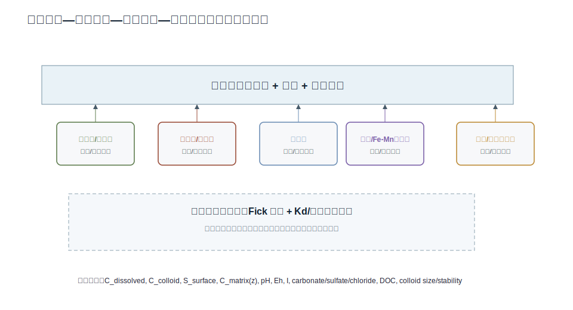
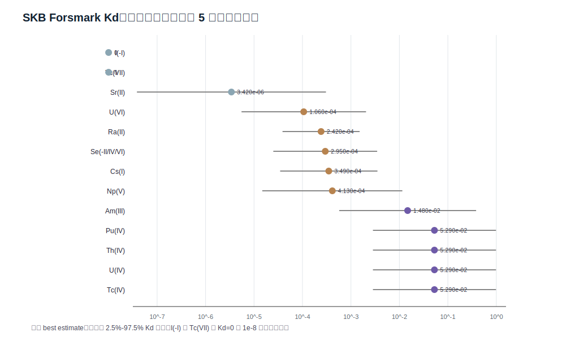
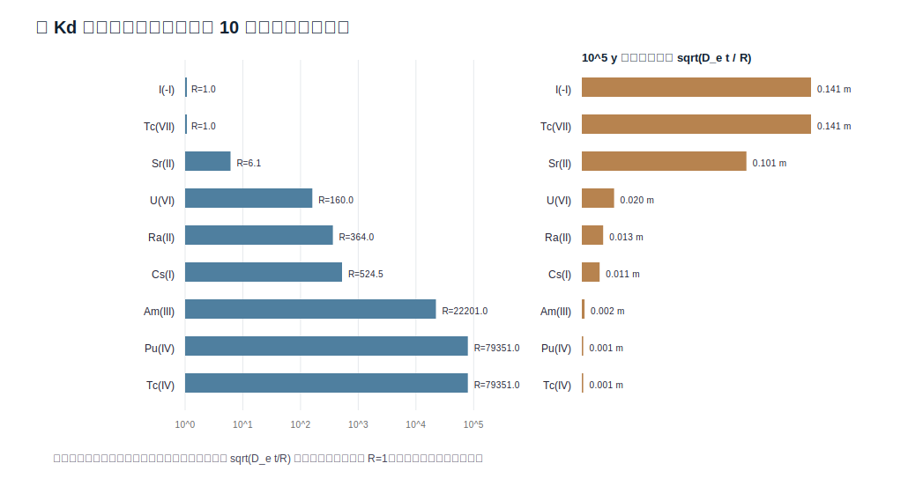
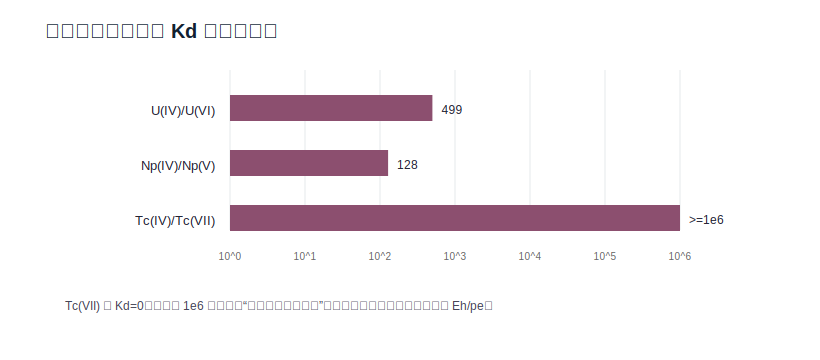
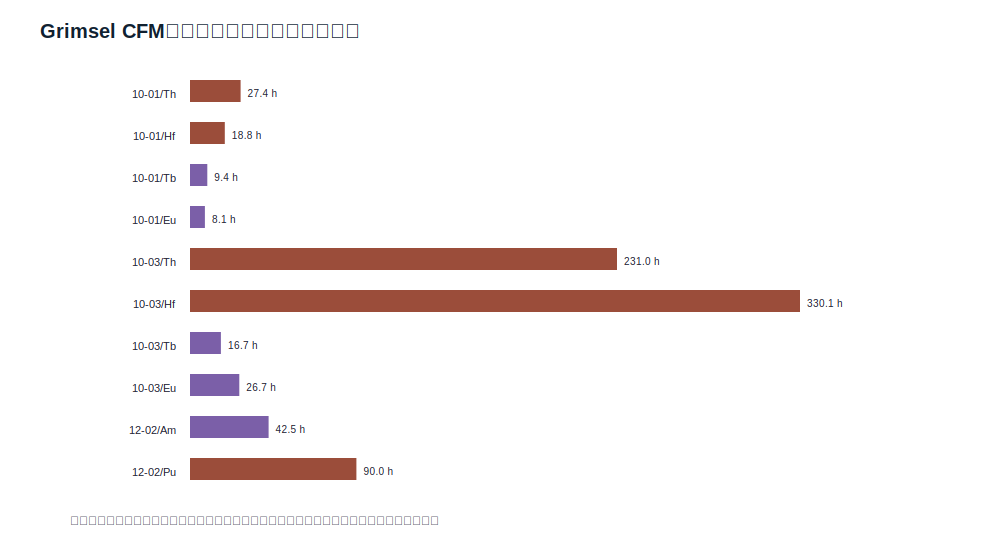
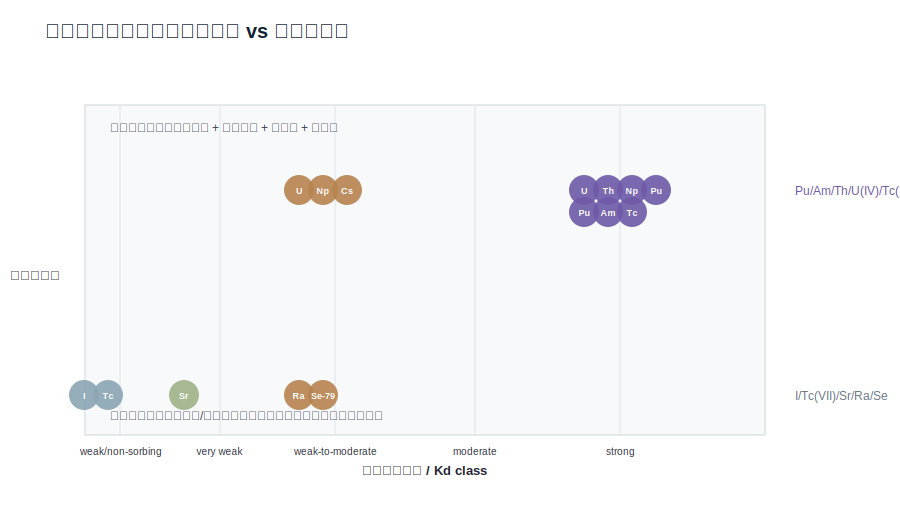

# 摘要

深地质处置库远场中的核素迁移不是简单的地下水随流输送过程，而是裂隙流动、矿物表面吸附、裂隙—基质扩散、氧化还原形态转换和胶体携带共同控制的多尺度反应运移问题。EGU 2026 摘要 EGU26-5127 明确指出，工程屏障和围岩矿物表面吸附是约束核素从深地质处置库向生物圈迁移的关键过程，但吸附受矿物类型、pH、Eh、离子强度、络合离子、温度、有机配体和微生物影响，并随空间和时间变化。本文据此构建“裂隙流动—矿物吸附—基质扩散—胶体携带”四过程耦合模型，重点讨论 U、Ra、Th、Np、Pu、Am，I-129、Tc-99、Se-79，以及 Cs-137、Sr-90 在结晶岩裂隙系统中的迁移风险排序。

本文使用三组公开证据进行数据化分析：SKB R-10-48 的 Forsmark 岩体 Kd 推荐值，SKB TR-10-50 的扩散可达孔隙度和有效扩散系数，以及 NAGRA/Grimsel CFM 胶体形成与迁移现场试验参数。以 $\rho_b=2700\ \mathrm{kg\,m^{-3}}$、$\theta_m=0.0018$、$D_e=10^{-13.7}\ \mathrm{m^2\,s^{-1}}$（阳离子/中性）和 $D_e=10^{-14.2}\ \mathrm{m^2\,s^{-1}}$（阴离子）为筛选参数，Kd 表明 I(-I) 与 Tc(VII) 可近似非吸附，Sr(II)、U(VI)、Ra(II)、Se 与 Cs(I) 处于弱到中等吸附区间，U(IV)、Th(IV)、Np(IV)、Pu(IV)、Tc(IV) 与 Am(III) 具有强吸附迟滞。红氧转换可使 Kd 发生 2-6 个数量级突变，例如 U(IV)/U(VI) 约 499，Np(IV)/Np(V) 约 128，Tc(IV)/Tc(VII) 由强吸附转为非吸附。Grimsel CFM 数据则显示，胶体回收率可达几十个百分点，强吸附 Th/Hf/Eu/Tb/Am/Pu 的突破主要受胶体解吸速率控制；Pu 的一位点解吸半衰期约 90 h，Am 约 43 h，说明强吸附核素在胶体稳定和过滤较弱的裂隙中可出现表观迁移增强。

本文最终观点是：结晶岩远场安全评价应避免用单一 Kd 或单一保守示踪剂代表全部核素。强吸附核素通常受矿物吸附和基质扩散迟滞，但在膨润土胶体、有机胶体、Fe-Mn 氧化物胶体或微生物胶体稳定存在时必须引入胶体携带状态；I-129、Tc(VII) 和部分 Se 形态的风险主要来自弱吸附和裂隙连通性；U、Np、Tc 的迁移排序必须以 Eh/pe 为状态变量动态判断。面向 PHREEQC、PFLOTRAN、COMSOL 或 OGS 的模型，应以显式物种形态、矿物表面反应、基质扩散和胶体过滤/解吸为共同骨架。

**关键词**：深地质处置库；结晶岩裂隙；核素迁移；矿物吸附；基质扩散；胶体促进迁移；Kd；PFLOTRAN；PHREEQC

# 1. 引言

在结晶岩处置库远场中，裂隙承担主要水力通道功能，而完整岩石基质的渗透性低、孔隙连通性差。若工程屏障发生极低概率核素释放，溶解态核素首先进入裂隙水；随后一部分被裂隙壁面矿物吸附，一部分扩散进入基质微孔并在基质矿物表面迟滞，另一部分可能吸附在移动胶体上并随裂隙流迁移。这个过程的难点在于尺度分裂：米尺度裂隙控制对流时间，毫米至微米尺度蚀变带控制表面反应与基质扩散，纳米至微米尺度胶体控制强吸附核素的旁路迁移。

EGU 2026 议题把 I、Np、Tc 的矿物吸附知识缺口作为深地质处置库安全评价问题，特别强调高盐度、高温、有机配体和微生物影响仍是知识缺口。该议题的重要性在于：它没有把“吸附”视作一个常数，而是视作随矿物、核素价态、水化学和时间变化的过程。本文在此基础上提出一个多尺度模型，并用公开参数做筛选级演算和可视化。

# 2. 数据源与方法

## 2.1 公开证据链

本文使用的证据分为四类。

第一，EGU26-5127 提供问题来源。该摘要指出吸附约束深地质处置库核素向生物圈迁移，且吸附受 redox、ionic strength、pH、complexing ions、microorganisms 等控制；其初步结果指出中性至弱碱性、低至中等离子强度条件研究较多，而高离子强度、大于 25 C 温度、有机配体和微生物影响仍是缺口。

第二，EURAD 2024 综述提供理论背景，说明核素向生物圈迁移取决于处置库距离、主导迁移机制（扩散或对流）以及核素与宿主岩/工程屏障矿物相互作用。

第三，SKB R-10-48 给出 Forsmark 岩体 Kd 推荐值和不确定性区间；SKB TR-10-50 给出 SR-Site 使用的扩散可达孔隙度 0.18% 和有效扩散系数：阳离子/中性物种 $\log_{10}D_e=-13.7\pm0.25$，阴离子 $\log_{10}D_e=-14.2\pm0.25$。

第四，NAGRA NTB 16-06 / Grimsel CFM 提供胶体迁移现场证据。该实验在 Grimsel Test Site 研究 FEBEX 膨润土胶体、保守示踪剂、三价/四价同系物和 Am/Pu 等核素的突破、过滤与解吸。

| axis | reported_state | interpretation |
| --- | --- | --- |
| radionuclides | I, Np, Tc selected as safety-relevant representatives | Use I-129, Np redox states and Tc-99/Tc redox states as gap-sensitive model tests. |
| studied domain | neutral to slightly alkaline pH and low to moderate ionic strength extensively studied | Base-case crystalline groundwater can be parameterized, but extrapolation needs uncertainty. |
| knowledge gaps | high ionic strength >1 M, temperature >25 C, organic ligands, microorganisms | Scenario matrix must include salinity, thermal pulse, organics and microbial colloids. |
| process statement | sorption on mineral surfaces constrains radionuclide migration to biosphere | Kd/surface complexation should be a first-order safety-relevant process, not a secondary correction. |

## 2.2 数据整理与筛选演算

本文没有声称完成场址校准或安全案例计算，而是做筛选级、可复核演算。主要数据文件包括：

- `data/skb_forsmark_kd_selected.csv`：从 SKB R-10-48 Table 6-1 整理的目标核素 Kd。
- `data/skb_transport_reference_parameters.csv`：从 SKB TR-10-50 整理的 $\theta_m$ 与 $D_e$。
- `data/derived_retardation_and_diffusion.csv`：由 Kd、孔隙度和扩散系数推导的迟滞因子和扩散深度。
- `data/nagra_cfm_desorption_rates.csv` 与 `data/nagra_cfm_filtration_parameters.csv`：Grimsel CFM 胶体解吸、过滤和可逆附着参数。

# 3. 理论框架与公式推导

## 3.1 裂隙对流—弥散方程

将裂隙近似为平行板通道，水力开度为 $2b$。若忽略密度差异和瞬态储水，裂隙内溶解态核素浓度 $C_f(x,t)$ 满足：

\[
2b R_f \frac{\partial C_f}{\partial t}
=
2bD_L\frac{\partial^2 C_f}{\partial x^2}
-2b v\frac{\partial C_f}{\partial x}
-2J_m
-2J_s
-\lambda 2bR_fC_f
+Q_s .
\]

其中 $v$ 为平均裂隙流速，$D_L=\alpha_Lv+D_m$ 为纵向弥散系数，$J_m$ 为进入岩石基质的扩散通量，$J_s$ 为裂隙壁面吸附/反应通量，$\lambda$ 为放射性衰变常数。若裂隙水体本身不考虑颗粒表面迟滞，则 $R_f\approx1$；若有悬浮颗粒或裂隙填充物参与，可把 $R_f$ 扩展为表观迟滞。

## 3.2 基质扩散与迟滞因子

低渗透岩石基质中的一维垂向扩散为：

\[
R_m\frac{\partial C_m}{\partial t}
=
D_e\frac{\partial^2 C_m}{\partial z^2}
-\lambda R_m C_m ,
\]

边界条件为：

\[
C_m(z=0,t)=C_f(x,t),\qquad C_m(z\rightarrow\infty,t)=0 .
\]

矩阵迟滞因子采用线性 Kd：

\[
R_m=1+\frac{\rho_b K_d}{\theta_m}.
\]

半无限基质中，裂隙进入基质的瞬时扩散通量可写为：

\[
J_m=-\theta_mD_e\left.\frac{\partial C_m}{\partial z}\right|_{z=0}.
\]

若用特征时间 $t$ 估算扩散前缘，强吸附核素满足：

\[
\ell_d(t)\sim\sqrt{\frac{D_e t}{R_m}} .
\]

这个式子解释了一个看似矛盾的现象：强吸附核素的扩散前缘较浅，但一旦进入基质，其单位体积储存容量因 $R_m$ 很大而显著提高，突破峰值被压低并产生长尾。

## 3.3 矿物吸附：Kd、表面络合与离子交换

Kd 模型为：

\[
S_i=K_{d,i}C_i,\qquad K_{d,i}=\frac{S_i}{C_i},
\]

其中 $S_i$ 为固相吸附量，单位可表示为 $\mathrm{Bq\,kg^{-1}}$ 或 $\mathrm{mol\,kg^{-1}}$，$C_i$ 为水相浓度。Kd 模型可直接进入迟滞因子，但它把 pH、Eh、矿物表面位点和络合作用折叠进一个常数，因此只适合筛选或在固定水化学条件下使用。

更机制化的表面络合写为：

\[
\equiv SOH + M^{z+} \rightleftharpoons \equiv SOM^{(z-1)+}+H^+ ,
\]

\[
K_{int}=\frac{a_{\equiv SOM}a_{H^+}}{a_{\equiv SOH}a_{M^{z+}}}\exp\left(\frac{F\psi}{RT}\Delta z\right).
\]

Cs 和 Sr 还可用离子交换表示：

\[
\equiv XNa+Cs^+ \rightleftharpoons \equiv XCs+Na^+ ,
\]

\[
2\equiv XNa+Sr^{2+}\rightleftharpoons (\equiv X)_2Sr+2Na^+ .
\]

这些反应说明，黑云母、绿泥石、黏土矿物、方解石、赤铁矿、磁铁矿和 Fe-Mn 氧化物不会给出统一吸附行为。强吸附锕系元素常由水解、碳酸盐络合、表面络合和胶体结合共同决定；I(-I) 与 TcO4- 在许多条件下则接近非吸附。

## 3.4 红氧形态转换

U、Np、Pu、Tc、Se 的迁移性强烈依赖价态。以 Tc 为例：

\[
\mathrm{TcO_4^- + 4H^+ + 3e^- \rightleftharpoons TcO(OH)_2(s/aq)+H_2O}.
\]

氧化态 Tc(VII) 以 pertechnetate $\mathrm{TcO_4^-}$ 存在，常近似非吸附；还原态 Tc(IV) 则水解和沉淀/吸附显著。Nernst 形式为：

\[
E_h=E^0-\frac{RT}{nF}\ln Q .
\]

这意味着 Eh 不能作为常数背景，而应是迁移模型的状态变量或情景边界。

## 3.5 胶体促进迁移

令 $C_d$ 为溶解态核素，$C_c$ 为移动胶体浓度，$C_{ic}$ 为胶体结合态核素，$S_s$ 为裂隙表面吸附态核素。简化动力学为：

\[
\frac{\partial C_c}{\partial t}
 +v_c\frac{\partial C_c}{\partial x}
=D_c\frac{\partial^2C_c}{\partial x^2}
-k_{att}C_c+k_{det}C_{c,s}-k_{irr}C_c ,
\]

\[
\frac{\partial C_{ic}}{\partial t}
 +v_c\frac{\partial C_{ic}}{\partial x}
=D_c\frac{\partial^2C_{ic}}{\partial x^2}
k_{on}C_dC_c-k_{off}C_{ic}-k_{irr}C_{ic}.
\]

若核素强烈吸附在胶体上且 $k_{off}$ 小，则它可随胶体移动；若 $k_{irr}$ 或过滤系数大，则胶体被裂隙填充物截留。胶体促进迁移的必要条件可写成三个不等式：

\[
K_{pc}C_c\gg 1,\qquad
Da_{off}=\frac{k_{off}L}{v}\ll1,\qquad
Da_{f}=\frac{k_{irr}L}{v}\lesssim1 .
\]

因此，胶体不是“总是增强迁移”，而是在强核素—胶体分配、低解吸、低过滤和足够连通裂隙同时满足时才增强迁移。

# 4. 公开数据分析

## 4.1 Kd 数据与核素吸附分类

SKB R-10-48 Forsmark Kd 表显示，目标核素的吸附强度跨越多个数量级。

| species | Kd_m3_kg | lower_upper_m3_kg | class |
| --- | --- | --- | --- |
| U(IV) | 5.290e-02 | 2.840e-03-9.840e-01 | strong |
| U(VI) | 1.060e-04 | 5.530e-06-2.050e-03 | weak-to-moderate |
| Ra(II) | 2.420e-04 | 3.870e-05-1.510e-03 | weak-to-moderate |
| Th(IV) | 5.290e-02 | 2.840e-03-9.840e-01 | strong |
| Np(IV) | 5.290e-02 | 2.840e-03-9.840e-01 | strong |
| Np(V) | 4.130e-04 | 1.480e-05-1.150e-02 | weak-to-moderate |
| Pu(III) | 1.480e-02 | 5.740e-04-3.830e-01 | strong |
| Pu(IV) | 5.290e-02 | 2.840e-03-9.840e-01 | strong |
| Am(III) | 1.480e-02 | 5.740e-04-3.830e-01 | strong |
| I(-I) | 0 | 0-0 | weak/non-sorbing |
| Tc(IV) | 5.290e-02 | 2.840e-03-9.840e-01 | strong |
| Tc(VII) | 0 | 0-0 | weak/non-sorbing |
| Se(-II/IV/VI) | 2.950e-04 | 2.500e-05-3.480e-03 | weak-to-moderate |
| Cs(I) | 3.490e-04 | 3.460e-05-3.520e-03 | weak-to-moderate |
| Sr(II) | 3.420e-06 | 3.840e-08-3.050e-04 | very weak |

这个结果直接支撑四类迁移情景。I(-I) 与 Tc(VII) 的 $K_d=0$，属于弱吸附高迁移端元；Sr(II)、U(VI)、Ra(II)、Se 和 Cs(I) 为弱到中等吸附，容易受离子强度、碳酸盐、硫酸盐和交换位点影响；Am(III)、Pu(III/IV)、Th(IV)、U(IV)、Np(IV)、Tc(IV) 为强吸附核素，但这些核素也最容易受到胶体携带的影响。

## 4.2 迟滞因子与基质扩散演算

采用 $\rho_b=2700\ \mathrm{kg\,m^{-3}}$ 和 $\theta_m=0.0018$，由 $R_m=1+\rho_bK_d/\theta_m$ 可得：

| species | R | D_e_m2_s | depth_1e5y_m |
| --- | --- | --- | --- |
| U(VI) | 1.6e+02 | 1.995e-14 | 0.020 |
| Ra(II) | 3.6e+02 | 1.995e-14 | 0.013 |
| Pu(IV) | 7.9e+04 | 1.995e-14 | 0.001 |
| Am(III) | 2.2e+04 | 1.995e-14 | 0.002 |
| I(-I) | 1 | 6.310e-15 | 0.141 |
| Tc(IV) | 7.9e+04 | 1.995e-14 | 0.001 |
| Tc(VII) | 1 | 6.310e-15 | 0.141 |
| Se(-II/IV/VI) | 4.4e+02 | 6.310e-15 | 0.007 |
| Cs(I) | 5.2e+02 | 1.995e-14 | 0.011 |
| Sr(II) | 6.1 | 1.995e-14 | 0.101 |

演算给出三个关键结论。第一，I(-I) 与 Tc(VII) 的 $R_m=1$，其迁移速度主要由裂隙流场、弥散和基质扩散决定。第二，U(VI)、Ra(II)、Se、Cs(I) 虽然 Kd 不高，但由于结晶岩 $\theta_m$ 很小，仍可形成数百量级迟滞。第三，强吸附锕系元素的 $R_m$ 可达 $10^4-10^5$ 量级，导致基质扩散前缘很浅，但基质容量极大，突破曲线表现为低峰值和长尾。

## 4.3 红氧转换的数量级影响

同一元素在不同价态下 Kd 可发生数量级突变。U(IV) 与 U(VI) 的 Kd 比约 499，Np(IV) 与 Np(V) 的 Kd 比约 128；Tc(IV) 和 Tc(VII) 的差别更极端，因为 Tc(VII) 在 SKB 表中被视为非吸附。由此可得：

\[
\mathrm{migration\ ranking} = f(Eh,pH,ligands,minerals)
\]

而不是固定核素名单。例如 Tc-99 在氧化裂隙中可能接近保守迁移，在还原 Fe(II)/硫化物环境中则可被强烈迟滞。

## 4.4 Grimsel CFM 胶体迁移约束

Grimsel CFM 提供了现场尺度胶体迁移证据。

| test | outflow_ml_min | conservative_recovery_pct | colloid_recovery_pct | interpretation |
| --- | --- | --- | --- | --- |
| 08-01/08-02 | 160/165 | 99 | near 99 in table context; report notes multiple analyses | shorter/high-flow dipole; conservative tracer nearly fully recovered |
| 10-01 | 48 | 84 | 53/47 (LIBD-dependent) | colloid recovery below conservative recovery; reversible plus irreversible filtration needed |
| 10-03 | 10 | 60 | 41 | lower flow/longer interaction; colloid recovery decreases, consistent with filtration |
| 12-02 | 25 | 80 | 54 | colloid-associated radionuclide breakthrough observed; Am/Pu fitted after field data release |

胶体过滤/附着参数：

| parameter | symbol | value_h-1 | half_time_h | interpretation |
| --- | --- | --- | --- | --- |
| colloid_attachment_to_fracture_filling | k_cs | 0.054 | 12.8 | reversible colloid attachment calibrated for Run 10-01 |
| colloid_detachment_from_fracture_filling | k_sc | 0.108 | 6.4 | reversible detachment calibrated for Run 10-01 |
| irreversible_colloid_filtration | k_cs_irr | 0.01 | 69.3 | additional irreversible filtration; important for long pathways |

胶体结合态核素/同系物的解吸速率如下。

| test | species | valence_proxy | kmca_h-1 | desorption_half_life_h |
| --- | --- | --- | --- | --- |
| 10-01 | Th | tetravalent | 0.0253 | 27.4 |
| 10-01 | Hf | tetravalent | 0.0368 | 18.8 |
| 10-01 | Tb | trivalent | 0.074 | 9.4 |
| 10-01 | Eu | trivalent | 0.086 | 8.1 |
| 10-03 | Th | tetravalent | 0.003 | 231.0 |
| 10-03 | Hf | tetravalent | 0.0021 | 330.1 |
| 10-03 | Tb | trivalent | 0.0415 | 16.7 |
| 10-03 | Eu | trivalent | 0.026 | 26.7 |
| 12-02 | Am | trivalent actinide | 0.0163 | 42.5 |
| 12-02 | Pu | tetravalent/actinide | 0.0077 | 90.0 |

NAGRA 报告对 Run 10-01 的胶体突破曲线给出 $k_{cs}=0.054\ \mathrm{h^{-1}}$、$k_{sc}=0.108\ \mathrm{h^{-1}}$ 和不可逆过滤 $k_{cs,irr}=0.01\ \mathrm{h^{-1}}$。这说明胶体在裂隙填充物上存在可逆交换，同时有不可逆损失。核素/同系物方面，Th、Hf、Tb、Eu、Am、Pu 的突破受从胶体解吸的速率控制；Pu 一位点解吸 $k=0.0077\ \mathrm{h^{-1}}$，半衰期约 90 h，Am 为 0.0163 $\mathrm{h^{-1}}$，半衰期约 43 h。若裂隙旅行时间与这些半衰期同阶或更短，胶体结合态就可能显著贡献迁移。

# 5. 情景矩阵与论证对齐

| species | nuclide_group | sorption_class | redox_sensitivity | colloid_relevance | expected_migration_scenario |
| --- | --- | --- | --- | --- | --- |
| U(IV) | U | strong | yes | medium/high for actinides or Cs under favorable colloid stability | strong sorption - matrix/mineral retention unless colloid-bound |
| U(VI) | U | weak-to-moderate | yes | medium/high for actinides or Cs under favorable colloid stability | redox/speciation-sensitive intermediate mobility |
| Ra(II) | Ra | weak-to-moderate | limited | low | cation exchange / mineral-specific sorption |
| Th(IV) | Th | strong | limited | medium/high for actinides or Cs under favorable colloid stability | strong sorption - matrix/mineral retention unless colloid-bound |
| Np(IV) | Np | strong | yes | medium/high for actinides or Cs under favorable colloid stability | strong sorption - matrix/mineral retention unless colloid-bound |
| Np(V) | Np | weak-to-moderate | yes | medium/high for actinides or Cs under favorable colloid stability | redox/speciation-sensitive intermediate mobility |
| Pu(III) | Pu | strong | yes | medium/high for actinides or Cs under favorable colloid stability | strong sorption - matrix/mineral retention unless colloid-bound |
| Pu(IV) | Pu | strong | yes | medium/high for actinides or Cs under favorable colloid stability | strong sorption - matrix/mineral retention unless colloid-bound |
| Am(III) | Am | strong | limited | medium/high for actinides or Cs under favorable colloid stability | strong sorption - matrix/mineral retention unless colloid-bound |
| I(-I) | I-129 | weak/non-sorbing | limited | low | weak sorption - high fracture-flow mobility |
| Tc(IV) | Tc-99 | strong | yes | medium/high for actinides or Cs under favorable colloid stability | strong sorption - matrix/mineral retention unless colloid-bound |
| Tc(VII) | Tc-99 | weak/non-sorbing | yes | low | weak sorption - high fracture-flow mobility |
| Se(-II/IV/VI) | Se-79 | weak-to-moderate | yes | low | redox/speciation-sensitive intermediate mobility |
| Cs(I) | Cs-137 | weak-to-moderate | limited | medium/high for actinides or Cs under favorable colloid stability | cation exchange / mineral-specific sorption |
| Sr(II) | Sr-90 | very weak | limited | low | cation exchange / mineral-specific sorption |

| claim | data_evidence | model_alignment | status |
| --- | --- | --- | --- |
| 强吸附核素以矿物吸附和基质扩散迟滞为主 | Forsmark Kd: U(IV), Th(IV), Np(IV), Pu(IV), Tc(IV) = 5.29e-2 m3/kg; Am(III)=1.48e-2 m3/kg. Derived R values are 2.2e4 to 7.9e4. | Retardation equation R=1+rho_b Kd/theta predicts very large matrix storage capacity. | supported for redox/colloid-stable-free case |
| I-129 and Tc(VII) are weak吸附高迁移性阴离子 | SKB_R_10_48 assigns Kd=0 for I(-I) and Tc(VII). | R=1; transport controlled by fracture connectivity, diffusion-accessible porosity and source term rather than mineral sorption. | supported |
| Se-79 is less mobile than I/Tc(VII) but still often weakly sorbing | Se(-II/IV/VI) best Kd=2.95e-4 m3/kg, comparable to Ra/Cs order in this dataset but with redox uncertainty. | Scenario must distinguish selenide/selenite/selenate and Fe/Mn oxide retention. | supported with redox caveat |
| U、Np、Tc redox transition changes mobility by orders of magnitude | U(IV)/U(VI) Kd ratio about 499; Np(IV)/Np(V) ratio about 128; Tc(IV)/Tc(VII) ratio is effectively infinite in Kd table because Tc(VII)=0. | Eh boundary must be an explicit state variable, not a fixed parameter. | strongly supported |
| 胶体可增强强吸附核素的表观迁移 | Grimsel CFM: colloid recovery tens of percent; Th/Hf/Eu/Tb/Am/Pu breakthrough controlled by desorption from bentonite colloids. | A mobile colloid-attached state plus filtration/desorption kinetics is required. | supported for colloid-stable fracture scenarios |
| 胶体增强不是无限制迁移 | NAGRA Run 10-01 fitted k_cs=0.054 h-1, k_sc=0.108 h-1, k_cs,irr=0.01 h-1; colloid recoveries decline with travel time. | Filtration Damkohler number must screen whether colloids survive a given pathway. | supported |

模型—数据对齐可以概括为：

1. 强吸附锕系元素在无胶体或胶体被过滤条件下迁移距离有限；这一点由高 Kd 和大 $R_m$ 支持。
2. I-129 与 Tc(VII) 的远场重要性来自弱吸附，而不是高放射毒性或高源项本身；它们更接近水文连通性指标。
3. U、Np、Tc、Se 必须进行价态情景拆分；一个固定 Kd 不能同时代表氧化、还原和过渡带。
4. 胶体促进迁移主要改变强吸附核素的表观迁移性，对 I(-I) 或 Tc(VII) 这类本来就弱吸附的阴离子不是主要增强机制。
5. 胶体迁移需要同时考虑胶体稳定、过滤、解吸和裂隙尺度，不应简单假定胶体全程保守。

# 6. 面向 PHREEQC、PFLOTRAN、COMSOL 与 OGS 的模型实现

## 6.1 PHREEQC 原型

PHREEQC 适合处理水化学形态、饱和指数、离子交换和表面络合原型。本文提供 `models/phreeqc_sorption_speciation_template.phr`。建议使用流程为：

1. 输入地下水 pH、pe/Eh、离子强度、碳酸盐、硫酸盐、氯离子、Ca、Na、Fe、Mn、DOC。
2. 对 U、Np、Pu、Am、Tc、Se 进行价态和络合形态计算。
3. 对黑云母/绿泥石/黏土矿物使用交换位点，对 Fe-Mn 氧化物使用表面络合位点。
4. 输出主要水相物种和表面吸附分数，再传递给场尺度反应运移模型。

## 6.2 PFLOTRAN/OGS/COMSOL 场尺度实现

场尺度推荐三种路线：

- **PFLOTRAN**：适合 2D/3D 反应运移和长时间尺度参数扫描；胶体模块可用移动伪组分或外部耦合实现。
- **OpenGeoSys**：适合裂隙—基质扩散、THM/THMC 耦合和有限元网格控制。
- **COMSOL**：适合验证性模型、裂隙-基质多物理场耦合和胶体过滤/解吸方程原型。

模型至少需要以下输入：裂隙开度、连通性、流速、孔隙率、基质扩散系数、裂隙壁面矿物组成、蚀变带厚度、pH、Eh、盐度、碳酸盐/硫酸盐/氯离子、有机质、胶体粒径、胶体稳定性、初始核素形态、Kd、表面络合参数、沉淀/溶解速率和温度。

# 7. 局限性

本文为综述与概念模型构建，不是处置库安全案例。局限性包括：

- SKB Kd 是 Forsmark 条件下的推荐参数，不可直接移植到加拿大 Shield、Revell Batholith 或任何具体场址。
- Kd 模型无法替代表面络合和离子交换模型；它把水化学条件折叠为常数。
- Grimsel CFM 是强约束现场 analogue，但其流场、胶体配方、注入方式和尺度与真实处置库远场并不相同。
- 胶体长期稳定性、微生物胶体、有机胶体和 Fe-Mn 氧化物胶体仍需要更多现场数据。
- 本文未执行 PHREEQC/PFLOTRAN/OGS/COMSOL，因此所有模型输出为筛选演算和概念图，不是数值模拟结果。

# 8. 结论

本文建立了结晶岩裂隙中核素吸附—基质扩散—胶体促进迁移的多尺度模型，并用公开数据进行筛选演算。结论如下。

第一，矿物吸附是远场核素迟滞的核心机制，但它不能被简化为普适常数。Kd 随核素价态、矿物类型、pH、Eh、离子强度和络合离子变化；EGU 2026 指出的高盐度、高温、有机配体和微生物影响仍是关键知识缺口。

第二，基质扩散是结晶岩远场的峰值削减机制。裂隙提供快速水力通道，低渗透基质提供扩散储存空间。强吸附核素的扩散前缘较浅，但迟滞因子极大；非吸附阴离子扩散更深，但储存容量较低。

第三，迁移风险排序应按核素形态而不是元素名称判断。I(-I) 与 Tc(VII) 属于弱吸附高迁移端元；U(IV)、Th(IV)、Np(IV)、Pu(IV)、Am(III) 在无胶体条件下强烈迟滞；U(VI)、Np(V)、Tc(IV/VII)、Se(-II/IV/VI) 必须按 Eh-pH 情景拆分。

第四，胶体促进迁移是强吸附核素远场评价的必要机制，但不是无条件增强项。Grimsel CFM 证据表明胶体可携带 Th、Hf、Eu、Tb、Am、Pu 等迁移，并且突破曲线受解吸速率控制；同时胶体也会被裂隙填充物过滤，回收率随旅行时间降低。因此，胶体模块必须同时包含核素—胶体分配、解吸、可逆附着和不可逆过滤。

第五，面向长期安全评价的模型应采用“四过程耦合”结构：裂隙对流弥散定义水力连通性，矿物吸附定义迟滞和反应位点，基质扩散定义远场储存和尾迹，胶体携带定义强吸附核素的旁路迁移。这个框架能把 U/Ra/Th/Np/Pu/Am、I/Tc/Se、Cs/Sr 三类核素纳入统一但可区分的迁移排序。

# 数据与文件清单

- `data/source_bibliography.csv`：公开证据源列表。
- `data/skb_forsmark_kd_selected.csv`：目标核素 Kd 表。
- `data/skb_transport_reference_parameters.csv`：孔隙度与有效扩散系数。
- `data/derived_retardation_and_diffusion.csv`：迟滞因子和扩散深度演算。
- `data/nagra_cfm_field_summary.csv`：Grimsel CFM 现场试验汇总。
- `data/nagra_cfm_desorption_rates.csv`：胶体结合核素解吸速率。
- `data/model_alignment_matrix.csv`：命题—数据—模型对齐矩阵。
- `figures/*.svg`：论文图件。
- `models/*.json`、`models/*.phr`、`models/*.in`：后续模型模板。
- `sources/*.pdf|*.html|*.txt`：公开源文件和 PDF 文本抽取结果。

# 参考文献

1. Philipp, T., Weyand, T., and Bracke, G. (2026). *Identification of knowledge gaps regarding iodine, neptunium and technetium sorption in the context of deep geological nuclear waste disposal*. EGU General Assembly 2026, EGU26-5127. https://doi.org/10.5194/egusphere-egu26-5127
2. Maes, N., Churakov, S., Glaus, M., Baeyens, B., et al. (2024). *EURAD state-of-the-art report on the understanding of radionuclide retention and transport in clay and crystalline rocks*. Frontiers in Nuclear Engineering. https://doi.org/10.3389/fnuen.2024.1417827
3. Crawford, J. (2010). *Bedrock Kd data and uncertainty assessment for application in SR-Site geosphere transport calculations*. SKB R-10-48. https://skb.com/publication/2192981/R-10-48.pdf
4. SKB. (2010). *Radionuclide transport report for the safety assessment SR-Site*. SKB TR-10-50. https://www.skb.com/publication/2166831/TR-10-50.pdf
5. NAGRA. (2016). *Modelling of the Colloid Formation and Migration Experiment at the Grimsel Test Site*. NAGRA NTB 16-06. https://nagra.ch/wp-content/uploads/2022/08/e_ntb16-006.pdf
6. Grimsel Test Site. *Colloid Formation and Migration project aims*. https://www.grimsel.com/gts-projects/cfm-section/cfm-aims
