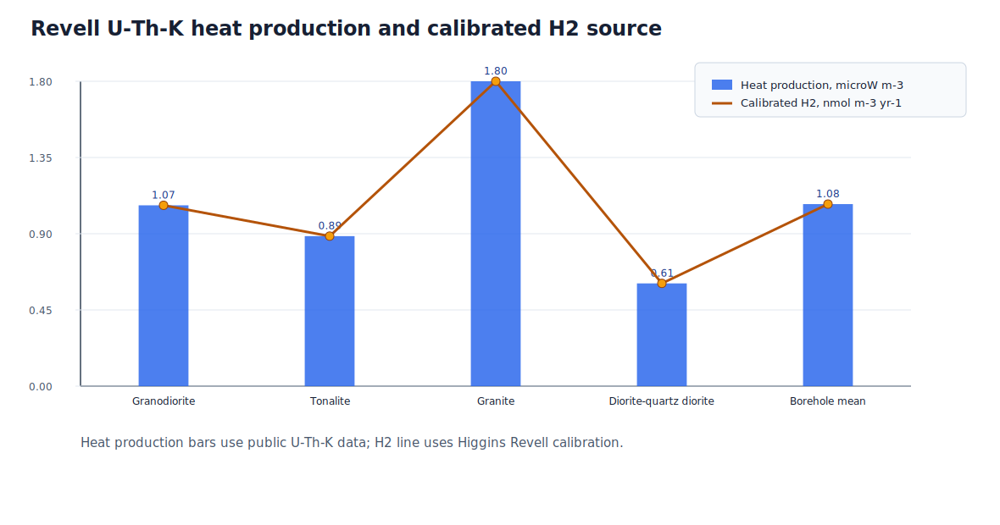
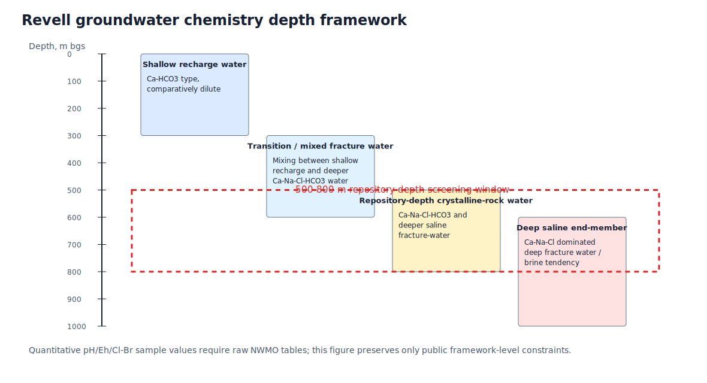
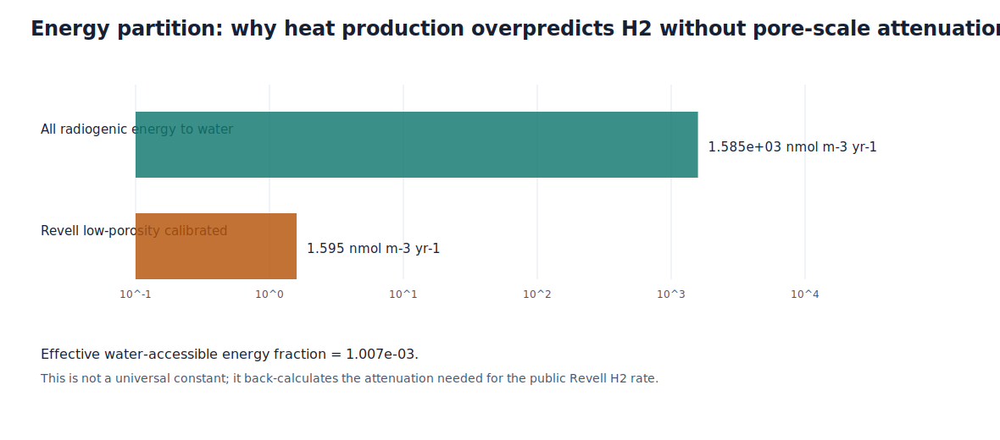
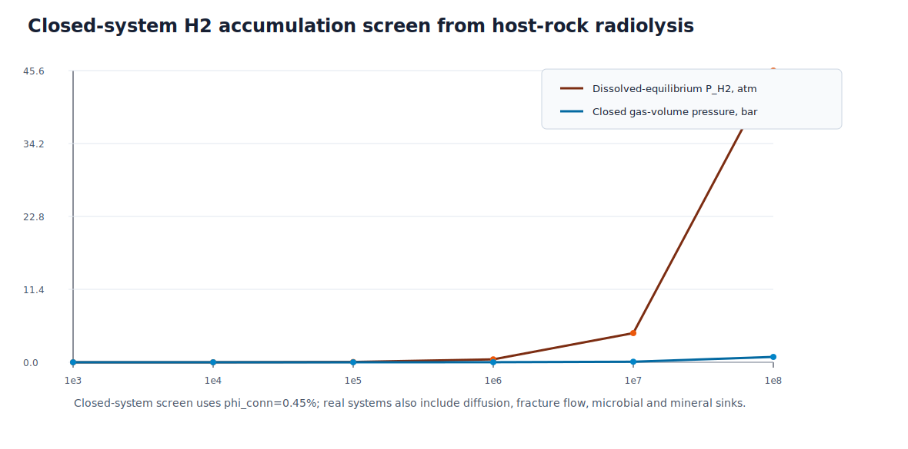
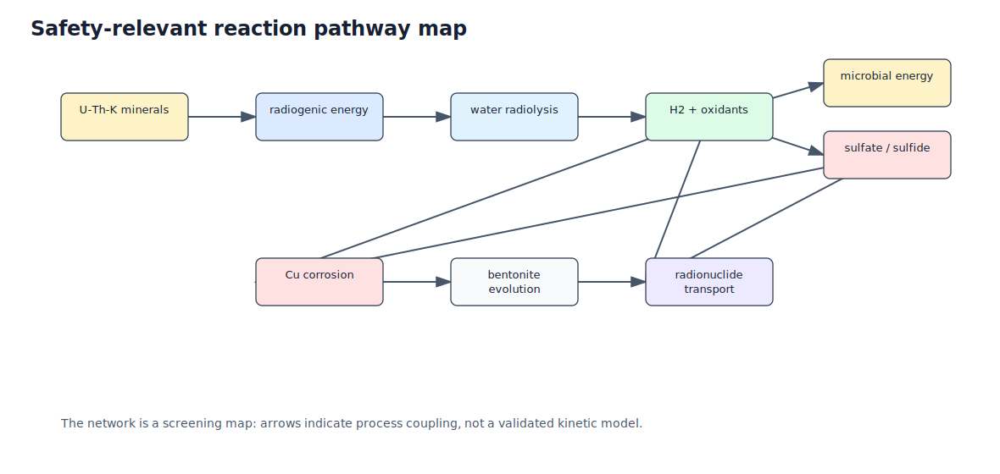

# Revell Batholith 地下水化学、放射性辐解产氢与深地质处置库长期安全性的耦合分析

**论文类型**：综述-方法学论文 / THMC 反应路径框架。  
**研究边界**：本文不评价 Revell Batholith 处置库是否安全，也不构成监管安全案例、工程认证或选址结论；本文只把公开 Revell 勘探资料、公开 U-Th-K/热产率数据与公开辐解产氢结果组织成可复核的地球化学-THMC 分析框架。  
**数据状态**：原始 PDF 和源链接保存在 `sources/`；二次整理数据保存在 `data/`；计算与图件由 `scripts/build_revell_radiolysis_thmc_package.py` 生成。

## 摘要

Revell Batholith 是加拿大安大略省西北部一个以花岗质-英云闪长质结晶岩为主的区域性岩体，也是加拿大深地质处置库研究中反复讨论的候选结晶岩体系之一。与把场址直接简化为工程处置空间不同，本文将其视为一个长期演化的深部水-岩-气-微生物反应系统：低孔隙度、低渗透率岩石中的 U-Th-K 矿物持续产生放射性热和电离能量，孔隙/裂隙水在该能量场中发生水辐解，生成 H2、氧化剂和可能的硫酸盐通量；这些组分又会影响微生物代谢、氧化还原缓冲、铜容器腐蚀、膨润土缓冲材料演化以及核素迁移。

本文基于公开 NWMO Revell 报告、Revell THMC/热学论文、Revell 辐解论文和 PHREEQC 官方文档，建立了三个层级的分析：第一，整理 Revell 的岩性、孔隙度、水化学分带、导水率与 U-Th-K 数据；第二，从放射性衰变、热产率、水辐解 G 值、H2 质量守恒、硫酸盐还原能量学和气体压力筛选公式出发，推导长期 H2 生成与闭合孔隙积累的数量级；第三，把 H2、硫酸盐、微生物、腐蚀、膨润土和核素迁移纳入 THMC 状态变量与反应网络。计算显示，Revell borehole mean 的公开 U-Th-K 数据对应热产率约 $1.08\ \mu\mathrm{W}\ \mathrm{m}^{-3}$；如果把全部放射性热能直接沉积到水中，H2 会被高估到 $1584.7\ \mathrm{nmol}\ \mathrm{m}^{-3}\ \mathrm{yr}^{-1}$。与公开 Revell 辐解结果 $1.6\ \mathrm{nmol}\ \mathrm{m}^{-3}\ \mathrm{yr}^{-1}$ 对齐时，等效水可达能量分数约为 $1.01e-03$，说明低连通孔隙度和矿物-水几何关系是源项解释的关键。封闭孔隙筛选表明，在没有扩散、微生物和矿物消耗的极端条件下，$10^6$ 年可积累约 1.60 mmol H2 m-3 rock；但年度通量很小，安全相关风险主要取决于是否存在闭合滞留、气体迁移门槛以及工程近场腐蚀 H2 的叠加。

**最终观点**：Revell Batholith 的长期安全评价不应把放射性辐解 H2 简化为“有/无风险”的单因子判断。更严谨的表述是：宿主岩 U-Th-K 辐解提供了可持续但低通量的深部还原性电子供体；其安全意义由水可达能量分数、裂隙-基质连通性、硫/铁矿物反应、微生物消耗、膨润土气体阈值、容器腐蚀 H2 与核素迁移参数共同决定。现有公开数据足以支持一个 L1-L2 级的方法学框架和筛选计算，但不足以支持站址级定量安全结论；下一步必须进入样品级 PHREEQC 物种计算、裂隙-基质反应输运和场地校准。

**关键词**：Revell Batholith；深地质处置库；地下水化学；水辐解；U-Th-K；H2；硫酸盐；微生物；铜腐蚀；膨润土；THMC；PHREEQC。

## 1. 引言

结晶岩深地质处置库的长期安全性通常依赖多重屏障：废物形态、金属容器、膨润土缓冲层、封堵材料和低渗透围岩。对 Revell Batholith 这样的花岗质结晶岩体系而言，围岩不只是力学稳定的被动介质，而是长期地球化学能量和反应边界的来源。U、Th、K 衰变释放的能量一部分以热形式表现为地温梯度和岩石热产率，一部分通过电离辐射在矿物-水界面附近驱动水辐解。即使源项很小，百万年至千万年尺度也可能在低通量环境中塑造 H2、氧化剂、硫酸盐、硫化物和氧化还原边界。

本文围绕三个问题展开：

1. Revell Batholith 地下水的主要化学特征、盐度分层、氧化还原状态和水岩作用路径是什么？
2. 围岩 U-Th-K 衰变在长期尺度上可能产生多少 H2，这些 H2 是更可能被矿物/微生物消耗，还是形成气体压力风险？
3. 上述过程应如何进入 DGR 的 THMC 安全评价框架，并影响核素释放、迁移与封闭后风险判断？

## 2. 数据源、证据等级与可复现性

本文使用的公开来源如下。所有数值均作为二次整理数据进入 `data/`，不把未解析的 PDF 图件当作样品级数据库。

| source | year | use | url |
| --- | --- | --- | --- |
| nwmo_2022_confidence_revell | 2022 | Revell site investigation context, boreholes, hydrogeochemistry depth framework, low-permeability crystalline-rock safety context. | https://www.nwmo.ca/-/media/Reports-MASTER/Technical-reports/NWMO-TR-2022-14-Confidence-in-Safety-Revell-Site-2022-03.ashx?rev=7e56d8a81d714d70a8d6004b1c2cce49&sc_lang=en |
| nwmo_2023_confidence_revell_update | 2023 | Public Revell update values for lithology, porosity, hydrochemistry zones, hydraulic conductivity and sulphide detection boundary. | https://www.nwmo.ca/-/media/Reports-MASTER/Technical-reports/NWMO-TR-2023-07-Confidence-in-Safety---Revell-Site---2023-Update.ashx?rev=6180a2f1bd95498f96d4dec51c8e406c&sc_lang=en |
| villamizar_2024_arma | 2024 | Borehole-scale U-Th-K, density, heat production, temperature gradient and repository-depth THMC model context. | https://armarocks.net/papers/379.pdf |
| nwmo_mapping_2017 | 2017 | Surface lithology and U-Th-K summary statistics for Revell-area crystalline rocks. | https://www.nwmo.ca/-/media/Reports---Reports/APM-REP-01332-0225-Phase-2-Geological-Mapping-Township-of-Ignace-and-Area-11-17.ashx?hash=2B490F4795C7E3BB59C39AB3EAB296CF&rev=a36ce8c7c16e4020b5896e539fdce61e&sc_lang=en |
| higgins_2025_radiolysis | 2025 | Revell Batholith H2 production rate, Kidd Creek comparison, and sulfate-production contrast. | https://doi.org/10.1021/acsearthspacechem.5c00072 |
| usgs_phreeqc_v3 | 2024 | PHREEQC speciation, reaction, transport and inverse-modeling workflow boundary. | https://water.usgs.gov/water-resources/software/PHREEQC/documentation/phreeqc3-html/phreeqc3.htm |

**证据等级**：

- A 级：公开报告或论文中直接给出的数值，如 U、Th、K、热产率、孔隙度、导水率量级、H2 生成率。
- B 级：公开报告中的概念性或图示性趋势，如浅部 Ca-HCO3 水、深部 Ca-Na-Cl-HCO3/Cl 型水、盐度随深度升高。
- C 级：本文为了建立模型路径而进行的推导、筛选计算或情景假设。

GeoMine MCP 在本轮用于 AOI 标准化与数据源发现，但该 MCP 版本未执行实时目录抓取；因此本文把 MCP 结果列为来源发现与工作流 provenance，而不是站址测量数据。

## 3. Revell Batholith 的岩性与地下水化学框架

### 3.1 岩性与 U-Th-K 约束

Revell 区域公开地质资料显示，研究对象以花岗闪长岩、英云闪长岩和局部花岗岩为主。不同岩性的 U-Th-K 差异决定了热产率和辐解源项的一阶空间差异。由公开 U-Th-K 数据计算得到的热产率与校准 H2 源项如下。

| unit | K_wt_pct_mean | U_ppm_mean | Th_ppm_mean | heat_microW_m3 | h2_calibrated_nmol_m3_yr | effective_attenuation_fraction |
| --- | --- | --- | --- | --- | --- | --- |
| Granodiorite | 2.100 | 1.560 | 7.050 | 1.070 | 1.584 | 1.007e-03 |
| Tonalite | 1.430 | 1.330 | 6.140 | 0.887 | 1.314 | 1.007e-03 |
| Granite | 3.200 | 2.670 | 12.200 | 1.803 | 2.671 | 1.007e-03 |
| Diorite-quartz diorite | 0.910 | 0.830 | 4.600 | 0.608 | 0.900 | 1.007e-03 |
| Revell borehole mean | 2.079 | 2.081 | 5.247 | 1.077 | 1.595 | 1.007e-03 |

### 3.2 孔隙度、导水率与水化学分带

公开 Revell 更新资料给出结晶岩连通孔隙度约 0.45%、总孔隙度约 1.32%。这一数量级对辐解和输运有两重意义：第一，只有非常有限的水体积直接参与水辐解和溶解 H2 储存；第二，若裂隙连通性弱，扩散控制会放大长期滞留效应。水化学框架可概括为浅部补给水、过渡混合水、处置深度水和深部盐水端元。公开资料足以支持“盐度随深度升高、处置深度受深部裂隙水影响”的框架，但本文没有解析样品级 Cl、Br、SO4、Fe、U、Eh 或 pH 表，因此不宣称完成站址级 PHREEQC 物种计算。

## 4. 理论框架与公式推导

### 4.1 放射性衰变、活度与热产率

对任一放射性核素 $i$，原子数和活度为：

$$
N_i(t)=N_{i,0}e^{-\lambda_i t},\qquad A_i(t)=\lambda_i N_i(t)
$$

若以岩石体积为基准，放射性热功率密度可写成：

$$
Q_h=\sum_i A_i E_i \eta_i
$$

其中 $E_i$ 是每次衰变释放能量，$\eta_i$ 是沉积为局部热/电离能的比例。地球化学中常用的 U-Th-K 岩石热产率经验式为：

$$
A_h=10^{-2}\rho\left(9.52C_U+2.56C_{Th}+3.48C_K\right)
$$

其中 $A_h$ 单位为 $\mu\mathrm{W}\ \mathrm{m}^{-3}$，$\rho$ 单位为 $\mathrm{g}\ \mathrm{cm}^{-3}$，$C_U$ 与 $C_{Th}$ 单位为 ppm，$C_K$ 单位为 wt%。将 Revell borehole mean 的公开值 $C_U=2.081$ ppm、$C_{Th}=5.247$ ppm、$C_K=2.079$ wt%、$\rho=2.66$ 代入，有：

$$
A_h=10^{-2}\times2.66\times(9.52\times2.081+2.56\times5.247+3.48\times2.079)
\approx 1.08\ \mu\mathrm{W}\ \mathrm{m}^{-3}
$$

该结果与公开 Revell 热产率约 $1.08\ \mu\mathrm{W}\ \mathrm{m}^{-3}$ 对齐。

### 4.2 水辐解 H2 源项

水辐解的产额可由 G 值表示。若 $G_{H_2}=0.45$ molecule/100 eV，则：

$$
G_{H_2}=0.45\times0.10364\times10^{-6}
=4.664e-08\ \mathrm{mol}\ \mathrm{J}^{-1}
$$

若把岩石热产率全部视作水吸收能量，则单位体积岩石每年的 H2 生成率为：

$$
R_{H_2}^{all}=G_{H_2}A_h10^{-6}t_y
$$

对 Revell borehole mean：

$$
R_{H_2}^{all}=4.664e-08\times 1.08\times10^{-6}\times31557600
\approx 1584.7\ \mathrm{nmol}\ \mathrm{m}^{-3}\ \mathrm{yr}^{-1}
$$

但公开 Revell 辐解模型给出的代表性结果约为：

$$
R_{H_2}^{Revell}=1.6\ \mathrm{nmol}\ \mathrm{m}^{-3}\ \mathrm{rock}\ \mathrm{yr}^{-1}
$$

因而定义水可达能量分数：

$$
\epsilon_w=\frac{R_{H_2}^{Revell}}{R_{H_2}^{all}}\approx 1.01e-03
$$

该值不是常数，而是把公开 Revell H2 源项与 U-Th-K 热产率对齐后得到的有效几何/能量分配因子。它代表低孔隙度、矿物-水接触面积、alpha/beta/gamma 能量沉积路径和孔隙水可达性的综合效果。

### 4.3 H2 质量守恒、扩散与裂隙输运

H2 在裂隙-基质系统中的质量守恒可写为：

$$
\frac{\partial(\phi C_{H_2})}{\partial t}
=\nabla\cdot(D_e\nabla C_{H_2})
-\nabla\cdot(\mathbf{q}C_{H_2})
+R_{H_2}^{rad}-R_{bio}-R_{min}-R_{gas}
$$

其中 $R_{H_2}^{rad}$ 是辐解源项，$R_{bio}$ 是微生物消耗，$R_{min}$ 是矿物/氧化剂反应消耗，$R_{gas}$ 是气相逸出或两相流损失。Revell 的关键不是源项是否存在，而是上述源-汇项的相对大小。

### 4.4 硫酸盐生成与微生物能量

辐解氧化剂可把硫化物氧化为硫酸盐。以黄铁矿为例：

$$
\mathrm{FeS_2}+3.75\mathrm{O_2}+3.5\mathrm{H_2O}
\rightarrow \mathrm{Fe(OH)_3}+2\mathrm{SO_4^{2-}}+4\mathrm{H^+}
$$

若 H2 与硫酸盐还原菌相耦合，则反应可写为：

$$
4\mathrm{H_2}+\mathrm{SO_4^{2-}}+\mathrm{H^+}
\rightarrow \mathrm{HS^-}+4\mathrm{H_2O}
$$

采用保守的能量数量级 $|\Delta G|\approx38\ \mathrm{kJ}\ \mathrm{mol}^{-1}\ H_2$，Revell 宿主岩辐解 H2 的能量通量约为：

$$
\Phi_G=1.6\times10^{-9}\times 3.8\times10^4
\approx 6.08e-05\ \mathrm{J}\ \mathrm{m}^{-3}\ \mathrm{yr}^{-1}
$$

这说明宿主岩辐解可作为持续电子供体，但在年度尺度上能量通量很低；微生物过程是否显著，更可能受局部裂隙水停留时间、硫酸盐供应、表面积和群落阈值控制。

### 4.5 气体压力与溶解度筛选

在极端封闭条件下，若 H2 完全以气体占据连通孔隙体积 $V_g=\phi V_{rock}$，压力可用理想气体式筛选：

$$
P=\frac{nRT}{V_g}
$$

若 H2 以溶解态与水相平衡，则：

$$
C_{H_2}=k_HP_{H_2}
$$

以 $\phi=0.45\%$、$T=283.15\ \mathrm{K}$、$k_H=7.8\times10^{-4}\ \mathrm{mol}\ \mathrm{L}^{-1}\ \mathrm{atm}^{-1}$ 进行筛选，$10^6$ 年闭合系统可得到约 0.008 bar 的气相体积压力或 0.46 atm 的溶解平衡分压；$10^7$ 年对应 0.084 bar 或 4.56 atm。该结果不能直接转化为处置库压力结论，因为实际系统存在扩散、裂隙流、矿物/微生物消耗、两相流和工程近场 H2 叠加。

### 4.6 核素迁移与 THMC 状态变量

对可溶核素的筛选输运方程可写为：

$$
R_f\frac{\partial C}{\partial t}=
D_e\nabla^2C-\mathbf{v}\cdot\nabla C-\lambda C+S
$$

$$
R_f=1+\frac{\rho_bK_d}{\phi}
$$

其中 $K_d$ 或表面络合模型由 pH、Eh、离子强度、碳酸盐、硫酸盐、Fe/Mn 氧化物和黏土交换位点控制。THMC 模型的最小状态向量可写为：

$$
\mathbf{y}=[T,p_l,S_l,\sigma',\phi,k,pH,Eh,\mathbf{c},C_{H_2},p_g]
$$

## 5. 数据分析结果与预期对齐

### 5.1 U-Th-K 热产率与 H2 源项

花岗岩端元的 U、Th、K 明显高于英云闪长岩和闪长质端元，因此热产率与校准 H2 源项最高。Revell borehole mean 的热产率与公开热学论文对齐，说明本文的 U-Th-K 热模型没有数量级偏差。更重要的是，直接把热产率换算为水辐解 H2 会高估约三阶数量级；只有引入低孔隙度、低水可达性和矿物-水界面效应，才能与公开 Revell 辐解结果对齐。

### 5.2 地下水化学与安全相关过程

公开资料支持以下判断：浅部水以 Ca-HCO3 型补给水为主；深部水受 Ca-Na-Cl-HCO3/Cl 型端元影响，盐度随深度增加；处置深度位于浅部补给与深部盐水影响之间。该框架符合结晶岩 DGR 的一般预期：低渗透基质提供扩散屏障，裂隙控制少量快速通道，高盐度和还原性影响金属腐蚀、膨润土交换/膨胀和核素络合。由于本文没有解析样品级 Cl-Br、SO4、Fe、U、Eh、pH 数据，所有 PHREEQC 计算仍停留在模板层级。

### 5.3 H2、硫酸盐与微生物

公开 Revell 辐解论文指出 Revell H2 生成率远低于硫化物丰富的 Kidd Creek 体系，硫酸盐生成更低多个数量级。本文计算表明，H2 年度能量通量仅约 $6.08e-05\ \mathrm{J}\ \mathrm{m}^{-3}\ \mathrm{yr}^{-1}$，因此宿主岩辐解 H2 更适合作为“长期低通量电子供体”而非“短期强能源”。如果局部裂隙长期封闭，则百万年尺度的累积可能有地球化学意义；如果裂隙连通或微生物/矿物汇强，则 H2 将表现为红氧缓冲通量而不是气压问题。

### 5.4 情景矩阵

| scenario | dominant_controls | expected_result | computed_status | alignment |
| --- | --- | --- | --- | --- |
| S0 reducing low-salinity baseline | low K, low connected porosity, diffusion-dominated transport, reducing groundwater | low radiolytic H2 source term; radionuclide mobility controlled by sorption/diffusion | screening computed | consistent with low Revell H2 rate after geometric attenuation |
| S1 deep saline / Cl-rich fracture mixing | Cl activity, ionic strength, fracture connectivity, matrix diffusion | potentially lower sorption for some species and different copper corrosion chemistry | conceptual, requires raw water chemistry | public depth framework supports scenario, but no sample-level PHREEQC run was claimed |
| S2 radiolytic H2 accumulation in closed pores | H2 source rate, connected porosity, residence time, diffusion, microbial/mineral sinks | host-rock radiolysis alone is small annually but can become mM-scale over Myr if closed | screening computed | partly aligned; pressure risk is a transport/closure question, not a source-rate question alone |
| S3 sulfate generation and microbial sulfate reduction | sulfide mineral availability, oxidant yield, sulfate supply, H2 electron donor flux | low sulfate source in Revell relative to sulfide-rich Kidd Creek; microbial energy limited | energy-flux screening computed; sulfate rate requires source paper/table | aligned with published Revell-Kidd Creek contrast |
| S4 engineered near-field corrosion H2 | copper/container corrosion, steel components, groundwater composition, bentonite gas entry pressure | likely dominates over host-rock radiolytic H2 near the container | not computed; outside public Revell host-rock dataset | kept as THMC safety-interface path, not field-derived result |

## 6. PHREEQC、COMSOL 与 PINN 模型化路径

### 6.1 PHREEQC

`models/revell_phreeqc_screening_template.phr` 给出了浅部 Ca-HCO3 端元和深部 Ca-Na-Cl 端元的占位输入结构。执行前必须填入样品级温度、pH、pe/Eh、Ca、Na、K、Mg、Cl、SO4、碱度、Fe、U 和气相 H2。优先输出应包括离子强度、饱和指数、H2、U-碳酸盐物种、HS- 与 SO4 物种。没有这些样品级输入，不应报告“Revell PHREEQC 结果”。

### 6.2 COMSOL / OGS / PFLOTRAN

连续介质 THMC 可使用 COMSOL 或 OpenGeoSys 建立热-流-力-化耦合；场尺度反应输运可由 PFLOTRAN 或 PhreeqcRM-耦合框架承担。最小控制方程组包括热传导/对流、达西流、有效应力、孔隙率-渗透率更新、多组分反应输运、辐解源项和气相压力项。本文将变量映射写入 `models/comsol_thmc_variable_map.json`。

### 6.3 PINN

PINN 适合在已有样品和物理方程约束下构建代理模型，而不适合作为无数据条件下的事实生成器。`models/pinn_training_spec.json` 只定义输入、输出和物理残差项；训练必须等待样品级水化学、温度、导水率、扩散/吸附和腐蚀数据。

## 7. 讨论

### 7.1 放射性辐解 H2 的双重角色

Revell 宿主岩 H2 不是一个简单的风险源。低通量 H2 可维持深部还原环境，有利于降低某些氧化态核素的迁移性；但 H2 也可能作为硫酸盐还原菌电子供体，间接形成硫化物并影响铜腐蚀。其影响方向取决于 sulfate/sulfide 供应、微生物活性、裂隙连通性和近场工程材料。

### 7.2 硫酸盐与硫化物不是同一个安全指标

公开资料中低 sulphide 检测边界支持“即时硫化物腐蚀压力较低”的解释，但不能排除长期 sulfate reduction 情景。安全评价中应分别追踪 sulfate 生成、sulfate 输入、microbial sulfate reduction、HS- 扩散和铜表面反应，而不是只用一个总硫指标替代。

### 7.3 气体压力风险由源项、储存和输运共同决定

本文的闭合孔隙筛选说明，年度 H2 源项很低，但百万年至千万年封闭滞留可达到 mM 级溶解浓度或可观的分压筛选值。实际 DGR 风险必须与扩散、裂隙排散、两相流、膨润土气体进入压力以及工程近场腐蚀 H2 一起求解。宿主岩辐解 H2 很可能不是近场最大 H2 源，但它是深部背景红氧和微生物能量边界。

### 7.4 核素迁移的关键耦合

对 U、Tc、Se、I、Cs、Sr、Ra、Np、Pu 等核素而言，pH/Eh、碳酸盐、硫酸盐、Fe/Mn 氧化物、胶体和黏土交换位点共同决定迁移性。Revell 的深部 Cl-rich 端元可能改变离子强度、膨润土交换和金属络合；还原性 H2 背景可能降低某些多价元素迁移性，但对保守阴离子和弱吸附核素帮助有限。

## 8. 局限性

1. 本文未解析 NWMO 原始水样表，因此不报告样品级 pH、Eh、Cl-Br、SO4、Fe、U 物种结果。
2. H2 源项采用公开 Revell 辐解结果进行对齐；没有重建该论文的完整 Monte Carlo 几何模型。
3. 硫酸盐生成只给出反应路径和相对解释；绝对 sulfate rate 需要源论文完整表格或补充资料。
4. 气体压力筛选是假设性闭合系统，不代表裂隙网络或工程近场两相流结果。
5. 铜腐蚀、膨润土演化和核素 Kd/表面络合参数未校准；本文只给出模型路径。

## 9. 结论与论文最终观点

1. Revell Batholith 可被理解为低孔隙度、低渗透率、U-Th-K 低至中等含量的结晶岩水-岩-气-微生物系统；其地下水化学随深度从浅部 Ca-HCO3 补给水向深部 Ca-Na-Cl-HCO3/Cl 端元演化。
2. U-Th-K 热产率公式能够复现公开 borehole mean 热产率；但热产率到 H2 生成之间必须引入水可达能量分数。Revell 的公开 H2 结果对应约 $1.01e-03$ 的有效分配比例，证明“低孔隙度几何衰减”是解释辐解源项的核心。
3. 宿主岩辐解 H2 的年度通量很低，但长期封闭条件下可积累到地球化学上有意义的浓度；它对安全评价的关键作用不是单独形成风险，而是改变红氧、微生物、硫循环和近场腐蚀边界。
4. 硫酸盐/硫化物链条必须作为独立反应路径进入 THMC 模型。低 sulphide 检测边界降低 immediate corrosion concern，但不等于长期 sulfate reduction 风险为零。
5. 最终安全相关模型应采用 PHREEQC 进行端元物种与反应网络筛选，用 PFLOTRAN/OGS/COMSOL 描述裂隙-基质反应输运和 THMC 反馈，再用 PINN 作为经样品数据约束的代理模型。没有样品级数据和模型执行结果时，结论应停留在方法学与筛选层级。

**论文最终观点**：Revell Batholith 的深地质处置库长期安全评价中，放射性辐解产氢应被纳入安全案例，但不应被孤立夸大。它是一个低通量、长寿命、强耦合的背景过程：在还原缓冲方面可能有正面作用，在硫酸盐还原、气体积累和腐蚀方面具有条件性负面作用。最严谨的评价路径是把 H2 作为 THMC 状态变量和反应源项，与地下水盐度、裂隙连通性、硫循环、微生物、膨润土气体阈值和核素迁移共同求解。

## 参考文献

- NWMO. 2022. *Confidence in Safety: Revell Site*. URL: https://www.nwmo.ca/-/media/Reports-MASTER/Technical-reports/NWMO-TR-2022-14-Confidence-in-Safety-Revell-Site-2022-03.ashx?rev=7e56d8a81d714d70a8d6004b1c2cce49&sc_lang=en
- NWMO. 2023. *Confidence in Safety: Revell Site - 2023 Update*. URL: https://www.nwmo.ca/-/media/Reports-MASTER/Technical-reports/NWMO-TR-2023-07-Confidence-in-Safety---Revell-Site---2023-Update.ashx?rev=6180a2f1bd95498f96d4dec51c8e406c&sc_lang=en
- NWMO. 2017. *Phase 2 Geological Mapping: Township of Ignace and Area, Ontario*. URL: https://www.nwmo.ca/-/media/Reports---Reports/APM-REP-01332-0225-Phase-2-Geological-Mapping-Township-of-Ignace-and-Area-11-17.ashx?hash=2B490F4795C7E3BB59C39AB3EAB296CF&rev=a36ce8c7c16e4020b5896e539fdce61e&sc_lang=en
- Villamizar et al. 2024. *Developing a coupled thermal-hydraulic-mechanical-chemical model for the Revell Batholith, Ontario, Canada*. ARMA. URL: https://armarocks.net/papers/379.pdf
- Higgins et al. 2025. *Natural H2 and Sulfate Production via Radiolysis in Low Porosity and Permeability Crystalline Rocks*. ACS Earth and Space Chemistry. DOI: https://doi.org/10.1021/acsearthspacechem.5c00072
- USGS. *PHREEQC Version 3 documentation*. URL: https://water.usgs.gov/water-resources/software/PHREEQC/documentation/phreeqc3-html/phreeqc3.htm

## 附录 A：符号与单位

| 符号 | 含义 | 单位 |
|---|---|---|
| $A_h$ | 放射性热产率 | $\mu\mathrm{W}\ \mathrm{m}^{-3}$ |
| $C_U,C_{Th},C_K$ | U、Th、K 含量 | ppm, ppm, wt% |
| $G_{H_2}$ | H2 辐解 G 值 | mol J-1 |
| $\epsilon_w$ | 水可达能量分数 | dimensionless |
| $R_{H_2}$ | H2 生成率 | mol m-3 yr-1 |
| $\phi$ | 孔隙度 | dimensionless |
| $D_e$ | 有效扩散系数 | m2 s-1 |
| $K_d$ | 分配系数 | m3 kg-1 |
| $R_f$ | 迟滞因子 | dimensionless |
| $p_g$ | 气相压力 | Pa or bar |

## 附录 B：过程文件

- `data/lithology_radioelements.csv`
- `data/revell_public_parameters.csv`
- `data/derived_radiolysis_screening.csv`
- `data/groundwater_depth_framework.csv`
- `data/scenario_matrix.csv`
- `data/equation_registry.csv`
- `figures/fig01_radioelements_heat_h2.svg`
- `figures/fig02_energy_partition_attenuation.svg`
- `figures/fig03_groundwater_depth_framework.svg`
- `figures/fig04_h2_closed_system_pressure.svg`
- `figures/fig05_thmc_reaction_network.svg`
- `models/revell_phreeqc_screening_template.phr`
- `models/comsol_thmc_variable_map.json`
- `models/pinn_training_spec.json`
