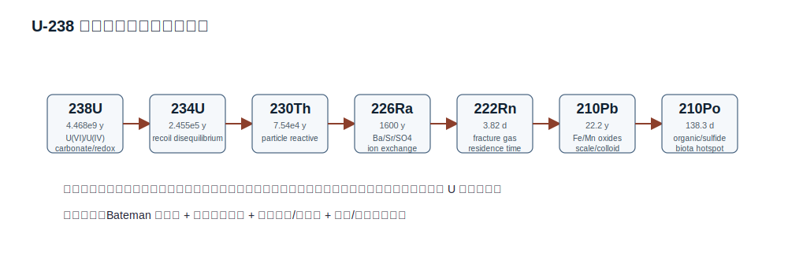
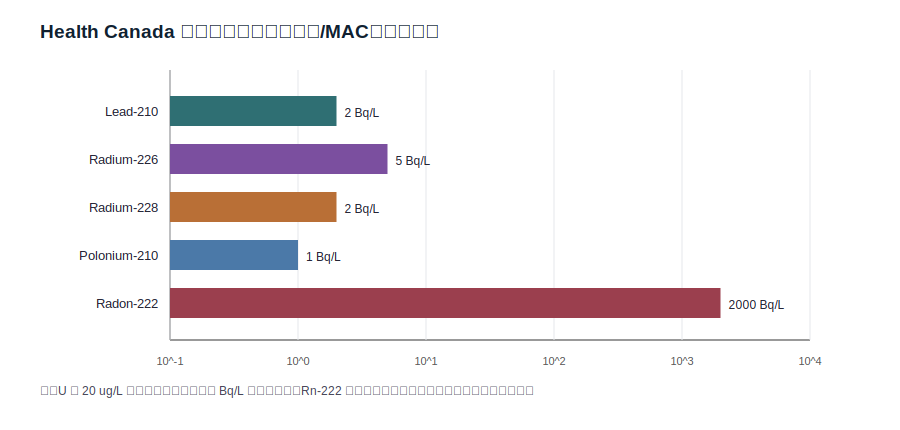
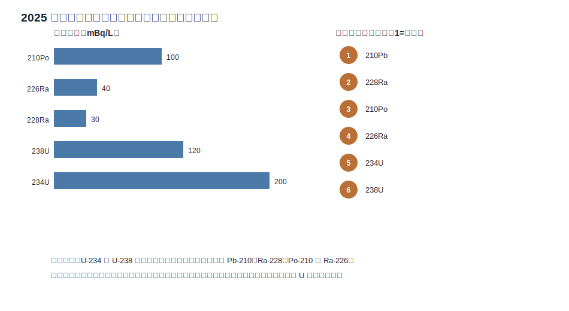
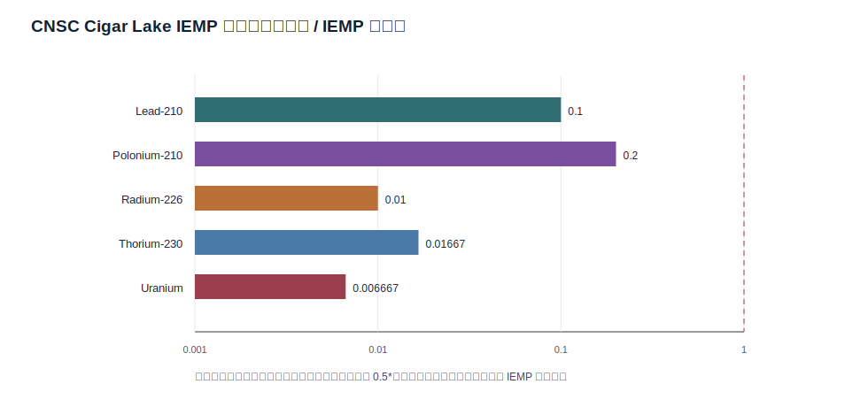
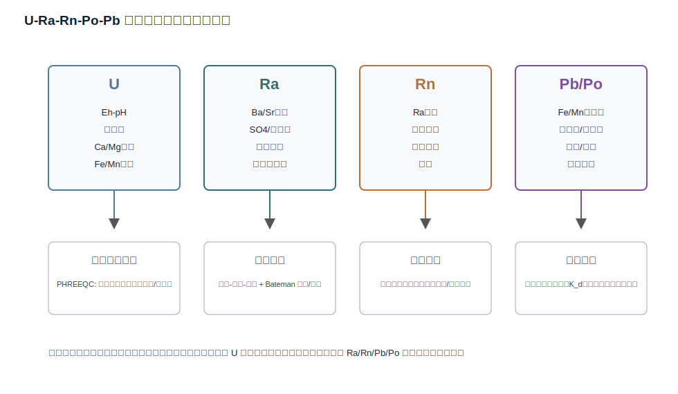

# 摘要

铀矿区和富铀地质背景区的地下水风险不能由总铀浓度单独刻画。铀、镭、氡、铅、钋虽属于 U/Th 衰变系列，但它们在地下水中的化学形态、源项生成机制、滞留过程、迁移距离和人体剂量系数显著不同。本文围绕“U 高不必然 Ra/Rn/Po/Pb 高，Ra/Rn/Po/Pb 异常也不必然对应高 U”的核心命题，建立一个可验证的地球化学-放射性剂量框架。研究综合了三类公开证据：第一，2025 年瑞典私井研究的开放论文数据摘要，覆盖 56 口井的 $^{210}$Po、$^{210}$Pb、$^{226}$Ra、$^{228}$Ra、$^{238}$U 和 $^{234}$U；第二，Health Canada 2025 饮用水放射性参数指南和 2019 铀饮用水指南；第三，CNSC Independent Environmental Monitoring Program (IEMP) Cigar Lake Operation 2020/2024 公开 CSV 数据。结果显示，瑞典井水中平均剂量贡献排序为 $^{210}$Pb > $^{228}$Ra > $^{210}$Po > $^{226}$Ra > $^{234}$U > $^{238}$U，尽管 U 同位素平均活度并不最低；约 40% 的井水指示剂量超过 100 $\mu$Sv/y。相反，Cigar Lake IEMP 地表水样在保守左删失上限处理下，U、Pb-210、Po-210、Ra-226、Th-230 均低于 IEMP 筛选值。这种对比说明：铀矿环境表层水监测“低于筛选值”与私井/裂隙地下水“强变异性”并不矛盾，二者反映不同水文地球化学域。

本文的最终观点是：铀矿区地下水安全评价应从“总 U 单指标”升级为“衰变链核素系统评价”。实际评价中至少应同步纳入 U 同位素、Ra-226/Ra-228、Rn-222、Pb-210、Po-210 以及 pH-Eh、碱度、硫酸盐、Ba/Sr、离子强度、Fe/Mn 氧化物、有机质、裂隙结构和地下水停留时间。Po/Pb 更适合作为长期放射性剂量和沉积/生物累积风险指标，Ra 更适合识别碱土金属-硫酸盐-离子交换控制，Rn 更适合识别裂隙连通性和短停留时间气体迁移。

**关键词**：铀矿区地下水；镭；氡；铅-210；钋-210；U decay series；剂量评价；PHREEQC；反应迁移

# 1. 研究问题与判据

本文研究对象是铀矿区、富铀结晶岩/砂岩含水层、私井和矿区周边环境水体中的 U-Ra-Rn-Po-Pb 衰变系列核素。论文不把任一公开监测结果直接外推为某个矿区的健康结论，而是建立可复核的解释框架，回答三个问题：

1. **分布问题**：$^{238}$U、$^{234}$U、$^{226}$Ra、$^{228}$Ra、$^{222}$Rn、$^{210}$Pb、$^{210}$Po 在地下水和矿区环境水中是否同步变化？
2. **迁移问题**：Eh-pH、碳酸盐络合、硫酸盐、Ba/Sr 共沉淀、离子强度、Fe/Mn 氧化物吸附、裂隙发育和停留时间如何分别控制这些核素？
3. **剂量问题**：饮水摄入、释氡吸入、矿区排水/尾矿渗滤液和长期沉积累积中，哪类核素更可能支配剂量或风险解释？

判据上，本文采用“双基准”而非单一阈值：加拿大饮用水侧使用 Health Canada 的放射性参数 MAC/参考浓度和铀化学毒性 MAC；矿区环境侧使用 CNSC IEMP 数据自带筛选值，并保留其 0.1 mSv/y 筛选逻辑。两个基准的剂量水平和适用场景不同，因此只做结构化对比，不将 IEMP 筛选值替代饮用水 MAC。

# 2. 数据源、采集与可复现性

## 2.1 公开数据源

本文使用的公开源如下。

- Vengosh et al. (2022) 对 U/Th 衰变链核素地下水赋存进行了综述，明确指出 U、Ra、Rn、Pb、Po 的地下水浓度由“生成/反冲/溶出”与“吸附/沉淀/离子交换/滞留”的净平衡控制，而非由铀含量单变量决定。来源：<https://www.sciencedirect.com/science/article/pii/S0048969721069904>。
- $\Pi$ñero-García et al. (2025) 瑞典井水开放论文研究了 56 口井的 $^{210}$Po、$^{210}$Pb、$^{226}$Ra、$^{228}$Ra、$^{238}$U、$^{234}$U，并给出指示剂量公式和剂量排序。来源：<https://www.sciencedirect.com/science/article/pii/S0147651324015562> 与 PubMed <https://pubmed.ncbi.nlm.nih.gov/39644567/>。
- Health Canada (2025) 放射性饮用水指南给出 Pb-210、Ra-226、Ra-228 的 MAC、Po-210/Rn-222 参考浓度、gross alpha/beta 筛选值，并说明 MAC 由 1 mSv/y 参考剂量和 1.53 L/day 饮水量推导。来源：<https://www.canada.ca/en/health-canada/services/publications/healthy-living/guidelines-drinking-water-quality-radiological-parameters.html>。
- Health Canada (2019) 铀饮用水指南给出总天然铀 0.02 mg/L (20 ug/L) MAC，且该值主要基于化学毒性。来源：<https://www.canada.ca/en/health-canada/services/publications/healthy-living/guidelines-canadian-drinking-water-quality-guideline-technical-document-uranium.html>。
- CNSC IEMP Cigar Lake Operation 页面和 CSV 给出 2020/2024 年水样、鱼、蓝莓和 Labrador tea 中的 U、Pb-210、Po-210、Ra-226、Th-230 等监测结果。来源：<https://www.cnsc-ccsn.gc.ca/eng/resources/maps-of-nuclear-facilities/iemp/cigar-lake/>。

原始 CSV、网页快照、整理后的中间表、图件和模型模板均保存在本报告目录。CNSC 原始 CSV 共 820 行；本文水样汇总使用 128 个参数-样品记录，食物/生物介质汇总使用 235 个记录。

## 2.2 左删失数据处理

公开监测数据中大量结果以“<检出限”给出。本文采用两个并行量：

$$
\bar C_{1/2DL}=\frac1n\sum_j
\begin{cases}
C_j, & C_j \text{ 为检出值}\\
\frac12DL_j, & C_j<DL_j
\end{cases}
$$

用于描述性均值；筛选比值使用保守上限：

$$
R_{max}=\max_j\left(\frac{
\begin{cases}
C_j, & C_j \text{ 为检出值}\\
DL_j, & C_j<DL_j
\end{cases}}{C_{screen}}\right).
$$

这种处理不会把未检出值解释为零，也不会把保守上限误用为真实均值。

# 3. 理论框架与公式推导

## 3.1 放射性衰变链与非平衡

单核素衰变满足：

$$
\frac{dN_i}{dt}=-\lambda_i N_i,\qquad
\lambda_i=\frac{\ln 2}{T_{1/2,i}},\qquad
A_i=\lambda_iN_i .
$$

连续衰变链 $1\rightarrow2\rightarrow\cdots\rightarrow k$ 在初始仅有母体 $N_1(0)$ 的理想封闭条件下，Bateman 解为：

$$
N_k(t)=N_1(0)\left(\prod_{j=1}^{k-1}\lambda_j\right)
\sum_{j=1}^k
\frac{e^{-\lambda_jt}}{\prod_{m=1,m\ne j}^k(\lambda_m-\lambda_j)} .
$$

若母体半衰期远大于子体，且体系封闭，则经历若干子体半衰期后可趋于长期平衡：

$$
A_1\approx A_2\approx\cdots\approx A_k .
$$

但地下水不是封闭体系。水-岩反应、吸附、沉淀、反冲、对流、弥散、脱气和抽水会打破活度平衡。对第 $i$ 个核素，含迁移和滞留的反应迁移式可写为：

$$
R_i\frac{\partial C_i}{\partial t}
=\nabla\cdot(D_i\nabla C_i)-\nabla\cdot(\mathbf v C_i)
+\lambda_{i-1}R_{i-1}C_{i-1}
-\lambda_iR_iC_i
+S_i-k_iC_i .
$$

其中 $C_i$ 为水相活度浓度，$R_i$ 为迟滞因子，$D_i$ 为水动力弥散张量，$\mathbf v$ 为孔隙水速度，$S_i$ 包含矿物溶出、反冲和外部输入，$k_i$ 代表沉淀、不可逆吸附或脱气等一阶损失。线性吸附近似下：

$$
R_i=1+\frac{\rho_bK_{d,i}}{\theta},
$$

其中 $\rho_b$ 为介质干密度，$\theta$ 为有效孔隙度，$K_d$ 为分配系数。不同核素 $K_d$ 差异很大，意味着同一衰变链中的子体不会按同一速度迁移。

## 3.2 铀：Eh-pH 与碳酸盐络合控制

铀在天然水中主要以 U(IV) 和 U(VI) 两类价态控制迁移。氧化、中性至弱碱性、富碳酸盐水中，U(VI) 以 uranyl 碳酸盐络合物存在：

$$
\mathrm{UO_2^{2+}+2CO_3^{2-}\rightleftharpoons UO_2(CO_3)_2^{2-}},
$$

$$
\mathrm{UO_2^{2+}+3CO_3^{2-}\rightleftharpoons UO_2(CO_3)_3^{4-}},
$$

并可形成 Ca-U-carbonate 络合物：

$$
\mathrm{Ca^{2+}+UO_2(CO_3)_3^{4-}\rightleftharpoons CaUO_2(CO_3)_3^{2-}},
$$

$$
\mathrm{2Ca^{2+}+UO_2(CO_3)_3^{4-}\rightleftharpoons Ca_2UO_2(CO_3)_3(aq)} .
$$

这些络合物提高溶解度并降低部分矿物表面吸附。还原条件下：

$$
\mathrm{UO_2^{2+}+2e^-+4H^+\rightleftharpoons UO_2(s)+2H_2O},
$$

U(VI) 可转化为低溶解度 U(IV) 固相。Nernst 形式说明 Eh、pH 与溶解铀之间的耦合：

$$
E_h=E^0-\frac{RT}{2F}\ln
\left(\frac{a_{\mathrm{UO_2(s)}}a_{H_2O}^2}{a_{\mathrm{UO_2^{2+}}}a_{H^+}^4}\right).
$$

因此，U 高常对应氧化-碳酸盐环境或局部酸性淋滤，但这并不必然提高 Ra、Rn、Po、Pb。

## 3.3 镭：Ba/Sr、硫酸盐、离子强度与交换位点

Ra-226 是 U-238 系列子体，Ra-228 来自 Th-232 系列。两者水化学行为近似碱土金属二价阳离子，而非铀的 uranyl 碳酸盐体系。镭的核心反应包括阳离子交换：

$$
\mathrm{2X{-}Na+Ra^{2+}\rightleftharpoons X_2Ra+2Na^+},
$$

以及与硫酸盐矿物的共沉淀/固溶：

$$
\mathrm{Ba^{2+}+SO_4^{2-}\rightleftharpoons BaSO_4(s)},
$$

$$
\mathrm{Ra^{2+}+SO_4^{2-}\rightleftharpoons RaSO_4(s)} .
$$

若以重晶石-镭固溶体表示：

$$
D_{Ra/Ba}=
\frac{x_{RaSO_4}/x_{BaSO_4}}{a_{Ra^{2+}}/a_{Ba^{2+}}},
$$

则水中 Ba、SO4、Sr、Ca 和离子强度会通过活度系数、竞争交换和固溶分配共同控制溶解 Ra。高硫酸盐并不总是提高 Ra；当 Ba 充足且重晶石过饱和时，Ra 可被有效带入固相。相反，在低硫酸盐、高离子强度或交换位点被 Na/Ca 竞争占据的水中，Ra 可更易释放。

## 3.4 氡：短半衰期气体、裂隙与停留时间

Rn-222 来自 Ra-226 衰变，是惰性气体。含水裂隙中的氡可用一维近似表示：

$$
\frac{\partial C_{Rn}}{\partial t}
=\frac{E\rho_s A_{Ra}\lambda_{Ra}}{\theta}
-\lambda_{Rn}C_{Rn}
-k_{deg}C_{Rn}
-v\frac{\partial C_{Rn}}{\partial x}
D\frac{\partial^2C_{Rn}}{\partial x^2},
$$

其中 $E$ 是 emanation coefficient，$A_{Ra}$ 是固相 Ra 活度，$k_{deg}$ 是脱气损失。一维稳态、忽略弥散时：

$$
C(x)=C_{eq}+(C_0-C_{eq})\exp\left[-\frac{(\lambda_{Rn}+k_{deg})x}{v}\right],
\qquad
C_{eq}=\frac{E\rho_sA_{Ra}\lambda_{Ra}}{\theta(\lambda_{Rn}+k_{deg})} .
$$

因此 Rn 更反映固相 Ra 分布、裂隙面面积、流速、停留时间和逸散条件。它可以高于 U 预期，也可以在高 U 水中因强脱气或短路径而低。

## 3.5 Pb/Po：表面反应、胶体和长期累积

Pb-210 和 Po-210 不应只被视为“铀的后代”。Pb(II) 易与 Fe/Mn 氧化物、碳酸盐、腐蚀垢和有机质结合：

$$
\equiv SOH+\mathrm{Pb^{2+}}
\rightleftharpoons
\equiv SOPb^+ + \mathrm{H^+} .
$$

Po 的价态和络合更复杂，但在许多环境中表现为强颗粒/有机质/硫化物亲和。用分配系数表示：

$$
K_d=\frac{C_s}{C_w},\qquad
f_{diss}=\frac1{1+\rho_bK_d/\theta} .
$$

这意味着 Pb/Po 在水样、悬浮颗粒、沉积物、管网垢层和生物组织之间的再分配可能支配长期剂量。若只测溶解 U，容易漏掉 Pb/Po 的沉积-再释放风险。

## 3.6 剂量公式与筛选指数

饮水摄入剂量的一般式为：

$$
D_{ing}=\sum_i C_i I e_i ,
$$

其中 $C_i$ 为活度浓度 (Bq/L)，$I$ 为年饮水量 (L/y)，$e_i$ 为摄入剂量系数 (Sv/Bq)。瑞典井水论文采用：

$$
ID(\mu Sv)=\sum_i a_i V e_i,\qquad V=730\;L/y .
$$

Health Canada 的 MAC 可写成反推形式：

$$
MAC_i=\frac{D_{ref}}{I e_i},
\qquad
D_{ref}=1\;mSv/y,\quad I=1.53\;L/day .
$$

当多个核素共同存在时，Health Canada 使用加和判据：

$$
\sum_i\frac{C_i}{MAC_i}\le 1 .
$$

这个式子是风险筛选指数，不是每个场址的最终剂量模型。年龄组、饮水量、食物摄入、处理前后水样、季节性和左删失数据都会改变实际剂量估计。

# 4. 数据分析结果

## 4.1 加拿大饮用水基准

Health Canada 的放射性饮用水基准显示，Pb-210、Ra-226、Ra-228 是加拿大饮用水中最重要的天然放射性核素；Po-210 和 Rn-222 作为特殊场景参考浓度列出；铀则主要按化学毒性给出 20 ug/L MAC。

| analyte | value | unit | basis |
| --- | --- | --- | --- |
| Gross $\alpha$ | 0.5 | Bq/L | initial screening criterion |
| Gross $\beta$ | 1.0 | Bq/L | initial screening criterion |
| Lead-210 | 2.0 | Bq/L | MAC from 1 mSv/y reference dose |
| Radium-226 | 5.0 | Bq/L | MAC from 1 mSv/y reference dose |
| Radium-228 | 2.0 | Bq/L | MAC from 1 mSv/y reference dose |
| Polonium-210 | 1.0 | Bq/L | Appendix C reference concentration from 1 mSv/y |
| Radon-222 | 2000.0 | Bq/L | Appendix C reference concentration; inhalation from indoor air remains primary management pathway |
| Total natural uranium | 20.0 | ug/L | MAC based primarily on chemical toxicity |

这一基准本身已经支持一个重要判断：铀不是饮水放射性剂量的唯一核心。Health Canada 明确将 U 作为弱放射性、以化学毒性为主的参数处理，而 Pb-210、Ra-226、Ra-228 构成放射性 MAC 主体。对矿区地下水而言，这意味着“总 U 达标”不能推出“放射性剂量达标”，尤其在 Ra/Pb/Po 未测时。

## 4.2 2025 年瑞典井水研究：活度高低与剂量排序分离

瑞典研究的 56 口井展示了典型的私井/裂隙地下水强变异性。开放页面给出的关键统计如下。

| radionuclide | n_or_detection | range_min_mBq_L | range_max_mBq_L | mean_mBq_L | median_mBq_L | dose_rank | note |
| --- | --- | --- | --- | --- | --- | --- | --- |
| 210Po | >90% detected | 0.2 | 1410 | 100 | 6 | 3 | For wells with >150 mBq/L, Po may contribute 50-90% of indicative dose. |
| 210Pb | all samples detected |  |  |  |  | 1 | Mean dose contribution ranked first; source page did not expose a machine-readable numeric activity table. |
| 226Ra | all 56 detected | 0.8 | 598 | 40 | 10 | 4 | Radium is chemically decoupled from uranium and controlled by alkaline-earth/sulfate chemistry. |
| 228Ra | about 85% detected | 1 | 258 | 30 | 10 | 2 | Despite lower mean activity than U isotopes, dose rank is high because of dose coefficient. |
| 238U | 55 samples | 0.2 | 2300 | 120 | 10 | 6 | Seven wells exceeded Swedish chemical uranium threshold of 30 ug/L. |
| 234U | 56 samples |  |  | 200 | 20 | 5 | Higher mean activity than Ra, but lower mean dose rank. |
| Indicative dose | 56 wells |  |  |  |  |  | ID ranged 3-1474 uSv/y, mean 130 uSv/y, and about 40% exceeded the 100 uSv/y Swedish/Euratom reference. |

这组结果对本文命题非常关键。U-234 的平均活度约 200 mBq/L，U-238 约 120 mBq/L，高于 Ra-226 和 Ra-228 的平均活度量级；然而平均剂量贡献排序中 U-234 和 U-238 位居第五、第六。相反，Pb-210 虽然开放页面没有给出可机读平均活度表，却在平均剂量贡献中居首；Ra-228 平均活度约 30 mBq/L，却居第二；Po-210 在高值井中可贡献 50%-90% 指示剂量。由此可见：

$$
\text{剂量重要性}\ne\text{活度浓度排序}\ne\text{总 U 浓度排序} .
$$

这种分离来自两个因素。第一，核素摄入剂量系数不同；第二，子体核素在地下水中处于非平衡状态。U 的碳酸盐迁移、Ra 的碱土金属交换/共沉淀、Pb/Po 的颗粒表面反应相互独立，导致同一口井中各核素可能不相关甚至反相关。

## 4.3 Cigar Lake IEMP 公开数据：矿区地表水低于筛选值

CNSC IEMP Cigar Lake CSV 是真实公开监测数据。本文仅将其作为“铀矿环境地表水/食物监测”证据，不把它等同于深部地下水。水样关键汇总如下。

| parameter | n | years | unit | left_censored_n | mean_half_dl | max_upper_bound | iemp_guideline_or_screening | max_upper_to_iemp_screening_ratio |
| --- | --- | --- | --- | --- | --- | --- | --- | --- |
| Lead-210 | 16 | 2020;2024 | Bq/L | 15 | 0.010625 | 0.02 | 0.2 | 0.1 |
| Polonium-210 | 16 | 2020;2024 | Bq/L | 14 | 0.003812 | 0.02 | 0.1 | 0.2 |
| Radium-226 | 16 | 2020;2024 | Bq/L | 16 | 0.0025 | 0.005 | 0.5 | 0.01 |
| Thorium-230 | 16 | 2020;2024 | Bq/L | 16 | 0.005 | 0.01 | 0.6 | 0.016667 |
| Total hardness | 16 | 2020;2024 | mg/L | 0 | 9.625 | 17.0 |  |  |
| Uranium | 16 | 2020;2024 | ug/L | 16 | 0.05 | 0.1 | 15.0 | 0.006667 |
| pH | 16 | 2020;2024 | pH | 0 | 7.051875 | 7.23 |  |  |

保守上限分析表明，水样 U、Pb-210、Po-210、Ra-226、Th-230 均低于 IEMP 筛选值。页面正文亦说明 2024 年水样放射性和非放射性污染物处于自然背景水平并低于适用指南。这一结果与瑞典井水的高变异性并不冲突：IEMP 数据是湖泊表层水和生态介质监测，受稀释、曝气、短停留时间和区域背景控制；私井/裂隙地下水则长期接触富 U/Th 岩石，可积累衰变链核素并形成局部非平衡。

## 4.4 Po/Pb 的生态介质信号

CNSC 食物/生物介质数据中，Po-210 是最需要解释的核素之一。CSV 汇总中 Po-210 的样品类型结果如下。

| sample_description | n | years | unit | mean_half_dl | max_upper_bound | iemp_screening | max_upper_to_iemp_screening_ratio |
| --- | --- | --- | --- | --- | --- | --- | --- |
| Blueberries (wild) | 7 | 2020;2024 | Bq/kg fresh weight | 0.169914 | 0.249 | 12.4 | 0.020081 |
| Fish - Lake Whitefish | 12 | 2020;2024 | Bq/kg fresh weight | 1.058333 | 3.8 | 1.22 | 3.114754 |
| Fish - Northern Pike | 12 | 2020;2024 | Bq/kg fresh weight | 2.35 | 3.6 | 1.22 | 2.95082 |
| Fish - Trout | 12 | 2020;2024 | Bq/kg fresh weight | 0.108333 | 0.2 | 1.22 | 0.163934 |
| Labrador Tea | 2 | 2020 | Bq/kg fresh weight | 2.22 | 2.6 | 203.0 | 0.012808 |
| Labrador tea | 2 | 2024 | Bq/kg fresh weight | 3.448 | 3.92 | 202.9 | 0.01932 |

IEMP 页面指出，2024 年 Cigar Lake 区域鱼类 Po-210 最高值为 3.5 Bq/kg fresh weight，位于区域自然背景范围 0.02-14 Bq/kg fresh weight 内，且参考站与潜在影响站结果相似，因而不能解释为矿山单独造成。这个结果对地下水课题仍有意义：Po/Pb 是长期沉积、生物摄入和颗粒相迁移中更敏感的子体核素；它们可能在水相低值时仍通过食物网或沉积物成为剂量评价关键项。

# 5. 机制解释：为何 U、Ra、Rn、Po/Pb 不同步

## 5.1 U 高不必然 Ra 高

U(VI) 在氧化、碳酸盐水中以阴离子或中性络合物迁移，主要受 Eh-pH、DIC、Ca/Mg 和 Fe/Mn 氧化物吸附控制。Ra 是二价阳离子，不参与 uranyl 碳酸盐体系，主要受 Ba/Sr/Ca 竞争、硫酸盐矿物饱和度、阳离子交换容量和离子强度控制。因此，同一含水层内可能出现：

- 氧化碳酸盐水中 U 高、Ra 低：U 形成可迁移络合物，而 Ra 被重晶石/交换位点截留。
- 还原或高离子强度水中 U 低、Ra 高：U(IV) 沉淀或吸附，而 Ra 从交换位点释放，且缺乏硫酸盐/重晶石沉淀。
- 富 Th 岩性中 Ra-228 高但 U 不高：Ra-228 母体来自 Th-232 系列，与 U-238 源项不同。

这解释了为什么以总 U 作为唯一指标会误判 Ra 剂量。

## 5.2 Ra 高不必然 Rn 高，Rn 高也不必然 U 高

Rn-222 的半衰期只有 3.82 天，迁移距离受流速和裂隙连通性约束。若地下水在富 Ra 裂隙面附近快速进入井筒且脱气少，Rn 可很高；若路径长、曝气强或停留时间相对半衰期过长，Rn 会衰变或逸散。Rn 还可由固相 Ra 的反冲进入水相，而不需要高溶解 U。因此，Rn 更适合作为裂隙系统、岩性和短时标水-岩接触的示踪，而不是 U 浓度代理。

Health Canada 也强调，水中 Rn 对室内空气的贡献需要通过空气检测来管理，不能简单由水浓度外推。这一监管逻辑与上述迁移方程一致。

## 5.3 Po/Pb 适合长期风险和累积风险评价

Pb-210 半衰期 22.2 年，Po-210 半衰期 138.3 天，二者在矿区水-沉积物-生物体系中具有较强表面反应和生物地球化学循环特征。它们可以通过以下路径影响长期评价：

- 管网或井壁 Fe/Mn 氧化物、腐蚀垢和沉积物吸附 Pb/Po，水力扰动后再释放。
- 有机质和硫化物富集 Po，形成与溶解 U 不同步的热点。
- Rn 衰变子体沉积可生成 unsupported Pb-210/Po-210，使 Po/Pb 活度与溶解 U 脱耦。
- 食物网中 Po-210 可能成为剂量敏感项，Cigar Lake IEMP 鱼类结果即显示 Po-210 是需要单独解释的生态介质指标。

因此，长期风险评价中只测 U 不足以覆盖 Pb/Po 的沉积和累积路径。

# 6. 与预设命题的对齐

| hypothesis | mechanistic_basis | data_alignment | status |
| --- | --- | --- | --- |
| U high does not necessarily mean Ra/Pb/Po dose dominance | U redox/carbonate speciation differs from Ra alkaline-earth chemistry and Pb/Po surface reactivity. | Swedish mean U activity can exceed Ra activity, yet mean dose ranking is Pb-210 > Ra-228 > Po-210 > Ra-226 > U-234 > U-238. | supported |
| Ra can be high when U is not high | Ra is controlled by ion exchange, recoil, residence time, ionic strength and sulfate/barite sinks rather than U(VI) carbonate mobility. | Vengosh et al. review identifies reducing/permeable settings where Ra is mobile; Health Canada treats Ra-226/Ra-228 as primary Canadian drinking-water radionuclides. | supported mechanistically |
| Rn is a fracture/residence-time indicator rather than a dissolved-U proxy | Rn is a noble gas produced from Ra-bearing solids, transported over a short decay length and lost by degassing. | Health Canada manages radon mainly through indoor-air testing; groundwater may contribute through outgassing but cannot be inferred from U alone. | supported |
| Po/Pb are better long-term radiological risk indicators than total U alone | Pb/Po have high dose coefficients and strong association with particles, Fe/Mn oxides, organic matter and biota/sediments. | Swedish well data place Pb-210 first and Po-210 third in mean dose contribution; CNSC Cigar Lake food data show Po-210 as the main series radionuclide with values governed by regional background rather than mine exposure alone. | supported |
| Mine surface-water monitoring can look safe while private well groundwater remains variable | Surface water is aerated, diluted and short-residence; bedrock wells integrate water-rock contact and fracture sources. | Cigar Lake IEMP surface-water radionuclides are below screening levels, whereas Swedish private wells show strong variability and 40% ID exceedance. | supported but requires site-specific groundwater data |

综合来看，公开数据和理论模型对齐良好：瑞典井水数据提供“井水强变异性与剂量排序脱钩”的直接证据；Health Canada 基准提供“Pb/Ra 是饮用水放射性评价核心，U 主要是化学毒性”的监管证据；CNSC IEMP 提供“矿区地表环境监测可低于筛选值，但 Po/Pb/Ra 仍需在生态介质和地下水中单独评价”的场景证据；Vengosh 等综述和铀形态综述提供机制支撑。

# 7. 面向 PHREEQC/COMSOL/PINN 的模型框架

## 7.1 反应网络

建议把状态变量分为四组：

$$
\mathbf y=
[\mathrm{pH}, Eh, I, Alk, SO_4, Cl, Ba, Sr, Ca, Fe, Mn, DOC,
U_{238},U_{234},Ra_{226},Ra_{228},Rn_{222},Pb_{210},Po_{210}].
$$

反应网络包含：

1. U(VI)-carbonate-Ca/Mg 络合和 U(IV) 还原沉淀。
2. Ra 与 Ba/Sr/Ca 的阳离子交换、barite/celestite 固溶和硫酸盐控制。
3. Rn 由固相 Ra 反冲/emanation 进入水相，并发生衰变和脱气。
4. Pb/Po 在 Fe/Mn 氧化物、有机质、硫化物、胶体和沉积物上的吸附/解吸。
5. 各核素按 Bateman 生成项耦合，但迁移项和滞留项分别参数化。

本报告已提供 $models/uranium_{\mathrm{series}}_{\mathrm{phreeqc}}_{\mathrm{template}}.phr$、`models/reactive_transport_state_vector.json` 和 `models/dose_calculation_template.json`，作为后续建模起点。

## 7.2 计算流程

推荐工作流如下：

1. 以水样 pH、Eh/pe、碱度、SO4、Cl、Ba、Sr、Ca、Fe、Mn、DOC 和 U/Ra/Pb/Po 活度作为输入。
2. PHREEQC 计算 U 络合物比例、barite/celestite/calcite 饱和指数和主要离子活度。
3. 将 PHREEQC 输出的饱和指数、络合比例和吸附容量转入反应迁移模型。
4. 对 Rn 单独计算 emanation、裂隙对流和脱气；不把 Rn 简化为溶解 U 的函数。
5. 剂量模块分别计算饮水摄入、释氡吸入和食物/沉积累积贡献。
6. 对 $K_d$、停留时间、Ba/Sr、SO4、DOC、Fe/Mn 氧化物和左删失处理进行敏感性分析。

# 8. 局限性

本文是综述性和二次数据分析研究，不替代场址调查或饮用水合规判断。主要局限包括：

- 瑞典 2025 论文的原始样品表开放页面未提供机器可下载数据，本文使用开放页面给出的统计摘要和剂量排序，未重构单井原始数据。
- CNSC IEMP Cigar Lake 数据为矿区周边地表水和生态介质监测，不是深部地下水或私井数据；本文将其用于矿区环境对比，而非地下水源项拟合。
- Health Canada MAC 和 IEMP 筛选值剂量基准不同，前者为饮用水 1 mSv/y 参考，后者常按 0.1 mSv/y 环境筛选设置；本文仅比较结构和数量级，不混同监管含义。
- Rn 的主要健康路径是室内空气吸入，水样 Rn 只能作为潜在贡献源和裂隙示踪，不能替代室内空气检测。
- Pb/Po 的吸附和胶体模型需要场址特定 Fe/Mn 氧化物、有机质、颗粒粒径和沉积物数据；现阶段只能建立反应路径图。

# 9. 结论与论文最终观点

本文的核心结论如下。

第一，铀矿区地下水放射性风险不能用总 U 浓度单独判断。U、Ra、Rn、Pb、Po 属于衰变链系统，但地下水不是封闭衰变容器；水-岩反应、裂隙流、离子交换、共沉淀、吸附、脱气和生物地球化学过程会造成长期非平衡。

第二，Ra 是与 U 显著脱耦的剂量关键核素。Ra-226/Ra-228 受 Ba/Sr、SO4、离子强度和交换位点控制，且 Ra-228 还反映 Th 系列源项。高 U 不保证高 Ra，低 U 也不能排除 Ra 风险。

第三，Rn 是裂隙-停留时间-emanation 指标，不是 U 浓度代理。水中 Rn 受固相 Ra、裂隙面、流速和脱气控制，并且健康管理上应与室内空气检测耦合。

第四，Pb-210 和 Po-210 对长期剂量、沉积累积和生态介质评价尤其重要。2025 年瑞典井水研究显示 Pb-210、Ra-228、Po-210、Ra-226 的平均剂量贡献均高于 U 同位素；CNSC IEMP 数据也说明 Po-210 需要在鱼类等生物介质中单独解释，即便水样低于筛选值。

第五，一个严谨的铀矿区地下水评价框架应至少同时包含：U 同位素活度/质量浓度、Ra-226/Ra-228、Rn-222、Pb-210、Po-210；水化学端元和 Eh-pH；SO4、Ba、Sr、Ca、碱度、离子强度；Fe/Mn 氧化物、有机质和胶体；裂隙结构与地下水停留时间；饮水、吸入和食物/沉积三类剂量路径。论文的最终观点是：应把铀矿区地下水视为一个“衰变链生成-反应迁移-地球化学截留-人体剂量”的耦合系统，而不是把总铀作为唯一风险代理变量。

# 数据与文件清单

- $data/cnsc_{\mathrm{iemp}}_{\mathrm{cigar}}_{\mathrm{lake}}_2020_2024.csv$：CNSC IEMP 原始 CSV。
- $data/cnsc_{\mathrm{iemp}}_{\mathrm{water}}_{\mathrm{summary}}.csv$：IEMP 水样标准化统计与筛选比值。
- $data/cnsc_{\mathrm{iemp}}_{\mathrm{food}}_{\mathrm{series}}_{\mathrm{summary}}.csv$：IEMP 食物/生物介质 U-Ra-Pb-Po 系列统计。
- $data/swedish_{\mathrm{well}}_2025_{\mathrm{summary}}.csv$：瑞典井水论文开放页面统计摘要。
- $data/health_{\mathrm{canada}}_{\mathrm{reference}}_{\mathrm{levels}}.csv$：加拿大饮用水放射性与铀基准。
- $data/dose_{\mathrm{model}}_{\mathrm{parameters}}.csv$：由 Health Canada MAC 反推的筛选等效剂量系数。
- $data/hypothesis_{\mathrm{alignment}}_{\mathrm{matrix}}.csv$：理论命题、机制和数据证据对齐表。
- `figures/*.svg`：论文图件。
- `models/*.json`、`models/*.phr`：后续 PHREEQC/反应迁移/剂量模型模板。
- `sources/*.html`：网页源快照。

# 参考文献

1. Vengosh, A., Coyte, R. M., Podgorski, J., & Johnson, T. M. (2022). *A critical review on the occurrence and distribution of the uranium- and thorium-decay nuclides and their effect on the quality of groundwater*. Science of The Total Environment, 808, 151914. <https://www.sciencedirect.com/science/article/pii/S0048969721069904>
2. $\Pi$ñero-García, F., Thomas, R., Forssell-Aronsson, E., & Isaksson, M. (2025). *Comprehensive analysis of naturally occurring radionuclides in well water: Isotopic ratios, mitigation, and dose assessment*. Ecotoxicology and Environmental Safety, 289, 117480. <https://www.sciencedirect.com/science/article/pii/S0147651324015562>
3. Health Canada. (2025). *Guidelines for Canadian drinking water quality: Radiological parameters*. <https://www.canada.ca/en/health-canada/services/publications/healthy-living/guidelines-drinking-water-quality-radiological-parameters.html>
4. Health Canada. (2019). *Guidelines for Canadian Drinking Water Quality Guideline Technical Document - Uranium*. <https://www.canada.ca/en/health-canada/services/publications/healthy-living/guidelines-canadian-drinking-water-quality-guideline-technical-document-uranium.html>
5. Canadian Nuclear Safety Commission. (2025). *Independent Environmental Monitoring Program: Cigar Lake Operation*. <https://www.cnsc-ccsn.gc.ca/eng/resources/maps-of-nuclear-facilities/iemp/cigar-lake/>
6. Martell, E. A. M., et al. / Frontiers in Chemistry review source used for uranium speciation context: *Speciation of Uranium and Plutonium From Nuclear Legacy Sites to the Environment: A Mini Review*. <https://www.frontiersin.org/journals/chemistry/articles/10.3389/fchem.2020.00630/full>
