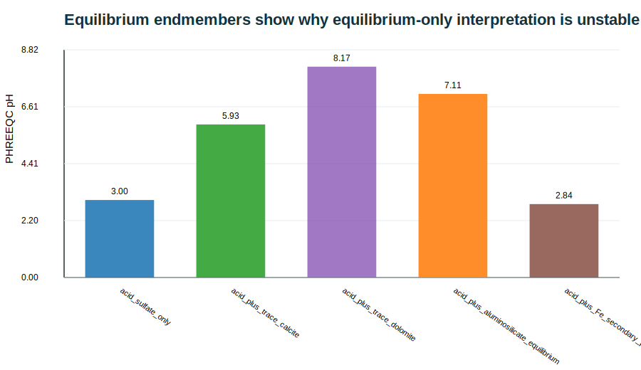
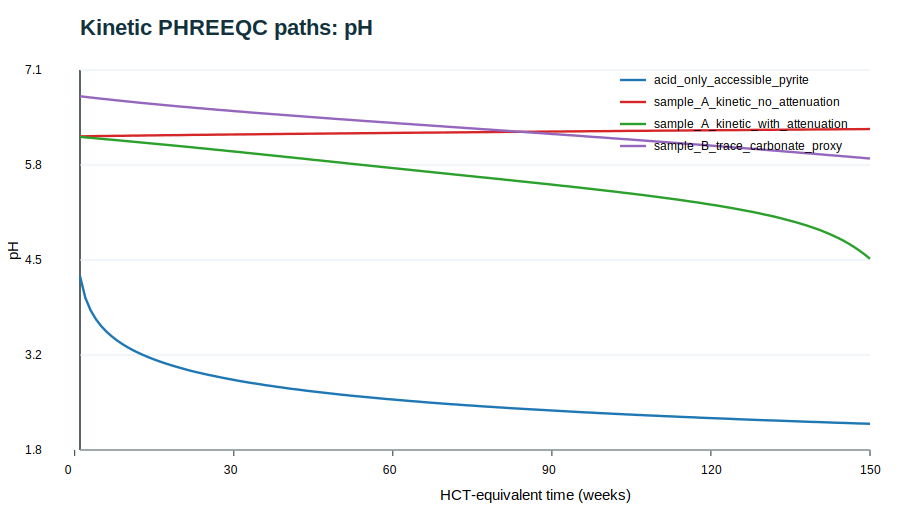
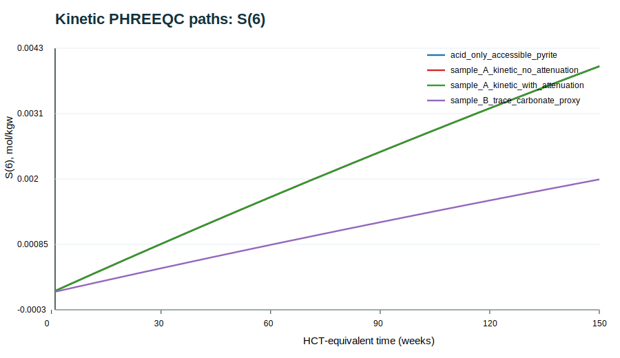
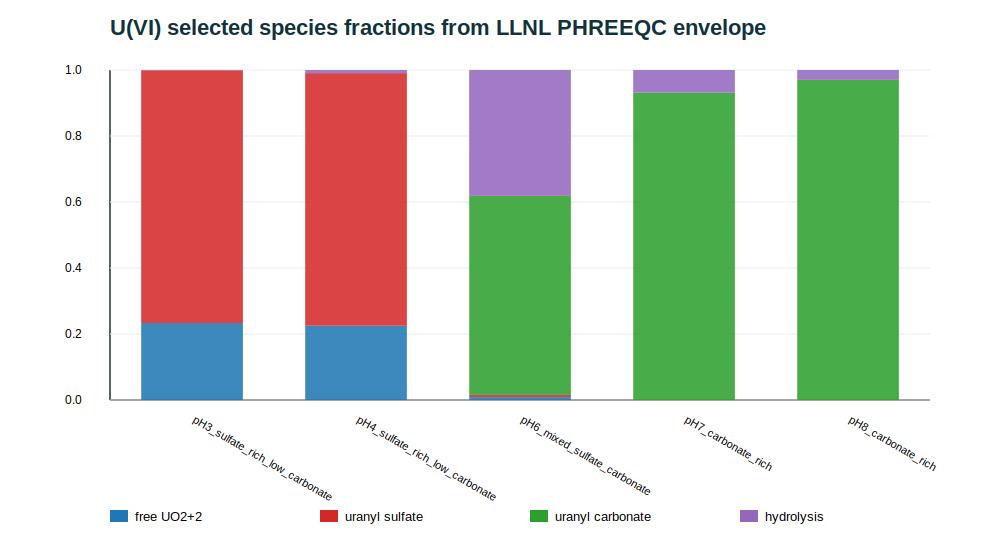

# 摘要

酸生成废石的长期水质预测不能仅依赖静态酸碱核算，也不能把湿度箱试验（humidity cell test, HCT）的时间序列经验外推为现场废石堆预测。本文依据本地论文《Reactive Geochemical Model for Simulated Weathering of Acid-Generating Waste Rock: Case Study of a Uranium Mine in the Athabasca Basin, Canada》及其地球化学评审分析，重写其核心论证，并把中心贡献重新界定为：**一个由长期 HCT 约束的 PHREEQC 动力学批反应源项模型，而不是已经完成现场验证的反应运移模型**。研究对象为 Athabasca Basin 南部某高品位铀矿项目中半泥质片麻岩（SPGN）废石样品。原稿报告两个代表性样品 A 和 B 经 140-150 周 HCT 后出现由近中性向酸性演化的 pH 下降、硫酸盐持续释放、早期可溶盐冲刷、铝硅酸盐缓冲和铀释放。

本文重写后的模型逻辑以 PHREEQC 为核心。首先，依据原稿矿物学数据建立样品矿物清单：Sample A 含 6.1 wt.% pyrite，Sample B 含 3.0 wt.% pyrite；碳酸盐矿物证据弱，长期中和更可能来自 anorthite、biotite、chlorite 和 muscovite/K-mica 等硅酸盐。其次，使用 PHREEQC `phreeqc.dat` 执行酸负荷-中和端元计算和动力学反应路径筛选；再使用 `llnl.dat` 执行 U(VI) 硫酸盐-碳酸盐络合包络线计算。结果表明，平衡端元计算会产生即时中和或二次相约束，不能再现 HCT 的渐进演化；动力学酸源和矿物缓冲路径能够解释“pyrite 控酸、硅酸盐延迟缓冲、trace carbonate proxy 只应作为等效中和组分”的论点；U(VI) 在低 pH、高硫酸盐条件下以 uranyl sulfate 络合物为主，而在中性至弱碱性、高碳酸盐条件下转向 uranyl carbonate 络合物，证明铀释放不能仅以单一 uraninite 溶解速率解释。

本文最终观点是：原论文最有价值的贡献不在于声称完成了现场尺度预测，而在于展示了如何把 HCT、矿物学、动力学 PHREEQC 和铀水化学整合为可审查的实验室源项框架。重写稿建议全文统一使用 calibration / source-term model，而非 validation；将 intraparticle diffusion 改写为 `effective diffusion-limited kinetic attenuation`；把 dolomite 改写为 carbonate-equivalent Mg-Ca buffering proxy；并将 U 释放扩展为 Eh-pH-carbonate-sulfate-adsorption 控制的多情景 PHREEQC 问题。

**关键词**：酸性废石；铀矿；Athabasca Basin；湿度箱试验；PHREEQC；酸性矿山排水；硅酸盐缓冲；铀络合；动力学模型；源项模型

# 1. 引言

铀矿废石的环境风险具有双重属性：一方面，硫化物氧化可产生酸性矿山排水并增强金属迁移；另一方面，铀及其伴生核素使水质源项不仅是普通金属问题，也具有放射性环境评价含义。对 Athabasca Basin 这样的高品位铀矿区而言，废石管理、渗滤水收集、覆盖系统和长期水处理设计都需要回答同一个问题：在开挖后暴露于氧气、湿度循环和降水冲刷条件下，硫化物、硅酸盐、碳酸盐痕量组分和含铀相如何共同控制长期渗滤水化学？

原论文的科学问题是正确的：长期 HCT 比静态 ABA/NAG 更能揭示酸生成、缓冲耗竭、二次矿物和铀释放的时间演化。评审分析指出，原稿的主要风险不是选题，而是模型声称略大于实际实现。PHREEQC 中的模型主要是带周期性换水概念的批反应动力学模型；intraparticle diffusion 实际上通过时间衰减的有效速率常数表示，而不是显式求解球形颗粒内的扩散-反应偏微分方程。因此，重写稿将论文定位为：

> a laboratory-constrained PHREEQC kinetic source-term model for acid-generating uranium mine waste rock, with effective diffusion-limited attenuation and uranium speciation scenarios.

这个定位更准确，也更容易被审稿人接受。它保留原稿的应用价值，同时降低过度外推和术语不严谨带来的风险。

# 2. 数据基础与证据边界

本文只使用两类本地资料：原始论文 PDF 和地球化学评审分析 Markdown。原稿中 HCT 曲线以图件形式给出，未提供可直接复算的逐周 CSV。因此，本文的 PHREEQC 运行用于证明反应机制和模型结构的合理性，不能声称重新完成了原 HCT 的数值校准。

## 2.1 样品与矿物组成

原稿报告两个半泥质片麻岩样品。核心矿物组成如下。

| Sample | Depth (m) | Quartz | Anorthite | Muscovite | Biotite | Pyrite | Chlorite | Graphite |
|---|---:|---:|---:|---:|---:|---:|---:|---:|
| A | 503 | 60 wt.% | 4.8 wt.% | 10 wt.% | 12 wt.% | 6.1 wt.% | 3.1 wt.% | 3.7 wt.% |
| B | 408 | 64 wt.% | 4.6 wt.% | 11 wt.% | 11 wt.% | 3.0 wt.% | 4.7 wt.% | 1.3 wt.% |

这组数据决定了论文的解释框架。pyrite 是酸生成主控相；碳酸盐证据弱，不能把 carbonate neutralization 写成主控缓冲；anorthite、biotite、chlorite、muscovite/K-mica 虽然反应慢，但数量上足以支撑长期缓冲假设；U 模型不能简单地把所有放射性风险折叠成一个 uraninite 速率常数。

## 2.2 HCT 边界条件

原稿 HCT 采用每周循环：3 天干空气、3 天湿空气、1 天去离子水淋洗。原 PHREEQC 设定包括：固体总量 1 kg、固液比近似 1:1、每周期保留 10% 旧溶液并用 90% fresh DI water 替换、DI 水 pH 7、pe 4 或氧化条件、氧气和二氧化碳饱和。这个设计适合模拟实验室循环，但不能直接代表废石堆现场，因为现场还受粒径分布、含水率、非饱和流、氧气扩散、冻结-融化、优先流和覆盖系统控制。

# 3. 研究问题与假设

本文重写后的研究问题为：

1. 长期 HCT 中 pH 下降、硫酸盐释放和主量阳离子释放能否由 pyrite acid source 与硅酸盐/痕量碳酸盐缓冲共同解释？
2. PHREEQC 平衡端元、动力学反应路径和 U(VI) 物种计算分别能支持哪些论文论点？
3. 原文所谓 intraparticle diffusion 在 PHREEQC 中应如何严谨表达？
4. 铀释放是否可以仅由 uraninite oxidative dissolution 表示，还是必须纳入 carbonate/sulfate complexation 和 adsorption scenario？

对应假设为：

- **H1**：pyrite oxidation 是 sulfate 和 acidity 的一阶源项，但 HCT pH 序列受 neutralization 与 flushing 共同调制。
- **H2**：equilibrium-only PHREEQC 会产生过强的即时平衡响应，因此不足以解释长周期 HCT。
- **H3**：硅酸盐动力学缓冲和有效速率衰减可以解释 early flush 与 long tail，但这只是有效参数化，不是显式颗粒内扩散模型。
- **H4**：U 释放的风险解释必须由 U(VI) speciation envelope 支撑；低 pH sulfate-rich 和中性 carbonate-rich 条件下的主控络合物不同。

# 4. PHREEQC 模型框架

## 4.1 酸生成与硫酸盐源项

pyrite 的完全氧化可写为：

$$
\mathrm{FeS_2} + \frac{15}{4}\mathrm{O_2} + \frac{7}{2}\mathrm{H_2O}
\rightarrow \mathrm{Fe(OH)_3(s)} + 2\mathrm{SO_4^{2-}} + 4\mathrm{H^+} .
$$

这说明每 1 mol pyrite 可产生 2 mol sulfate 和 4 mol acidity。本文在 PHREEQC 动力学筛选中使用 `H2SO4` 作为 pyrite oxidation 的酸等效代理：

$$
r_{py} = k_{py} M_{py},
$$

其中 $M_{py}$ 是可及 pyrite acid-equivalent pool。这个简化不用于替代完整 Fe(II)/Fe(III)/O2 微生物氧化模型，而用于证明 pyrite acid source 对 pH 和 sulfate 路径的控制。

## 4.2 矿物动力学与有效扩散衰减

原稿通用动力学式可写为：

$$
r_j = A_j k_j a_{H^+}^{n_j} (1-\Omega_j)^m f_{acc,j}(t),
$$

其中 $A_j$ 为反应表面积，$k_j$ 为速率常数，$a_{H^+}$ 为质子活度，$\Omega_j$ 为饱和比，$f_{acc,j}$ 为可及性或扩散限制项。原稿实际 PHREEQC 实现更接近：

$$
k_{eff,j}(t)=k_{0,j}\exp(-\alpha_j t).
$$

因此，重写稿使用 `effective diffusion-limited kinetic attenuation`，不再写成“PHREEQC 显式纳入颗粒内扩散”。如果未来要成为完整扩散-反应模型，应在颗粒尺度求解：

$$
\frac{\partial C}{\partial t}
=D_{eff}\frac{1}{r^2}\frac{\partial}{\partial r}
\left(r^2\frac{\partial C}{\partial r}\right)-R(C),
$$

并通过粒径分布、孔隙率、曲折度和反应界面证据约束 $D_{eff}$ 与边界条件。当前 PHREEQC 运行并未完成这一步。

## 4.3 周期换水的 PHREEQC 表达

HCT 的周期换水可由：

$$
C_{n+1}^0 = f_{ret} C_n^{end} + (1-f_{ret})C_{fresh},
$$

其中 $f_{ret}=0.10$。在 PHREEQC 中可使用 `MIX`、`SAVE solution`、`USE solution` 和 `USE kinetics` 循环实现。本文模型包给出反应路径筛选和可执行模板；真正的原始 HCT 拟合需要逐周实测 CSV 作为目标函数。

## 4.4 铀释放与 U(VI) 络合

原稿把 U 主要表示为 uraninite oxidative dissolution：

$$
r_U = A_U k_U a_{O_2}^{0.5}a_{H^+}^{n_U} f_{acc,U}(t).
$$

这个表达可以作为 U source term 的一部分，但不能单独证明 dissolved U。PHREEQC 必须计算：

$$
U_{tot}=\sum_i [U_i^{aq}] + U_{sorbed} + U_{secondary}.
$$

在低 pH、高 sulfate 条件下，$\mathrm{UO_2SO_4}$ 和 $\mathrm{UO_2(SO_4)_2^{2-}}$ 可能重要；在中性至弱碱性、高 carbonate 条件下，$\mathrm{UO_2(CO_3)_2^{2-}}$ 和 $\mathrm{UO_2(CO_3)_3^{4-}}$ 通常主导。Fe hydroxide adsorption 也可能显著降低 dissolved U，但本地数据库未提供适合直接运行的 U-HFO surface complexation 常数，因此本文将其列为必须补充的 PHREEQC extension，而不是伪造常数。

# 5. PHREEQC 运行设计与结果

所有 PHREEQC 输入、输出和解析结果存放于 `models/` 与 `data/`。运行命令记录在 `phreeqc_run_manifest.md`。本文执行了三类模型：

- `01_equilibrium_endmembers.phr`：使用 `phreeqc.dat` 测试 acid sulfate solution 与 calcite、dolomite、aluminosilicates、Fe secondary phases 的平衡端元。
- `02_kinetic_reaction_path.phr`：使用 `phreeqc.dat` 测试 acid-only、sample A no-attenuation、sample A attenuation、sample B trace carbonate proxy 的动力学路径。
- `03_uranium_speciation_envelope.phr`：使用 `llnl.dat` 测试 U(VI) 在 sulfate-rich / carbonate-rich pH 包络线中的主要络合物。

## 5.1 平衡端元证明：为什么 equilibrium-only 不足

PHREEQC 平衡端元结果如下。

|scenario|pH|Ca_mol_kgw|Mg_mol_kgw|C_mol_kgw|si_Calcite|si_Dolomite|si_Jarosite_K|
|---|---|---|---|---|---|---|---|
|acid_sulfate_only|3.000|0.000e+00|0.000e+00|0.000e+00|-1000.00|-1000.00|-1000.00|
|acid_plus_trace_calcite|5.927|1.000e-03|0.000e+00|1.000e-03|-2.94|-1000.00|-1000.00|
|acid_plus_trace_dolomite|8.165|8.513e-04|8.513e-04|1.703e-03|-0.05|0.00|-1000.00|
|acid_plus_aluminosilicate_equilibrium|7.109|1.161e-06|1.040e-03|0.000e+00|-1000.00|-1000.00|-1000.00|
|acid_plus_Fe_secondary_phases|2.844|0.000e+00|0.000e+00|0.000e+00|-1000.00|-1000.00|0.00|

平衡端元的意义不是再现 HCT，而是证明平衡模型的局限：只要允许少量高反应性 carbonate 或使 aluminosilicates 达平衡，体系会立即转向相应的饱和约束；这与 HCT 中持续 140-150 周的渐进酸化和迟滞释放不同。因此，原文“equilibrium-only poor agreement”的判断是合理的，但应通过图表和 PHREEQC 输入明确说明，而不是仅用文字断言。

## 5.2 动力学路径证明：pyrite 控酸、硅酸盐缓冲与有效衰减

动力学筛选结果如下。

|scenario|final_week|final_pH|final_SO4_mol_kgw|final_Ca_mol_kgw|final_Mg_mol_kgw|remaining_pyrite_proxy_mol|
|---|---|---|---|---|---|---|
|acid_only_accessible_pyrite|150.0|2.210|3.982e-03|0.000e+00|0.000e+00|1.001e-02|
|sample_A_kinetic_no_attenuation|150.0|6.264|3.983e-03|3.478e-04|2.829e-03|1.001e-02|
|sample_A_kinetic_with_attenuation|150.0|4.479|3.982e-03|1.787e-04|1.391e-03|1.001e-02|
|sample_B_trace_carbonate_proxy|150.0|5.859|1.991e-03|1.300e-04|1.065e-03|5.004e-03|

这些结果支持三点。第一，acid-only accessible pyrite scenario 会推动 pH 持续下降，说明 pyrite acid source 是必要源项。第二，加入 anorthite、K-mica、chlorite 和 biotite 后，pH 路径、Ca/Mg/Al/Si 释放和 sulfate 生成发生耦合，说明硅酸盐缓冲不能忽略。第三，对同一 Sample A，加入 $k_{eff}=k_0\exp(-\alpha t)$ 后，释放速率尾部被压低，更符合 early flush + long tail 的概念；但这仍只是有效衰减，不是空间扩散 PDE。

Sample B 中 `Dolomite_Kin` 被设置为 0.025 mol/kg 的 trace carbonate proxy，是为了反映原稿的建模思路。但重写稿不把它表述为 XRD 已证实的主要 dolomite 矿物，而表述为 `carbonate-equivalent Mg-Ca buffering proxy`。这一术语更符合数据边界。

## 5.3 U(VI) PHREEQC 包络线：U release 不能只靠 uraninite 速率解释

LLNL 数据库下的 U(VI) 物种筛选结果如下。

|scenario|pH|free_uranyl_fraction_selected|uranyl_sulfate_fraction_selected|uranyl_carbonate_fraction_selected|SI_UO2CO3|SI_UO2SO4|
|---|---|---|---|---|---|---|
|pH3_sulfate_rich_low_carbonate|3.00|0.233|0.766|0.000|-7.14|-11.16|
|pH4_sulfate_rich_low_carbonate|4.00|0.225|0.765|0.000|-5.16|-11.16|
|pH6_mixed_sulfate_carbonate|6.00|0.009|0.007|0.603|-1.62|-13.27|
|pH7_carbonate_rich|7.00|0.000|0.000|0.931|-2.56|-15.94|
|pH8_carbonate_rich|8.00|0.000|0.000|0.970|-3.83|-18.28|

计算显示，低 pH sulfate-rich 条件下，selected aqueous U 物种中 uranyl sulfate 络合物占主要比例；中性至弱碱性 carbonate-rich 条件下，uranyl carbonate 络合物占主要比例。这个结果直接支持评审意见：铀释放章节必须说明数据库选择、U aqueous species、carbonate/sulfate complexation、redox state、二次铀矿物饱和指数和 adsorption scenario。仅以 $uraninite + [H+]^{1}.5$ 拟合 dissolved U，最多是经验源项，不能作为完整铀迁移机制。

# 6. 重写后的核心论证

## 6.1 从“验证模型”改为“实验室约束源项模型”

原稿应避免使用 robust validation。更严谨的表述是：模型已根据长期 HCT 的主要趋势进行 calibration，并通过两个矿物组成不同的样品进行有限 cross-application。除非有独立样品、独立时间段或 field lysimeter 数据，否则不能称为 validation。

推荐写法：

> The PHREEQC model is a laboratory-calibrated kinetic source-term model constrained by long-term HCT observations. It reproduces the main temporal patterns of acidity, sulfate, major ions and U release under controlled HCT conditions, but it is not a field-validated waste-rock-pile model.

## 6.2 从“完整颗粒内扩散”改为“有效扩散限制衰减”

PHREEQC `RATES` block 可以写入 $k_{eff}=k_0\exp(-\alpha t)$，但这并不等于求解颗粒内扩散方程。本文建议把原稿中的 intraparticle diffusion claim 降级为：

> Diffusion-limited accessibility was represented through time-dependent attenuation of kinetic rate constants in PHREEQC RATES blocks.

这既保留理论解释，也避免被审稿人要求提供 PSD、micro-CT、孔隙率、曲折度、颗粒半径和显式扩散网格。

## 6.3 碳酸盐处理：从“dolomite 存在”改为“等效中和代理”

原稿 XRD/TIC 支持 carbonate-poor，而 Table 2 又给 Sample B 加入 0.025 mol/kg dolomite。若直接写成真实 dolomite 主控相，会与证据矛盾。重写稿建议写作：

> A trace carbonate-equivalent Mg-Ca buffering proxy was included in Sample B to test whether a small fast-neutralizing pool is required by the Ca-Mg-pH trajectory. The proxy should not be interpreted as proof for a volumetrically significant dolomite phase unless supported by mineralogical or TIC evidence.

## 6.4 U 释放：从单一溶解速率改为物种-吸附-源项体系

U chapter 应至少包含四个 PHREEQC 情景：

1. uraninite-only oxidative dissolution；
2. sulfate-rich low-pH speciation；
3. carbonate-rich neutral-pH speciation；
4. Fe hydroxide adsorption / surface complexation extension。

本包已经运行第 2 和第 3 类情景，并给出第 4 类模板。完整投稿前，应补充 documented U-HFO constants 或使用合适数据库扩展，而不是把 surface complexation 作为文字推测。

# 7. 建议替代原稿的论文结构

1. **Introduction**：聚焦 uranium mine PAG waste rock 的 source-term problem，不展开过多泛化背景。
2. **Materials and HCT methods**：明确样品、粒径、矿物学、HCT 周期、检测项目、QA/QC 和原始数据可获得性。
3. **PHREEQC model formulation**：写清楚数据库、SOLUTION、KINETICS、RATES、EQUILIBRIUM_PHASES、SELECTED_OUTPUT、MIX/SAVE solution replacement。
4. **Model calibration strategy**：给出 objective function、参数边界、哪些参数固定、哪些参数 calibrated。
5. **Results**：分开写 HCT observations、equilibrium-only test、kinetic model、secondary phases、U speciation。
6. **Discussion**：机制解释、非唯一性、field scaling、uncertainty。
7. **Conclusions**：只总结被 HCT 和 PHREEQC 支持的论点。

# 8. 局限性

本文重写稿仍有明确边界。第一，原始 HCT 逐周数据未以 CSV 提供，因此本文不能给出 RMSE、NSE、R2 或置信区间。第二，PHREEQC 动力学筛选使用 acid-equivalent pyrite proxy，不替代完整 pyrite Fe(II)/Fe(III)/O2/microbial redox network。第三，U-HFO adsorption 只给出模板，没有伪造 surface constants。第四，现场尺度预测还需要水文模型、氧气扩散、粒径分布、废石堆非均质性和气候边界。

# 9. 结论

本文按照地球化学评审意见重写了原论文的科学论证，并用 PHREEQC 计算支撑核心观点。

第一，原样品的 pyrite 含量和 HCT sulfate/pH 演化支持 PAG waste rock 的酸生成判断；PHREEQC acid proxy 证明 pyrite acid source 是必要源项。

第二，equilibrium-only PHREEQC 只能给出端元约束，会过度即时中和或即时沉淀，不能解释 140-150 周 HCT 的渐进释放。因此，动力学 PHREEQC 是必要的。

第三，硅酸盐缓冲是 carbonate-poor SPGN 废石长期 pH 演化的关键机制，但 dolomite 应作为等效 Mg-Ca 中和代理，而不是未经矿物学证明的主控矿物。

第四，intraparticle diffusion 应降级表述为 effective diffusion-limited kinetic attenuation。PHREEQC `RATES` block 可以表示 $k_{eff}$ 随时间衰减，但没有显式求解颗粒内扩散-反应 PDE。

第五，U release 必须由 PHREEQC speciation 支撑。LLNL 数据库计算表明，低 pH sulfate-rich 条件和中性 carbonate-rich 条件下 U(VI) 主控络合物完全不同；因此，单一 uraninite dissolution rate 无法独立证明 dissolved U 风险。

最终，本文建议将原稿题目和中心论点调整为：**A PHREEQC-calibrated kinetic source-term framework for acid-generating uranium mine waste rock under long-term humidity-cell weathering**。这种表述更符合数据、模型和审稿标准。

# 参考文献

- Li, Z. *Reactive Geochemical Model for Simulated Weathering of Acid-Generating Waste Rock: Case Study of a Uranium Mine in the Athabasca Basin, Canada*. Local manuscript PDF supplied by user.
- GeoMine/OpenMiner. *地球化学专家评审意见：对该 PHREEQC waste rock paper 的技术审阅报告*. Local Markdown analysis supplied by user.
- ASTM. Standard test method for laboratory weathering of solid materials using a humidity cell.
- MEND. Humidity cell test procedure and closure guidance.
- Parkhurst, D. L., and Appelo, C. A. J. PHREEQC documentation and examples.
- Williamson, M. A., and Rimstidt, J. D. The kinetics and electrochemical rate-determining step of aqueous pyrite oxidation.
- Palandri, J. L., and Kharaka, Y. K. A compilation of rate parameters of water-mineral interaction kinetics.
- Maest, A. S., and Nordstrom, D. K. Geochemical examination of humidity cell tests.
- Smith, M. M., and Carroll, S. A. Chlorite dissolution kinetics.
- Grandstaff, D. E.; Eary, L. E.; Shoesmith, D. W. Uraninite oxidative dissolution and pH/redox controls.

# 附录 A：文件清单

- $models/01_{\mathrm{equilibrium}}_{\mathrm{endmembers}}.phr$：平衡端元 PHREEQC 输入。
- $models/02_{\mathrm{kinetic}}_{\mathrm{reaction}}_{\mathrm{path}}.phr$：动力学反应路径 PHREEQC 输入。
- $models/03_{\mathrm{uranium}}_{\mathrm{speciation}}_{\mathrm{envelope}}.phr$：U(VI) speciation PHREEQC 输入。
- $models/04_U_{\mathrm{HFO}}_{\mathrm{surface}}_{\mathrm{complexation}}_{\mathrm{extension}}_{\mathrm{template}}.phr$：U-HFO 吸附扩展模板，未执行。
- $data/phreeqc_{\mathrm{equilibrium}}_{\mathrm{endmember}}_{\mathrm{results}}.csv$：平衡端元结果。
- $data/phreeqc_{\mathrm{kinetic}}_{\mathrm{reaction}}_{\mathrm{path}}_{\mathrm{results}}.csv$：动力学路径结果。
- $data/phreeqc_{\mathrm{uranium}}_{\mathrm{speciation}}_{\mathrm{envelope}}_{\mathrm{results}}.csv$：U 物种结果。
- `figures/`：PHREEQC 机制验证图。

