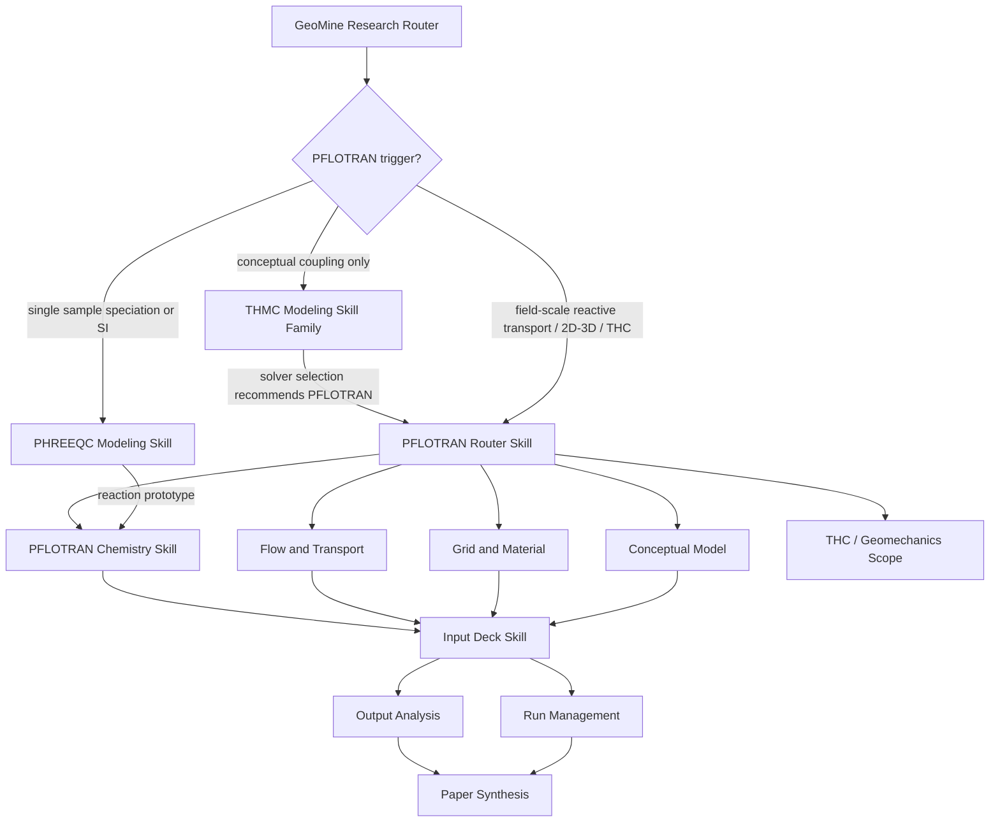

# GeoMine Research PFLOTRAN Modeling Skill 说明文档

生成日期：2026-05-13  
适用插件：GeoMine Research  
适用模块：`skills/pflotran-modeling/`  
当前版本定位：v0.1 skills-only + default-off MCP planning layer

## 1. 概述

PFLOTRAN Modeling Skill Family 是 GeoMine Research 插件中的独立 PFLOTRAN 建模工作流。它的目标不是替代 PFLOTRAN 求解器，也不是在当前版本中直接执行数值模拟，而是把地质、地下水、矿山环境、反应输运、THC 耦合和长期空间预测问题，转化为可审查、可复现、可继续实现的 **PFLOTRAN Modeling Package**。

该 skill family 位于：

```text
skills/pflotran-modeling/
```

它不是 `thmc-modeling` 的子目录，也不是 THMC Skill Family 的附属模块。它可以被 GeoMine 主 router 直接调用，也可以在 THMC solver selection 判定 PFLOTRAN 合适之后，由 THMC router 交接调用。

核心边界：

- THMC Modeling 负责科学耦合框架、过程识别、耦合等级、控制方程和求解器路线比较。
- PHREEQC Modeling 负责单水样、批反应、饱和指数、反应网络原型和水化学局部平衡分析。
- PFLOTRAN Modeling 负责 solver-specific 的空间反应输运建模包、input deck skeleton、网格/材料/边界/输出/运行计划和论文写作支撑。

## 2. 设计目的

PFLOTRAN 适合用于地下水系统中的大尺度、二维/三维、长时段反应输运和 THC 模拟。GeoMine Research 引入 PFLOTRAN Modeling Skill 的目的，是把研究人员提出的复杂地球化学和地下水迁移问题，转化为工程化的建模设计包，而不是停留在泛泛的概念讨论。

设计目标包括：

1. 判断研究问题是否适合 PFLOTRAN，而不是默认把所有水化学问题都交给 PFLOTRAN。
2. 把科研问题拆分为 PFLOTRAN 所需的 domain、grid、region、material、flow、transport、chemistry、output、run plan。
3. 生成 PFLOTRAN input deck skeleton，保留所有缺失参数占位符。
4. 生成运行命令、MPI 命令、run manifest、output manifest 和结果解析计划。
5. 支持论文级 Methods、Results Interpretation Plan、Limitations 和 Machine-readable Manifest。
6. 与 THMC、PHREEQC、Academic Figure Package、MCP 规划层形成协同。
7. 严格避免伪造实测数据、边界条件、动力学常数、热力学数据、校准结果或真实求解器输出。

## 3. 功能架构

PFLOTRAN Modeling Skill Family 由 12 个子 skill 组成：

| 子 skill | 主要职责 |
| --- | --- |
| `pflotran-router-skill` | 判断是否应使用 PFLOTRAN，选择下游 skill chain |
| `pflotran-conceptual-model-skill` | 建立 source-pathway-receptor、过程地图、模型域和观测点 |
| `pflotran-grid-material-skill` | 设计 grid、region、material property、孔隙度/渗透率表 |
| `pflotran-flow-transport-skill` | 选择 saturated/variably saturated flow、transport mode、边界与初始条件 |
| `pflotran-chemistry-skill` | 设计 species、minerals、kinetics、sorption、ion exchange 和反应网络 |
| `pflotran-thc-skill` | 处理 thermal-hydrologic-chemical coupling、热源和温度依赖反应 |
| `pflotran-geomechanics-skill` | 说明 PFLOTRAN 中力学反馈的适用边界和转交条件 |
| `pflotran-input-deck-skill` | 组装 PFLOTRAN input deck skeleton |
| `pflotran-run-management-skill` | 生成本地/MPI run command、run manifest 和 deck 校验 |
| `pflotran-output-analysis-skill` | 规划 observation、breakthrough curve、spatial fields 和结果摘要 |
| `pflotran-calibration-validation-skill` | 设计校准、验证、benchmark、sensitivity 和 uncertainty plan |
| `pflotran-paper-synthesis-skill` | 汇总 26 节 PFLOTRAN Modeling Package 和论文写作内容 |

整体调用关系：



## 4. PFLOTRAN Modeling Package 输出结构

标准输出包为 **PFLOTRAN Modeling Package**，模板位于：

```text
skills/pflotran-modeling/pflotran-paper-synthesis-skill/templates/pflotran-modeling-package-template.md
```

输出包包含 26 个部分：

1. Research Objective
2. Scenario Classification
3. Why PFLOTRAN Is Appropriate
4. Relationship to THMC / PHREEQC / GeoMine Workflow
5. Conceptual Model
6. Process Mode Selection
7. Model Domain and Grid
8. Regions and Material Properties
9. Initial Conditions
10. Boundary Conditions
11. Flow and Transport Configuration
12. Chemistry Configuration
13. Thermal-Hydrologic-Chemical Coupling, if applicable
14. Geomechanics Scope, if applicable
15. Generated PFLOTRAN Input Deck Skeleton
16. Database and Reaction Network Requirements
17. Run Command and Execution Plan
18. Output / Observation Design
19. Calibration and Validation Plan
20. Sensitivity and Uncertainty Plan
21. Expected Figures and Tables
22. Paper-ready Methods Draft
23. Paper-ready Results Interpretation Plan
24. Limitations and Assumptions
25. Future MCP / Remote Compute Extension
26. Machine-readable Model Manifest

这个输出包的重点是建模设计、可复现性和科研表达，而不是声称模型已经执行或验证。

## 5. 能力边界

当前 PFLOTRAN Modeling Skill Family v0.1 的能力边界非常明确。

可以做：

- 判断 PFLOTRAN 是否适合当前问题。
- 生成 field-scale / site-scale / regional-scale reactive transport 建模方案。
- 设计 1D/2D/3D grid、regions、materials、boundary conditions、initial conditions。
- 设计 saturated flow、variably saturated flow、transport、reactive transport 和 THC coupling。
- 从 PHREEQC reaction prototype 接收反应网络概念，并转为 PFLOTRAN chemistry plan。
- 生成 PFLOTRAN input deck skeleton。
- 生成本地运行命令和 MPI 运行命令。
- 生成 run manifest、output manifest、observation parsing 和 result summary。
- 生成论文 Methods、Results Interpretation Plan、Limitations。
- 通过 `geomine_pflotran` MCP planning layer 做 deck validation、manifest、output parsing 和 package record。

不可以做：

- 不执行真实 PFLOTRAN 求解器。
- 不声称 input deck 已经通过 PFLOTRAN 验证。
- 不声称模型已收敛、已校准、已验证。
- 不伪造实测场地参数。
- 不伪造热力学常数、动力学速率、矿物体积分数、边界条件、孔隙度/渗透率场。
- 不把 PFLOTRAN 当成所有地下水化学问题的默认最佳求解器。
- 不用 mock MCP 输出替代真实现场数据或真实模拟结果。

## 6. 触发条件

GeoMine Router 会在以下情况下倾向调用 PFLOTRAN Modeling：

- 用户明确要求 PFLOTRAN。
- 需要 field-scale、site-scale 或 regional-scale reactive transport。
- 需要 2D 或 3D groundwater simulation。
- 需要 long-term spatial geochemical prediction。
- 需要 THC simulation 或 geothermal groundwater chemistry。
- 需要 high-performance subsurface simulation。
- 需要分析矿物反应对 porosity/permeability 的反馈。
- 需要输出 concentration field、pH field、temperature field、mineral volume fraction、porosity field。
- 需要 breakthrough curves 或 observation point time series。
- 需要 PFLOTRAN input deck skeleton、run command 或 run manifest。

不应触发 PFLOTRAN 的情况：

- 单个水样 speciation：使用 `phreeqc-modeling-skill`。
- 仅计算 saturation index：使用 `phreeqc-modeling-skill`。
- 仅做 batch reaction 或 reaction path 原型：优先 PHREEQC。
- 仅做概念 THMC 讨论：使用 `thmc-groundwater-router-skill`。
- 仅做图件设计：使用 Academic Figure Package。
- 法律、合规、披露问题：使用对应 disclosure/compliance skill。

## 7. 与 THMC 的关联

PFLOTRAN Modeling 与 THMC Modeling 的关系可以概括为：

```text
THMC = scientific coupling framework
PFLOTRAN = solver-specific implementation package
```

THMC Modeling 负责回答：

- 哪些 T/H/M/C 过程是 active？
- 耦合等级是 H、HC、THC、HM、THM 还是 THMC？
- 控制方程和变量有哪些？
- 反应网络、验证计划和不确定性框架是什么？
- OGS、PFLOTRAN、PHREEQC、COMSOL、PINN 等路线如何比较？

PFLOTRAN Modeling 负责回答：

- 如果选择 PFLOTRAN，模型域如何离散？
- grid、region、material 如何定义？
- flow condition、transport condition、chemistry block 如何组织？
- input deck skeleton 应如何写？
- run command、MPI command、manifest 如何记录？
- 输出字段、observation points、breakthrough curves 和 spatial fields 如何设计？
- 论文中如何描述 PFLOTRAN 模型方法和结果解释边界？

因此，THMC 可以把问题交给 PFLOTRAN，但 PFLOTRAN 不应被理解为 THMC 的子 skill。它是独立 solver family，可接收 THMC 的概念模型，也可接收 PHREEQC 的反应网络原型。

## 8. 与 PHREEQC 的关联

PHREEQC 更适合：

- 单水样 speciation。
- saturation index。
- batch reaction。
- equilibrium phases。
- inverse modeling。
- reaction network prototype。
- 一维或局部水岩反应原型。

PFLOTRAN 更适合：

- 空间反应输运。
- 2D/3D 地下水流动与反应耦合。
- 长期迁移预测。
- 大规模场地模型。
- THC 模拟。
- HPC 或远程计算。
- 空间场输出和 breakthrough curves。

推荐工作流：

```text
PHREEQC reaction prototype
  -> PFLOTRAN chemistry configuration plan
  -> PFLOTRAN reactive transport input skeleton
  -> output / observation / calibration plan
  -> paper-ready modeling package
```

## 9. MCP 设计

当前版本新增了 default-off MCP planning layer：

```text
server name: geomine_pflotran
config: references/geomine-pflotran.mcp.example.json
entrypoint: geomine_thmc_mcp.pflotran_server:main
```

该 MCP 默认不启用，不写入 plugin manifest，也不依赖真实 PFLOTRAN 安装。

当前工具：

| 工具 | 作用 |
| --- | --- |
| `validate_input_deck` | 检查 input deck 是否包含基本块、占位符和结构问题 |
| `build_input_deck` | 生成 draft PFLOTRAN input deck skeleton 和 manifest |
| `build_run_manifest` | 生成 run command、MPI 信息、expected outputs |
| `parse_observation_output` | 解析 observation CSV/TSV 文本 |
| `generate_result_summary` | 生成数值列 min/max/last 等摘要 |
| `save_model_package` | 保存 draft PFLOTRAN Modeling Package record |
| `get_model_package` | 读取 package record |
| `list_model_packages` | 列出 package records |

重要限制：

- `geomine_pflotran` 当前不执行 PFLOTRAN。
- `geomine_pflotran` 当前不做远程 HPC 提交。
- `geomine_pflotran` 的输出只能作为规划、校验和记录，不是数值模拟结果。

## 10. 使用案例

### 10.1 尾矿渗漏进入浅层含水层

适合调用 PFLOTRAN，因为问题通常涉及二维/三维地下水流动、硫酸盐/酸度迁移、碳酸盐中和、Fe/Al 氢氧化物沉淀、金属迁移和下游观测井 breakthrough curves。

示例 prompt：

```text
Use GeoMine Research PFLOTRAN Modeling Skill Family.
Design a PFLOTRAN reactive transport model for sulfide-bearing tailings seepage into a shallow aquifer.
Include saturated or variably saturated flow selection, sulfate/acidity generation, carbonate neutralization,
Fe/Al hydroxide precipitation, metal transport, porosity/permeability feedback, observation points,
input deck skeleton, run command, output plan, paper Methods draft, and limitations.
```

对应示例文件：

```text
skills/pflotran-modeling/examples/pflotran-tailings-seepage.md
```

### 10.2 铀系放射性核素在裂隙花岗岩地下水中的迁移

适合调用 PFLOTRAN，因为问题涉及长期空间迁移、反应输运、裂隙/基质参数、碳酸盐络合、Ra 与 sulfate/barite/sorption 作用、Fe-Mn oxide surface interaction 和 field-scale 输出。

示例 prompt：

```text
Build a PFLOTRAN model plan for uranium-series radionuclide reactive transport in fractured granitic groundwater.
Focus on U mobility under carbonate-rich groundwater, Ra attenuation by sulfate/barite or sorption,
Fe-Mn oxide surface interaction, long-term spatial transport, and comparison with a PHREEQC reaction network prototype.
```

对应示例文件：

```text
skills/pflotran-modeling/examples/pflotran-uranium-reactive-transport.md
```

### 10.3 地热梯度下地下水 THC 演化

适合调用 PFLOTRAN，因为问题涉及温度场、水流、反应、矿物沉淀、渗透率反馈和长期演化。

示例 prompt：

```text
Design a thermal-hydrologic-chemical PFLOTRAN model for groundwater chemistry evolution under a geothermal gradient.
Include heat and mass boundary conditions, temperature-dependent reaction effects, mineral saturation/precipitation,
permeability feedback, expected outputs, figures, and limitations.
```

对应示例文件：

```text
skills/pflotran-modeling/examples/pflotran-thc-geothermal-groundwater.md
```

## 11. 典型输入与数据要求

PFLOTRAN Modeling Package 通常需要以下输入：

| 数据类型 | 例子 | 缺失时处理 |
| --- | --- | --- |
| 模型域 | 1D/2D/3D、范围、坐标、地层结构 | 使用 `<domain_extent>` 等占位符 |
| 网格 | structured grid、cell size、refinement zones | 标记为 draft grid |
| 材料属性 | porosity、permeability、tortuosity、density、thermal properties | 不估算，保留占位符 |
| 初始条件 | pressure/head、saturation、chemistry、temperature | 标记缺失对解释的影响 |
| 边界条件 | head/pressure/flux/concentration/heat | 不伪造边界 |
| 反应网络 | species、minerals、kinetics、sorption、exchange | 只用有来源的常数 |
| 输出目标 | fields、observation points、breakthrough curves | 作为 output design |
| 校准数据 | head、flow、chemistry、temperature、breakthrough | 无数据则不得声称校准 |

## 12. 本地脚本能力

PFLOTRAN skill family 提供轻量脚本，不要求安装 PFLOTRAN：

```text
skills/pflotran-modeling/pflotran-run-management-skill/scripts/validate_input_deck.py
skills/pflotran-modeling/pflotran-run-management-skill/scripts/make_run_command.py
skills/pflotran-modeling/pflotran-run-management-skill/scripts/build_run_manifest.py
skills/pflotran-modeling/pflotran-output-analysis-skill/scripts/parse_observation_output.py
skills/pflotran-modeling/pflotran-output-analysis-skill/scripts/build_result_summary.py
skills/pflotran-modeling/pflotran-output-analysis-skill/scripts/generate_output_manifest.py
```

示例：

```bash
python3 skills/pflotran-modeling/pflotran-run-management-skill/scripts/validate_input_deck.py --input model.in
python3 skills/pflotran-modeling/pflotran-run-management-skill/scripts/make_run_command.py --input model.in --mpi 8
python3 skills/pflotran-modeling/pflotran-run-management-skill/scripts/build_run_manifest.py --model-name tailings-seepage --input model.in --mpi 8
python3 skills/pflotran-modeling/pflotran-output-analysis-skill/scripts/parse_observation_output.py --input observation.csv
```

这些脚本用于结构化准备与解析，不执行求解器。

## 13. 面向论文写作的价值

PFLOTRAN Modeling Skill 可以把复杂反应输运研究整理为论文可用的建模方法和结果解释框架：

- Methods：模型域、网格、材料、边界、初始条件、反应网络、数据库、输出变量、运行计划。
- Results Interpretation Plan：哪些结果可以从 concentration fields、pH fields、mineral volume fraction、breakthrough curves 中解释。
- Limitations：缺失边界条件、热力学/动力学常数、矿物体积分数、孔隙度/渗透率场和校准数据的影响。
- Figures：研究区剖面、模型域、边界条件、反应区、输出场、breakthrough curves、敏感性分析图。
- Manifest：可复现记录 input deck、database、run command、expected outputs、status。

这使 GeoMine Research 的输出不只是综述，而是能形成可审查的建模研究框架。

## 14. 未来拓展

### 14.1 真实 PFLOTRAN 执行

未来可以增加：

- `run_pflotran_local`
- `submit_pflotran_remote`
- `get_run_status`
- `fetch_run_logs`
- `fetch_pflotran_outputs`

前提是必须能记录 solver version、input checksum、database checksum、run command、MPI 配置、日志、错误和输出文件。

### 14.2 PostGIS / R2 数据集成

未来 MCP 可连接：

- PostGIS mesh / region / boundary condition geometry。
- R2 中的 HDF5、CSV、VTU、Tecplot、parameter field。
- OpenMine 项目数据库中的水化学、岩性、矿物学、监测井数据。

### 14.3 可视化输出

可以与 GeoMine Visualization Studio 和 Academic Figure Package 联动：

- 生成 3D 模型域展示。
- 展示 pH / sulfate / uranium / temperature 空间场。
- 展示 reaction front 和 mineral precipitation zone。
- 展示 breakthrough curves 和 observation time series。

### 14.4 校准与不确定性

未来可进一步增加：

- 参数敏感性设计。
- Ensemble scenario manifest。
- Calibration target schema。
- Validation dataset registry。
- 不确定性传播结果摘要。

### 14.5 与 THMC/PFLOTRAN 执行层整合

长期目标是形成：

```text
GeoMine Research question
  -> THMC conceptual model
  -> PHREEQC reaction prototype
  -> PFLOTRAN input deck
  -> remote PFLOTRAN execution
  -> output parsing
  -> model version + run record
  -> paper + figure + PDF
```

但在当前版本中，执行层仍处于规划状态，不应把 draft package 误认为真实模拟成果。

## 15. 快速使用方式

推荐 prompt：

```text
Use GeoMine Research PFLOTRAN Modeling Skill Family.
为 [研究场景] 构建 PFLOTRAN Modeling Package。
请包括：
1. 适用性判断
2. 与 THMC / PHREEQC 的关系
3. 概念模型
4. grid/material plan
5. flow and transport configuration
6. chemistry configuration
7. THC/geomechanics scope if applicable
8. input deck skeleton
9. run command and manifest
10. output/observation design
11. calibration/validation plan
12. paper-ready methods/results guidance
13. limitations and missing data
```

如果只需要单水样 speciation 或 saturation index，应改用：

```text
Use GeoMine Research PHREEQC Modeling Skill.
```

如果还没有确定求解器，应先使用：

```text
Use GeoMine Research THMC Modeling Skill Family.
```

## 16. 结论

PFLOTRAN Modeling Skill Family 为 GeoMine Research 增加了面向空间反应输运和 THC 模拟的 solver-specific 建模能力。它补足了 THMC 概念框架与 PHREEQC 反应原型之间的执行前设计环节，可以生成完整的 PFLOTRAN Modeling Package、input deck skeleton、运行计划、输出分析方案和论文写作材料。

当前版本的核心价值是“把复杂研究问题变成严谨、可复现、可审查的 PFLOTRAN 建模方案”。它不执行求解器、不伪造结果、不替代现场数据和专业验证。未来可通过 MCP 逐步扩展到真实 PFLOTRAN 本地/远程执行、PostGIS/R2 数据接入、模型版本管理、输出解析和可视化报告生成。
